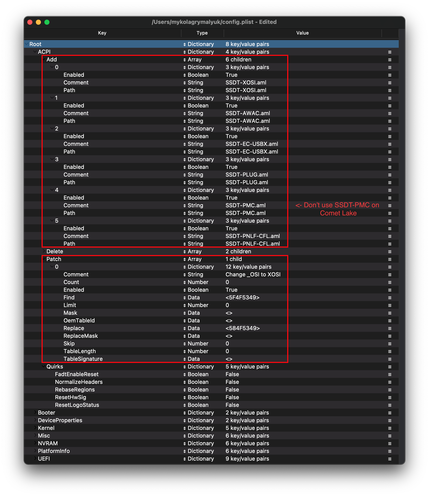
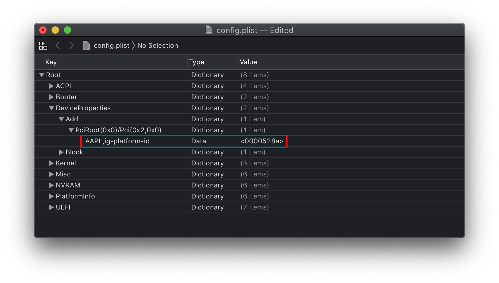
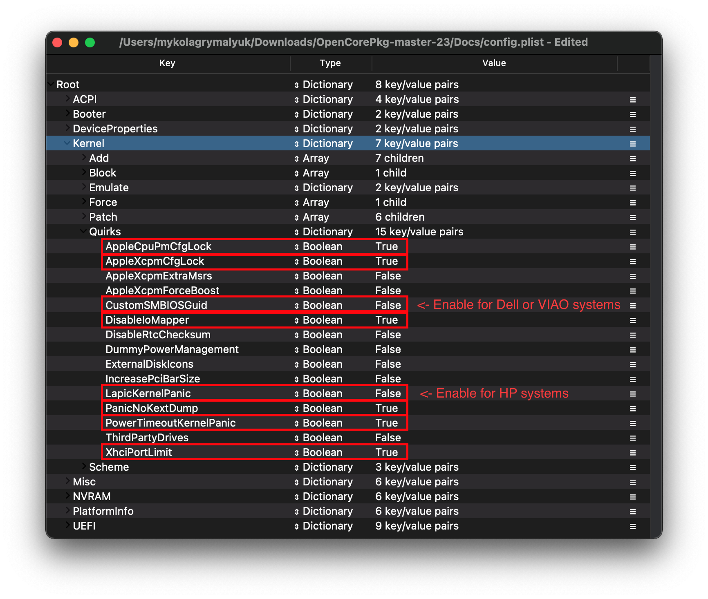
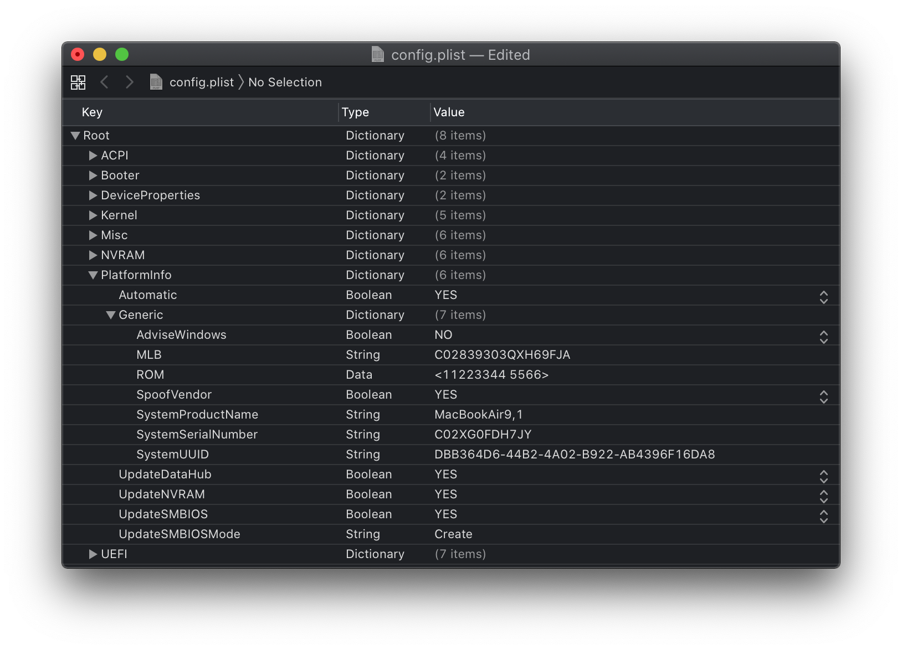

# Laptop Icelake

* Supported version: 0.5.9

<extoc></extoc>

## Starting Point

So making a config.plist may seem hard, its not. It just takes some time but this guide will tell you how to configure everything, you won't be left in the cold. This also means if you have issues, review your config settings to make sure they're correct. Main things to note with OpenCore:

* **All properties must be defined**, there are no default OpenCore will fall back on so **do not delete sections unless told explicitly so**. If the guide doesn't mention the option, leave it at default.
* **The Sample.plist cannot be used As-Is**, you must configure it to your system
* **DO NOT USE CONFIGURATORS**, these rarely respect OpenCore's configuration and even some like Mackie's will add Clover properties and corrupt plists!

Now with all that, a quick reminder of the tools we need

* [ProperTree](https://github.com/corpnewt/ProperTree)
  * Universal plist editor
* [GenSMBIOS](https://github.com/corpnewt/GenSMBIOS)
  * For generating our SMBIOS data
* [Sample/config.plist](https://github.com/acidanthera/OpenCorePkg/releases)
  * See previous section on how to obtain: [config.plist Setup](../config.plist/README.md)

**And read this guide more than once before setting up OpenCore and make sure you have it set up correctly. Do note that images will not always be the most up-to-date so please read the text below them, if nothing's mentioned then leave as default.**

## ACPI



### Add

::: tip Info

This is where you'll add SSDTs for your system, these are very important to **booting macOS** and have many uses like [USB maps](https://dortania.github.io/OpenCore-Post-Install/usb/), [disabling unsupported GPUs](https://dortania.github.io/OpenCore-Post-Install/) and such. And with our system, **its even required to boot**. Guide on making them found here: [**Getting started with ACPI**](https://dortania.github.io/Getting-Started-With-ACPI/)

For us we'll need a couple of SSDTs to bring back functionality that Clover provided:

| Required_SSDTs | Description |
| :--- | :--- |
| **[SSDT-PLUG](https://dortania.github.io/Getting-Started-With-ACPI/)** | Allows for native CPU power management on Haswell and newer, see [Getting Started With ACPI Guide](https://dortania.github.io/Getting-Started-With-ACPI/) for more details. |
| **[SSDT-EC-USBX](https://dortania.github.io/Getting-Started-With-ACPI/)** | Fixes both the embedded controller and USB power, see [Getting Started With ACPI Guide](https://dortania.github.io/Getting-Started-With-ACPI/) for more details. |
| **[SSDT-GPIO](https://github.com/dortania/Getting-Started-With-ACPI/blob/master/extra-files/decompiled/SSDT-GPI0.dsl)** | Creates a stub so VoodooI2C can connect, for those having troubles getting VoodooI2C working can try [SSDT-XOSI](https://github.com/dortania/Getting-Started-With-ACPI/blob/master/extra-files/compiled/SSDT-XOSI.aml) instead |
| **[SSDT-PNLF-CFL](https://dortania.github.io/Getting-Started-With-ACPI/)** | Fixes brightness control, see [Getting Started With ACPI Guide](https://dortania.github.io/Getting-Started-With-ACPI/) for more details. |
| **[SSDT-AWAC](https://dortania.github.io/Getting-Started-With-ACPI/)** | This is the [300 series RTC patch](https://www.hackintosh-forum.de/forum/thread/39846-asrock-z390-taichi-ultimate/?pageNo=2), required for most B360, B365, H310, H370, Z390 and some Z370 boards which prevent systems from booting macOS. The alternative is [SSDT-RTC0](https://dortania.github.io/Getting-Started-With-ACPI/) for when AWAC SSDT is incompatible due to missing the Legacy RTC clock, to check whether you need it and which to use please see [Getting started with ACPI](https://dortania.github.io/Getting-Started-With-ACPI/) page. |

Note that you **should not** add your generated `DSDT.aml` here, it is already in your firmware. So if present, remove the entry for it in your `config.plist` and under EFI/OC/ACPI.

For those wanting a deeper dive into dumping your DSDT, how to make these SSDTs, and compiling them, please see the [**Getting started with ACPI**](https://dortania.github.io/Getting-Started-With-ACPI/) **page.** Compiled SSDTs have a **.aml** extension(Assembled) and will go into the `EFI/OC/ACPI` folder and **must** be specified in your config under `ACPI -> Add` as well.

:::

### Delete

This blocks certain ACPI tables from loading, for us we can ignore this.

### Patch

::: tip Info

This section allows us to dynamically modify parts of the ACPI (DSDT, SSDT, etc.) via OpenCore. For us, we'll need the following:

* OSI rename
  * This is required when using SSDT-XOSI as we redirect all OSI calls to this SSDT, **this is not needed if you're using SSDT-GPIO**

| Comment | String | Change _OSI to XOSI |
| :--- | :--- | :--- |
| Enabled | Boolean | YES |
| Count | Number | 0 |
| Limit | Number | 0 |
| Find | Data | 5f4f5349 |
| Replace | Data | 584f5349 |

:::

### Quirks

Settings relating to ACPI, leave everything here as default as we have no use for these quirks.

## Booter


This section is dedicated to quirks relating to boot.efi patching with OpenRuntime, the replacement for AptioMemoryFix.efi

### MmioWhitelist

This section is allowing devices to be pass-through to macOS that are generally ignored, for us we can ignore this section.

### Quirks

::: tip Info
Settings relating to boot.efi patching and firmware fixes, for us, we need to change the following:

| Quirk | Enabled |
| :--- | :--- |
| DevirtualiseMmio | YES |
| EnableWriteUnprotector | NO |
| ProtectUefiServices | YES |
| RebuildAppleMemoryMap | YES |
| SyncRuntimePermissions | YES |
:::

::: details More in-depth Info

* **AvoidRuntimeDefrag**: YES
  * Fixes UEFI runtime services like date, time, NVRAM, power control, etc
* **DevirtualiseMmio**: YES
  * Reduces Stolen Memory Footprint, expands options for `slide=N` values and very helpful with fixing Memory Allocation issues on Z390. Requires `ProtectUefiServices` as well on IceLake and Z390 Coffee Lake
* **EnableWriteUnprotector**: NO
  * This quirk and RebuildAppleMemoryMap can commonly conflict, recommended to enable the latter on newer platforms and disable this entry.
* **ProtectUefiServices**: NO
  * Protects UEFI services from being overridden by the firmware, mainly relevant for VMs, Icelake and Z390 systems'
  * If on Z390, **enable this quirk**
* **RebuildAppleMemoryMap**: YES
  * Generates Memory Map compatible with macOS, can break on some laptop OEM firmwares so if you receive early boot failures disable this
* **SetupVirtualMap**: YES
  * Fixes SetVirtualAddresses calls to virtual addresses, shouldn't be needed on Skylake and newer. Some firmware like Gigabyte may still require it, and will kernel panic without this
* **SyncRuntimePermissions**: YES
  * Fixes alignment with MAT tables and required to boot Windows and Linux with MAT tables, also recommended for macOS. Mainly relevant for Skylake and newer

:::

## DeviceProperties



### Add

Sets device properties from a map.

::: tip PciRoot(0x0)/Pci(0x2,0x0)

This section is set up via WhateverGreen's [Framebuffer Patching Guide](https://github.com/acidanthera/WhateverGreen/blob/master/Manual/FAQ.IntelHD.en.md) and is used for setting important iGPU properties.

When setting up your iGPU, the table below should help with finding the right values to set. Here is an explanation of some values:

* **Device-id**
  * The actual Device ID used by the graphics drivers to figure out if it's an iGPU. If your iGPU isn't natively supported, you can add `device-id` to fake it as a native iGPU  
* **AAPL,ig-platform-id**
  * This is used internally for setting up the iGPU
* **Stolen Memory**
  * The minimum amount of iGPU memory required for the framebuffer to work correctly
* **Port Count + Connectors**
  * The number of displays and what types are supported

Generally follow these steps when setting up your iGPU properties. Follow the configuration notes below the table if they say anything different:

1. When initially setting up your config.plist, only set AAPL,ig-platform-id - this is normally enough
2. If you boot and you get no graphics acceleration (7MB VRAM and solid background for dock), then you likely need to set device-id as well

Note that highlighted entries with a star(*) are the recommended entries to use:

| iGPU | device-id | AAPL,ig-platform-id | Port Count | Total Stolen Memory | Connectors |
| :--- | :--- | :--- | :--- | :--- | :--- |
| Iris Plus | 8A510000 | 0000518A | 6 | 193MB |  LVDSx1 DPx5 |
| Iris Plus | 8A5C0000 | 00005C8A | 6 | 193MB |  LVDSx1 DPx5 |
| **Iris Plus** * | 8A520000 | 0000528A | 6 | 193MB |  LVDSx1 DPx5 |
| Iris Plus | 8A5A0000 | 00005A8A | 6 | 193MB |  LVDSx1 DPx5 |

#### Configuration Notes

* `8A520000` is the recommended ig-platform-id value, note that info on setting up Icelake iGPUs is still limited

:::

::: tip PciRoot(0x0)/Pci(0x1b,0x0)

`layout-id`

* Applies AppleALC audio injection, you'll need to do your own research on which codec your motherboard has and match it with AppleALC's layout. [AppleALC Supported Codecs](https://github.com/acidanthera/AppleALC/wiki/Supported-codecs).
* You can delete this property outright as it's unused for us at this time

For us, we'll be using the boot argument `alcid=xxx` instead to accomplish this. `alcid` will override all other layout-IDs present. More info on this is covered in the [Post-Install Page](https://dortania.github.io/OpenCore-Post-Install/)

:::

### Delete

Removes device properties from the map, for us we can ignore this

## Kernel



### Add

Here's where you specify which kexts to load, order matters here so make sure Lilu.kext is always first! Other higher priority kexts come after Lilu such as VirtualSMC, AppleALC, WhateverGreen, etc. A reminder that [ProperTree](https://github.com/corpnewt/ProperTree) users can run **Cmd/Ctrl + Shift + R** to add all their kexts in the correct order without manually typing each kext out.

* **BundlePath**
  * Name of the kext
  * ex: `Lilu.kext`
* **Enabled**
  * Self-explanatory, either enables or disables the kext
* **ExecutablePath**
  * Path to the actual executable is hidden within the kext, you can see what path your kext has by right-clicking and selecting `Show Package Contents`. Generally, they'll be `Contents/MacOS/Kext` but some have kexts hidden within under `Plugin` folder. Do note that plist only kexts do not need this filled in.
  * ex: `Contents/MacOS/Lilu`
* **PlistPath**
  * Path to the `info.plist` hidden within the kext
  * ex: `Contents/Info.plist`

### Emulate

Needed for spoofing unsupported CPUs like Pentiums and Celerons

* **CpuidMask**: Leave this blank
* **CpuidData**: Leave this blank

### Block

Blocks certain kexts from loading. Not relevant for us.

### Patch

Patches both the kernel and kexts.

### Quirks

::: tip Info

Settings relating to the kernel, for us we'll be enabling the following:

| Quirk | Enabled | Comment |
| :--- | :--- | :--- |
| AppleCpuPmCfgLock | YES | Not needed if `CFG-Lock` is disabled in the BIOS|
| AppleXcpmCfgLock | YES | Not needed if `CFG-Lock` is disabled in the BIOS |
| DisableIOMapper | YES | Not needed if `VT-D` is disabled in the BIOS |
| LapicKernelPanic | NO | HP Machines will require this quirk |
| PanicNoKextDump | YES | |
| PowerTimeoutKernelPanic | YES | |
| XhciPortLimit | YES | |

:::

::: details More in-depth Info

* **AppleCpuPmCfgLock**: YES
  * Only needed when CFG-Lock can't be disabled in BIOS, Clover counterpart would be AppleIntelCPUPM. **Please verify you can disable CFG-Lock, most systems won't boot with it on so requiring use of this quirk**
* **AppleXcpmCfgLock**: YES
  * Only needed when CFG-Lock can't be disabled in BIOS, Clover counterpart would be KernelPM. **Please verify you can disable CFG-Lock, most systems won't boot with it on so requiring use of this quirk**
* **CustomSMBIOSGuid**: NO
  * Performs GUID patching for UpdateSMBIOSMode Custom mode. Usually relevant for Dell laptops
* **DisableIoMapper**: YES
  * Needed to get around VT-D if either unable to disable in BIOS or needed for other operating systems, much better alternative to `dart=0` as SIP can stay on in Catalina
* **DisableRtcChecksum**: NO
  * Prevents AppleRTC from writing to primary checksum (0x58-0x59), required for users who either receive BIOS reset or are sent into Safe mode after reboot/shutdown
* **LapicKernelPanic**: NO
  * Disables kernel panic on AP core lapic interrupt, generally needed for HP systems. Clover equivalent is `Kernel LAPIC`
* **PanicNoKextDump**: YES
  * Allows for reading kernel panics logs when kernel panics occur
* **PowerTimeoutKernelPanic**: YES
  * Helps fix kernel panics relating to power changes with Apple drivers in macOS Catalina, most notably with digital audio.
* **XhciPortLimit**: YES
  * This is actually the 15 port limit patch, don't rely on it as it's not a guaranteed solution for fixing USB. Please create a [USB map](https://dortania.github.io/OpenCore-Post-Install/usb/) when possible.

The reason being is that UsbInjectAll reimplements builtin macOS functionality without proper current tuning. It is much cleaner to just describe your ports in a single plist-only kext, which will not waste runtime memory and such

:::

## Misc


### Boot

Settings for boot screen (Leave everything as default).

### Debug

::: tip Info

Helpful for debugging OpenCore boot issues(We'll be changing everything *but* `DisplayDelay`):

| Quirk | Enabled |
| :--- | :--- |
| AppleDebug | YES |
| ApplePanic | YES |
| DisableWatchDog | YES |
| Target | 67 |

:::

::: details More in-depth Info

* **AppleDebug**: YES
  * Enables boot.efi logging, useful for debugging. Note this is only supported on 10.15.4 and newer
* **ApplePanic**: YES
  * Attempts to log kernel panics to disk
* **DisableWatchDog**: YES
  * Disables the UEFI watchdog, can help with early boot issues
* **Target**: `67`
  * Shows more debug information, requires debug version of OpenCore
* **DisplayLevel**: `2147483650`
  * Shows even more debug information, requires debug version of OpenCore

These values are based of those calculated in [OpenCore debugging](../troubleshooting/debug.md)

:::

### Security

::: tip Info

Security is pretty self-explanatory, **do not skip**. We'll be changing the following:

| Quirk | Enabled | Comment |
| :--- | :--- | :--- |
| AllowNvramReset | YES | |
| AllowSetDefault | YES | |
| Vault | Optional | This is a word, it is not optional to omit this setting. You will regret it if you don't set it to Optional, note that it is case-sensitive |
| ScanPolicy | 0 | |

:::

::: details More in-depth Info

* **AllowNvramReset**: YES
  * Allows for NVRAM reset both in the boot picker and when pressing `Cmd+Opt+P+R`
* **AllowSetDefault**: YES
  * Allow `CTRL+Enter` and `CTRL+Index` to set default boot device in the picker
* **AuthRestart**: NO
  * Enables Authenticated restart for FileVault 2 so password is not required on reboot. Can be considered a security risk so optional
* **BlacklistAppleUpdate**: True
  * Ignores Apple's firmware updater, recommended to enable as to avoid issues with installs and updates
* **BootProtect**: None
  * Allows the use of Bootstrap.efi inside EFI/OC/Bootstrap instead of BOOTx64.efi, useful for those wanting to either boot with rEFInd or avoid BOOTx64.efi overwrites from Windows. Proper use of this quirks is not be covered in this guide
* **ExposeSensitiveData**: `6`
  * Shows more debug information, requires debug version of OpenCore
* **Vault**: `Optional`
  * We won't be dealing vaulting so we can ignore, **you won't boot with this set to Secure**
  * This is a word, it is not optional to omit this setting. You will regret it if you don't set it to `Optional`, note that it is case-sensitive
* **ScanPolicy**: `0`
  * `0` allows you to see all drives available, please refer to [Security](https://dortania.github.io/OpenCore-Post-Install/universal/security.html) section for further details. **Will not boot USB devices with this set to default**

:::

### Tools

Used for running OC debugging tools like the shell, ProperTree's snapshot function will add these for you.

### Entries

Used for specifying irregular boot paths that can't be found naturally with OpenCore.

Won't be covered here, see 8.6 of [Configuration.pdf](https://github.com/acidanthera/OpenCorePkg/blob/master/Docs/Configuration.pdf) for more info

## NVRAM


### Add

::: tip 4D1EDE05-38C7-4A6A-9CC6-4BCCA8B38C14

Used for OpenCore's UI scaling, default will work for us. See in-depth section for more info

:::

::: details More in-depth Info

Booter Path, mainly used for UI Scaling

* **UIScale**:
  * `01`: Standard resolution
  * `02`: HiDPI (generally required for FileVault to function correctly on smaller displays)

* **DefaultBackgroundColor**: Background color used by boot.efi
  * `00000000`: Syrah Black
  * `BFBFBF00`: Light Gray

:::

::: tip 7C436110-AB2A-4BBB-A880-FE41995C9F82

System Integrity Protection bitmask

* **General Purpose boot-args**:

| boot-args | Description |
| :--- | :--- |
| **-v** | This enables verbose mode, which shows all the behind-the-scenes text that scrolls by as you're booting instead of the Apple logo and progress bar. It's invaluable to any Hackintosher, as it gives you an inside look at the boot process, and can help you identify issues, problem kexts, etc. |
| **debug=0x100** | This disables macOS's watchdog which helps prevents a reboot on a kernel panic. That way you can *hopefully* glean some useful info and follow the breadcrumbs to get past the issues. |
| **keepsyms=1** | This is a companion setting to debug=0x100 that tells the OS to also print the symbols on a kernel panic. That can give some more helpful insight as to what's causing the panic itself. |
| **alcid=1** | Used for setting layout-id for AppleALC, see [supported codecs](https://github.com/acidanthera/applealc/wiki/supported-codecs) to figure out which layout to use for your specific system. More info on this is covered in the [Post-Install Page](https://dortania.github.io/OpenCore-Post-Install/) |

* **GPU-Specific boot-args**:

| boot-args | Description |
| :--- | :--- |
| **-wegnoegpu** | Used for disabling all other GPUs than the integrated Intel iGPU, useful for those wanting to run newer versions of macOS where their dGPU isn't supported |

* **csr-active-config**: Settings for 'System Integrity Protection' (SIP). It is generally recommended to change this with `csrutil` via the recovery partition.

csr-active-config by default is set to `00000000` which enables System Integrity Protection. You can choose a number of different values but overall we recommend keeping this enabled for best security practices. More info can be found in our troubleshooting page: [Disabling SIP](https://dortania.github.io/OpenCore-Install-Guide/troubleshooting/troubleshooting.html#disabling-sip)

* **nvda\_drv**: <>
  * For enabling Nvidia Web Drivers, set to 31 if running a [Maxwell or Pascal GPU](https://github.com/khronokernel/Catalina-GPU-Buyers-Guide/blob/master/README.md#Unsupported-nVidia-GPUs). This is the same as setting nvda\_drv=1 but instead we translate it from [text to hex](https://www.browserling.com/tools/hex-to-text), Clover equivalent is `NvidiaWeb`. **AMD, Intel and Kepler GPU users should delete this section.**
* **prev-lang:kbd**: <>
  * Needed for non-latin keyboards in the format of `lang-COUNTRY:keyboard`, recommended to keep blank though you can specify it(**Default in Sample config is Russian**):
  * American: `en-US:0`(`656e2d55533a30` in HEX)
  * Full list can be found in [AppleKeyboardLayouts.txt](https://github.com/acidanthera/OpenCorePkg/blob/master/Utilities/AppleKeyboardLayouts/AppleKeyboardLayouts.txt)
  * Hint: `prev-lang:kbd` can be changed into a String so you can input `en-US:0` directly instead of converting to HEX

| Key | Type | Value |
| :--- | :--- | :--- |
| prev-lang:kbd | String | en-US:0 |

:::

### Delete

Forcibly rewrites NVRAM variables, do note that `Add` **will not overwrite** values already present in NVRAM so values like `boot-args` should be left alone.

**LegacyEnable**: NO

* Allows for NVRAM to be stored on nvram.plist, needed for systems without native NVRAM

**LegacyOverwrite**: NO

* Permits overwriting firmware variables from nvram.plist, only needed for systems without native NVRAM

**LegacySchema**:

* Used for assigning NVRAM variables, used with LegacyEnable set to YES

**WriteFlash**: YES

* Enables writing to flash memory for all added variables.

## PlatformInfo



::: tip Info

For setting up the SMBIOS info, we'll use CorpNewt's [GenSMBIOS](https://github.com/corpnewt/GenSMBIOS) application.

For this IceLake example, we chose the MacBookAir9,1 SMBIOS - this is done intentionally for compatibility's sake. The breakdown is as follows:

| SMBIOS | CPU Type | GPU Type | Display Size | Touch ID |
| :--- | :--- | :--- | :--- | :--- |
| MacBookAir9,1 | Dual/Quad Core 12w | iGPU: G4/G7 | 13" | Yes |
| MacBookPro16,2 | Quad Core 28w | iGPU: G4/G7 | 13" | Yes |

Run GenSMBIOS, pick option 1 for downloading MacSerial and Option 3 for selecting out SMBIOS.  This will give us an output similar to the following:

```
  #######################################################
 #               MacBookAir9,1 SMBIOS Info                  #
#######################################################

Type:         MacBookAir9,1
Serial:       C02XG0FDH7JY
Board Serial: C02839303QXH69FJA
SmUUID:       DBB364D6-44B2-4A02-B922-AB4396F16DA8
```

The `Type` part gets copied to Generic -> SystemProductName.

The `Serial` part gets copied to Generic -> SystemSerialNumber.

The `Board Serial` part gets copied to Generic -> MLB.

The `SmUUID` part gets copied to Generic -> SystemUUID.

We set Generic -> ROM to either an Apple ROM (dumped from a real Mac), your NIC MAC address, or any random MAC address (could be just 6 random bytes, for this guide we'll use `11223300 0000`. After install follow the [Fixing iServices](https://dortania.github.io/OpenCore-Post-Install/) page on how to find your real MAC Address)

##### Reminder that you want either an invalid serial or valid serial numbers but those not in use, you want to get a message back like: "Invalid Serial" or "Purchase Date not Validated"

[Apple Check Coverage page](https://checkcoverage.apple.com)

**Automatic**: YES

* Generates PlatformInfo based on Generic section instead of DataHub, NVRAM, and SMBIOS sections

:::

### Generic

::: details More in-depth Info

* **SpoofVendor**: YES
  * Swaps vendor field for Acidanthera, generally not safe to use Apple as a vendor in most case
* **AdviseWindows**: NO
  * Used for when the EFI partition isn't first on the Windows drive

**UpdateDataHub**: YES

* Update Data Hub fields

**UpdateNVRAM**: YES

* Update NVRAM fields

**UpdateSMBIOS**: YES

* Updates SMBIOS fields

**UpdateSMBIOSMode**: Create

* Replace the tables with newly allocated EfiReservedMemoryType, use Custom on Dell laptops requiring CustomSMBIOSGuid quirk

:::

## UEFI


**ConnectDrivers**: YES

* Forces .efi drivers, change to NO will automatically connect added UEFI drivers. This can make booting slightly faster, but not all drivers connect themselves. E.g. certain file system drivers may not load.

### Drivers

Add your .efi drivers here.

Only drivers present here should be:

* HfsPlus.efi
* OpenRuntime.efi

### APFS

Settings related to the APFS driver, leave everything here as default.

### Audio

Related to AudioDxe settings, for us we'll be ignoring(leave as default). This is unrelated to audio support in macOS.

* For further use of AudioDxe and the Audio section, please see the Post Install page: [Add GUI and Boot-chime](https://dortania.github.io/OpenCore-Post-Install/)

### Input

Related to boot.efi keyboard pass-through used for FileVault and Hotkey support.

* **KeyFiltering**: NO
  * Verifies and discards uninitialized data, mainly prevalent on 7 series Gigabyte boards
* **KeyForgetThreshold**: `5`
  * The delay between each key input when holding a key down, for best results use `5` milliseconds
* **KeyMergeThreshold**: `2`
  * The length of time that a key will be registered before resetting, for best results use `2` milliseconds
* **KeySupport**: `YES`
  * Enables OpenCore's built in key support and **required for boot picker selection**, do not use with OpenUsbKbDxe.efi
* **KeySupportMode**: `Auto`
  * Keyboard translation for OpenCore
* **KeySwap**: `NO`
  * Swaps `Option` and `Cmd` key
* **PointerSupport**: `NO`
  * Used for fixing broken pointer support, commonly used for Z87 Asus boards
* **PointerSupportMode**:
  * Specifies OEM protocol, currently only supports Z87 and Z97 ASUS boards so leave blank
* **TimerResolution**: `50000`
  * Set architecture timer resolution, Asus Z87 boards use `60000` for the interface. Settings to `0` can also work for some

### Output

Relating to OpenCore's visual output,  leave everything here as default as we have no use for these quirks.

### ProtocolOverrides

Mainly relevant for Virtual machines, legacy macs and FileVault users. See here for more details: [Security and FileVault](https://dortania.github.io/OpenCore-Post-Install/)

### Quirks

::: tip Info
Relating to quirks with the UEFI environment, for us we'll be changing the following:

| Quirk | Enabled | Comment |
| :--- | :--- | :--- |
| ReleaseUsbOwnership | YES | |
| UnblockFsConnect | NO | Needed mainly by HP motherboards |

:::

::: details More in-depth Info

* **DeduplicateBootOrder**: YES
  * Request fallback of some Boot prefixed variables from `OC_VENDOR_VARIABLE_GUID` to `EFI_GLOBAL_VARIABLE_GUID`. Used for fixing boot options.

* **ReleaseUsbOwnership**: YES
  * Releases USB controller from firmware driver, needed for when your firmware doesn't support EHCI/XHCI Handoff. Most laptops have garbage firmwares so we'll need this as well
* **RequestBootVarRouting**: YES
  * Redirects AptioMemoryFix from `EFI_GLOBAL_VARIABLE_GUID` to `OC\_VENDOR\_VARIABLE\_GUID`. Needed for when firmware tries to delete boot entries and is recommended to be enabled on all systems for correct update installation, Startup Disk control panel functioning, etc.

* **UnblockFsConnect**: NO
  * Some firmware block partition handles by opening them in By Driver mode, which results in File System protocols being unable to install. Mainly relevant for HP systems when no drives are listed

:::

### ReservedMemory

Used for exempting certain memory regions from OSes to use, mainly relevant for Sandy Bridge iGPUs or systems with faulty memory. Use of this quirk is not covered in this guide

## Cleaning up

And now you're ready to save and place it into your EFI under EFI/OC.

For those having booting issues, please make sure to read the [Troubleshooting section](https://dortania.github.io/OpenCore-Install-Guide/troubleshooting/troubleshooting.html) first and if your questions are still unanswered we have plenty of resources at your disposal:

* [r/Hackintosh Subreddit](https://www.reddit.com/r/hackintosh/)
* [r/Hackintosh Discord](https://discord.gg/2QYd7ZT)

**Sanity check**:

So thanks to the efforts of Ramus, we also have an amazing tool to help verify your config for those who may have missed something:

### Config reminders

**HP Users**:

* Kernel -> Quirks -> LapicKernelPanic -> True
  * You will get a kernel panic on LAPIC otherwise
* UEFI -> Quirks -> UnblockFsConnect -> True

**Dell Users**:

* Kernel -> Quirk -> CustomSMBIOSGuid -> True
* PlatformInfo -> UpdateSMBIOSMode -> Custom

## Intel BIOS settings

### Disable

* Fast Boot
* Secure Boot
* VT-d (can be enabled if you set `DisableIoMapper` to YES)
* CSM
* Thunderbolt(For initial install, as Thunderbolt can cause issues if not setup correctly)
* Intel SGX
* Intel Platform Trust
* CFG Lock (MSR 0xE2 write protection)(**This must be off, if you can't find the option then enable both `AppleCpuPmCfgLock` and `AppleXcpmCfgLock` under Kernel -> Quirks. Your hack will not boot with CFG-Lock enabled**)

### Enable

* VT-x
* Above 4G decoding
* Hyper-Threading
* Execute Disable Bit
* EHCI/XHCI Hand-off
* OS type: Windows 8.1/10 UEFI Mode
* DVMT Pre-Allocated(iGPU Memory): 64MB

## Now with all this done, head to the [Installation Page](../installation/installation-process.md)
