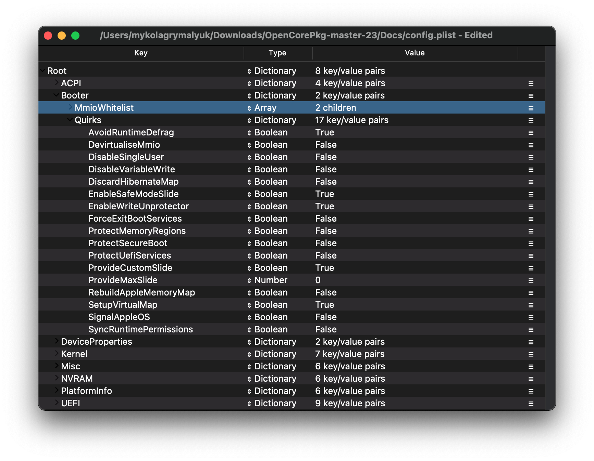

# Laptop Sandy Bridge

| Support | Version |
| :--- | :--- |
| Initial macOS Support | OS X 10.6.7, Snow Leopard |
| Last Supported OS | macOS 10.13, High Sierra |
| Note | Most Sandy bridge boards do not support UEFI |

## Starting Point

So making a config.plist may seem hard, it's not. It just takes some time but this guide will tell you how to configure everything, you won't be left in the cold. This also means if you have issues, review your config settings to make sure they're correct. Main things to note with OpenCore:

* **All properties must be defined**, there are no default OpenCore will fall back on so **do not delete sections unless told explicitly so**. If the guide doesn't mention the option, leave it at default.
* **The Sample.plist cannot be used As-Is**, you must configure it to your system
* **DO NOT USE CONFIGURATORS**, these rarely respect OpenCore's configuration and even some like Mackie's will add Clover properties and corrupt plists!

Now with all that, a quick reminder of the tools we need

* [ProperTree](https://github.com/corpnewt/ProperTree)
  * Universal plist editor
* [GenSMBIOS](https://github.com/corpnewt/GenSMBIOS)
  * For generating our SMBIOS data
* [Sample/config.plist](https://github.com/acidanthera/OpenCorePkg/releases)
  * See previous section on how to obtain: [config.plist Setup](../config.plist/README.md)

::: warning

Read this guide more than once before setting up OpenCore and make sure you have it set up correctly. Do note that images will not always be the most up-to-date so please read the text below them, if nothing's mentioned then leave as default.

:::

## ACPI


### Add

::: tip Info

This is where you'll add SSDTs for your system, these are very important to **booting macOS** and have many uses like [USB maps](https://dortania.github.io/OpenCore-Post-Install/usb/), [disabling unsupported GPUs](../extras/spoof.md) and such. And with our system, **it's even required to boot**. Guide on making them found here: [**Getting started with ACPI**](https://dortania.github.io/Getting-Started-With-ACPI/)

For us we'll need a couple of SSDTs to bring back functionality that Clover provided:

| Required SSDTs | Description |
| :--- | :--- |
| **[SSDT-PM](https://github.com/Piker-Alpha/ssdtPRGen.sh)** | Needed for proper CPU power management, you will need to run Pike's ssdtPRGen.sh script to generate this file. This will be run in [post install](https://dortania.github.io/OpenCore-Post-Install/). |
| **[SSDT-EC](https://dortania.github.io/Getting-Started-With-ACPI/)** | Fixes the embedded controller, see [Getting Started With ACPI Guide](https://dortania.github.io/Getting-Started-With-ACPI/) for more details. |
| **[SSDT-XOSI](https://github.com/dortania/Getting-Started-With-ACPI/blob/master/extra-files/compiled/SSDT-XOSI.aml)** | Makes all _OSI calls specific to Windows work for macOS (Darwin) Identifier. This may help enabling some features like XHCI and others. |
| **[SSDT-PNLF](https://dortania.github.io/Getting-Started-With-ACPI/)** | Fixes brightness control, see [Getting Started With ACPI Guide](https://dortania.github.io/Getting-Started-With-ACPI/) for more details. Note that Intel NUCs do not need this |
| **[SSDT-IMEI](https://dortania.github.io/Getting-Started-With-ACPI/)** | Needed to add a missing IMEI device on Sandy Bridge CPU with 7 series motherboards. **This is not needed for 6-series motherboards** |

Note that you **should not** add your generated `DSDT.aml` here, it is already in your firmware. So if present, remove the entry for it in your `config.plist` and under EFI/OC/ACPI.

For those wanting a deeper dive into dumping your DSDT, how to make these SSDTs, and compiling them, please see the [**Getting started with ACPI**](https://dortania.github.io/Getting-Started-With-ACPI/) **page.** Compiled SSDTs have a **.aml** extension(Assembled) and will go into the `EFI/OC/ACPI` folder and **must** be specified in your config under `ACPI -> Add` as well.

:::

### Delete

::: tip Info

This blocks certain ACPI tables from loading, for us we really care about this. Main reason is that Apple's XCPM does not support Sandy Bridge all too well and can cause AppleIntelCPUPowerManagement panics on boot. To avoid this we make our own PM SSDT in [Post-Install](https://dortania.github.io/OpenCore-Post-Install/) and drop the old tables(Note that this is only temporary until we've made our SSDT-PM, we'll re-enable these tables later):

Removing CpuPm:

| Key | Type | Value |
| :--- | :--- | :--- |
| All | Boolean | YES |
| Comment | String | Delete CpuPm |
| Enabled | Boolean | YES |
| OemTableId | Data | `437075506d000000` |
| TableLength | Number | 0 |
| TableSignature | Data | `53534454` |

Removing Cpu0Ist:

| Key | Type | Value |
| :--- | :--- | :--- |
| All | Boolean | YES |
| Comment | String | Delete Cpu0Ist |
| Enabled | Boolean | YES |
| OemTableId | Data | `4370753049737400` |
| TableLength | Number | 0 |
| TableSignature | Data | `53534454` |

:::

### Patch

::: tip Info

This section allows us to dynamically modify parts of the ACPI (DSDT, SSDT, etc.) via OpenCore. For us, we'll need the following:

* OSI rename
  * This is required when using SSDT-XOSI as we redirect all OSI calls to this SSDT

| Comment | String | Change _OSI to XOSI |
| :--- | :--- | :--- |
| Enabled | Boolean | YES |
| Count | Number | 0 |
| Limit | Number | 0 |
| Find | Data | `5f4f5349` |
| Replace | Data | `584f5349` |

:::

### Quirks

Settings relating to ACPI, leave everything here as default as we have no use for these quirks.

## Booter



This section is dedicated to quirks relating to boot.efi patching with OpenRuntime, the replacement for AptioMemoryFix.efi

### MmioWhitelist

This section is allowing spaces to be pass-through to macOS that are generally ignored, useful when paired with `DevirtualiseMmio`

### Quirks

::: tip Info
Settings relating to boot.efi patching and firmware fixes, for us, we leave it as default
:::
::: details More in-depth Info

* **AvoidRuntimeDefrag**: YES
  * Fixes UEFI runtime services like date, time, NVRAM, power control, etc
* **EnableSafeModeSlide**: YES
  * 允许slide变量在安全模式下使用。
* **EnableWriteUnprotector**: YES
  * Needed to remove write protection from CR0 register.
* **ProvideCustomSlide**: YES
  * 用于Slide变量计算。然而，这种怪异的必要性取决于 `OCABC: Only N/256 slide values are usable!` 调试日志中的消息。如果显示 `OCABC: All slides are usable! You can disable ProvideCustomSlide!` 在你的日志中，你可以禁用`ProvideCustomSlide`.
* **SetupVirtualMap**: YES
  * Fixes SetVirtualAddresses calls to virtual addresses, required for Gigabyte boards to resolve early kernel panics
  
:::

## DeviceProperties


### Add

Sets device properties from a map.

::: tip PciRoot(0x0)/Pci(0x2,0x0)

This section is set up via WhateverGreen's [Framebuffer Patching Guide](https://github.com/acidanthera/WhateverGreen/blob/master/Manual/FAQ.IntelHD.en.md) and is used for setting important iGPU properties.

The config.plist doesn't already have a section for this so you will have to create it manually.

When setting up your iGPU, the table below should help with finding the right values to set. Here is an explanation of some values:

* **AAPL,snb-platform-id**
  * This is used internally for setting up the iGPU
* **Type**
  * Whether the entry is recommended for laptops(ie. with built-in displays) or for Intel NUCs(ie. stand alone boxes)

Generally follow these steps when setting up your iGPU properties. Follow the configuration notes below the table if they say anything different:

1. When initially setting up your config.plist, only set AAPL,snb-platform-id - this is normally enough

| AAPL,snb-platform-id | Type | Comment |
| ------------------- | ---- | ------- |
| **`00000100`** | Laptop | To be used with laptops |
| **`10000300`** | NUC | To be used with Intel NUCs |

#### Configuration Notes

* VGA is *not* supported (unless it's running through a DP to VGA internal adapter, which apparently only rare devices will see it as DP and not VGA, it's all about luck.)
* HD 2000 series are unsupported as well

:::

::: tip PciRoot(0x0)/Pci(0x16,0x0)

**Sandy/IvyBridge Hybrids:**

Some laptops from this era came with a mixed chipset setup, using Sandy Bridge CPUs with Ivy Bridge chipsets which creates issues with macOS since it expects a certain [IMEI](https://en.wikipedia.org/wiki/Intel_Management_Engine) ID that it doesn't find and would get stuck at boot(As Apple's iGPU drivers require an [IMEI device](https://en.wikipedia.org/wiki/Intel_Management_Engine)), to fix this we need to fake the IMEI's IDs in these models

* To know if you're affected check if your CPU is an Intel Core ix-3xxx and your chipset is Hx6x (for example a laptop with HM65 or HM67 with a Core i3-3110M) through tools like AIDA64.
* In your config add a new PciRoot device named `PciRoot(0x0)/Pci(0x16,0x0)`

| Key | Type | Value |
| :--- | :--- | :--- |
| device-id | Data | `3A1C0000` |

:::

::: tip PciRoot(0x0)/Pci(0x1b,0x0)

`layout-id`

* Applies AppleALC audio injection, you'll need to do your own research on which codec your motherboard has and match it with AppleALC's layout. [AppleALC Supported Codecs](https://github.com/acidanthera/AppleALC/wiki/Supported-codecs).
* You can delete this property outright as it's unused for us at this time

For us, we'll be using the boot argument `alcid=xxx` instead to accomplish this. `alcid` will override all other layout-IDs present. More info on this is covered in the [Post-Install Page](https://dortania.github.io/OpenCore-Post-Install/)

:::

### Delete

Removes device properties from the map, for us we can ignore this

## Kernel


### Add

Here's where we specify which kexts to load, in what specific order to load, and what architectures each kext is meant for. By default we recommend leaving what ProperTree has done, however for 32-bit CPUs please see below:

::: details More in-depth Info

The main thing you need to keep in mind is:

* 装载顺序
  * 记住，任何插件都应该在它的依赖**后面**加载
  * 这意味着像Lilu这样的kext **必须**出现在VirtualSMC、AppleALC、WhateverGreen等之前

提醒一下 [ProperTree](https://github.com/corpnewt/ProperTree) 用户可以运行 **Cmd/Ctrl + Shift + R** 以正确的顺序添加他们所有的kext，而无需手动输入每个kext。

* **Arch**
  * 这个kext支持的架构
  * 目前支持的值是 `Any`, `i386` (32位), 和`x86_64` (64位)
* **BundlePath**
  * kext的名称
  * 例如: `Lilu.kext`
* **Enabled**
  * 不言自明，启用或禁用kext
* **ExecutablePath**
  * 实际可执行文件的路径隐藏在kext中，您可以通过右键单击并选择`显示包内容`来查看kext的路径。一般来说，它们将是`Contents/MacOS/Kext`，但有些将Kext隐藏在`Plugin`文件夹下。请注意，kext中仅plist时不需要填充该属性。
  * 例如: `Contents/MacOS/Lilu`
* **MinKernel**
  * kext将被注入到的最低内核版本，有关可能的值，请参见下表
  * 例如. `12.00.00` 用于 OS X 10.8
* **MaxKernel**
  * kext将被注入到的最高内核版本，可能的值见下表
  * 例如. `11.99.99` 用于 OS X 10.7
* **PlistPath**
  * 隐藏在kext中的info.plist的路径
  * 例如: `Contents/Info.plist`
  
::: details Kernel Support Table

| OS X Version | MinKernel | MaxKernel |
| :--- | :--- | :--- |
| 10.4 | 8.0.0 | 8.99.99 |
| 10.5 | 9.0.0 | 9.99.99 |
| 10.6 | 10.0.0 | 10.99.99 |
| 10.7 | 11.0.0 | 11.99.99 |
| 10.8 | 12.0.0 | 12.99.99 |
| 10.9 | 13.0.0 | 13.99.99 |
| 10.10 | 14.0.0 | 14.99.99 |
| 10.11 | 15.0.0 | 15.99.99 |
| 10.12 | 16.0.0 | 16.99.99 |
| 10.13 | 17.0.0 | 17.99.99 |
| 10.14 | 18.0.0 | 18.99.99 |
| 10.15 | 19.0.0 | 19.99.99 |
| 11 | 20.0.0 | 20.99.99 |
| 12 | 21.0.0 | 21.99.99 |
| 13 | 22.0.0 | 22.99.99 |

:::

### Emulate

Needed for spoofing unsupported CPUs like Pentiums and Celerons

* **Cpuid1Mask**: Leave this blank
* **Cpuid1Data**: Leave this blank

### Force

Used for loading kexts off system volume, only relevant for older operating systems where certain kexts are not present in the cache(ie. IONetworkingFamily in 10.6).

For us, we can ignore.

### Block

Blocks certain kexts from loading. Not relevant for us.

### Patch

Patches both the kernel and kexts.

### Quirks

::: tip Info

Settings relating to the kernel, for us we'll be enabling the following:

| Quirk | Enabled | Comment |
| :--- | :--- | :--- |
| AppleCpuPmCfgLock | YES | Not needed if `CFG-Lock` is disabled in the BIOS |
| DisableIoMapper | YES | Not needed if `VT-D` is disabled in the BIOS |
| LapicKernelPanic | NO | HP Machines will require this quirk |
| PanicNoKextDump | YES | |
| PowerTimeoutKernelPanic | YES | |
| XhciPortLimit | YES | If your board does not have USB 3.0, you can disable<br/>Disable if running macOS 11.3+ |

:::

::: details More in-depth Info

* **AppleCpuPmCfgLock**: YES
  * 仅当BIOS中不能禁用CFG-Lock时需要
  * 仅适用于 Ivy Bridge 和更旧的
    * 注意:Broadwell及更老版本在运行10.10或更老版本时需要此功能
* **AppleXcpmCfgLock**: NO
  * 仅当BIOS中不能禁用CFG-Lock时需要
  * 仅适用于Haswell和更新版本
    * 注意:Ivy Bridge-E也包括在内，因为它支持XCPM
* **CustomSMBIOSGuid**: NO
  * 为UpdateSMBIOSMode设置为`Custom`时执行GUID补丁。通常与戴尔笔记本电脑有关
  * 通过UpdateSMBIOSMode自定义模式启用此怪癖也可以禁用SMBIOS注入到“非苹果”操作系统中，但我们不支持这种方法，因为它破坏了Bootcamp兼容性。使用风险自负
* **DisableIoMapper**: YES
  * 如果在BIOS中无法禁用或其他操作系统需要启用VT-D，则需要绕过VT-D，这是`dart=0`的更好替代方案，因为SIP可以在Catalina中继续运行
* **DisableLinkeditJettison**: YES
  * 允许Lilu和其他kext在不需要`keepsyms=1`的情况下拥有更可靠的性能
* **DisableRtcChecksum**: NO
  * 防止AppleRTC写入主校验和(0x58-0x59)，这对于接收BIOS重置或在重启/关机后进入安全模式的用户是必需的
* **ExtendBTFeatureFlags** NO
  * 对于那些非apple /非fenvi卡有连续性问题的人很有帮助
* **LapicKernelPanic**: NO
  * 在AP核心lapic中断上禁用内核崩溃，一般HP系统需要。相当于Clover的`Kernel LAPIC`
* **LegacyCommpage**: NO
  * 解决了macOS中64位cpu的SSSE3要求，主要适用于64位Pentium 4 cpu (即Prescott)
* **PanicNoKextDump**: YES
  * 允许在发生内核严重故障时读取内核严重故障日志
* **PowerTimeoutKernelPanic**: YES
  * 帮助修复macOS Catalina中与苹果驱动程序权限变化相关的内核崩溃，尤其是数字音频。
* **SetApfsTrimTimeout**: `-1`
  * 为ssd上的APFS文件系统设置以微秒为单位的修剪超时时间，仅适用于macOS 10.14及更新版本的有问题的ssd。
* **XhciPortLimit**: YES
  * This is actually the 15 port limit patch, don't rely on it as it's not a guaranteed solution for fixing USB. Please create a [USB map](https://dortania.github.io/OpenCore-Post-Install/usb/) when possible.
  * 在macOS 11.3+中，[XhciPortLimit可能无法正常工作。](https://github.com/dortania/bugtracker/issues/162) 我们建议用户在升级前禁用此功能和 映射或 [从Windows映射](https://github.com/USBToolBox/tool). 你也可以安装macOS 11.2.3或更旧的版本。

The reason being is that UsbInjectAll reimplements builtin macOS functionality without proper current tuning. It is much cleaner to just describe your ports in a single plist-only kext, which will not waste runtime memory and such

:::

### Scheme

Settings related to legacy booting(ie. 10.4-10.6), for majority you can skip however for those planning to boot legacy OSes you can see below:

::: details More in-depth Info

* **FuzzyMatch**: True
  * 用于忽略内核缓存的校验和，而不是选择可用的最新缓存。可以帮助提高10.6中许多机器的启动性能
* **KernelArch**: x86_64
  * 设置内核的arch类型，你可以在`Auto`、`i386`(32位)和`x86_64`(64位)之间选择。
  * 如果你正在启动需要32位内核的旧操作系统(例如:10.4和10.5)我们建议将其设置为`Auto`，并让macOS根据您的SMBIOS决定。支持的值见下表:
    * 10.4-10.5 — `x86_64`, `i386` 或 `i386-user32`
      * `i386-user32` 是32位的用户空间，所以32位的cpu必须使用这个(或cpu缺少SSSE3)
      * `x86_64` 仍然有一个32位的内核空间，但是在10.4/5中将确保64位的用户空间
    * 10.6 — `i386`, `i386-user32`, 或 `x86_64`
    * 10.7 — `i386` 或 `x86_64`
    * 10.8 或更新的 — `x86_64`

* **KernelCache**: Auto
  * 设置内核缓存类型，主要用于调试，因此我们建议使用`Auto`以获得最佳支持

:::

## Misc


### Boot

::: tip Info

| Quirk | Enabled | Comment |
| :--- | :--- | :--- |
| HideAuxiliary | YES | Press space to show macOS recovery and other auxiliary entries |

:::

::: details More in-depth Info

* **HideAuxiliary**: YES
  * 此选项将在选择器中隐藏补充条目，例如macOS恢复和工具。隐藏辅助条目可以提高多磁盘系统的启动性能。您可以在选择器处按空格键来显示这些条目

:::

### Debug

::: tip Info

Helpful for debugging OpenCore boot issues(We'll be changing everything *but* `DisplayDelay`):

| Quirk | Enabled |
| :--- | :--- |
| AppleDebug | YES |
| ApplePanic | YES |
| DisableWatchDog | YES |
| Target | 67 |

:::

::: details More in-depth Info

* **AppleDebug**: YES
  * 启用boot.efi的日志记录，用于调试。注意只有10.15.4及更高版本支持这个功能
* **ApplePanic**: YES
  * 尝试将内核崩溃记录到磁盘
* **DisableWatchDog**: YES
  * 禁用UEFI watchdog，可以帮助解决早期引导问题
* **DisplayLevel**: `2147483650`
  * 显示更多的调试信息，需要调试版本的OpenCore
* **SysReport**: NO
  * 有助于调试，例如转储ACPI表
  * 注意，这仅限于调试版本的OpenCore
* **Target**: `67`
  * 显示更多的调试信息，需要OpenCore的调试版本

这些值是基于 [OpenCore 调试](../troubleshooting/debug.md)中计算的值。

:::

### Security

::: tip Info

Security is pretty self-explanatory, **do not skip**. We'll be changing the following:

| Quirk | Enabled | Comment |
| :--- | :--- | :--- |
| AllowSetDefault | YES | |
| BlacklistAppleUpdate | YES | |
| ScanPolicy | 0 | |
| SecureBootModel | Default | Leave this as `Default` for OpenCore to automatically set the correct value corresponding to your SMBIOS. The next page goes into more detail about this setting. |
| Vault | Optional | This is a word, it is not optional to omit this setting. You will regret it if you don't set it to Optional, note that it is case-sensitive |

:::

::: details More in-depth Info

* **AllowSetDefault**: YES
  * 允许按 `CTRL+Enter` 和`CTRL+Index` 在选择器中设置默认启动条目
* **ApECID**: 0
  * 用于网络个性化的安全启动标识符，由于macOS安装程序中的一个bug，目前这种方式是不可靠的，因此我们强烈建议您保留默认设置。
* **AuthRestart**: NO
  * 为FileVault 2启用身份认证重启，因此在重启时不需要密码。可以被认为是一个可选的安全风险
* **BlacklistAppleUpdate**: YES
  * 用于阻止固件更新，作为额外的保护级别，因为macOS Big Sur不再使用`run-efi-updater`变量

* **DmgLoading**: Signed
  * 确保只加载经过签名的dmg
* **ExposeSensitiveData**: `6`
  * 显示更多的调试信息，需要OpenCore的调试版本
* **Vault**: `Optional`
  * 我们不会处理这个，所以我们可以忽略，**你不会启动这个设置，因为安全**
  * 这是一个单词，省略此设置是不可以的。如果你不把它设置为`Optional`，你会后悔的，注意它是区分大小写的
* **ScanPolicy**: `0`
  * `0`允许您查看所有可用的驱动器，请参阅[安全](https://dortania.github.io/OpenCore-Post-Install/universal/security.html)部分了解更多详细信息。**如果设置为默认，将不会启动USB设备**
* **SecureBootModel**: Default
  * 在macOS中控制Apple的安全启动功能，请参阅[安全](https://dortania.github.io/OpenCore-Post-Install/universal/security.html) 部分了解更多细节。
  * 注意:用户可能会发现在已经安装的系统上升级OpenCore可能会导致早期引导失败。要解决这个问题，请参见这里:[卡在 OCB: LoadImage failed - Security Violation](/troubleshooting/extended/kernel-issues.md#stuck-on-ocb-loadimage-failed-security-violation)

:::

### Serial

Used for serial debugging (Leave everything as default).

### Tools

Used for running OC debugging tools like the shell, ProperTree's snapshot function will add these for you.

### Entries

Used for specifying irregular boot paths that can't be found naturally with OpenCore.

Won't be covered here, see 8.6 of [Configuration.pdf](https://github.com/acidanthera/OpenCorePkg/blob/master/Docs/Configuration.pdf) for more info

## NVRAM


### Add

::: tip 4D1EDE05-38C7-4A6A-9CC6-4BCCA8B38C14

Used for OpenCore's UI scaling, default will work for us. See in-depth section for more info

:::

::: details More in-depth Info

Booter Path, mainly used for UI modification

* **DefaultBackgroundColor**: Background color used by boot.efi
  * `00000000`: Syrah Black
  * `BFBFBF00`: Light Gray

:::

::: tip 4D1FDA02-38C7-4A6A-9CC6-4BCCA8B30102

OpenCore's NVRAM GUID, mainly relevant for RTCMemoryFixup users

:::

::: details More in-depth Info

* **rtc-blacklist**: <>
  * To be used in conjunction with RTCMemoryFixup, see here for more info: [Fixing RTC write issues](https://dortania.github.io/OpenCore-Post-Install/misc/rtc.html#finding-our-bad-rtc-region)
  * Most users can ignore this section

:::

::: tip 7C436110-AB2A-4BBB-A880-FE41995C9F82

System Integrity Protection bitmask

* **General Purpose boot-args**:

| boot-args | Description |
| :--- | :--- |
| **-v** | This enables verbose mode, which shows all the behind-the-scenes text that scrolls by as you're booting instead of the Apple logo and progress bar. It's invaluable to any Hackintosher, as it gives you an inside look at the boot process, and can help you identify issues, problem kexts, etc. |
| **debug=0x100** | This disables macOS's watchdog which helps prevents a reboot on a kernel panic. That way you can *hopefully* glean some useful info and follow the breadcrumbs to get past the issues. |
| **keepsyms=1** | This is a companion setting to debug=0x100 that tells the OS to also print the symbols on a kernel panic. That can give some more helpful insight as to what's causing the panic itself. |
| **alcid=1** | Used for setting layout-id for AppleALC, see [supported codecs](https://github.com/acidanthera/applealc/wiki/supported-codecs) to figure out which layout to use for your specific system. More info on this is covered in the [Post-Install Page](https://dortania.github.io/OpenCore-Post-Install/) |

* **GPU-Specific boot-args**:

| boot-args | Description |
| :--- | :--- |
| **-wegnoegpu** | 用于禁用除集成的Intel iGPU之外的所有其他gpu，对于那些想运行新版本的macOS，而他们的dGPU不支持的人很有用 |

* **csr-active-config**: `00000000`
  * '系统完整性保护' (SIP)的设置。通常建议通过恢复分区使用`csrutil`进行更改。
  * 默认情况下，csr-active-config设置为`00000000`，以启用系统完整性保护。您可以选择许多不同的值，但总的来说，为了最佳安全实践，我们建议启用此选项。更多信息可以在我们的故障排除页面中找到:[禁用SIP](../troubleshooting/extended/post-issues.md#disabling-sip)

* **run-efi-updater**: `No`
  * 这用于防止苹果的固件更新包安装的时候破坏引导顺序;这很重要，因为这些固件更新(意味着mac)将无法工作。

* **prev-lang:kbd**: <>
  * *需要`lang-COUNTRY:keyboard`格式的非拉丁键盘，建议保持空白，尽管你可以指定它(**示例配置中默认是俄语**):
  * American: `en-US:0`(`656e2d55533a30` in HEX)
  * Full list can be found in [AppleKeyboardLayouts.txt](https://github.com/acidanthera/OpenCorePkg/blob/master/Utilities/AppleKeyboardLayouts/AppleKeyboardLayouts.txt)
  * Hint: `prev-lang:kbd` can be changed into a String so you can input `en-US:0` directly instead of converting to HEX
  * Hint 2: `prev-lang:kbd` can be set to a blank variable (eg. `<>`) which will force the Language Picker to appear instead at first boot up.

| Key | Type | Value |
| :--- | :--- | :--- |
| prev-lang:kbd | String | en-US:0 |

:::

### Delete

Forcibly rewrites NVRAM variables, do note that `Add` **will not overwrite** values already present in NVRAM so values like `boot-args` should be left alone.

* **LegacySchema**
  * Used for assigning NVRAM variables, used with `OpenVariableRuntimeDxe.efi`. Only needed for systems without native NVRAM

* **WriteFlash**: YES
  * Enables writing to flash memory for all added variables.

## PlatformInfo


::: tip Info

For setting up the SMBIOS info, we'll use CorpNewt's [GenSMBIOS](https://github.com/corpnewt/GenSMBIOS) application.

For this Sandy Bridge example, we'll chose the MacBookPro8,1 SMBIOS - this is done intentionally for compatibility's sake. The typical breakdown is as follows:

| SMBIOS | CPU Type | GPU Type | Display Size |
| :--- | :--- | :--- | :--- |
| MacBookAir4,1 | Dual Core 17W | iGPU: HD 3000 | 11" |
| MacBookAir4,2 | Dual Core 17W | iGPU: HD 3000 | 13" |
| MacBookPro8,1 | Dual Core 35W | iGPU: HD 3000 | 13" |
| MacBookPro8,2 | Quad Core 45W(High End) | iGPU: HD 3000 + 6490M | 15" |
| MacBookPro8,3 | Quad Core 45W(High End) | iGPU: HD 3000 + 6750M | 17" |
| Macmini5,1 | Dual Core NUC | iGPU: HD 3000 | N/A |
| Macmini5,3 | Quad Core NUC | iGPU: HD 3000 | N/A |

Run GenSMBIOS, pick option 1 for downloading MacSerial and Option 3 for selecting out SMBIOS.  This will give us an output similar to the following:

```sh
  #######################################################
 #                MacBookPro8,2 SMBIOS Info            #
#######################################################

Type:         MacBookPro8,2
Serial:       C02KCYZLDNCW
Board Serial: C02309301QXF2FRJC
SmUUID:       A154B586-874B-4E57-A1FF-9D6E503E4580
```

The `Type` part gets copied to Generic -> SystemProductName.

The `Serial` part gets copied to Generic -> SystemSerialNumber.

The `Board Serial` part gets copied to Generic -> MLB.

The `SmUUID` part gets copied to Generic -> SystemUUID.

We set Generic -> ROM to either an Apple ROM (dumped from a real Mac), your NIC MAC address, or any random MAC address (could be just 6 random bytes, for this guide we'll use `11223300 0000`. After install follow the [Fixing iServices](https://dortania.github.io/OpenCore-Post-Install/universal/iservices.html) page on how to find your real MAC Address)

**Reminder that you need an invalid serial! When inputting your serial number in [Apple's Check Coverage Page](https://checkcoverage.apple.com), you should get a message such as "Unable to check coverage for this serial number."**

**Automatic**: YES

* Generates PlatformInfo based on Generic section instead of DataHub, NVRAM, and SMBIOS sections

:::

### Generic

::: details More in-depth Info

* **AdviseFeatures**: NO
  * Used for when the EFI partition isn't first on the Windows drive

* **MaxBIOSVersion**: NO
  * Sets BIOS version to Max to avoid firmware updates in Big Sur+, mainly applicable for genuine Macs.

* **ProcessorType**: `0`
  * Set to `0` for automatic type detection, however this value can be overridden if desired. See [AppleSmBios.h](https://github.com/acidanthera/OpenCorePkg/blob/master/Include/Apple/IndustryStandard/AppleSmBios.h) for possible values

* **SpoofVendor**: YES
  * Swaps vendor field for Acidanthera, generally not safe to use Apple as a vendor in most case

* **SystemMemoryStatus**: Auto
  * Sets whether memory is soldered or not in SMBIOS info, purely cosmetic and so we recommend `Auto`

* **UpdateDataHub**: YES
  * Update Data Hub fields

* **UpdateNVRAM**: YES
  * Update NVRAM fields

* **UpdateSMBIOS**: YES
  * Updates SMBIOS fields

* **UpdateSMBIOSMode**: Create
  * Replace the tables with newly allocated EfiReservedMemoryType, use `Custom` on Dell laptops requiring `CustomSMBIOSGuid` quirk
  * Setting to `Custom` with `CustomSMBIOSGuid` quirk enabled can also disable SMBIOS injection into "non-Apple" OSes however we do not endorse this method as it breaks Bootcamp compatibility. Use at your own risk

:::

## UEFI


**ConnectDrivers**: YES

* Forces .efi drivers, change to NO will automatically connect added UEFI drivers. This can make booting slightly faster, but not all drivers connect themselves. E.g. certain file system drivers may not load.

### Drivers

Add your .efi drivers here.

Only drivers present here should be:

* HfsPlusLegacy.efi
* OpenRuntime.efi
* OpenUsbKbDxe.efi(If your firmware does not support UEFI)

::: details More in-depth Info

| Key | Type | Description |
| :--- | :--- | :--- |
| Path | String | Path of the file from `OC/Drivers` directory |
| LoadEarly | Boolean | Load the driver early before NVRAM setup, should only be enabled for `OpenRuntime.efi` and `OpenVariableRuntimeDxe.efi` if using legacy NVRAM |
| Arguments | String | Some drivers accept additional arguments which are specified here. |

:::

### APFS

By default, OpenCore only loads APFS drivers from macOS Big Sur and newer. If you are booting macOS Catalina or earlier, you may need to set a new minimum version/date.
Not setting this can result in OpenCore not finding your macOS partition!

macOS Sierra and earlier use HFS instead of APFS. You can skip this section if booting older versions of macOS.

::: tip APFS Versions

Both MinVersion and MinDate need to be set if changing the minimum version.

| macOS Version | Min Version | Min Date |
| :------------ | :---------- | :------- |
| High Sierra (`10.13.6`) | `748077008000000` | `20180621` |
| Mojave (`10.14.6`) | `945275007000000` | `20190820` |
| Catalina (`10.15.4`) | `1412101001000000` | `20200306` |
| No restriction | `-1` | `-1` |

:::

### Audio

Related to AudioDxe settings, for us we'll be ignoring(leave as default). This is unrelated to audio support in macOS.

* For further use of AudioDxe and the Audio section, please see the Post Install page: [Add GUI and Boot-chime](https://dortania.github.io/OpenCore-Post-Install/)

### Input

::: tip Info

Related to boot.efi keyboard passthrough used for FileVault and Hotkey support, leave everything here as default besides:

| Quirk | Value | Comment |
| :--- | :--- | :--- |
| KeySupport | NO | Enable if your BIOS supports UEFI |

:::

### Output

Relating to OpenCore's visual output, leave everything here as default as we have no use for these quirks.

::: details More in-depth Info

| Output | Value | Comment |
| :--- | :--- | :--- |
| UIScale | `0` | `0` will automatically set based on resolution<br/>`-1` will leave it unchanged<br/>`1` for 1x scaling, for normal displays<br/>`2` for 2x scaling, for HiDPI displays |

:::

### ProtocolOverrides

Mainly relevant for Virtual machines, legacy macs and FileVault users. See here for more details: [Security and FileVault](https://dortania.github.io/OpenCore-Post-Install/)

### Quirks

::: tip Info
Relating to quirks with the UEFI environment, for us we'll be changing the following:

| Quirk | Enabled | Comment |
| :--- | :--- | :--- |
| IgnoreInvalidFlexRatio | YES | |
| ReleaseUsbOwnership | YES | |
| UnblockFsConnect | NO | Needed mainly by HP motherboards |

:::

::: details More in-depth Info

* **IgnoreInvalidFlexRatio**: YES
  * Fix for when MSR_FLEX_RATIO (0x194) can't be disabled in the BIOS, required for all pre-Skylake based systems
* **ReleaseUsbOwnership**: YES
  * Releases USB controller from firmware driver, needed for when your firmware doesn't support EHCI/XHCI Handoff. Most laptops have garbage firmwares so we'll need this as well
* **DisableSecurityPolicy**: NO
  * Disables platform security policy in firmware, recommended for buggy firmwares where disabling Secure Boot does not allow 3rd party firmware drivers to load.
  * If running a Microsoft Surface device, recommended to enable this option

* **RequestBootVarRouting**: YES
  * Redirects AptioMemoryFix from `EFI_GLOBAL_VARIABLE_GUID` to `OC_VENDOR_VARIABLE_GUID`. Needed for when firmware tries to delete boot entries and is recommended to be enabled on all systems for correct update installation, Startup Disk control panel functioning, etc.

* **UnblockFsConnect**: NO
  * Some firmware block partition handles by opening them in By Driver mode, which results in File System protocols being unable to install. Mainly relevant for HP systems when no drives are listed

:::

### ReservedMemory

Used for exempting certain memory regions from OSes to use, mainly relevant for Sandy Bridge iGPUs or systems with faulty memory. Use of this quirk is not covered in this guide

## Cleaning up

And now you're ready to save and place it into your EFI under EFI/OC.

For those having booting issues, please make sure to read the [Troubleshooting section](../troubleshooting/troubleshooting.md) first and if your questions are still unanswered we have plenty of resources at your disposal:

* [r/Hackintosh Subreddit](https://www.reddit.com/r/hackintosh/)
* [r/Hackintosh Discord](https://discord.gg/2QYd7ZT)

### Config reminders

**HP Users**:

* Kernel -> Quirks -> LapicKernelPanic -> True
  * You will get a kernel panic on LAPIC otherwise
* UEFI -> Quirks -> UnblockFsConnect -> True

## Intel BIOS settings

* Note: Most of these options may not be present in your firmware, we recommend matching up as closely as possible but don't be too concerned if many of these options are not available in your BIOS

These are the main options to check for, if you can't find it or an equivalent for it, just skip it.

### Disable

* Fast Boot
* Secure Boot
* Serial/COM Port
* Parallel Port
* VT-d (can be enabled if you set `DisableIoMapper` to YES)
* Compatibility Support Module (CSM) (**Must be off in most cases, GPU errors/stalls like `gIO` are common when this option is enabled**) (or Legacy Support, or Hybrid Boot)
* Thunderbolt (For initial install, as Thunderbolt can cause issues if not setup correctly, if available)
* Intel SGX
* Intel Platform Trust
* CFG Lock (MSR 0xE2 write protection)(**This must be off, if you can't find the option then enable `AppleCpuPmCfgLock` under Kernel -> Quirks. Your hack will not boot with CFG-Lock enabled**)

### Enable

* VT-x (Virtualization Support)
* Above 4G Decoding
* Hyper-Threading
* Execute Disable Bit
* EHCI/XHCI Hand-off
* OS type: Windows 8.1/10 UEFI Mode (some motherboards may require "Other OS" instead)
* DVMT Pre-Allocated(iGPU Memory): 32MB or higher
* SATA Mode: AHCI

# Once done here, we need to edit a couple extra values. Head to the [Apple Secure Boot Page](../config.plist/security.md)
