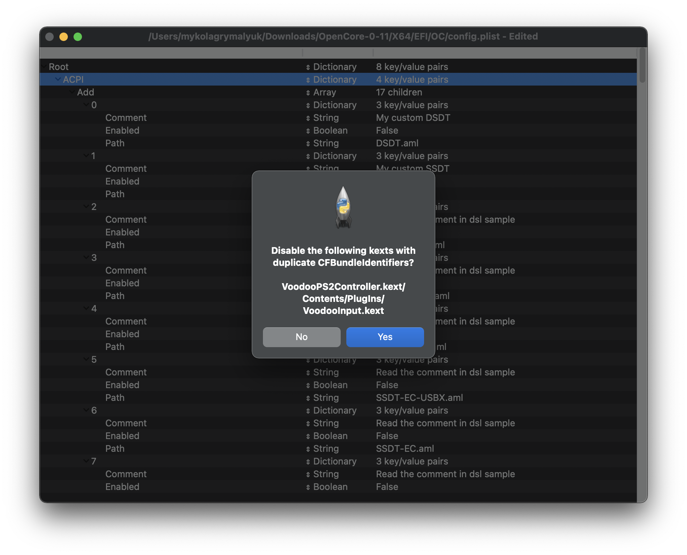

# Config.plist Setup

So making a config.plist may seem hard, it's not. It just takes some time but this guide will tell you how to configure everything, you won't be left in the cold. This also means if you have issues, review your config settings to make sure they're correct. Main things to note with OpenCore:

* **All properties must be defined**, there are no default OpenCore will fall back on so **do not delete sections unless told explicitly so**. If the guide doesn't mention the option, leave it at default.
* **The Sample.plist cannot be used As-Is**, you must configure it to your system
* **DO NOT USE CONFIGURATORS**, these rarely respect OpenCore's configuration and even some like Mackie's will add Clover properties and corrupt plists!

Now with all that, these are the tools that will be used to configure your config.plist.

* [ProperTree](https://github.com/corpnewt/ProperTree)
  * Universal plist editor
* [GenSMBIOS](https://github.com/corpnewt/GenSMBIOS)
  * For generating our SMBIOS data
* [AMD Kernel Patches](https://github.com/AMD-OSX/AMD_Vanilla/tree/master)
  * Needed for booting macOS on AMD hardware(save these for later, we'll go over how to use them below)
  * Supporting AMD Family 15h, 16h, 17h and 19h

**You may want to read this page more than once to make sure you don't miss anything. Do note that the images may not be up to date. The text below the images are more likely to be updated.**

Now that we've got all our Kexts(.kext), SSDTs(.aml) and firmware drivers(.efi), your USB should start to look something like this:

* **Note**: Your USB **will look different**, everyone's system will have different requirements.

## Creating your config.plist

First we'll want to grab the sample.plist from the [OpenCorePkg](https://github.com/acidanthera/OpenCorePkg/releases), this will be located under the `Docs` folder:

Next lets move it onto our USB's EFI partition(will be called BOOT on Windows) under `EFI/OC/`, and rename it to config.plist:

## Adding your SSDTs, Kexts and Firmware Drivers

For the rest of this guide, you're gonna need some form of plist editer. This guide assumes that you are using ProperTree and GenSMBIOS, which can help automate some of the tedious work:

To open ProperTree and edit our config.plist, run the below:

* `ProperTree.command`
  * For macOS
  * Pro tip: there's a `buildapp.command` utility in the `Scripts` folder that lets you turn ProperTree into a dedicated app in macOS
* `ProperTree.bat`
  * For Windows

Once ProperTree is running, open your config.plist by pressing **Cmd/Ctrl + O** and selecting the `config.plist` file on your USB.

After the config is opened, press **Cmd/Ctrl + Shift + R** and point it at your EFI/OC folder to perform a "Clean Snapshot":

* This will remove all the entries from the config.plist and then adds all your SSDTs, Kexts and Firmware drivers to the config
* **Cmd/Ctrl + R** is another option that will add all your files as well but will leave entries disabled if they were set like that before, useful for when you're troubleshooting but for us not needed right now

Once done, you'll see your SSDTs, Kexts and firmware drivers populated in the config.plist:

* **Note:** If you get a pop up "Disable the following kexts with Duplicate CFBundleIdentifiers?", press "Yes". This is to ensure you don't have duplicate kexts being injected, as some kexts may have some of the same plugins(ie. VoodooInput is in both VoodooPS2 and VoodooI2C's plugin folder)

If you wish to clean up the file a bit, you can remove the `#WARNING` entries. These cause no issues if left in, so it is up to personal preference.

::: danger
The config.plist **must** match the contents of the EFI folder. If you delete a file but leave it listed in the Config.plist, OpenCore will error and stop booting. If you make any modifications, you can use the OC snapshot tool (**Cmd/Ctrl + R**) in ProperTree to update the config.plist.
:::

Once you are done adding with the snapshot, you will want to [start configuring your Config.plist here.](./global.md)