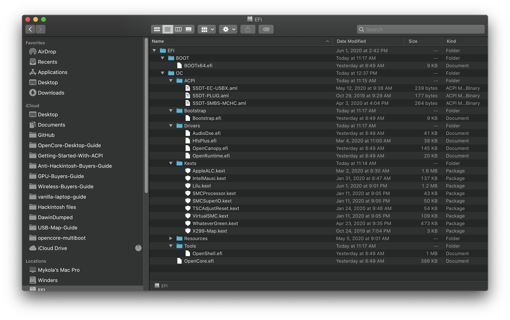
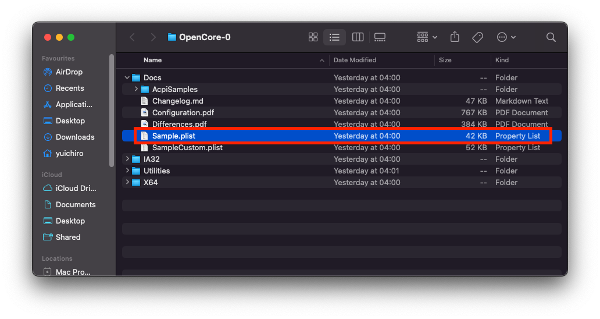
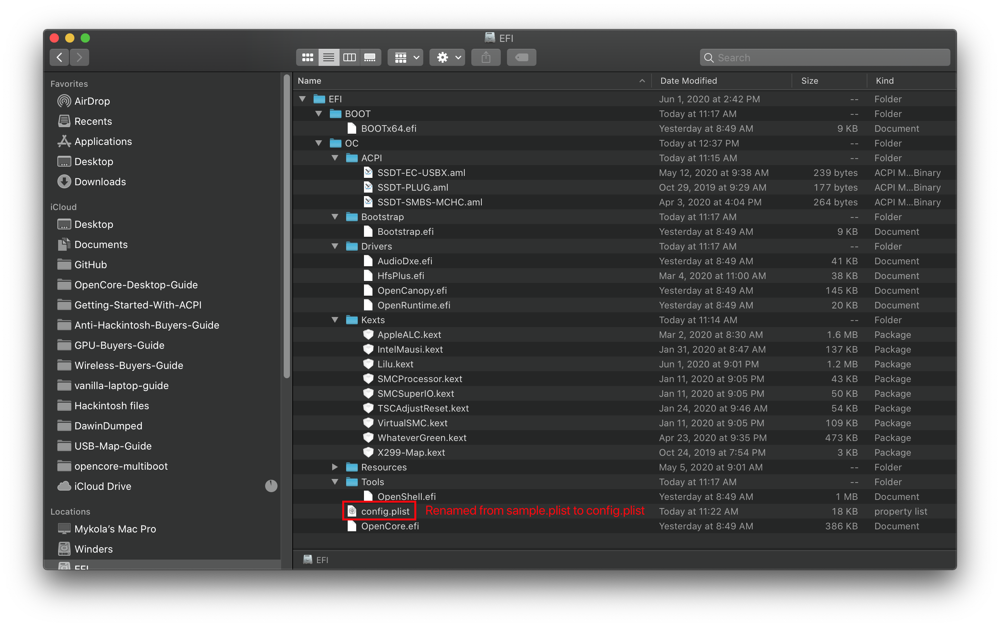
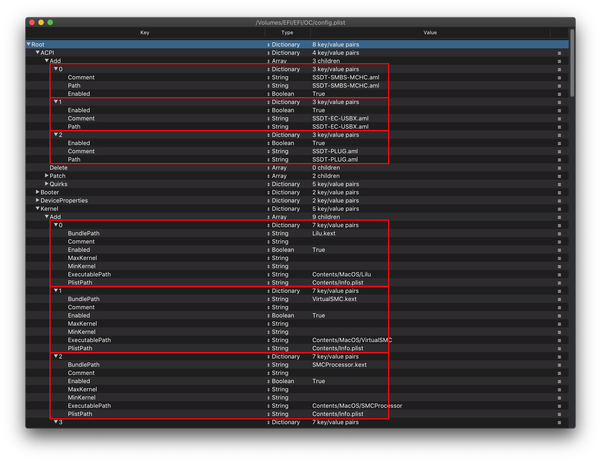

# config.plist Setup

Now that we've got all our Kexts(.kext), SSDTs(.aml) and firmware drivers(.efi), your USB should start to look something like this:

* **Note**: Your USB **will look different**, everyone's system will have different requirements.

## Creating your config.plist

First we'll want to grab the sample.plist from the [OpenCorePkg](https://github.com/acidanthera/OpenCorePkg/releases), this will be located under the `Docs` folder:

Next lets move it onto our USB's EFI partition(will be called BOOT on Windows) under `EFI/OC/`, and rename it to config.plist:

## Adding your SSDTs, Kexts and Firmware Drivers

For the rest of this guide, you're gonna need some form of plist editing. And for our guide, we'll be using ProperTree and GenSMBIOS to help automate some of the tedious work:

* [ProperTree](https://github.com/corpnewt/ProperTree)
  * Universal plist editor
* [GenSMBIOS](https://github.com/corpnewt/GenSMBIOS)
  * For generating our SMBIOS data

Next, let's open ProperTree and edit our config.plist:

* `ProperTree.command`
  * For macOS
  * Pro tip: there's a `buildapp.command` utility in the `Scripts` folder that lets you turn ProperTree into a dedicated app in macOS
* `ProperTree.bat`
  * For Windows

Once ProperTree is running, open your config.plist by pressing **Cmd/Ctrl + O** and selecting the `config.plist` file on your USB.

After the config is opened, press **Cmd/Ctrl + Shift + R** and point it at your EFI/OC folder to perform a "Clean Snapshot":

* This will remove all the entries from the config.plist and then adds all your SSDTs, Kexts and Firmware drivers to the config
* **Cmd/Ctrl + R** is another option that will add all your files as well but will leave entries disabled if they were set like that before, useful for when you're troubleshooting but for us not needed right now

Once done, you'll see your SSDTs, Kexts and firmware drivers populated in the config.plist:

If you wish to clean up the file a bit, you can remove the `#WARNING` entries. Though they cause no issues staying there, so up to personal preference.

## Selecting your platform

Now comes the important part, selecting the configuration path. Each platform has their own unique quirks that you need to account for so knowing your hardware is super important. See below for what to follow:

### Intel Desktop

* Note: Intel's NUC series are considered mobile hardware, for these situations we recommend following the [Intel Laptop Section](#intel-laptop)

| Code Name | Series | Release |
| :--- | :--- | :--- |
| [Yonah, Conroe and Penryn](../config.plist/penryn.md) | E8XXX, Q9XXX, [etc 1](https://en.wikipedia.org/wiki/Yonah_(microprocessor)), [etc 2](https://en.wikipedia.org/wiki/Penryn_(microarchitecture)) | 2006-2009 era |
| [Lynnfield and Clarkdale](../config.plist/clarkdale.md) | 5XX-8XX | 2010 era |
| [Sandy Bridge](../config.plist/sandy-bridge.md) | 2XXX | 2011 era |
| [Ivy Bridge](../config.plist/ivy-bridge.md) | 3XXX | 2012 era |
| [Haswell](../config.plist/haswell.md) | 4XXX | 2013-2014 era |
| [Skylake](../config.plist/skylake.md) | 6XXX | 2015-2016 era |
| [Kaby Lake](../config.plist/kaby-lake.md) | 7XXX | 2017 era |
| [Coffee Lake](../config.plist/coffee-lake.md) | 8XXX-9XXX | 2017-2019 era |
| [Comet Lake](../config.plist/comet-lake.md) | 10XXX | 2020 era |

### Intel Laptop

| Code Name | Series | Release |
| :--- | :--- | :--- |
| [Clarksfield and Arrandale](../config-laptop.plist/arrandale.md) | 3XX-9XX | 2010 era |
| [Sandy Bridge](../config-laptop.plist/sandy-bridge.md) | 2XXX | 2011 era |
| [Ivy Bridge](../config-laptop.plist/ivy-bridge.md) | 3XXX | 2012 era |
| [Haswell](../config-laptop.plist/haswell.md) | 4XXX | 2013-2014 era |
| [Broadwell](../config-laptop.plist/broadwell.md) | 5XXX | 2014-2015 era |
| [Skylake](../config-laptop.plist/skylake.md) | 6XXX | 2015-2016 era |
| [Kaby Lake and Amber Lake](../config-laptop.plist/kaby-lake.md) | 7XXX | 2017 era |
| [Coffee Lake and Whiskey Lake](../config-laptop.plist/coffee-lake.md) | 8XXX | 2017-2018 era |
| [Coffee Lake Plus and Comet Lake](../config-laptop.plist/coffee-lake-plus.md) | 9XXX-10XXX | 2019-2020 era |
| [Ice Lake](../config-laptop.plist/icelake.md) | 10XXX | 2019-2020 era |

### Intel HEDT

This section includes both enthusiast and server based hardware.

| Code Name | Series | Release |
| :--- | :--- | :--- |
| [Nehalem and Westmere](../config-HEDT/nehalem.md) | 9XX, X3XXX, X5XXX, [etc 1](https://en.wikipedia.org/wiki/Nehalem_(microarchitecture)), [2](https://en.wikipedia.org/wiki/Westmere_(microarchitecture)) | 2008-2010 era |
| [Sandy/Ivy Bridge-E](../config-HEDT/ivy-bridge-e.md) | 3XXX, 4XXX | 2011-2013 era |
| [Haswell-E](../config-HEDT/haswell-e.md) | 5XXX | 2014 era |
| [Broadwell-E](../config-HEDT/broadwell-e.md) | 6XXX | 2016 era |
| [Skylake/Cascade Lake-X/W](../config-HEDT/skylake-x.md) | 7XXX, 9XXX, 10XXX | 2017-2019 era |

### AMD

| Code Name | Series | Release |
| :--- | :--- | :--- |
| [Bulldozer/Jaguar](../AMD/fx.md) | [It's weird](https://en.wikipedia.org/wiki/List_of_AMD_processors#Bulldozer_architecture;_Bulldozer,_Piledriver,_Steamroller,_Excavator_(2011%E2%80%932017)) | [AMD was really bad with naming back then](https://en.wikipedia.org/wiki/List_of_AMD_processors#Bulldozer_architecture;_Bulldozer,_Piledriver,_Steamroller,_Excavator_(2011%E2%80%932017)) |
| [Zen](../AMD/zen.md) | 1XXX, 2XXX, 3XXX, 5XXX | 2017-2020 era |

* Note: ~~Threadripper 3rd gen(39XX) are not supported, 1st and 2nd gen however are supported~~
  * Latest BIOS and OpenCore version has resolved this issue, all Threadripper platforms are now supported
