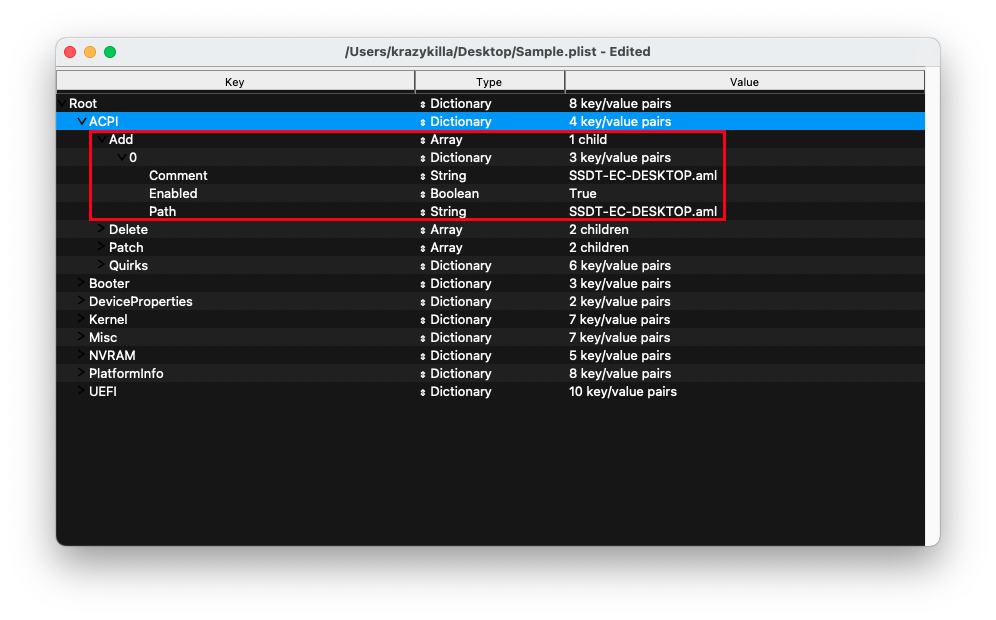
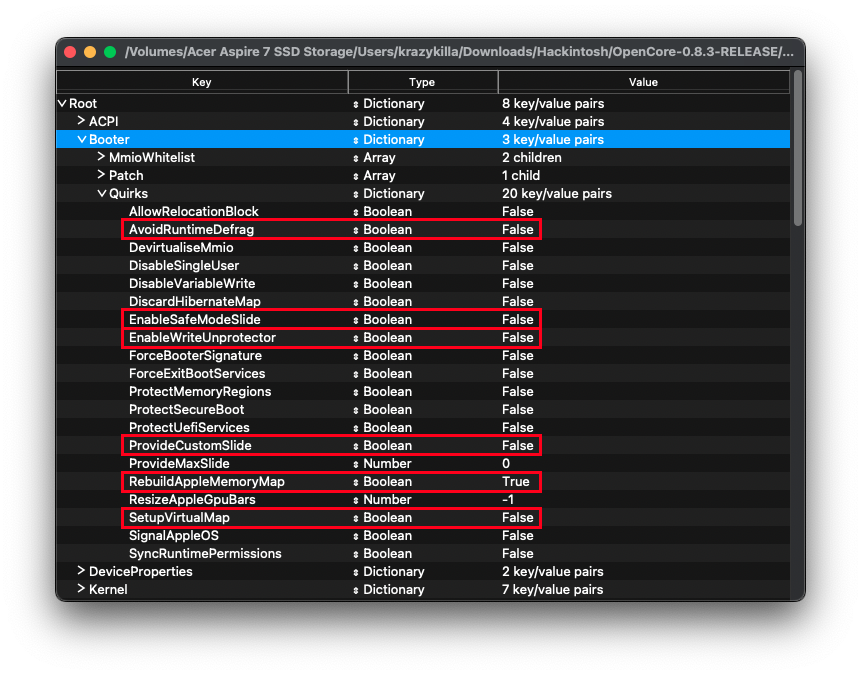
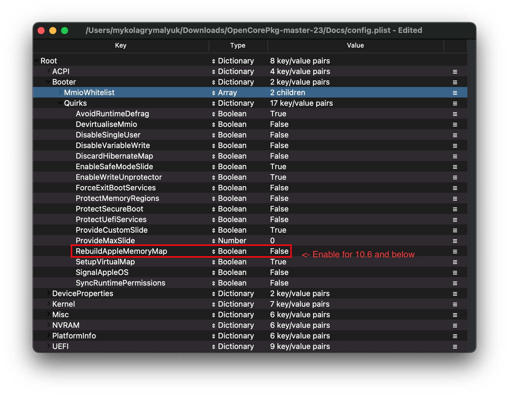

# Desktop Lynnfield and Clarkdale

| Support | Version |
| :--- | :--- |
| Initial macOS Support | OS X 10.6.3, Snow Leopard |
| Note 1 | Apple does not support desktop Iron Lake iGPUs |
| Note 2 | Most Lynnfield and Clarkdale boards do not support UEFI |

## ACPI



### Add

::: tip Info

| Required SSDTs | Description |
| :--- | :--- |
| **[SSDT-EC](https://dortania.github.io/Getting-Started-With-ACPI/)** | Fixes the embedded controller, see [Getting Started With ACPI Guide](https://dortania.github.io/Getting-Started-With-ACPI/) for more details. |

:::

## Booter

| Legacy | UEFI
| :--- | :--- |
|  |  |

This section is dedicated to quirks relating to boot.efi patching with OpenRuntime, the replacement for AptioMemoryFix.efi

### Quirks

::: tip Info
Settings relating to boot.efi patching and firmware fixes, depending where your board has UEFI, you have 2 options depending what your motherboard supports:

#### Legacy Settings

| Quirk | Enabled | Comment |
| :--- | :--- | :--- |
| AvoidRuntimeDefrag | No | Big Sur may require this quirk enabled |
| EnableSafeModeSlide | No | |
| EnableWriteUnprotector | No | |
| ProvideCustomSlide | No | |
| RebuildAppleMemoryMap | Yes | This is required to boot OS X 10.4 through 10.6 |
| SetupVirtualMap | No | |

#### UEFI Settings

| Quirk | Enabled | Comment |
| :--- | :--- | :--- |
| RebuildAppleMemoryMap | Yes | This is required to boot OS X 10.4 through 10.6 |

:::
::: details More in-depth Info

* **AvoidRuntimeDefrag**: NO
  * Fixes UEFI runtime services like date, time, NVRAM, power control;
  * macOS Big Sur however requires the APIC table present, otherwise causing early kernel panics so this quirk is recommended for those users.
* **EnableSafeModeSlide**: YES
  * Enables slide variables to be used in safe mode.
* **EnableWriteUnprotector**: NO
  * Needed to remove write protection from CR0 register.
* **ProvideCustomSlide**: YES
  * Used for Slide variable calculation. However the necessity of this quirk is determined by `OCABC: Only N/256 slide values are usable!` message in the debug log. If the message `OCABC: All slides are usable! You can disable ProvideCustomSlide!` is present in your log, you can disable `ProvideCustomSlide`.
* **RebuildAppleMemoryMap**: YES
  * Resolves early memory kernel panics on 10.6 and below.
* **SetupVirtualMap**: YES
  * Fixes SetVirtualAddresses calls to virtual addresses.

:::

## DeviceProperties


### Add

By default, the Sample.plist has this section set for iGPU and Audio. Apple's Iron lake iGPU drivers do not support desktop hardware so PciRoot `PciRoot(0x0)/Pci(0x2,0x0)` can be removed from `Add` section.

TL;DR, delete all the PciRoot's here as we won't be using this section.

## Kernel


### Quirks

::: tip Info

Settings relating to the kernel, for us we'll be enabling the following:

| Quirk | Enabled | Comment |
| :--- | :--- | :--- |
| AppleCpuPmCfgLock | YES | Not needed if `CFG-Lock` is disabled in the BIOS |
| DisableIoMapper | YES | Not needed if `VT-D` is disabled in the BIOS |
| LapicKernelPanic | NO | HP Machines will require this quirk |
| PanicNoKextDump | YES | |
| PowerTimeoutKernelPanic | YES | |
| XhciPortLimit | YES | If your board does not have USB 3.0, you can disable |

:::

::: details More in-depth Info

* **AppleCpuPmCfgLock**: YES
  * Only needed when CFG-Lock can't be disabled in BIOS
  * Only applicable for Ivy Bridge and older
    * Note: Broadwell and older require this when running 10.10 or older
* **AppleXcpmCfgLock**: NO
  * Only needed when CFG-Lock can't be disabled in BIOS
  * Only applicable for Haswell and newer
    * Note: Ivy Bridge-E is also included as it's XCPM capable
* **CustomSMBIOSGuid**: NO
  * Performs GUID patching for UpdateSMBIOSMode set to `Custom`. Usually relevant for Dell laptops
  * Enabling this quirk with UpdateSMBIOSMode Custom mode can also disable SMBIOS injection into "non-Apple" OSes however we do not endorse this method as it breaks Bootcamp compatibility. Use at your own risk
* **DisableIoMapper**: YES
  * Needed to get around VT-D if either unable to disable in BIOS or needed for other operating systems, much better alternative to `dart=0` as SIP can stay on in Catalina
* **DisableLinkeditJettison**: YES
  * Allows Lilu and others to have more reliable performance without `keepsyms=1`
* **DisableRtcChecksum**: NO
  * Prevents AppleRTC from writing to primary checksum (0x58-0x59), required for users who either receive BIOS reset or are sent into Safe mode after reboot/shutdown
* **ExtendBTFeatureFlags** NO
  * Helpful for those having continuity issues with non-Apple/non-Fenvi cards
* **LapicKernelPanic**: NO
  * Disables kernel panic on AP core lapic interrupt, generally needed for HP systems. Clover equivalent is `Kernel LAPIC`
* **LegacyCommpage**: NO
  * Resolves SSSE3 requirement for 64 Bit CPUs in macOS, mainly relevant for 64-Bit Pentium 4 CPUs(ie. Prescott)
* **PanicNoKextDump**: YES
  * Allows for reading kernel panics logs when kernel panics occur
* **PowerTimeoutKernelPanic**: YES
  * Helps fix kernel panics relating to power changes with Apple drivers in macOS Catalina, most notably with digital audio.
* **SetApfsTrimTimeout**: `-1`
  * Sets trim timeout in microseconds for APFS filesystems on SSDs, only applicable for macOS 10.14 and newer with problematic SSDs.
* **XhciPortLimit**: YES
  * This is actually the 15 port limit patch, don't rely on it as it's not a guaranteed solution for fixing USB. Please create a [USB map](https://dortania.github.io/OpenCore-Post-Install/usb/) when possible.
  * With macOS 11.3+, [XhciPortLimit may not function as intended.](https://github.com/dortania/bugtracker/issues/162) We recommend users either disable this quirk and map before upgrading or [map from Windows](https://github.com/USBToolBox/tool). You may also install macOS 11.2.3 or older.

The reason being is that UsbInjectAll reimplements builtin macOS functionality without proper current tuning. It is much cleaner to just describe your ports in a single plist-only kext, which will not waste runtime memory and such

:::

## Misc


## PlatformInfo


::: tip Info

For setting up the SMBIOS info, we'll use CorpNewt's [GenSMBIOS](https://github.com/corpnewt/GenSMBIOS) application.

For this Clarkdale example, we'll chose the iMac11,2 SMBIOS - this is done intentionally for compatibility's sake. There are 3 main SMBIOS used for Clarkdale:

| SMBIOS | Hardware |
| :--- | :--- |
| iMac11,1 | Lynnfield SMBIOS |
| iMac11,2 | Clarkdale SMBIOS |
| MacPro6,1 |  Mojave and newer SMBIOS |

* If you plan to later run macOS 10.14, Mojave or newer, MacPro6,1 will be the recommended SMBIOS and the iGPU must be disabled in the BIOS due to no longer being supported

Run GenSMBIOS, pick option 1 for downloading MacSerial and Option 3 for selecting out SMBIOS.  This will give us an output similar to the following:

```sh
  #######################################################
 #               iMac11,2 SMBIOS Info                  #
#######################################################

Type:         iMac11,2
Serial:       C02KCYZLDNCW
Board Serial: C02309301QXF2FRJC
SmUUID:       A154B586-874B-4E57-A1FF-9D6E503E4580
```

The `Type` part gets copied to Generic -> SystemProductName.

The `Serial` part gets copied to Generic -> SystemSerialNumber.

The `Board Serial` part gets copied to Generic -> MLB.

The `SmUUID` part gets copied to Generic -> SystemUUID.

We set Generic -> ROM to either an Apple ROM (dumped from a real Mac), your NIC MAC address, or any random MAC address (could be just 6 random bytes, for this guide we'll use `11223300 0000`. After install follow the [Fixing iServices](https://dortania.github.io/OpenCore-Post-Install/universal/iservices.html) page on how to find your real MAC Address)

**Reminder that you want either an invalid serial or valid serial numbers but those not in use, you want to get a message back like: "Invalid Serial" or "Purchase Date not Validated"**

[Apple Check Coverage page](https://checkcoverage.apple.com)

**Automatic**: YES

* Generates PlatformInfo based on Generic section instead of DataHub, NVRAM, and SMBIOS sections

:::

### Generic

::: details More in-depth Info

* **AdviseFeatures**: NO
  * Used for when the EFI partition isn't first on the Windows drive

* **MaxBIOSVersion**: NO
  * Sets BIOS version to Max to avoid firmware updates in Big Sur+, mainly applicable for genuine Macs.

* **ProcessorType**: `0`
  * Set to `0` for automatic type detection, however this value can be overridden if desired. See [AppleSmBios.h](https://github.com/acidanthera/OpenCorePkg/blob/master/Include/Apple/IndustryStandard/AppleSmBios.h) for possible values

* **SpoofVendor**: YES
  * Swaps vendor field for Acidanthera, generally not safe to use Apple as a vendor in most case

* **SystemMemoryStatus**: Auto
  * Sets whether memory is soldered or not in SMBIOS info, purely cosmetic and so we recommend `Auto`

* **UpdateDataHub**: YES
  * Update Data Hub fields

* **UpdateNVRAM**: YES
  * Update NVRAM fields

* **UpdateSMBIOS**: YES
  * Updates SMBIOS fields

* **UpdateSMBIOSMode**: Create
  * Replace the tables with newly allocated EfiReservedMemoryType, use `Custom` on Dell laptops requiring `CustomSMBIOSGuid` quirk
  * Setting to `Custom` with `CustomSMBIOSGuid` quirk enabled can also disable SMBIOS injection into "non-Apple" OSes however we do not endorse this method as it breaks Bootcamp compatibility. Use at your own risk

:::

## UEFI


### Quirks

::: tip Info
Relating to quirks with the UEFI environment, for us we'll be changing the following:

| Quirk | Enabled | Comment |
| :--- | :--- | :--- |
| IgnoreInvalidFlexRatio | YES | |
| UnblockFsConnect | NO | Needed mainly by HP motherboards |

:::

::: details More in-depth Info

* **IgnoreInvalidFlexRatio**: YES
  * Fix for when MSR_FLEX_RATIO (0x194) can't be disabled in the BIOS, required for all pre-Skylake based systems

* **DisableSecurityPolicy**: NO
  * Disables platform security policy in firmware, recommended for buggy firmwares where disabling Secure Boot does not allow 3rd party firmware drivers to load.
  * If running a Microsoft Surface device, recommended to enable this option

* **RequestBootVarRouting**: YES
  * Redirects AptioMemoryFix from `EFI_GLOBAL_VARIABLE_GUID` to `OC_VENDOR_VARIABLE_GUID`. Needed for when firmware tries to delete boot entries and is recommended to be enabled on all systems for correct update installation, Startup Disk control panel functioning, etc.

* **UnblockFsConnect**: NO
  * Some firmware block partition handles by opening them in By Driver mode, which results in File System protocols being unable to install. Mainly relevant for HP systems when no drives are listed
  
:::

## Intel BIOS settings

* Note: Most of these options may not be present in your firmware, we recommend matching up as closely as possible but don't be too concerned if many of these options are not available in your BIOS

### Disable

* Fast Boot
* Secure Boot
* Serial/COM Port
* Parallel Port
* VT-d (can be enabled if you set `DisableIoMapper` to YES)
* CSM
* Thunderbolt(For initial install, as Thunderbolt can cause issues if not setup correctly)
* Intel SGX
* Intel Platform Trust
* CFG Lock (MSR 0xE2 write protection)(**This must be off, if you can't find the option then enable `AppleCpuPmCfgLock` under Kernel -> Quirks. Your hack will not boot with CFG-Lock enabled**)

### Enable

* VT-x
* Above 4G decoding
* Hyper-Threading
* Execute Disable Bit
* EHCI/XHCI Hand-off
* OS type: Windows 8.1/10 UEFI Mode
* DVMT Pre-Allocated(iGPU Memory): 32MB
* SATA Mode: AHCI

# Now with all this done, head to the [cleaning up Config.plist page](/config.plist/secureboot.md)