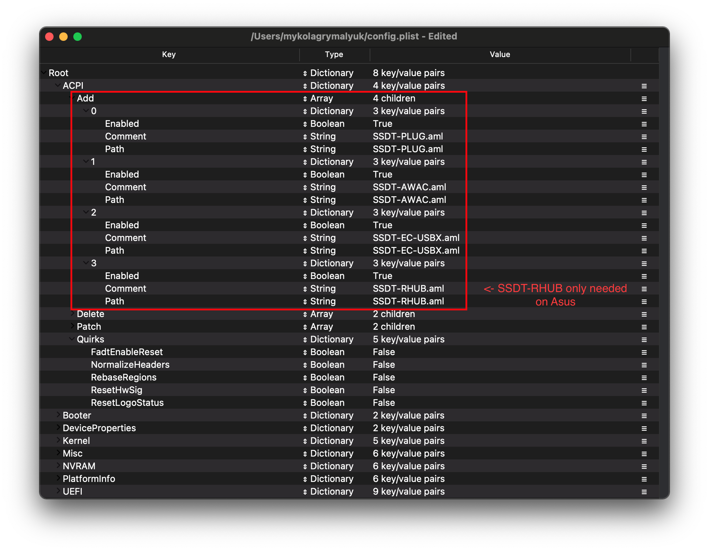
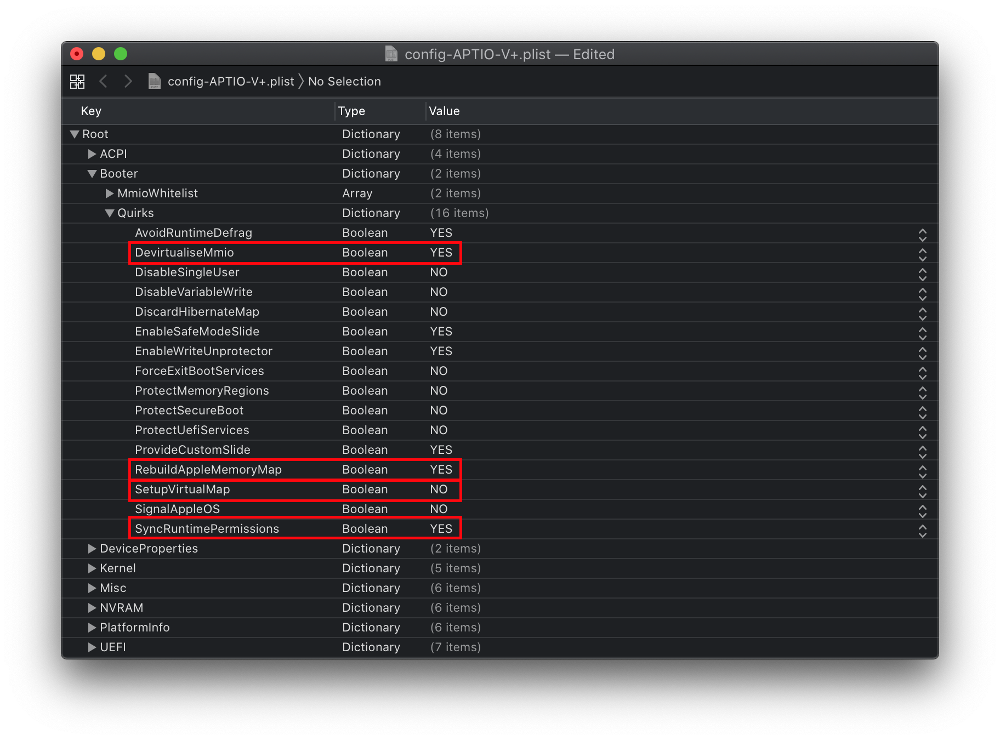
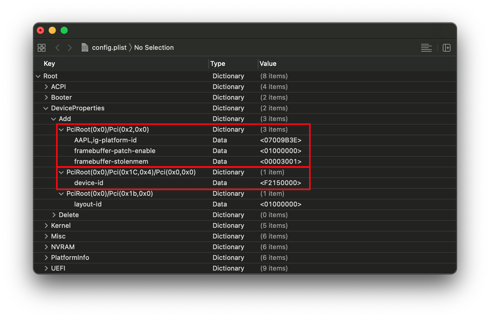
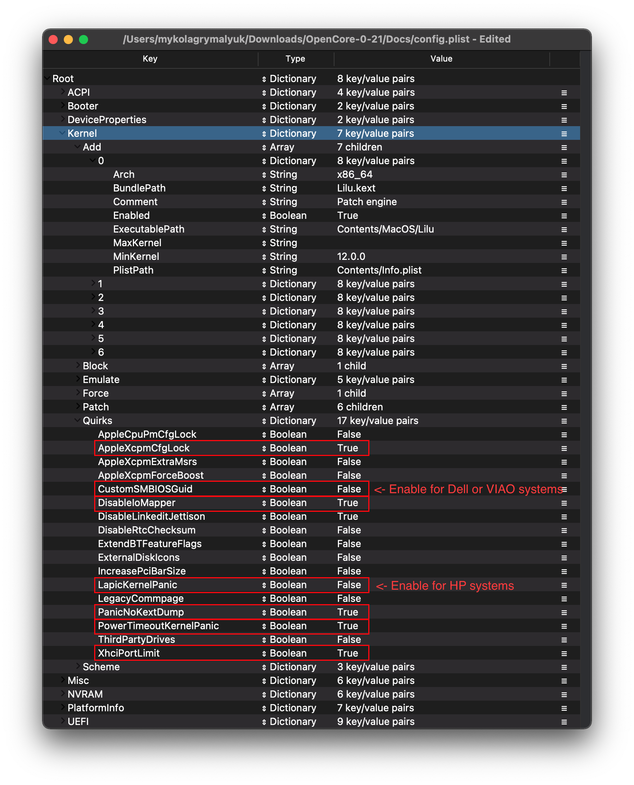

# 台式 Comet Lake

| 支持 | 版本 |
| :--- | :--- |
| 初始macOS支持 | macOS 10.15, Catalina |

## 起点

制作一个config.plist看起来很难，其实并不难。这只是需要一些时间，但本指南将告诉你如何配置所有的东西，你不会被冷落。这也意味着如果你有问题，检查你的配置设置以确保它们是正确的。OpenCore的主要注意事项:

* **所有属性必须被定义**，没有默认的OpenCore将出错，所以**不要删除节，除非有明确告知你**。如果指南没有提到该选项，请将其保留为默认值。
* **Sample plist不能按原样使用**，必须配置到您的系统中。
* **不要使用配置器**，这些配置器很少遵守OpenCore的规则，甚至一些像Mackie的配置器会添加Clover属性和破坏plists!

现在，我们来快速地提醒一下我们需要哪些工具

* [ProperTree](https://github.com/corpnewt/ProperTree)
  * 通用plist编辑器
* [GenSMBIOS](https://github.com/corpnewt/GenSMBIOS)
  * 用于生成SMBIOS数据
* [Sample/config.plist](https://github.com/acidanthera/OpenCorePkg/releases)
  * 参见上一节中如何获取:[config.plist Setup](../config.plist/README.md)

::: warning 注意

在设置OpenCore之前，请多次阅读本指南，并确保设置正确。请注意，图像并不总是最新的，所以请阅读下面的文本，如果没有提到，则保留为默认值。

:::

## ACPI



### Add

::: tip 信息

这是你将为系统添加ssdt的地方，这些对于**引导macOS**非常重要，并且有许多用途，例如[USB映射](https://sumingyd.github.io/OpenCore-Post-Install/usb/), [禁用不支持的gpu](../extras/spoof.md) 等，这对于我们的系统来说是**启动所必须**的。制作指南可以在这里找到:[**ACPI入门**](https://sumingyd.github.io/Getting-Started-With-ACPI/)

我们需要几个ssdt来恢复Clover提供的功能:

| 所需ssdt | 描述 |
| :--- | :--- |
| **[SSDT-PLUG](https://sumingyd.github.io/Getting-Started-With-ACPI/)** | 在Haswell和更新的版本上允许本地CPU电源管理，请参阅[ACPI入门指南](https://sumingyd.github.io/Getting-Started-With-ACPI/)了解更多细节。 |
| **[SSDT-EC-USBX](https://sumingyd.github.io/Getting-Started-With-ACPI/)** | 修复了嵌入式控制器和USB电源，请参阅[开始与ACPI指南](https://sumingyd.github.io/Getting-Started-With-ACPI/)了解更多细节。 |
| **[SSDT-AWAC](https://sumingyd.github.io/Getting-Started-With-ACPI/)** | 这是[300系列RTC补丁](https://www.hackintosh-forum.de/forum/thread/39846-asrock-z390-taichi-ultimate/?pageNo=2)，用于所有B460和Z490板，以防止系统引导macOS。另一种选择是[SSDT-rtc0](https://sumingyd.github.io/Getting-Started-With-ACPI/)，当AWAC SSDT由于缺少遗留的RTC时钟而不兼容时，请检查您是否需要它以及使用哪个，请参阅[开始使用ACPI](https://sumingyd.github.io/Getting-Started-With-ACPI/)页面。 |
| **[SSDT-RHUB](https://sumingyd.github.io/Getting-Started-With-ACPI/)** | 需要修复Asus和MSI板上的根设备错误。Gigabyte和AsRock主板**不需要**这个SSDT |

注意，你**不应该**在这里添加你生成的`DSDT aml`，它已经在你的固件中了。因此，如果存在，请在你的`config.plist`和EFI/OC/ACPI下删除它的条目。

对于那些想要更深入地了解转储您的DSDT、如何制作这些ssdt以及编译它们的人，请参阅[开始使用ACPI](https://sumingyd.github.io/Getting-Started-With-ACPI/) 页面。编译的ssdt有一个 **.aml** 扩展名(组装)，将被放入`EFI/OC/ACPI`文件夹，并且**必须**在你的配置文件`ACPI -> Add`下指定。

:::

### Delete

这将阻止某些ACPI表加载，对于我们来说，我们可以忽略它。

### Patch

本节允许我们通过OpenCore动态修改ACPI的部分内容(DSDT、SSDT等)。对我们来说，我们的补丁由我们的ssdt处理。这是一个更简洁的解决方案，因为这将允许我们使用OpenCore引导Windows和其他操作系统

### Quirks

与ACPI相关的设置，将所有内容保留为默认设置，因为我们不需要这些怪癖。

## Booter



本节专门讨论使用OpenRuntime (AptioMemoryFix.efi的替代品)进行引导efi补丁的相关问题

### MmioWhitelist

本节允许将通常被忽略的设备直通到macOS，对我们来说，我们可以忽略本节。

### Quirks

::: tip 信息
与boot.efi补丁和固件修复相关的设置，对我们来说，我们需要更改以下内容:

| 怪癖 | 启用 | 注释 |
| :--- | :--- | :--- |
| DevirtualiseMmio | 是 | |
| EnableWriteUnprotector | 否 | |
| ProtectUefiServices | 是 | |
| RebuildAppleMemoryMap | 是 | |
| ResizeAppleGpuBars | -1 | 如果您的固件支持增加GPU Bar大小(如：可调整大小的BAR支持)，请将其设置为`0` |
| SetupVirtualMap | 否 | |
| SyncRuntimePermissions | 是 | |
:::

::: details 更多深入信息

* **AvoidRuntimeDefrag**: YES
  * Fixes UEFI runtime services like date, time, NVRAM, power control, etc.
* **DevirtualiseMmio**: YES
  * Reduces Stolen Memory Footprint, expands options for `slide=N` values and very helpful with fixing Memory Allocation issues , requires `ProtectUefiServices` as well for Z490.
* **EnableSafeModeSlide**: YES
  * Enables slide variables to be used in safe mode.
* **EnableWriteUnprotector**: NO
  * This quirk and RebuildAppleMemoryMap can commonly conflict, recommended to enable the latter on newer platforms and disable this entry.
  * However, due to issues with OEMs not using the latest EDKII builds you may find that the above combo will result in early boot failures. This is due to missing the `MEMORY_ATTRIBUTE_TABLE` and such we recommend disabling RebuildAppleMemoryMap and enabling EnableWriteUnprotector. More info on this is covered in the [troubleshooting section](/troubleshooting/extended/kernel-issues.md#stuck-on-eb-log-exitbs-start).
* **ProtectUefiServices**: YES
  * Protects UEFI services from being overridden by the firmware, required for Z490.
* **ProvideCustomSlide**: YES
  * Used for Slide variable calculation. However the necessity of this quirk is determined by `OCABC: Only N/256 slide values are usable!` message in the debug log. If the message `OCABC: All slides are usable! You can disable ProvideCustomSlide!` is present in your log, you can disable `ProvideCustomSlide`.
* **RebuildAppleMemoryMap**: YES
  * Generates Memory Map compatible with macOS, can break on some laptop OEM firmwares so if you receive early boot failures disable this.
* **ResizeAppleGpuBars**: -1
  * Will reduce the size of GPU PCI Bars if set to `0` when booting macOS, set to `-1` to disable
  * Setting other PCI Bar values is possible with this quirk, though can cause instabilities
  * This quirk being set to zero is only necessary if Resizable BAR Support is enabled in your firmware.
* **SetupVirtualMap**: NO
  * Fixes SetVirtualAddresses calls to virtual addresses, however broken due to Comet Lake's memory protections. ASUS, Gigabyte and AsRock boards will not boot with this on.
* **SyncRuntimePermissions**: YES
  * Fixes alignment with MAT tables and required to boot Windows and Linux with MAT tables, also recommended for macOS. Mainly relevant for RebuildAppleMemoryMap users.

:::

## DeviceProperties



### Add

从映射设置设备属性。

::: tip PciRoot(0x0)/Pci(0x2,0x0)

本节是通过WhateverGreen的[Framebuffer补丁指南](https://github.com/acidanthera/WhateverGreen/blob/master/Manual/FAQ.IntelHD.en.md)建立的，用于设置重要的iGPU属性。**如果你有`-F`系列CPU，你可以忽略这一部分，因为你没有iGPU。**

config.plist还没有这个部分，所以你必须手动创建它。

`AAPL,ig-platform-id` 是macOS用来确定iGPU驱动程序如何与我们的系统交互的值，两个值之间的选择如下:

| AAPL,ig-platform-id | 注释 |
| :--- | :--- |
| **`07009B3E`** | 当桌面iGPU用于驱动显示器时使用 |
| **`00009B3E`** | 如果它不起作用，可以替代`07009B3E` |
| **`0300C89B`** | 当桌面iGPU仅用于计算任务而不驱动显示时使用 |

* **注意**:在macOS 10.15.5及更新版本中，使用`07009B3E`时黑屏似乎有很多问题，如果你遇到类似的问题，请尝试切换到`00009B3E`

我们还添加了另外两个属性，`framebuffer-patch-enable`和`framebuffer-stolenmem`。第一个启用WhateverGreen.kext打补丁，第二个设置最小共享内存为19MB。这通常是不必要的，因为可以在BIOS中配置(推荐64MB)，但在不可用时是必需的。

* **注意**:无头帧缓冲区(其中dGPU是显示出来的)不需要`framebuffer-patch-enable`和`framebuffer-stolenmem`

| 键 | 类型 | 值 |
| :--- | :--- | :--- |
| AAPL,ig-platform-id | Data | `07009B3E` |
| framebuffer-patch-enable | Data | `01000000` |
| framebuffer-stolenmem | Data | `00003001` |

(这是一个桌面UHD 630没有dGPU和iGPU内存没有BIOS选项的例子)

:::

::: tip PciRoot(0x0)/Pci(0x1C,0x1)/Pci(0x0,0x0)

这篇文章与Intel的I225-V 2.5GBe控制器有关，我们在这里要做的是让Apple的I225LM驱动程序支持我们的I225-V网络控制器:

| 键 | 类型 | 值 |
| :--- | :--- | :--- |
| device-id | Data | `F2150000` |

* **注**:如果你的主板没有附带Intel I225网卡，没有理由添加这个条目。
* **注2**:如果你在AppleIntelI210Ethernet kext上得到内核崩溃，你的以太网路径可能是 `PciRoot(0x0)/Pci(0x1C,0x4)/Pci(0x0,0x0)`

:::

::: tip PciRoot(0x0)/Pci(0x1b,0x0)

`layout-id`

* 应用AppleALC音频注入，你需要自己研究你的主板有哪个编解码器，并将其与AppleALC的布局匹配。[AppleALC支持的编解码器](https://github.com/acidanthera/AppleALC/wiki/Supported-codecs).
* 你可以直接删除这个属性，因为我们现在还没有使用它

对于我们来说，我们将使用引导参数`alcid=xxx`来完成此操作。`alcid`将覆盖所有其他layout- id。更多信息可以在[安装后页面](https://sumingyd.github.io/OpenCore-Post-Install/)中找到。

:::

### Delete

从映射中删除设备属性，我们可以忽略它

## Kernel



### Add

在这里，我们指定要加载哪些kext，以什么特定的顺序加载，以及每个kext适用于什么体系结构。默认情况下，我们建议保留ProperTree所做的操作，但对于32位cpu，请参见以下内容:

::: details 更深入的信息

The main thing you need to keep in mind is:

* Load order
  * Remember that any plugins should load *after* its dependencies
  * This means kexts like Lilu **must** come before VirtualSMC, AppleALC, WhateverGreen, etc

A reminder that [ProperTree](https://github.com/corpnewt/ProperTree) users can run **Cmd/Ctrl + Shift + R** to add all their kexts in the correct order without manually typing each kext out.

* **Arch**
  * Architectures supported by this kext
  * Currently supported values are `Any`, `i386` (32-bit), and `x86_64` (64-bit)
* **BundlePath**
  * Name of the kext
  * ex: `Lilu.kext`
* **Enabled**
  * Self-explanatory, either enables or disables the kext
* **ExecutablePath**
  * Path to the actual executable is hidden within the kext, you can see what path your kext has by right-clicking and selecting `Show Package Contents`. Generally, they'll be `Contents/MacOS/Kext` but some have kexts hidden within under `Plugin` folder. Do note that plist only kexts do not need this filled in.
  * ex: `Contents/MacOS/Lilu`
* **MinKernel**
  * Lowest kernel version your kext will be injected into, see below table for possible values
  * ex. `12.00.00` for OS X 10.8
* **MaxKernel**
  * Highest kernel version your kext will be injected into, see below table for possible values
  * ex. `11.99.99` for OS X 10.7
* **PlistPath**
  * Path to the `info.plist` hidden within the kext
  * ex: `Contents/Info.plist`

::: details 内核支持表

| OS X 版本 | MinKernel | MaxKernel |
| :--- | :--- | :--- |
| 10.4 | 8.0.0 | 8.99.99 |
| 10.5 | 9.0.0 | 9.99.99 |
| 10.6 | 10.0.0 | 10.99.99 |
| 10.7 | 11.0.0 | 11.99.99 |
| 10.8 | 12.0.0 | 12.99.99 |
| 10.9 | 13.0.0 | 13.99.99 |
| 10.10 | 14.0.0 | 14.99.99 |
| 10.11 | 15.0.0 | 15.99.99 |
| 10.12 | 16.0.0 | 16.99.99 |
| 10.13 | 17.0.0 | 17.99.99 |
| 10.14 | 18.0.0 | 18.99.99 |
| 10.15 | 19.0.0 | 19.99.99 |
| 11 | 20.0.0 | 20.99.99 |
| 12 | 21.0.0 | 21.99.99 |
| 13 | 22.0.0 | 22.99.99 |

:::

### Emulate

需要欺骗不支持的cpu，幸运的是在10.15.5+ Comet Lake中添加了支持，所以不需要在这里欺骗。对于那些运行High Sierra或Mojave的人，您将需要下面的代码来欺骗到一个受支持的CPU模型(由于稳定性问题，本指南将不讨论此类CPUID欺骗)

### Force

用于从系统卷中加载kext，仅适用于某些kext不存在于缓存中的旧操作系统(例如IONetworkingFamily在10.6)。

对我们来说，我们可以忽略。

### Block

阻止某些kext的加载。与我们无关。

### Patch

对内核和kext进行补丁。

::: tip 修复I225-V控制器

此条目与在更高端的 Comet Lake 板上找到的英特尔 I225-V 2.5GBe 控制器相关，我们将在这里做的是欺骗 Apple 的 I225LM 驱动程序以支持我们的 I225-V 网络控制器。 但是，这仅在 Catalina 和 Big Sur 上需要，最高为 11.3。

| 键 | 类型 | 值 |
| :--- | :--- | :--- |
| Base | String | __Z18e1000_set_mac_typeP8e1000_hw |
| Comment | String | I225-V patch |
| Count | Number | 1 |
| Enabled | Boolean | True |
| Find | Data | `F2150000` |
| Identifier | String | com.apple.driver.AppleIntelI210Ethernet |
| MinKernel | String | 19.0.0 |
| MaxKernel | String | 20.4.0 |
| Replace | Data | `F3150000` |

* **注 1**：如果您的主板未附带 Intel I225 NIC，则没有理由添加此条目。
* **注 2**：保留所有其他键的默认值

:::

### Quirks

::: tip 信息

与内核相关的设置，我们将启用以下功能：

| 怪癖 | 启用| 注释 |
| :--- | :--- | :--- |
| AppleXcpmCfgLock | 是 | 如果在 BIOS 中禁用了 `CFG-Lock`，则不需要 |
| DisableIoMapper | 是 | 如果在 BIOS 中禁用了 `VT-D` 如果在 BIOS 中禁用了 |
| LapicKernelPanic | 否 | 惠普机器将需要这个怪癖 |
| PanicNoKextDump | 是 | |
| PowerTimeoutKernelPanic | 是 | |
| XhciPortLimit | 是 | 如果运行 macOS 11.3+ 则禁用 |

:::

::: details 更深入的信息

* **AppleCpuPmCfgLock**: NO
  * Only needed when CFG-Lock can't be disabled in BIOS
  * Only applicable for Ivy Bridge and older
    * Note: Broadwell and older require this when running 10.10 or older
* **AppleXcpmCfgLock**: YES
  * Only needed when CFG-Lock can't be disabled in BIOS
  * Only applicable for Haswell and newer
    * Note: Ivy Bridge-E is also included as it's XCPM capable
* **CustomSMBIOSGuid**: NO
  * Performs GUID patching for UpdateSMBIOSMode set to `Custom`. Usually relevant for Dell laptops
  * Enabling this quirk with UpdateSMBIOSMode Custom mode can also disable SMBIOS injection into "non-Apple" OSes however we do not endorse this method as it breaks Bootcamp compatibility. Use at your own risk
* **DisableIoMapper**: YES
  * Needed to get around VT-D if either unable to disable in BIOS or needed for other operating systems, much better alternative to `dart=0` as SIP can stay on in Catalina
* **DisableLinkeditJettison**: YES
  * Allows Lilu and others to have more reliable performance without `keepsyms=1`
* **DisableRtcChecksum**: NO
  * Prevents AppleRTC from writing to primary checksum (0x58-0x59), required for users who either receive BIOS reset or are sent into Safe mode after reboot/shutdown
* **ExtendBTFeatureFlags** NO
  * Helpful for those having continuity issues with non-Apple/non-Fenvi cards
* **LapicKernelPanic**: NO
  * Disables kernel panic on AP core lapic interrupt, generally needed for HP systems. Clover equivalent is `Kernel LAPIC`
* **LegacyCommpage**: NO
  * Resolves SSSE3 requirement for 64 Bit CPUs in macOS, mainly relevant for 64-Bit Pentium 4 CPUs(ie. Prescott)
* **PanicNoKextDump**: YES
  * Allows for reading kernel panics logs when kernel panics occur
* **PowerTimeoutKernelPanic**: YES
  * Helps fix kernel panics relating to power changes with Apple drivers in macOS Catalina, most notably with digital audio.
* **SetApfsTrimTimeout**: `-1`
  * Sets trim timeout in microseconds for APFS filesystems on SSDs, only applicable for macOS 10.14 and newer with problematic SSDs.
* **XhciPortLimit**: YES
  * This is actually the 15 port limit patch, don't rely on it as it's not a guaranteed solution for fixing USB. Please create a [USB map](https://sumingyd.github.io/OpenCore-Post-Install/usb/) when possible.
  * With macOS 11.3+, [XhciPortLimit may not function as intended.](https://github.com/dortania/bugtracker/issues/162) We recommend users either disable this quirk and map before upgrading or [map from Windows](https://github.com/USBToolBox/tool). You may also install macOS 11.2.3 or older.

:::

### Scheme

与传统引导(例如10.4-10.6)相关的设置，大多数情况下你可以跳过，但是对于那些计划引导传统操作系统的人，你可以查看以下内容:

::: details 更深入的信息

* **FuzzyMatch**: True
  * Used for ignoring checksums with kernelcache, instead opting for the latest cache available. Can help improve boot performance on many machines in 10.6
* **KernelArch**: x86_64
  * Set the kernel's arch type, you can choose between `Auto`, `i386` (32-bit), and `x86_64` (64-bit).
  * If you're booting older OSes which require a 32-bit kernel(ie. 10.4 and 10.5) we recommend to set this to `Auto` and let macOS decide based on your SMBIOS. See below table for supported values:
    * 10.4-10.5 — `x86_64`, `i386` or `i386-user32`
      * `i386-user32` refers 32-bit userspace, so 32-bit CPUs must use this(or CPUs missing SSSE3)
      * `x86_64` will still have a 32-bit kernelspace however will ensure 64-bit userspace in 10.4/5
    * 10.6 — `i386`, `i386-user32`, or `x86_64`
    * 10.7 — `i386` or `x86_64`
    * 10.8 or newer — `x86_64`

* **KernelCache**: Auto
  * Set kernel cache type, mainly useful for debugging and so we recommend `Auto` for best support

:::

## Misc


### Boot

::: tip 信息

| 怪癖 | 启用 | 注释 |
| :--- | :--- | :--- |
| HideAuxiliary | 是 | 按空格键显示 macOS 恢复和其他辅助条目 |

:::

::: details 更深入的信息

* **HideAuxiliary**: YES
  * This option will hide supplementary entries, such as macOS recovery and tools, in the picker. Hiding auxiliary entries may increase boot performance on multi-disk systems. You can press space at the picker to show these entries

:::

### Debug

::: tip 信息

有助于调试 OpenCore 启动问题（我们将更改所有内容 *但* `显示会延迟`）：

| 怪癖 | 启用 |
| :--- | :--- |
| AppleDebug | 是 |
| ApplePanic | 是 |
| DisableWatchDog | 是 |
| Target | 67 |

:::

::: details 更深入的信息

* **AppleDebug**: YES
  * Enables boot.efi logging, useful for debugging. Note this is only supported on 10.15.4 and newer
* **ApplePanic**: YES
  * Attempts to log kernel panics to disk
* **DisableWatchDog**: YES
  * Disables the UEFI watchdog, can help with early boot issues
* **DisplayLevel**: `2147483650`
  * Shows even more debug information, requires debug version of OpenCore
* **SysReport**: NO
  * Helpful for debugging such as dumping ACPI tables
  * Note that this is limited to DEBUG versions of OpenCore
* **Target**: `67`
  * Shows more debug information, requires debug version of OpenCore

These values are based of those calculated in [OpenCore debugging](../troubleshooting/debug.md)

:::

### Security

::: tip 信息

安全性是不言而喻的，**不要跳过**。我们将修改以下内容:

| 怪癖 | 启用 | 注释 |
| :--- | :--- | :--- |
| AllowSetDefault | 是 | |
| BlacklistAppleUpdate | 是 | |
| ScanPolicy | 0 | |
| SecureBootModel | Default | 将此设置为`默认`，以便OpenCore自动设置与您的SMBIOS对应的正确值。下一页将详细介绍此设置。 |
| Vault | Optional | 这是一个词,不是可选的省略此设置。如果您没有将其设置为Optional，您将后悔，请注意它是区分大小写的 |

:::

::: details 更深入的信息

* **AllowSetDefault**: YES
  * Allow `CTRL+Enter` and `CTRL+Index` to set default boot device in the picker
* **ApECID**: 0
  * Used for netting personalized secure-boot identifiers, currently this quirk is unreliable due to a bug in the macOS installer so we highly encourage you to leave this as default.
* **AuthRestart**: NO
  * Enables Authenticated restart for FileVault 2 so password is not required on reboot. Can be considered a security risk so optional
* **BlacklistAppleUpdate**: YES
  * Used for blocking firmware updates, used as extra level of protection as macOS Big Sur no longer uses `run-efi-updater` variable

* **DmgLoading**: Signed
  * Ensures only signed DMGs load
* **ExposeSensitiveData**: `6`
  * Shows more debug information, requires debug version of OpenCore
* **Vault**: `Optional`
  * We won't be dealing vaulting so we can ignore, **you won't boot with this set to Secure**
  * This is a word, it is not optional to omit this setting. You will regret it if you don't set it to `Optional`, note that it is case-sensitive
* **ScanPolicy**: `0`
  * `0` allows you to see all drives available, please refer to [Security](https://sumingyd.github.io/OpenCore-Post-Install/universal/security.html) section for further details. **Will not boot USB devices with this set to default**
* **SecureBootModel**: Default
  * Controls Apple's secure boot functionality in macOS, please refer to [Security](https://sumingyd.github.io/OpenCore-Post-Install/universal/security.html) section for further details.
  * Note: Users may find upgrading OpenCore on an already installed system can result in early boot failures. To resolve this, see here: [Stuck on OCB: LoadImage failed - Security Violation](/troubleshooting/extended/kernel-issues.md#stuck-on-ocb-loadimage-failed-security-violation)

:::

### Serial

用于串行调试(一切都保留默认值)。

### Tools

用于运行OC调试工具，如shell, ProperTree的快照功能将为您添加这些。

### Entries

用于指定OpenCore无法自然找到的不规则引导路径。

这里不会介绍更多信息，请参阅[Configuration.pdf](https://github.com/acidanthera/OpenCorePkg/blob/master/Docs/Configuration.pdf) for more info

## NVRAM


### Add

::: tip 4D1EDE05-38C7-4A6A-9CC6-4BCCA8B38C14

用于OpenCore的UI缩放，default对我们有用。更多信息请参见深入部分

:::

::: details 更深入的信息

启动器路径，主要用于UI修改

* **DefaultBackgroundColor**: boot.efi使用的背景色
  * `00000000`: Syrah Black
  * `BFBFBF00`: Light Gray

:::

::: tip 4D1FDA02-38C7-4A6A-9CC6-4BCCA8B30102

OpenCore的NVRAM GUID，主要与RTCMemoryFixup用户相关

:::

::: details 更深入的信息

* **rtc-blacklist**: <>
  * 要与RTCMemoryFixup一起使用，请参阅这里了解更多信息:[修复RTC写入问题](https://sumingyd.github.io/OpenCore-Post-Install/misc/rtc.html#finding-our-bad-rtc-region)
  * 大多数用户可以忽略此部分

:::

::: tip 7C436110-AB2A-4BBB-A880-FE41995C9F82

系统完整性保护位掩码

* **通用引导参数**:

| 引导参数 | 描述 |
| :--- | :--- |
| **-v** | 这将启用详细模式，在你启动时显示所有滚动的幕后文本，而不是苹果logo和进度条。它对任何黑苹果来说都是非常宝贵的，因为它让您了解了引导过程的内部情况，并可以帮助您识别问题、问题kext等。 |
| **debug=0x100** | 禁用了macOS的watchdog，它有助于防止在内核出现严重错误时重新启动。 这样你就有希望收集到一些有用的信息并按照分层导航的方式来解决问题。 |
| **keepsyms=1** | 这是debug=0x100的配套设置，它告诉操作系统在内核出现崩溃时也打印这些符号。这可以提供一些更有用的信息，以了解造成崩溃本身的原因。 |
| **alcid=1** | 用于为AppleALC设置layout-id，请参阅[支持的编解码器](https://github.com/acidanthera/applealc/wiki/supported-codecs)以确定您的特定系统使用哪种布局。更多信息可以在[安装后页面](https://sumingyd.github.io/OpenCore-Post-Install/) 中找到 |

* **网络特定的引导参数**:
| 引导参数 | 描述 |
| :--- | :--- |
| **e1000=0** | 禁用`com apple DriverKit-AppleEthernetE1000`(苹果的DEXT驱动程序)与高端Comet Lake板上找到的英特尔I225- v以太网控制器匹配，以加载苹果的I225 kext驱动程序。<br/>这个引导参数在大多数板上是可选的，因为它们与DEXT驱动程序兼容。但在Gigabyte和其他几个主板上是必需的，这些主板只能使用kext驱动程序，因为DEXT驱动程序会导致挂起。<br/>如果你的主板没有附带I225-V网卡，你不需要这个。<br/><br/>在macOS 12.2.1及以下版本，使用`dk.e1000=0` 代替 |

* **gpu特定的引导参数**:

| 引导参数 | 描述 |
| :--- | :--- |
| **agdpmod=pikera** | 用于禁用一些Navi gpu (RX 5000 & 6000系列)的board ID检查，如果没有这个，你将得到一个黑屏。**如果你没有Navi请不要使用** (比如： Polaris 和 Vega 卡不应该使用它) |
| **-radcodec** | 用于允许官方不支持的AMD gpu(欺骗)使用硬件视频编码器 |
| **radpg=15** | U用于禁用一些电源开关模式，有助于正确初始化基于Verde based的 AMD 显卡 |
| **unfairgva=1** | 用于在支持的AMD gpu上修复硬件DRM支持 |
| **nvda_drv_vrl=1** | 用于在macOS Sierra和High Sierra的Maxwell和Pascal卡上启用NVIDIA的Web驱动程序 |
| **-wegnoegpu** | Used for disabling all other GPUs than the integrated Intel iGPU, useful for those wanting to run newer versions of macOS where their dGPU isn't supported |

* **csr-active-config**: `00000000`
  * Settings for 'System Integrity Protection' (SIP). It is generally recommended to change this with `csrutil` via the recovery partition.
  * csr-active-config by default is set to `00000000` which enables System Integrity Protection. You can choose a number of different values but overall we recommend keeping this enabled for best security practices. More info can be found in our troubleshooting page: [Disabling SIP](../troubleshooting/extended/post-issues.md#disabling-sip)

* **run-efi-updater**: `No`
  * This is used to prevent Apple's firmware update packages from installing and breaking boot order; this is important as these firmware updates (meant for Macs) will not work.

* **prev-lang:kbd**: <>
  * Needed for non-latin keyboards in the format of `lang-COUNTRY:keyboard`, recommended to keep blank though you can specify it(**Default in Sample config is Russian**):
  * American: `en-US:0`(`656e2d55533a30` in HEX)
  * Full list can be found in [AppleKeyboardLayouts.txt](https://github.com/acidanthera/OpenCorePkg/blob/master/Utilities/AppleKeyboardLayouts/AppleKeyboardLayouts.txt)
  * Hint: `prev-lang:kbd` can be changed into a String so you can input `en-US:0` directly instead of converting to HEX
  * Hint 2: `prev-lang:kbd` can be set to a blank variable (eg. `<>`) which will force the Language Picker to appear instead at first boot up.

| Key | Type | Value |
| :--- | :--- | :--- |
| prev-lang:kbd | String | en-US:0 |

:::

### Delete

::: tip 信息

强制重写NVRAM变量，请注意，`Add` **不会覆盖** NVRAM中已经存在的值，所以像`boot-args`这样的值应该保持不变。对我们来说，我们将更改以下内容:

| 怪癖 | 启用 |
| :--- | :--- |
| WriteFlash | 是 |

:::

::: details 更深入的信息

* **LegacySchema**
  * Used for assigning NVRAM variables, used with `OpenVariableRuntimeDxe.efi`. Only needed for systems without native NVRAM

* **WriteFlash**: YES
  * Enables writing to flash memory for all added variables.

:::

## PlatformInfo


::: tip 信息

为了设置SMBIOS信息，我们将使用CorpNewt的[GenSMBIOS](https://github.com/corpnewt/GenSMBIOS)应用程序。

对于这个Comet Lake示例，我们将选择iMac20,1 SMBIOS—这是为了兼容性而特意这样做的。有两个主要的SMBIOS用于Comet Lake:

| SMBIOS | 硬件 |
| :--- | :--- |
| iMac20,1 | i7 - 10700k及以下(即：8核心及以下) |
| iMac20,2 | i9-10850K 和更高(即：10核心) |

运行GenSMBIOS，选择选项1下载MacSerial，选择选项3选择SMBIOS。这会给我们一个类似下面的输出:

```sh
  #######################################################
 #               iMac20,1 SMBIOS Info                  #
#######################################################

Type:         iMac20,1
Serial:       C02XG0FDH7JY
Board Serial: C02839303QXH69FJA
SmUUID:       DBB364D6-44B2-4A02-B922-AB4396F16DA8
```

* **注意**:MacSerial目前不支持Linux，所以你必须使用Windows或macOS机器来生成值

`Type` 部分复制到 Generic -> SystemProductName.

`Serial` 部分复制到 Generic -> SystemSerialNumber.

`Board Serial` 部分复制到 Generic -> MLB.

`SmUUID` 部分复制到 Generic -> SystemUUID.

我们将Generic -> ROM设置为苹果ROM(从真正的Mac中转储)，你的网卡Mac地址，或任何随机的Mac地址(可以是6个随机字节，在本指南中我们将使用`11223300 0000`。安装后，请参考[修复iServices](https://sumingyd.github.io/OpenCore-Post-Install/universal/iservices.html)页面，了解如何找到你的真实MAC地址)

**提醒你需要一个无效的串行!当你在[苹果的检查覆盖页面](https://checkcoverage.apple.com)中输入你的序列号时，你会得到一条信息，比如“无法检查此序列号的覆盖范围”。**

**Automatic**: 是

* 基于Generic节而不是DataHub、NVRAM和SMBIOS节生成platformminfo

:::

### Generic

::: details 更深入的信息

* **AdviseFeatures**: NO
  * Used for when the EFI partition isn't first on the Windows drive

* **MaxBIOSVersion**: NO
  * Sets BIOS version to Max to avoid firmware updates in Big Sur+, mainly applicable for genuine Macs.

* **ProcessorType**: `0`
  * Set to `0` for automatic type detection, however this value can be overridden if desired. See [AppleSmBios.h](https://github.com/acidanthera/OpenCorePkg/blob/master/Include/Apple/IndustryStandard/AppleSmBios.h) for possible values

* **SpoofVendor**: YES
  * Swaps vendor field for Acidanthera, generally not safe to use Apple as a vendor in most case

* **SystemMemoryStatus**: Auto
  * Sets whether memory is soldered or not in SMBIOS info, purely cosmetic and so we recommend `Auto`

* **UpdateDataHub**: YES
  * Update Data Hub fields

* **UpdateNVRAM**: YES
  * Update NVRAM fields

* **UpdateSMBIOS**: YES
  * Updates SMBIOS fields

* **UpdateSMBIOSMode**: Create
  * Replace the tables with newly allocated EfiReservedMemoryType, use `Custom` on Dell laptops requiring `CustomSMBIOSGuid` quirk
  * Setting to `Custom` with `CustomSMBIOSGuid` quirk enabled can also disable SMBIOS injection into "non-Apple" OSes however we do not endorse this method as it breaks Bootcamp compatibility. Use at your own risk

:::

## UEFI


**ConnectDrivers**: 是

* 强制.efi驱动程序，更改为NO将自动连接添加的UEFI驱动程序。这可以使引导稍微快一点，但不是所有的驱动程序都连接自己。例如某些文件系统驱动程序不能加载。

### Drivers

在这里添加你的.efi驱动程序。

在这里的驱动程序应该只有:

* HfsPlus.efi
* OpenRuntime.efi

::: details 更深入的信息

| Key | Type | Description |
| :--- | :--- | :--- |
| Path | String | Path of the file from `OC/Drivers` directory |
| LoadEarly | Boolean | Load the driver early before NVRAM setup, should only be enabled for `OpenRuntime.efi` and `OpenVariableRuntimeDxe.efi` if using legacy NVRAM |
| Arguments | String | Some drivers accept additional arguments which are specified here. |

:::

### APFS

默认情况下，OpenCore只从macOS Big Sur及更新版本加载APFS驱动程序。如果你启动的是macOS Catalina或更早的版本，你可能需要设置一个新的最低版本/日期。
不设置这个会导致OpenCore找不到你的macOS分区!

macOS Sierra和更早的版本使用HFS而不是APFS。如果启动旧版本的macOS，您可以跳过本节。

::: tip APFS 版本

如果修改最小版本，则需要同时设置MinVersion和MinDate。

| macOS 版本 | Min Version | Min Date |
| :------------ | :---------- | :------- |
| High Sierra (`10.13.6`) | `748077008000000` | `20180621` |
| Mojave (`10.14.6`) | `945275007000000` | `20190820` |
| Catalina (`10.15.4`) | `1412101001000000` | `20200306` |
| No restriction | `-1` | `-1` |

:::

### Audio

对于AudioDxe设置，我们将忽略(保留默认值)。这与macOS中的音频支持无关。

* 要进一步使用AudioDxe和音频部分，请参见安装后页面:[添加主题和启动铃声](https://sumingyd.github.io/OpenCore-Post-Install/)

### Input

与boot.efi键盘直通用于FileVault和热键支持相关，这里保留所有默认设置，因为我们不需要这些怪癖。请参阅这里了解更多细节:[Security and FileVault](https://sumingyd.github.io/OpenCore-Post-Install/)

### Output

关于OpenCore的视觉输出，将所有内容保留为默认值，因为我们不需要这些怪癖。

::: details 更深入的信息

| Output | Value | Comment |
| :--- | :--- | :--- |
| UIScale | `0` | `0` will automatically set based on resolution<br/>`-1` will leave it unchanged<br/>`1` for 1x scaling, for normal displays<br/>`2` for 2x scaling, for HiDPI displays |

:::

### ProtocolOverrides

主要针对虚拟机、传统mac和FileVault用户。更多细节请参阅此处:[Security and FileVault](https://sumingyd.github.io/OpenCore-Post-Install/)

### Quirks

::: tip 信息
关于UEFI环境的怪癖，对于我们来说，我们将改变以下内容:

| 怪癖 | 启用 | 注释 |
| :--- | :--- | :--- |
| UnblockFsConnect | 否 | 主要由惠普主板使用 |

:::

::: details 更深入的信息

* **DisableSecurityPolicy**: 否
  * 禁用固件中的平台安全策略，建议用于有bug的固件，其中禁用安全引导不允许第三方固件驱动加载。
  * 如果运行微软Surface设备，建议启用此选项

* **RequestBootVarRouting**: 是
  * 将AptioMemoryFix从`EFI_GLOBAL_VARIABLE_GUID`重定向到`OC_VENDOR_VARIABLE_GUID`。当固件试图删除启动项时需要启用，建议在所有系统上启用，以确保正确的更新安装，启动磁盘控制面板的功能等。

* **UnblockFsConnect**: 否
  * 一些固件块分区处理通过驱动模式打开它们，这导致文件系统协议无法安装。主要适用于没有列出驱动器的HP系统

:::

### ReservedMemory

用于免除操作系统对某些内存区域的使用，主要适用于Sandy Bridge igpu或内存故障的系统。在本指南中没有涉及这种怪癖的使用

## 清理

现在，您可以保存它，并将其放入EFI/OC下的EFI中。

对于那些有启动问题的人，请务必先阅读[故障排除部分](../troubleshooting/troubleshooting.md)，如果您的问题仍然没有得到解答，我们有大量的资源供您使用:

* [r/Hackintosh Subreddit](https://www.reddit.com/r/hackintosh/)
* [r/Hackintosh Discord](https://discord.gg/2QYd7ZT)

## Intel BIOS 设置

* 注意: 大多数选项可能不会出现在你的固件中，我们建议尽可能匹配，但如果这些选项在你的BIOS中不可用，不要太担心

### 关闭

* Fast Boot（快速启动）
* Secure Boot（安全引导）
* Serial/COM Port（串口/COM端口）
* Parallel Port（并口）
* VT-d (如果将`DisableIoMapper`设置为YES，则可以启用)
* Compatibility Support Module (CSM) （兼容性支持模块）(**在大多数情况下必须关闭，当该选项启用时，像`gIO`这样的GPU错误/停顿很常见**)
* Thunderbolt （雷电）(用于初始安装，因为如果没有正确安装，Thunderbolt可能会导致问题)
* Intel SGX
* Intel Platform Trust
* CFG Lock (MSR 0xE2写保护)(**此选项必须关闭，如果你找不到该选项，则在Kernel -> Quirks下启用`AppleXcpmCfgLock`。你的黑苹果将无法在启用CFG-Lock的情况下启动**)

### 启用

* VT-x
* Above 4G Decoding（4G以上解码）
  * 2020+ BIOS注意事项:当启用4g以上时，Resizable BAR支持可能会在一些Z490和更新的主板上可用。如果启用，请确保Booter -> Quirks -> ResizeAppleGpuBars设置为`0`。
* Hyper-Threading（超线程）
* Execute Disable Bit（执行禁用位）
* EHCI/XHCI Hand-off（EHCI/XHCI切换）
* 操作系统类型:Windows 8.1/10 UEFI模式(一些主板可能需要”其他操作系统”代替)
* DVMT Pre-Allocated（DVMT预分配）(iGPU内存): 64MB或更高
* SATA模式:AHCI

# 完成后，我们需要编辑一些额外的值。访问[苹果安全启动页面](../config.plist/security.md)
