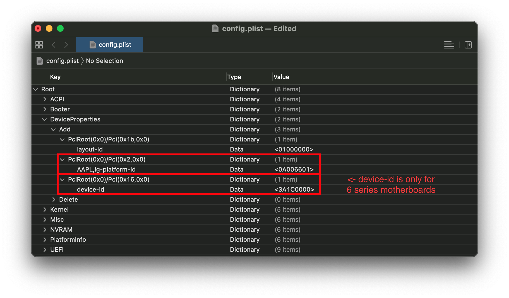
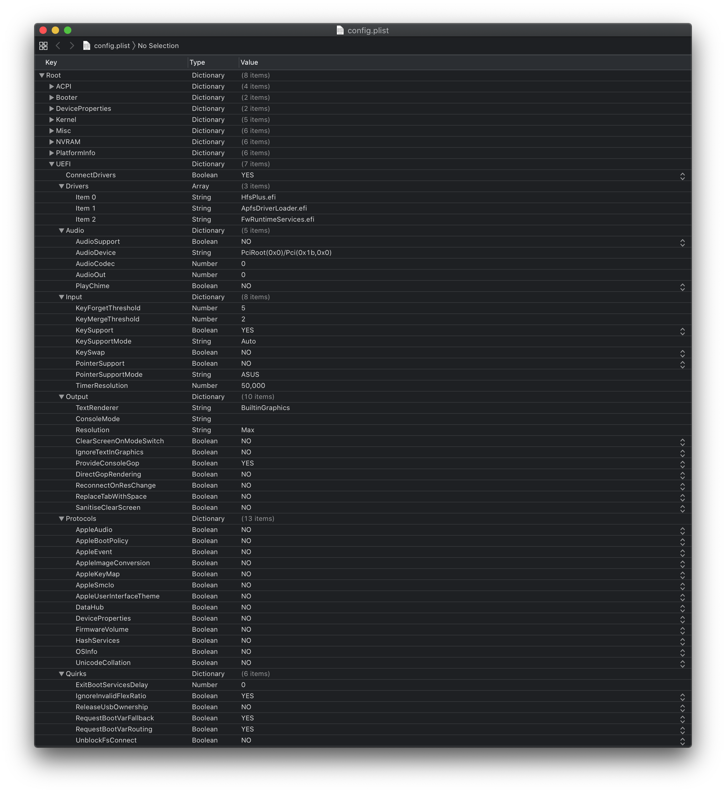

# Ivy bridge de escritorio

* Versión soportada: 0.5.9

<extoc></extoc>

## Punto de comienzo

Hacer un config.plist puede parecer difícil, pero en realidad no lo es. Sólo toma tiempo, pero esta guía te dirá cómo configurar todo, no dejará espacios sin cubrir. Esto también significa que si tienes problemas, asegúrate de que todos los espacios de tu config estén correctos, respaldándote con esta guía. Principales cosas a tener en cuenta con OpenCore:

* **Todas las propiedades deben ser definidas**, no hay opciones predeterminadas para OpenCore, así que **no elimines secciones a menos que se te indique específicamente**. Si la guía no menciona la opción, déjala como está.
* **El sample.plist no puede ser utilizado como está**, debes configurarlo para tu sistema
* **NO USES CONFIGURADORES**, éstos raramente respetan la configuración de OpenCore y algunos como los de Mackie agregarán propiedades de Clover y generarán plists corruptas!
Ahora con todo esto, haremos un pequeño recordatorio de todo lo que necesitamos:

* [ProperTree](https://github.com/corpnewt/ProperTree)
  * Editor de plists universal
* [GenSMBIOS](https://github.com/corpnewt/GenSMBIOS)
  * Para generar datos de SMBIOS
* [Sample/config.plist](https://github.com/acidanthera/OpenCorePkg/releases)
  * Dirígete a la sección anterior sobre cómo obtener: [Setup de tu config.plist](/config.plist/README.md)

**Lee esta guía más de una vez antes de configurar OpenCore y asegúrate de tenerlo configurado correctamente. Ten en cuenta que las imágenes no siempre serán las más actualizadas, así que lee el texto debajo de ellas, si no se menciona nada, déjalo como predeterminado.**

## ACPI


### Add

::: tip Info

Aquí es donde agregarás los SSDTs para su sistema, estos son muy importantes para **arrancar macOS** y tienen muchos usos como [hacer USB mapping](https://dortania.github.io/OpenCore-Post-Install/usb/), [deshabilitar GPUs no compatibles](/extras/spoof.md) y demás. Y con nuestro sistema, **incluso es necesario  para bootear**. Guía sobre cómo encontrarlos aquí: [**Comenzando con ACPI**](https://dortania.github.io/Getting-Started-With-ACPI/)

Para nosotros necesitaremos un par de SSDTs para recuperar la funcionalidad que Clover proporcionó:

| SSDTs requeridos | Descripción |
| :--- | :--- |
| **[SSDT-PM](https://github.com/Piker-Alpha/ssdtPRGen.sh)** | Necesario para la administración adecuada de la energía de la CPU, deberás ejecutar el script ssdtPRGen.sh de Pike para generar este archivo. Esto se ejecutará en [post-instalación](https://dortania.github.io/OpenCore-Post-Install/).
| **[SSDT-EC](https://dortania.github.io/Getting-Started-With-ACPI/)** | * Arregla el embedded controller (EC), dirígete a [la guía de comenzando con ACPI](https://dortania.github.io/Getting-Started-With-ACPI/) para más detalles.) |

Ten en cuenta que **no debes** agregar tu `DSDT.aml` generado aquí, ya está en tu firmware. Entonces, si está presente, elimina la entrada correspondiente en tu `config.plist` y en EFI/OC/ACPI.

Aquellos que deseen una explicación más profunda de cómo hacer un dump de su DSDT, y de cómo hacer estos SSDTs y compilarlos, consulten [**Comenzando con ACPI**](https://dortania.github.io/Getting-Started-With-ACPI/). Los SSDTs compilados tienen una extensión **.aml** (compilados) e irán a la carpeta `EFI/OC/ACPI` y **debe** especificarse en su configuración en`ACPI -> Add` también.

:::

### Delete

::: tip Info

Esto bloquea la carga de ciertas tablas ACPI, la principal razón de esto es que el XCPM de Apple  en nuestro caso esto es muy importante, la principal razón es que el XCPM de Apple no soporta Ivy Bridge muy bien y puede causar kernel panics con AppleIntelCPUPowerManagement al bootear. Para evitar esto necesitamos hacer nuestro propio SSDT de PM en[Post-Instalación](https://dortania.github.io/OpenCore-Post-Install/) y eliminar las tablas enteriores:

Eliminando CpuPm:

| Key | Type | Value |
| :--- | :--- | :--- |
| All | Boolean | YES |
| Comment | String | Delete CpuPm |
| Enabled | Boolean | YES |
| OemTableId | Data | 437075506d000000 |
| TableLength | Number | 0 |
| TableSignature | Data | 53534454 |

Eliminando Cpu0Ist:

| Key | Type | Value |
| :--- | :--- | :--- |
| All | Boolean | YES |
| Comment | String | Delete Cpu0Ist |
| Enabled | Boolean | YES |
| OemTableId | Data | 4370753049737400 |
| TableLength | Number | 0 |
| TableSignature | Data | 53534454 |

:::

### Patch

Esta sección nos permite modificar dinámicamente partes del ACPI (DSDT, SSDTs, etc.) a través de OpenCore. En nuestro caso, los parches son manejados por nuestros SSDTs. Esta es una solución mucho más limpia, ya que nos permitirá iniciar Windows y otros sistemas operativos con OpenCore

### Quirks

Configuración relacionada con ACPI: deja todo aquí como predeterminado, ya que no tenemos uso para estas quirks.

## Booter


Esta sección está dedicada a las peculiaridades relacionadas con el parche boot.efi con OpenRuntime, el reemplazo de AptioMemoryFix.efi

### MmioWhitelist

Esta sección permite pasar espacios a macOS que generalmente se ignoran, lo que es útil cuando se combina con `DevirtualiseMmio`

### Quirks

::: tip Info
Configuraciones relacionadas con parches boot.efi y correcciones de firmware, para nosotros, lo dejamos como predeterminado
:::
::: details Información más detallada

* **AvoidRuntimeDefrag**: YES
  * Corrige runtime services de UEFI como fecha, hora, NVRAM, control de energía, etc.
* **EnableWriteUnprotector**: YES
  * Necesario para eliminar la protección contra escritura del registro CR0.
* **SetupVirtualMap**: YES
  * Corrige las llamadas de `SetVirtualAddresses` a `virtual addresses`, no necesario en Skylake y posterior
  
:::

## DeviceProperties



### Add

Establece las `Device Properties` desde un mapa.

::: tip PciRoot(0x0)/Pci(0x2,0x0)

Esta sección se configura a través de la [Guía de parcheo de Framebuffers](https://github.com/acidanthera/WhateverGreen/blob/master/Manual/FAQ.IntelHD.en.md) y se utiliza para establecer propiedades importantes de tu iGPU.

El `AAPL, ig-platform-id` que utilizamos es el siguiente:

* `0A006601` - este es el hexadecimal estándar para el ig-platform-id

| Key | Type | Value |
| :--- | :--- | :--- |
| AAPL,ig-platform-id | Data | 0A006601 |

(Este es un ejemplo para una computadora de escritorio con un HD 4000)

:::

::: tip PciRoot(0x0)/Pci(0x1b,0x0)

`layout-id`

* Aplica la inyección de audio AppleALC. Deberás hacer tu propia investigación sobre qué códec tiene tu placa base y combinarla con el layout de AppleALC. [Códecs compatibles con AppleALC](https://github.com/acidanthera/AppleALC/wiki/Supported-codecs).
* Puedes eliminar esta propiedad directamente ya que no la utilizaremos en este momento

En nuestro caso, utilizaremos el boot-arg `alcid=xxx` en su lugar para lograrlo. `alcid` anulará todas las demás layouts ID  presentes. Encontrarás mayor información en la [Página de post-instalación](https://dortania.github.io/OpenCore-Post-Install/)

:::

### Delete

Elimina las propiedades del dispositivo del mapa. En nuestro caso podemos ignorarlo

## Kernel


### Add

Aquí es donde especificas qué kexts cargar. El orden importa aquí, así que asegúrate de que Lilu.kext siempre sea el primero. Otros kexts de mayor prioridad vienen después de Lilu, como VirtualSMC, AppleALC, WhateverGreen, etc. Un dato a tener en cuenta es que los usuarios de [ProperTree](https://github.com/corpnewt/ProperTree) pueden ejecutar **Cmd/Ctrl+Shift+R** para agregar todos sus kexts en el orden correcto sin escribir manualmente cada kext.

* **BundlePath**
  * Nombre del kext
  * por ejemplo: `Lilu.kext`
* **Enabled**
  * Se explica por sí solo, define si el kext está habilitado o no.
* **ExecutablePath**
  * La ruta al ejecutable real está oculta dentro del kext, puedes ver qué ruta tiene tu kext haciendo clic derecho y seleccionando `Mostrar contenido del paquete`. En general, será `Contents/MacOS/Kext` pero algunos tienen kexts ocultos dentro de la carpeta `Plugin`. Ten en cuenta que los kexts con sólo plists no necesitan que esto sea completado.
  * ejemplo: `Contents/MacOS/Lilu`
* **PlistPath**
  * Ruta al `info.plist`, oculto dentro del kext
  * ejemplo: `Contents/Info.plist`

### Emulate

Necesario para falsificar CPUs no compatibles como Pentiums y Celerons

* **CpuidMask**: Deja esto blanco
* **CpuidData**: Deja esto blanco

### Block

Bloquea la carga de ciertos kexts. No es relevante para nosotros.

### Patch

Parchea tanto el kernel como los kexts.

### Quirks

::: tip Info

Configuraciones relacionadas con el kernel, en nuestro caso habilitaremos lo siguiente:

| Quirk | Habilitado | Comentario |
| :--- | :--- | :--- |
| AppleCpuPmCfgLock | YES | No es necesario si `CFG-Lock` está desactivado en el BIOS|
| AppleXcpmCfgLock | YES | No es necesario si `CFG-Lock` está desactivado en el BIOS |
| DisableIOMapper | YES | No es necesario si `VT-D` está deshabilitado en el BIOS |
| LapicKernelPanic | NO | Las máquinas HP requerirán este quirk |
| PanicNoKextDump | YES | |
| PowerTimeoutKernelPanic | YES | |
| XhciPortLimit | YES | |

:::

::: details Información más detallada

* **AppleCpuPmCfgLock**: YES
  * Solo es necesario cuando CFG-Lock no se puede deshabilitar en BIOS, la contraparte de Clover sería AppleIntelCPUPM.
  **Por favor verifica si puedes deshabilitar CFG-Lock, la mayoría de los sistemas no arrancarán con él, por lo que requieren el uso de este quirk**
* **AppleXcpmCfgLock**: YES
  * Solo es necesario cuando CFG-Lock no se puede deshabilitar en BIOS, la contraparte de Clover sería KernelPM. **Por favor verifica si puedes deshabilitar CFG-Lock, la mayoría de los sistemas no arrancarán con él, por lo que requieren el uso de este quirk**
* **CustomSMBIOSGuid**: NO
  * Realiza parches GUID para el modo personalizado UpdateSMBIOSMode. Generalmente relevante para portátiles Dell
* **DisableIoMapper**: YES
  * Necesario para encontrar la vuelta a VT-D si no puedes desactivarlo desde la BIOS o si lo necesitas para otro SO. Esto es una mejor alternativa a `dart=0` ya que el SIP puede quedarse en Catalina
* **DisableRtcChecksum**: NO
  * Impide que AppleRTC escriba en la suma de comprobación primaria (0x58-0x59), necesaria para los usuarios que reciben el reinicio del BIOS o son enviados al modo seguro después del reinicio/apagado
* **LapicKernelPanic**: NO
  * Inhabilita el kernel panic en la interrupción del kernel de AP, generalmente necesaria para los sistemas HP. El equivalente de Clover es `Kernel LAPIC`
* **PanicNoKextDump**: YES
  * Permite leer los registros de kernel panics cuando éstos ocurren
* **PowerTimeoutKernelPanic**: YES
  * Ayuda a solucionar kernel panics relacionados con los cambios de energía con los drivers de Apple en macOS Catalina, especialmente con audio digital.
* **XhciPortLimit**: YES
  * Este es en realidad el parche de límite de 15 puertos, no confíes en él, ya que no es una solución garantizada para reparar USBs. Crea un [USB map](https://dortania.github.io/OpenCore-Post-Install/usb/) cuando sea posible.

La razón es que UsbInjectAll reimplementa la funcionalidad incorporada de macOS sin la sintonización adecuada. Es mucho más sencillo describir sus puertos en un solo kext con una sola plist, que no desperdiciará la memoria de tiempo de ejecución.

:::

## Misc


### Boot

Configuración para la pantalla de inicio (Deja todo como predeterminado).

### Debug

::: tip Info

Útil para depurar problemas de arranque de OpenCore (cambiaremos todo *menos* `DisplayDelay`):

| Quirk | Enabled |
| :--- | :--- |
| AppleDebug | YES |
| ApplePanic | YES |
| DisableWatchDog | YES |
| Target | 67 |

:::

::: details Información más detallada

* **AppleDebug**: YES
  * Enables boot.efi logging, useful for debugging. Note this is only supported on 10.15.4 and newer
* **ApplePanic**: YES
  * Intenta registrar kernel panics en el disco
* **DisableWatchDog**: YES
  * Deshabilita el watchdog UEFI, puede ayudar con problemas de arranque temprano
* **Target**: `67`
  * Muestra más información de depuración, requiere la versión de depuración de OpenCore
* **DisplayLevel**: `2147483650`
  * Muestra aún más información de depuración, requiere la versión de depuración de OpenCore

Estos valores se basan en los calculados en [Depuración de OpenCore](/troubleshooting/debug.md)

:::

### Security

::: tip Info

Security se explica por sí sola, **no te lo saltes**. Vamos a cambiar lo siguiente:

| Quirk | Enabled | Comment |
| :--- | :--- | :--- |
| AllowNvramReset | YES | |
| AllowSetDefault | YES | |
| Vault | Optional | Esta es una palabra, no es opcional omitir esta configuración. Lo lamentarás si no lo configuras en `Optional`, ten en cuenta que distingue entre mayúsculas y minúsculas |
| ScanPolicy | 0 | |

:::

::: details Información más detallada

* **AllowNvramReset**: YES
  * Permite restablecer NVRAM tanto en el selector de arranque como al presionar `Cmd+Opt+P+R`
* **AllowSetDefault**: YES
  * Permite que `CTRL+Enter` y `CTRL+Index` configuren el dispositivo de arranque predeterminado en el selector
* **AuthRestart**: NO
  * Habilita el reinicio autenticado para FileVault 2, por lo que no se requiere contraseña al reiniciar. Puede considerarse un riesgo de seguridad así que es opcional
* **BlacklistAppleUpdate**: True
  * Ignora el actualizador de firmware de Apple, que se recomienda habilitar para evitar problemas con las instalaciones y actualizaciones
* **BootProtect**: None
  * Ignora el actualizador de firmware de Apple, recomendado para evitar problemas con las instalaciones y actualizaciones. Permite el uso de Bootstrap.efi dentro de `EFI/OC/Bootstrap` en lugar de BOOTx64.efi.Útil para aquellos que desean arrancar con rEFInd o evitar sobrescribir BOOTx64.efi con Windows. El uso adecuado de estos quirks no está cubierto en esta guía.
* **ExposeSensitiveData**: `6`
  * Muestra más información de depuración, requiere la versión de depuración de OpenCore
* **Vault**: `Optional`
  * No trataremos el Vaulting, por lo que podemos ignorar esto, ten en cuenta que **no podrás bootear si esto está configurado en `Secure`**
  * Esta es una palabra, no es opcional omitir esta configuración. Lo lamentarás si no lo configuras en `Optional`, ten en cuenta que distingue entre mayúsculas y minúsculas
* **ScanPolicy**: `0`
  * `0` te permite ver todas las unidades disponibles, consulta la sección [Seguridad](https://dortania.github.io/OpenCore-Post-Install/universal/security.html) para obtener más detalles. **No arrancará dispositivos USB con este ajuste predeterminado**

:::

### Tools

Utilizado para ejecutar herramientas de depuración OC como el shell, la función de "Snapshot" de ProperTree las agregará por tí.

### Entries

Se usa para especificar rutas de inicio irregulares que no se pueden encontrar naturalmente con OpenCore.

No se cubrirá aquí, consulte 8.6 de [Configuration.pdf](https://github.com/acidanthera/OpenCorePkg/blob/master/Docs/Configuration.pdf) para obtener más información

## NVRAM


### Add

::: tip 4D1EDE05-38C7-4A6A-9CC6-4BCCA8B38C14

Utilizado para el escalado de la interfaz de usuario de OpenCore, el valor predeterminado funcionará para nosotros. Consulta la sección detallada para obtener más información.

:::

::: details More in-depth Info

Ruta de arranque, utilizada principalmente para escalar la interfaz de usuario

* **UIScale**:
  * `01`: Resolución estándar
  * `02`: HiDPI (generalmente requerido para FileVault para funcionar correctamente en pantallas más pequeñas)

* **DefaultBackgroundColor**: Color de fondo utilizado por boot.efi
  * `00000000`: Syrah Negro
  * `BFBFBF00`: Gris Claro

:::

::: tip 7C436110-AB2A-4BBB-A880-FE41995C9F82

Máscara de bits de Protección de integridad del sistema

* **boot-args de uso general**:

| boot-args | Descripción |
| :--- | :--- |
| **-v** | Esto habilita el modo detallado, que muestra todo el texto detrás de escena que se desplaza al iniciar, en lugar del logotipo de Apple y la barra de progreso. Es invaluable para cualquier Hackintosher, ya que le da una mirada interna al proceso de arranque y puede ayudarlo a identificar problemas, problemas con kexts, etc. |
| **debug=0x100** | Esto deshabilita el watchdog de macOS que ayuda a evitar el reinicio en caso de un kernel panic. De esa manera, puedes *con suerte* obtener información útil y usarla para solucionar este problema. |
| **keepsyms=1** | Esta es una configuración complementaria para debug=0x100 que le dice al sistema operativo que también imprima los símbolos en un kernel panic. Eso puede dar una idea más útil de lo que está causando el pánico en sí. |
| **alcid=1** | Utilizado para configurar el layout-id para AppleALC, consulta [códecs compatibles](https://github.com/acidanthera/applealc/wiki/supported-codecs) para averiguar qué layout usar para su sistema específico. Más información sobre esto está cubierta en la [Página de post instalación](https://dortania.github.io/OpenCore-Post-Install/) |

* **GPU-Specific boot-args**:

| boot-args | Description |
| :--- | :--- |
| **agdpmod=pikera** | Se usa para deshabilitar el BoardID en las GPUs Navi (series RX 5000). Sin esto obtendrás una pantalla negra. **No lo uses si no tienes Navi** (es decir, las tarjetas Polaris y Vega no deberían usar esto) |
| **nvda_drv_vrl=1** | Se utiliza para habilitar los Web Drivers de Nvidia en las tarjetas Maxwell y Pascal en Sierra y High Sierra |
| **-wegnoegpu** | Se usa para deshabilitar todas las otras GPU(s) que no sean la iGPU de Intel. Util para aquellos que deseen ejecutar versiones más nuevas de macOS donde su GPU dedicada no es compatible |

* **csr-active-config**: Configuración para 'Protección de integridad del sistema' (SIP). En general, se recomienda cambiar esto con `csrutil` a través de la partición de recuperación.

csr-active-config de forma predeterminada se establece en `00000000` que habilita la Protección de integridad del sistema. Puedes elegir una cantidad de valores diferentes, pero en general recomendamos mantener esto habilitado para tener mayor seguridad. Puedes encontrar más información en nuestra página de solución de problemas: [Desactivar SIP](/troubleshooting/troubleshooting.md#disabling-sip)

* **prev-lang:kbd**: <>
  * Necesario para teclados no latinos en el formato de `lang-COUNTRY:keyboard`, se recomienda mantener en blanco aunque puede especificarlo (**El valor predeterminado en el sample.plist es ruso**):
  * Inglés de Estados Unidos: `en-US:0`(`656e2d55533a30` en HEX)
  * Una lista completa puede ser encontrada en [AppleKeyboardLayouts.txt](https://github.com/acidanthera/OpenCorePkg/blob/master/Utilities/AppleKeyboardLayouts/AppleKeyboardLayouts.txt)
  * Sugerencia: `prev-lang:kbd` se puede cambiar a un string para que puedas ingresar `en-US: 0` directamente en lugar de convertir a HEX

| Key | Type | Value |
| :--- | :--- | :--- |
| prev-lang:kbd | String | en-US:0 |

:::

### Delete

::: tip Información

Vuelve a escribir a la fuerza las variables de NVRAM. Ten en cuenta que `Add` **no sobrescribirá** los valores ya presentes en NVRAM, por lo que  valores como `boot-args` deben dejarse solos. En nuestro caso, cambiaremos lo siguiente:

| Quirk | Enabled |
| :--- | :--- |
| WriteFlash | YES |

:::

::: details Información más detallada

**LegacyEnable**: NO

* Permite que la NVRAM se almacene en nvram.plist, necesario para sistemas sin NVRAM nativa

**LegacyOverwrite**: NO

* Permite sobrescribir variables de firmware de la nvram.plist, solo necesario para sistemas sin NVRAM nativa

**LegacySchema**

* Se usa para asignar variables NVRAM, se usa con LegacyEnable establecido en YES

**WriteFlash**: YES

* Permite escribir en la memoria flash para todas las variables agregadas.

:::

## PlatformInfo


::: tip Info

Para configurar la información SMBIOS, usaremos la aplicación [GenSMBIOS](https://github.com/corpnewt/GenSMBIOS) hecha por [CorpNewt](https://github.com/corpnewt/).

Para este ejemplo de Ivy Bridge, elegiremos el SMBIOS iMac13,2. Esto se hace intencionalmente por razones de compatibilidad. Hay dos SMBIOS principales utilizados para Ivy Bridge:

* `iMac13,1` - esto se usa para computadoras que utilizan su iGPU para la imagen.
* `iMac13,2` - esto se usa para computadoras que usan una GPU dedicada para la imagen y una iGPU solo para tareas computacionales.

Ejecuta GenSMBIOS, elije la opción 1 para descargar MacSerial y la Opción 3 para seleccionar SMBIOS. Esto nos dará una salida similar a la siguiente:

```
  #######################################################
 #               iMac13,2 SMBIOS Info                  #
#######################################################

Type:         iMac13,2
Serial:       C02KCYZLDNCW
Board Serial: C02309301QXF2FRJC
SmUUID:       A154B586-874B-4E57-A1FF-9D6E503E4580
```

La parte `Type` se copia en Generic -> SystemProductName.

La parte `Serial` se copia en Generic -> SystemSerialNumber.

La parte `Board Serial` se copia en Generic -> MLB.

La parte `SmUUID` se copia en Generic -> SystemUUID.

Configuramos Generic -> ROM a una ROM de Apple (extraída de una Mac real), la dirección MAC de tu NIC o cualquier dirección MAC aleatoria (podría ser solo 6 bytes aleatorios Para esta guía usaremos `11223300 0000`. Después de instalar dirígete a la página [Arreglando iServices](https://dortania.github.io/OpenCore-Post-Install/universal/iservices.html) para saber cómo encontrar tu dirección MAC real)

**Recuerda que quieres o una serie no válida o números de serie válidos, pero NO quieres series válidas que están en uso, quieres recibir un mensaje de regreso como: "Serie no válida" o "Fecha de compra no validada"**

[Página de verificación de cobertura de Apple](https://checkcoverage.apple.com)

**Automatic**: YES

* Genera PlatformInfo basada en la sección Generic en lugar de las secciones DataHub, NVRAM y SMBIOS

:::

### Generic

::: details Información más detallada

* **SpoofVendor**: YES
  * Intercambia el campo del proveedor de Acidanthera. Generalmente no es seguro usar Apple como proveedor.
* **AdviseWindows**: NO
  * Se usa cuando la partición EFI no es la primera en la unidad de Windows

**UpdateDataHub**: YES

* Actualiza campos de Data Hub

**UpdateNVRAM**: YES

* Actualiza campos de NVRAM

**UpdateSMBIOS**: YES

* Actualiza campos SMBIOS

**UpdateSMBIOSMode**: Create

* Reemplaza las tablas con EfiReservedMemoryType recientemente asignadas, usar `Custom` en las  Dell que requieren el quirk CustomSMBIOS

:::

## UEFI



**ConnectDrivers**: YES

* Fuerza drivers `.efi`. El cambio a NO conectará automáticamente los drivers UEFI agregados. Esto puede hacer que el arranque sea un poco más rápido, pero no todos los drivers se conectan. (ej. ciertos drivers del sistema pueden no cargarse).

### Drivers

Agrega tus drivers .efi aquí

Los únicos drivers presentes aquí deberían ser:

* HfsPlus.efi
* OpenRuntime.efi

### APFS

Configuración relacionada con el driver de APFS. Deja todo aquí como predeterminado.

### Audio

En relación con la configuración de AudioDxe, por ahora ignoraremos esto (dejar como predeterminado). Esto no está relacionado con el soporte de audio en macOS.

* Para un más información sobre uso de AudioDxe y la sección Audio, consulta la página de post instalación: [Agregar la GUI y el chime](https://dortania.github.io/OpenCore-Post-Install/)

### Input

En relación con el paso de teclado con boot.efi, utilizado para la compatibilidad con FileVault y los Hotkeys, deja todo aquí como predeterminado ya que no tenemos uso para estos quirks. Ver aquí para más detalles: [Seguridad y FileVault](https://dortania.github.io/OpenCore-Post-Install/)

### Output

Relating to OpenCore's visual output,  leave everything here as default as we have no use for these quirks.

### ProtocolOverrides

Principalmente relevante para máquinas virtuales, Macs Legacy y usuarios de FileVault. Consulte aquí para obtener más detalles: [Seguridad y FileVault](https://dortania.github.io/OpenCore-Post-Install/)

### Quirks

::: tip Info
En relación con los quirks con el entorno UEFI, cambiaremos lo siguiente:

| Quirk | Enabled | Comment |
| :--- | :--- | :--- |
| IgnoreInvalidFlexRatio | YES | - |
| UnblockFsConnect | NO | Necesario principalmente para placas madre HP |

:::

::: details Información más detallada

* **DeduplicateBootOrder**: YES
  * Solicita la reserva de algunas variables prefijadas de arranque de `OC_VENDOR_VARIABLE_GUID` a `EFI_GLOBAL_VARIABLE_GUID`. Se utiliza para arreglar las opciones de arranque.

* **IgnoreInvalidFlexRatio**: YES
  * Solución para cuando MSR\_FLEX \_RATIO (0x194) no se puede deshabilitar en la BIOS, requerido para todos los sistemas basados antes que Skylake.

* **RequestBootVarRouting**: YES
  * Redirige AptioMemoryFix desde `EFI_GLOBAL_VARIABLE_GUID` a `OC\_VENDOR\_VARIABLE\_GUID`. Necesario para cuando el firmware intenta eliminar las entradas de arranque y se recomienda que esté habilitado en todos los sistemas para la instalación correcta de las actualizaciones, el funcionamiento del panel de control del disco de inicio, etc.

* **UnblockFsConnect**: NO
  * Algunos firmwares bloquean a las llamadas "partition handles" abriéndolas en modo de controlador, lo que hace que los protocolos del sistema de archivos no puedan instalarse. Principalmente relevante para sistemas HP cuando no se ven discos enumerados

:::

### ReservedMemory

Se utiliza para eximir ciertas regiones de memoria de los sistemas operativos a utilizar, principalmente relevante para iGPUs o sistemas Sandy Bridge con memoria defectuosa. El uso de este quirk no está cubierto en esta guía

## Cleaning up

Y ahora estás listo para guardar y colocarlo en tu EFI bajo EFI/OC.

Para aquellos que tienen problemas de booteo, asegúrense de leer primero la [Sección de solución de problemas](../troubleshooting/troubleshooting.md) y si tus preguntas siguen sin respuesta, tenemos muchos recursos a tu disposición:

* [Subreddit de Hackintosh](https://www.reddit.com/r/hackintosh/)
* [Nuestro servidor de Discord](https://discord.gg/2QYd7ZT)

* **NOTA IMPORTANTE: El Subreddit y el servidor de Discord sólo admiten posts en inglés, así que asegúrate de hacerlos en este idioma para evitar inconvenientes.**

**Sanity check**:

Gracias a los esfuerzos de Ramus, también tenemos una herramienta increíble para ayudar a verificar su configuración para aquellos que pueden haberse perdido algo:

* [**Sanity Checker**](https://opencore.slowgeek.com)

Ten en cuenta que esta herramienta no está hecha ni mantenida por Dortania, todos los problemas con este sitio deben enviarse aquí: [Repositorio del Sanity Checker](https://github.com/rlerdorf/OCSanity)

## Configuración de BIOS de Intel

### Deshabilitar

* Fast Boot
* Secure Boot
* VT-d (puede ser habilitado si `DisableIoMapper` está configurado a `YES`)
* CSM
* Thunderbolt(Para la instalación inicial, ya que Thunderbolt puede causar problemas si no se configura correctamente)
* Intel SGX
* Intel Platform Trust
* CFG Lock (Protección contra escritura MSR 0xE2) (**Esto debe estar desactivado, si no puedes encontrar la opción, habilita tanto `AppleCpuPmCfgLock` como `AppleXcpmCfgLock` en Kernel -> Quirks. Tu hack no se iniciará con CFG-Lock habilitado** )

### Habilitar

* VT-x
* Above 4G decoding
* Hyper-Threading
* Execute Disable Bit
* EHCI/XHCI Hand-off
* OS type: Windows 8.1/10 UEFI Mode
* DVMT Pre-Allocated(iGPU Memory): 32MB

# Ahora con todo esto hecho, dirígete a la [página de instalación](/installation/installation-process)
