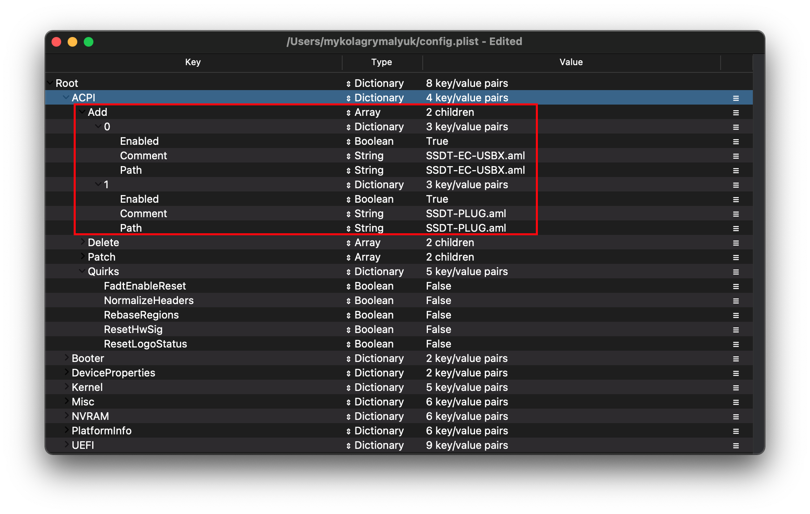

# 台式 Kaby Lake

| 支持 | 版本 |
| :--- | :--- |
| 初始macOS支持 | macOS 10.12, Sierra |

## 起点

制作一个config.plist看起来很难，其实并不难。这只是需要一些时间，但本指南将告诉你如何配置所有的东西，你不会被冷落。这也意味着如果你有问题，检查你的配置设置以确保它们是正确的。OpenCore的主要注意事项:

* **所有属性必须被定义**，没有默认的OpenCore将出错，所以**不要删除节，除非有明确告知你**。如果指南没有提到该选项，请将其保留为默认值。
* **Sample plist不能按原样使用**，必须配置到您的系统中。
* **不要使用配置器**，这些配置器很少遵守OpenCore的规则，甚至一些像Mackie的配置器会添加Clover属性和破坏plists!

现在，我们来快速地提醒一下我们需要哪些工具

* [ProperTree](https://github.com/corpnewt/ProperTree)
  * 通用plist编辑器
* [GenSMBIOS](https://github.com/corpnewt/GenSMBIOS)
  * 用于生成SMBIOS数据
* [Sample/config.plist](https://github.com/acidanthera/OpenCorePkg/releases)
  * 参见上一节中如何获取:[config.plist Setup](../config.plist/README.md)

::: warning 注意

在设置OpenCore之前，请多次阅读本指南，并确保设置正确。请注意，图像并不总是最新的，所以请阅读下面的文本，如果没有提到，则保留为默认值。

:::

## ACPI



### Add

::: tip 信息

这是你将为系统添加ssdt的地方，这些对于**引导macOS**非常重要，并且有许多用途，例如[USB映射](https://sumingyd.github.io/OpenCore-Post-Install/usb/), [禁用不支持的gpu](../extras/spoof.md) 等，这对于我们的系统来说是**启动所必须**的。制作指南可以在这里找到:[**ACPI入门**](https://sumingyd.github.io/Getting-Started-With-ACPI/)

我们需要几个ssdt来恢复Clover提供的功能:

| 所需ssdt | 描述 |
| :--- | :--- |
| **[SSDT-PLUG](https://sumingyd.github.io/Getting-Started-With-ACPI/)** | 在Haswell和更新的版本上允许本地CPU电源管理，请参阅[ACPI入门指南](https://sumingyd.github.io/Getting-Started-With-ACPI/)了解更多细节。 |
| **[SSDT-EC-USBX](https://sumingyd.github.io/Getting-Started-With-ACPI/)** | 修复了嵌入式控制器和USB电源，请参阅[开始与ACPI指南](https://sumingyd.github.io/Getting-Started-With-ACPI/)了解更多细节。 |

注意，你**不应该**在这里添加你生成的`DSDT aml`，它已经在你的固件中了。因此，如果存在，请在你的`config.plist`和EFI/OC/ACPI下删除它的条目。

对于那些想要更深入地了解转储您的DSDT、如何制作这些ssdt以及编译它们的人，请参阅[开始使用ACPI](https://sumingyd.github.io/Getting-Started-With-ACPI/) 页面。编译的ssdt有一个 **.aml** 扩展名(组装)，将被放入`EFI/OC/ACPI`文件夹，并且**必须**在你的配置文件`ACPI -> Add`下指定。

:::

### Delete

这将阻止某些ACPI表加载，对于我们来说，我们可以忽略它。

### Patch

本节允许我们通过OpenCore动态修改ACPI的部分内容(DSDT、SSDT等)。对我们来说，我们的补丁由我们的ssdt处理。这是一个更简洁的解决方案，因为这将允许我们使用OpenCore引导Windows和其他操作系统

### Quirks

与ACPI相关的设置，将所有内容保留为默认设置，因为我们不需要这些怪癖。

## Booter


本节专门讨论使用OpenRuntime (AptioMemoryFix.efi的替代品)进行boot.efi补丁的相关问题

### MmioWhitelist

本节允许将通常被忽略的空格传递给macOS，当与`DevirtualiseMmio`配对时很有用。

### Quirks

::: tip 信息
有关boot.efi补丁和固件修复的设置，对我们来说，我们将其保留为默认值
:::
::: details 更深入的信息

* **AvoidRuntimeDefrag**: YES
  * 修复UEFI运行时服务，如日期、时间、NVRAM、电源控制等。
* **EnableSafeModeSlide**: YES
  * 允许slide变量在安全模式下使用。
* **EnableWriteUnprotector**: YES
  * 需要从CR0寄存器移除写保护。
* **ProvideCustomSlide**: YES
  * 用于Slide变量计算。然而，这个选项的必要性是由 `OCABC: Only N/256 slide values are usable!` 消息所决定的. 如果显示 `OCABC: All slides are usable! You can disable ProvideCustomSlide!` 在你的日志中, 你可以禁用 `ProvideCustomSlide`.
* **SetupVirtualMap**: YES
  * 修复了对虚拟地址的SetVirtualAddresses调用，这是Gigabyte主板解决早期内核崩溃问题所需的。

:::

## DeviceProperties


### Add

从映射中设置设备属性。

::: tip PciRoot(0x0)/Pci(0x2,0x0)

本节是通过WhateverGreen的[Framebuffer补丁指南](https://github.com/acidanthera/WhateverGreen/blob/master/Manual/FAQ.IntelHD.en.md)建立的，用于设置重要的iGPU属性。

config.plist 还没有这个部分，所以你必须手动创建它。

`AAPL,ig-platform-id` 是macOS用来确定iGPU驱动程序如何与我们的系统交互的，可以选择的两个值如下:

| AAPL,ig-platform-id | 说明 |
| :--- | :--- |
| **`00001259`** | 使用桌面iGPU驱动显示器时使用 |
| **`03001259`** | 桌面iGPU仅用于计算任务而不驱动显示器时使用的 |

我们还添加了另外两个属性， `framebuffer-patch-enable` 和 `framebuffer-stolenmem`. 第一个启用WhateverGreen kext打补丁，第二个设置最小被盗内存为19MB。这通常是不必要的，因为可以在BIOS中配置(推荐64MB)，但在不可用时是必需的。

* **注**: Headless framebuffers其中dGPU是显示出来的)不需要`framebuffer-patch-enable` 和 `framebuffer-stolenmem`

| Key | Type | Value |
| :--- | :--- | :--- |
| AAPL,ig-platform-id | Data | `00001259` |
| framebuffer-patch-enable | Data | `01000000` |
| framebuffer-stolenmem | Data | `00003001` |

(这是一个桌面HD 630没有dGPU和BIOS选项中没有iGPU内存设置)

:::

::: tip PciRoot(0x0)/Pci(0x1b,0x0)

`layout-id`

* 应用AppleALC音频注入，你需要自己研究你的主板有哪个编解码器，并将其与AppleALC的布局匹配。[AppleALC支持编解码器](https://github.com/acidanthera/AppleALC/wiki/Supported-codecs)。
* 你可以直接删除这个属性，因为目前它还没有被使用

对于我们来说，我们将使用引导参数`alcid=xxx`来完成此操作。`alcid`将覆盖所有其他布局id。更多信息在[安装后页面](https://dortania.github.io/OpenCore-Post-Install/)

:::

### Delete

从映射中移除设备属性，我们可以忽略这个

有趣的事实:字节顺序被交换的原因是因为大多数现代处理器是[小尾数](https://en.wikipedia.org/wiki/Endianness)

## Kernel


### Add

在这里，我们指定要加载哪些kext，以什么特定的顺序加载，以及每个kext用于什么体系结构。默认情况下，我们建议保留ProperTree所做的操作，但对于32位cpu，请参见以下内容:

::: 更深入的信息

你需要记住的主要事情是:

* 装载顺序
  * 记住，任何插件都应该在它的依赖**后面**加载
  * 这意味着像Lilu这样的kext **必须**出现在VirtualSMC、AppleALC、WhateverGreen等之前

提醒一下[ProperTree](https://github.com/corpnewt/ProperTree)用户可以运行**Cmd/Ctrl + Shift + R**以正确的顺序添加他们所有的kext，而无需手动输入每个kext。

* **Arch**
  * 该kext支持的架构
  * 目前支持的值是 `Any`, `i386` (32位), 和 `x86_64` (64-位)
* **BundlePath**
  * kext的名称
  * 例如: `Lilu.kext`
* **Enabled**
  * 不言自明，启用或禁用kext
* **ExecutablePath**
  * 实际可执行文件的路径隐藏在kext中，您可以通过右键单击并选择`显示包内容`来查看kext的路径。一般来说，它们将是`Contents/MacOS/Kext`，但有些将Kext隐藏在`Plugin`文件夹下。请注意，kext中仅plist不需要填充该属性。
  * 例如: `Contents/MacOS/Lilu`
* **MinKernel**
  * kext将被注入到的最低内核版本，有关可能的值，请参见下表
  * ex. `12.00.00` for OS X 10.8
* **MaxKernel**
  * kext将被注入到的最高内核版本，可能的值见下表
  * ex. `11.99.99` for OS X 10.7
* **PlistPath**
  * 隐藏在kext中的`info.plist`的路径
  * 例如: `Contents/Info.plist`

::: details 内核支持表

| OS X 版本 | MinKernel | MaxKernel |
| :--- | :--- | :--- |
| 10.4 | 8.0.0 | 8.99.99 |
| 10.5 | 9.0.0 | 9.99.99 |
| 10.6 | 10.0.0 | 10.99.99 |
| 10.7 | 11.0.0 | 11.99.99 |
| 10.8 | 12.0.0 | 12.99.99 |
| 10.9 | 13.0.0 | 13.99.99 |
| 10.10 | 14.0.0 | 14.99.99 |
| 10.11 | 15.0.0 | 15.99.99 |
| 10.12 | 16.0.0 | 16.99.99 |
| 10.13 | 17.0.0 | 17.99.99 |
| 10.14 | 18.0.0 | 18.99.99 |
| 10.15 | 19.0.0 | 19.99.99 |
| 11 | 20.0.0 | 20.99.99 |
| 12 | 21.0.0 | 21.99.99 |
| 13 | 22.0.0 | 22.99.99 |

:::

### Emulate

用于仿冒不支持的cpu，如Pentiums和Celerons

* **Cpuid1Mask**: 不填写
* **Cpuid1Data**: 不填写

### Force

用于从系统卷中加载kext，只适用于某些特定的kext不在缓存中的旧操作系统。(例如：10.6中的 IONetworkingFamily).

对我们来说，我们可以忽略。

### Block

阻止某些kext的加载。与我们无关。

### Patch

为内核和kext打补丁。

### Quirks

::: tip 信息

与内核相关的设置，对我们来说，我们将启用以下:

| 选项 | 启用 | 描述 |
| :--- | :--- | :--- |
| AppleXcpmCfgLock | YES | 如果在BIOS中禁用了`CFG-Lock`，则不需要 |
| DisableIoMapper | YES | 如果在BIOS中禁用了`VT-D`，则不需要 |
| LapicKernelPanic | NO | 惠普机器将需要这个选项 |
| PanicNoKextDump | YES | |
| PowerTimeoutKernelPanic | YES | |
| XhciPortLimit | YES | 如果运行macOS 11.3+，请禁用 |

:::

::: details 更深入的信息

* **AppleCpuPmCfgLock**: NO
  * Only needed when CFG-Lock can't be disabled in BIOS
  * Only applicable for Ivy Bridge and older
    * Note: Broadwell and older require this when running 10.10 or older
* **AppleXcpmCfgLock**: YES
  * Only needed when CFG-Lock can't be disabled in BIOS
  * Only applicable for Haswell and newer
    * Note: Ivy Bridge-E is also included as it's XCPM capable
* **CustomSMBIOSGuid**: NO
  * Performs GUID patching for UpdateSMBIOSMode set to `Custom`. Usually relevant for Dell laptops
  * Enabling this quirk with UpdateSMBIOSMode Custom mode can also disable SMBIOS injection into "non-Apple" OSes however we do not endorse this method as it breaks Bootcamp compatibility. Use at your own risk
* **DisableIoMapper**: YES
  * Needed to get around VT-D if either unable to disable in BIOS or needed for other operating systems, much better alternative to `dart=0` as SIP can stay on in Catalina
* **DisableLinkeditJettison**: YES
  * Allows Lilu and others to have more reliable performance without `keepsyms=1`
* **DisableRtcChecksum**: NO
  * Prevents AppleRTC from writing to primary checksum (0x58-0x59), required for users who either receive BIOS reset or are sent into Safe mode after reboot/shutdown
* **ExtendBTFeatureFlags** NO
  * Helpful for those having continuity issues with non-Apple/non-Fenvi cards
* **LapicKernelPanic**: NO
  * Disables kernel panic on AP core lapic interrupt, generally needed for HP systems. Clover equivalent is `Kernel LAPIC`
* **LegacyCommpage**: NO
  * Resolves SSSE3 requirement for 64 Bit CPUs in macOS, mainly relevant for 64-Bit Pentium 4 CPUs(ie. Prescott)
* **PanicNoKextDump**: YES
  * Allows for reading kernel panics logs when kernel panics occur
* **PowerTimeoutKernelPanic**: YES
  * Helps fix kernel panics relating to power changes with Apple drivers in macOS Catalina, most notably with digital audio.
* **SetApfsTrimTimeout**: `-1`
  * Sets trim timeout in microseconds for APFS filesystems on SSDs, only applicable for macOS 10.14 and newer with problematic SSDs.
* **XhciPortLimit**: YES
  * This is actually the 15 port limit patch, don't rely on it as it's not a guaranteed solution for fixing USB. Please create a [USB map](https://dortania.github.io/OpenCore-Post-Install/usb/) when possible.
  * With macOS 11.3+, [XhciPortLimit may not function as intended.](https://github.com/dortania/bugtracker/issues/162) We recommend users either disable this quirk and map before upgrading or [map from Windows](https://github.com/USBToolBox/tool). You may also install macOS 11.2.3 or older.

:::

### Scheme

Settings related to legacy booting(ie. 10.4-10.6), for majority you can skip however for those planning to boot legacy OSes you can see below:

::: details More in-depth Info

* **FuzzyMatch**: True
  * Used for ignoring checksums with kernelcache, instead opting for the latest cache available. Can help improve boot performance on many machines in 10.6
* **KernelArch**: x86_64
  * Set the kernel's arch type, you can choose between `Auto`, `i386` (32-bit), and `x86_64` (64-bit).
  * If you're booting older OSes which require a 32-bit kernel(ie. 10.4 and 10.5) we recommend to set this to `Auto` and let macOS decide based on your SMBIOS. See below table for supported values:
    * 10.4-10.5 — `x86_64`, `i386` or `i386-user32`
      * `i386-user32` refers 32-bit userspace, so 32-bit CPUs must use this(or CPUs missing SSSE3)
      * `x86_64` will still have a 32-bit kernelspace however will ensure 64-bit userspace in 10.4/5
    * 10.6 — `i386`, `i386-user32`, or `x86_64`
    * 10.7 — `i386` or `x86_64`
    * 10.8 or newer — `x86_64`

* **KernelCache**: Auto
  * Set kernel cache type, mainly useful for debugging and so we recommend `Auto` for best support

:::

## Misc


### Boot

::: tip Info

| Quirk | Enabled | Comment |
| :--- | :--- | :--- |
| HideAuxiliary | YES | Press space to show macOS recovery and other auxiliary entries |

:::

::: details More in-depth Info

* **HideAuxiliary**: YES
  * This option will hide supplementary entries, such as macOS recovery and tools, in the picker. Hiding auxiliary entries may increase boot performance on multi-disk systems. You can press space at the picker to show these entries

:::

### Debug

::: tip Info

Helpful for debugging OpenCore boot issues(We'll be changing everything *but* `DisplayDelay`):

| Quirk | Enabled |
| :--- | :--- |
| AppleDebug | YES |
| ApplePanic | YES |
| DisableWatchDog | YES |
| Target | 67 |

:::

::: details More in-depth Info

* **AppleDebug**: YES
  * Enables boot.efi logging, useful for debugging. Note this is only supported on 10.15.4 and newer
* **ApplePanic**: YES
  * Attempts to log kernel panics to disk
* **DisableWatchDog**: YES
  * Disables the UEFI watchdog, can help with early boot issues
* **DisplayLevel**: `2147483650`
  * Shows even more debug information, requires debug version of OpenCore
* **SysReport**: NO
  * Helpful for debugging such as dumping ACPI tables
  * Note that this is limited to DEBUG versions of OpenCore
* **Target**: `67`
  * Shows more debug information, requires debug version of OpenCore

These values are based of those calculated in [OpenCore debugging](../troubleshooting/debug.md)

:::

### Security

::: tip Info

Security is pretty self-explanatory, **do not skip**. We'll be changing the following:

| Quirk | Enabled | Comment |
| :--- | :--- | :--- |
| AllowSetDefault | YES | |
| BlacklistAppleUpdate | YES | |
| ScanPolicy | 0 | |
| SecureBootModel | Default | Leave this as `Default` for OpenCore to automatically set the correct value corresponding to your SMBIOS. The next page goes into more detail about this setting. |
| Vault | Optional | This is a word, it is not optional to omit this setting. You will regret it if you don't set it to Optional, note that it is case-sensitive |

:::

::: details More in-depth Info

* **AllowSetDefault**: YES
  * Allow `CTRL+Enter` and `CTRL+Index` to set default boot device in the picker
* **ApECID**: 0
  * Used for netting personalized secure-boot identifiers, currently this quirk is unreliable due to a bug in the macOS installer so we highly encourage you to leave this as default.
* **AuthRestart**: NO
  * Enables Authenticated restart for FileVault 2 so password is not required on reboot. Can be considered a security risk so optional
* **BlacklistAppleUpdate**: YES
  * Used for blocking firmware updates, used as extra level of protection as macOS Big Sur no longer uses `run-efi-updater` variable

* **DmgLoading**: Signed
  * Ensures only signed DMGs load
* **ExposeSensitiveData**: `6`
  * Shows more debug information, requires debug version of OpenCore
* **Vault**: `Optional`
  * We won't be dealing vaulting so we can ignore, **you won't boot with this set to Secure**
  * This is a word, it is not optional to omit this setting. You will regret it if you don't set it to `Optional`, note that it is case-sensitive
* **ScanPolicy**: `0`
  * `0` allows you to see all drives available, please refer to [Security](https://dortania.github.io/OpenCore-Post-Install/universal/security.html) section for further details. **Will not boot USB devices with this set to default**
* **SecureBootModel**: Default
  * Controls Apple's secure boot functionality in macOS, please refer to [Security](https://dortania.github.io/OpenCore-Post-Install/universal/security.html) section for further details.
  * Note: Users may find upgrading OpenCore on an already installed system can result in early boot failures. To resolve this, see here: [Stuck on OCB: LoadImage failed - Security Violation](/troubleshooting/extended/kernel-issues.md#stuck-on-ocb-loadimage-failed-security-violation)

:::

### Serial

Used for serial debugging (Leave everything as default).

### Tools

Used for running OC debugging tools like the shell, ProperTree's snapshot function will add these for you.

### Entries

Used for specifying irregular boot paths that can't be found naturally with OpenCore.

Won't be covered here, see 8.6 of [Configuration.pdf](https://github.com/acidanthera/OpenCorePkg/blob/master/Docs/Configuration.pdf) for more info

## NVRAM


### Add

::: tip 4D1EDE05-38C7-4A6A-9CC6-4BCCA8B38C14

Used for OpenCore's UI scaling, default will work for us. See in-depth section for more info

:::

::: details More in-depth Info

Booter Path, mainly used for UI modification

* **DefaultBackgroundColor**: Background color used by boot.efi
  * `00000000`: Syrah Black
  * `BFBFBF00`: Light Gray

:::

::: tip 4D1FDA02-38C7-4A6A-9CC6-4BCCA8B30102

OpenCore's NVRAM GUID, mainly relevant for RTCMemoryFixup users

:::

::: details More in-depth Info

* **rtc-blacklist**: <>
  * To be used in conjunction with RTCMemoryFixup, see here for more info: [Fixing RTC write issues](https://dortania.github.io/OpenCore-Post-Install/misc/rtc.html#finding-our-bad-rtc-region)
  * Most users can ignore this section

:::

::: tip 7C436110-AB2A-4BBB-A880-FE41995C9F82

System Integrity Protection bitmask

* **General Purpose boot-args**:

| boot-args | Description |
| :--- | :--- |
| **-v** | This enables verbose mode, which shows all the behind-the-scenes text that scrolls by as you're booting instead of the Apple logo and progress bar. It's invaluable to any Hackintosher, as it gives you an inside look at the boot process, and can help you identify issues, problem kexts, etc. |
| **debug=0x100** | This disables macOS's watchdog which helps prevents a reboot on a kernel panic. That way you can *hopefully* glean some useful info and follow the breadcrumbs to get past the issues. |
| **keepsyms=1** | This is a companion setting to debug=0x100 that tells the OS to also print the symbols on a kernel panic. That can give some more helpful insight as to what's causing the panic itself. |
| **alcid=1** | Used for setting layout-id for AppleALC, see [supported codecs](https://github.com/acidanthera/applealc/wiki/supported-codecs) to figure out which layout to use for your specific system. More info on this is covered in the [Post-Install Page](https://dortania.github.io/OpenCore-Post-Install/) |

* **GPU-Specific boot-args**:

| boot-args | Description |
| :--- | :--- |
| **agdpmod=pikera** | Used for disabling board ID checks on some Navi GPUs (RX 5000 & 6000 series), without this you'll get a black screen. **Don't use if you don't have Navi** (ie. Polaris and Vega cards shouldn't use this) |
| **-radcodec** | Used for allowing officially unsupported AMD GPUs (spoofed) to use the Hardware Video Encoder |
| **radpg=15** | Used for disabling some power-gating modes, helpful for properly initializing AMD Cape Verde based GPUs |
| **unfairgva=1** | Used for fixing hardware DRM support on supported AMD GPUs |
| **nvda_drv_vrl=1** | Used for enabling NVIDIA's Web Drivers on Maxwell and Pascal cards in macOS Sierra and High Sierra |
| **-wegnoegpu** | Used for disabling all other GPUs than the integrated Intel iGPU, useful for those wanting to run newer versions of macOS where their dGPU isn't supported |

* **csr-active-config**: `00000000`
  * Settings for 'System Integrity Protection' (SIP). It is generally recommended to change this with `csrutil` via the recovery partition.
  * csr-active-config by default is set to `00000000` which enables System Integrity Protection. You can choose a number of different values but overall we recommend keeping this enabled for best security practices. More info can be found in our troubleshooting page: [Disabling SIP](../troubleshooting/extended/post-issues.md#disabling-sip)

* **run-efi-updater**: `No`
  * This is used to prevent Apple's firmware update packages from installing and breaking boot order; this is important as these firmware updates (meant for Macs) will not work.

* **prev-lang:kbd**: <>
  * Needed for non-latin keyboards in the format of `lang-COUNTRY:keyboard`, recommended to keep blank though you can specify it(**Default in Sample config is Russian**):
  * American: `en-US:0`(`656e2d55533a30` in HEX)
  * Full list can be found in [AppleKeyboardLayouts.txt](https://github.com/acidanthera/OpenCorePkg/blob/master/Utilities/AppleKeyboardLayouts/AppleKeyboardLayouts.txt)
  * Hint: `prev-lang:kbd` can be changed into a String so you can input `en-US:0` directly instead of converting to HEX
  * Hint 2: `prev-lang:kbd` can be set to a blank variable (eg. `<>`) which will force the Language Picker to appear instead at first boot up.

| Key | Type | Value |
| :--- | :--- | :--- |
| prev-lang:kbd | String | en-US:0 |

:::

### Delete

::: tip Info

Forcibly rewrites NVRAM variables, do note that `Add` **will not overwrite** values already present in NVRAM so values like `boot-args` should be left alone. For us, we'll be changing the following:

| Quirk | Enabled |
| :--- | :--- |
| WriteFlash | YES |

:::

::: details More in-depth Info

* **LegacySchema**
  * Used for assigning NVRAM variables, used with `OpenVariableRuntimeDxe.efi`. Only needed for systems without native NVRAM

* **WriteFlash**: YES
  * Enables writing to flash memory for all added variables.

:::

## PlatformInfo


::: tip Info

For setting up the SMBIOS info, we'll use CorpNewt's [GenSMBIOS](https://github.com/corpnewt/GenSMBIOS) application.

For this Kaby Lake example, we'll chose the iMac18,1 SMBIOS - this is done intentionally for compatibility's sake. There are two main SMBIOS used for Kaby Lake:

| SMBIOS | Hardware |
| :--- | :--- |
| iMac18,1 | Used for computers utilizing the iGPU for displaying |
| iMac18,3 | Used for computers using a dGPU for displaying, and an iGPU for computing tasks only |

Run GenSMBIOS, pick option 1 for downloading MacSerial and Option 3 for selecting out SMBIOS.  This will give us an output similar to the following:

```sh
  #######################################################
 #               iMac18,1 SMBIOS Info                  #
#######################################################

Type:         iMac18,1
Serial:       C02Z2CZ5H7JY
Board Serial: C02928701GUH69FFB
SmUUID:       AA043F8D-33B6-4A1A-94F7-46972AAD0607
```

The `Type` part gets copied to Generic -> SystemProductName.

The `Serial` part gets copied to Generic -> SystemSerialNumber.

The `Board Serial` part gets copied to Generic -> MLB.

The `SmUUID` part gets copied to Generic -> SystemUUID.

We set Generic -> ROM to either an Apple ROM (dumped from a real Mac), your NIC MAC address, or any random MAC address (could be just 6 random bytes, for this guide we'll use `11223300 0000`. After install follow the [Fixing iServices](https://dortania.github.io/OpenCore-Post-Install/universal/iservices.html) page on how to find your real MAC Address)

**Reminder that you need an invalid serial! When inputting your serial number in [Apple's Check Coverage Page](https://checkcoverage.apple.com), you should get a message such as "Unable to check coverage for this serial number."**

**Automatic**: YES

* Generates PlatformInfo based on Generic section instead of DataHub, NVRAM, and SMBIOS sections

:::

### Generic

::: details More in-depth Info

* **AdviseFeatures**: NO
  * Used for when the EFI partition isn't first on the Windows drive

* **MaxBIOSVersion**: NO
  * Sets BIOS version to Max to avoid firmware updates in Big Sur+, mainly applicable for genuine Macs.

* **ProcessorType**: `0`
  * Set to `0` for automatic type detection, however this value can be overridden if desired. See [AppleSmBios.h](https://github.com/acidanthera/OpenCorePkg/blob/master/Include/Apple/IndustryStandard/AppleSmBios.h) for possible values

* **SpoofVendor**: YES
  * Swaps vendor field for Acidanthera, generally not safe to use Apple as a vendor in most case

* **SystemMemoryStatus**: Auto
  * Sets whether memory is soldered or not in SMBIOS info, purely cosmetic and so we recommend `Auto`

* **UpdateDataHub**: YES
  * Update Data Hub fields

* **UpdateNVRAM**: YES
  * Update NVRAM fields

* **UpdateSMBIOS**: YES
  * Updates SMBIOS fields

* **UpdateSMBIOSMode**: Create
  * Replace the tables with newly allocated EfiReservedMemoryType, use Custom on Dell laptops requiring CustomSMBIOSGuid quirk
  * Setting to `Custom` with `CustomSMBIOSGuid` quirk enabled can also disable SMBIOS injection into "non-Apple" OSes however we do not endorse this method as it breaks Bootcamp compatibility. Use at your own risk

:::

## UEFI


**ConnectDrivers**: YES

* Forces .efi drivers, change to NO will automatically connect added UEFI drivers. This can make booting slightly faster, but not all drivers connect themselves. E.g. certain file system drivers may not load.

### Drivers

Add your .efi drivers here.

Only drivers present here should be:

* HfsPlus.efi
* OpenRuntime.efi

::: details More in-depth Info

| Key | Type | Description |
| :--- | :--- | :--- |
| Path | String | Path of the file from `OC/Drivers` directory |
| LoadEarly | Boolean | Load the driver early before NVRAM setup, should only be enabled for `OpenRuntime.efi` and `OpenVariableRuntimeDxe.efi` if using legacy NVRAM |
| Arguments | String | Some drivers accept additional arguments which are specified here. |

:::

### APFS

By default, OpenCore only loads APFS drivers from macOS Big Sur and newer. If you are booting macOS Catalina or earlier, you may need to set a new minimum version/date.
Not setting this can result in OpenCore not finding your macOS partition!

macOS Sierra and earlier use HFS instead of APFS. You can skip this section if booting older versions of macOS.

::: tip APFS Versions

Both MinVersion and MinDate need to be set if changing the minimum version.

| macOS Version | Min Version | Min Date |
| :------------ | :---------- | :------- |
| High Sierra (`10.13.6`) | `748077008000000` | `20180621` |
| Mojave (`10.14.6`) | `945275007000000` | `20190820` |
| Catalina (`10.15.4`) | `1412101001000000` | `20200306` |
| No restriction | `-1` | `-1` |

:::

### Audio

Related to AudioDxe settings, for us we'll be ignoring(leave as default). This is unrelated to audio support in macOS.

* For further use of AudioDxe and the Audio section, please see the Post Install page: [Add GUI and Boot-chime](https://dortania.github.io/OpenCore-Post-Install/)

### Input

Related to boot.efi keyboard passthrough used for FileVault and Hotkey support, leave everything here as default as we have no use for these quirks. See here for more details: [Security and FileVault](https://dortania.github.io/OpenCore-Post-Install/)

### Output

Relating to OpenCore's visual output, leave everything here as default as we have no use for these quirks.

::: details More in-depth Info

| Output | Value | Comment |
| :--- | :--- | :--- |
| UIScale | `0` | `0` will automatically set based on resolution<br/>`-1` will leave it unchanged<br/>`1` for 1x scaling, for normal displays<br/>`2` for 2x scaling, for HiDPI displays |

:::

### ProtocolOverrides

Mainly relevant for Virtual machines, legacy macs and FileVault users. See here for more details: [Security and FileVault](https://dortania.github.io/OpenCore-Post-Install/)

### Quirks

::: tip Info
Relating to quirks with the UEFI environment, for us we'll be changing the following:

| Quirk | Enabled | Comment |
| :--- | :--- | :--- |
| UnblockFsConnect | NO | Needed mainly by HP motherboards |

:::

::: details More in-depth Info

* **DisableSecurityPolicy**: NO
  * Disables platform security policy in firmware, recommended for buggy firmwares where disabling Secure Boot does not allow 3rd party firmware drivers to load.
  * If running a Microsoft Surface device, recommended to enable this option

* **RequestBootVarRouting**: YES
  * Redirects AptioMemoryFix from `EFI_GLOBAL_VARIABLE_GUID` to `OC_VENDOR_VARIABLE_GUID`. Needed for when firmware tries to delete boot entries and is recommended to be enabled on all systems for correct update installation, Startup Disk control panel functioning, etc.

* **UnblockFsConnect**: NO
  * Some firmware block partition handles by opening them in By Driver mode, which results in File System protocols being unable to install. Mainly relevant for HP systems when no drives are listed

:::

### ReservedMemory

Used for exempting certain memory regions from OSes to use, mainly relevant for Sandy Bridge iGPUs or systems with faulty memory. Use of this quirk is not covered in this guide

## Cleaning up

And now you're ready to save and place it into your EFI under EFI/OC.

For those having booting issues, please make sure to read the [Troubleshooting section](../troubleshooting/troubleshooting.md) first and if your questions are still unanswered we have plenty of resources at your disposal:

* [r/Hackintosh Subreddit](https://www.reddit.com/r/hackintosh/)
* [r/Hackintosh Discord](https://discord.gg/2QYd7ZT)

## Intel BIOS settings

* Note: Most of these options may not be present in your firmware, we recommend matching up as closely as possible but don't be too concerned if many of these options are not available in your BIOS

### Disable

* Fast Boot
* Secure Boot
* Serial/COM Port
* Parallel Port
* VT-d (can be enabled if you set `DisableIoMapper` to YES)
* Compatibility Support Module (CSM) (**Must be off in most cases, GPU errors/stalls like `gIO` are common when this option is enabled**)
* Thunderbolt (For initial install, as Thunderbolt can cause issues if not setup correctly)
* Intel SGX
* Intel Platform Trust
* CFG Lock (MSR 0xE2 write protection)(**This must be off, if you can't find the option then enable `AppleXcpmCfgLock` under Kernel -> Quirks. Your hack will not boot with CFG-Lock enabled**)

### Enable

* VT-x
* Above 4G Decoding
* Hyper-Threading
* Execute Disable Bit
* EHCI/XHCI Hand-off
* OS type: Windows 8.1/10 UEFI Mode (some motherboards may require "Other OS" instead)
* DVMT Pre-Allocated(iGPU Memory): 64MB or higher
* SATA Mode: AHCI

# Once done here, we need to edit a couple extra values. Head to the [Apple Secure Boot Page](../config.plist/security.md)
