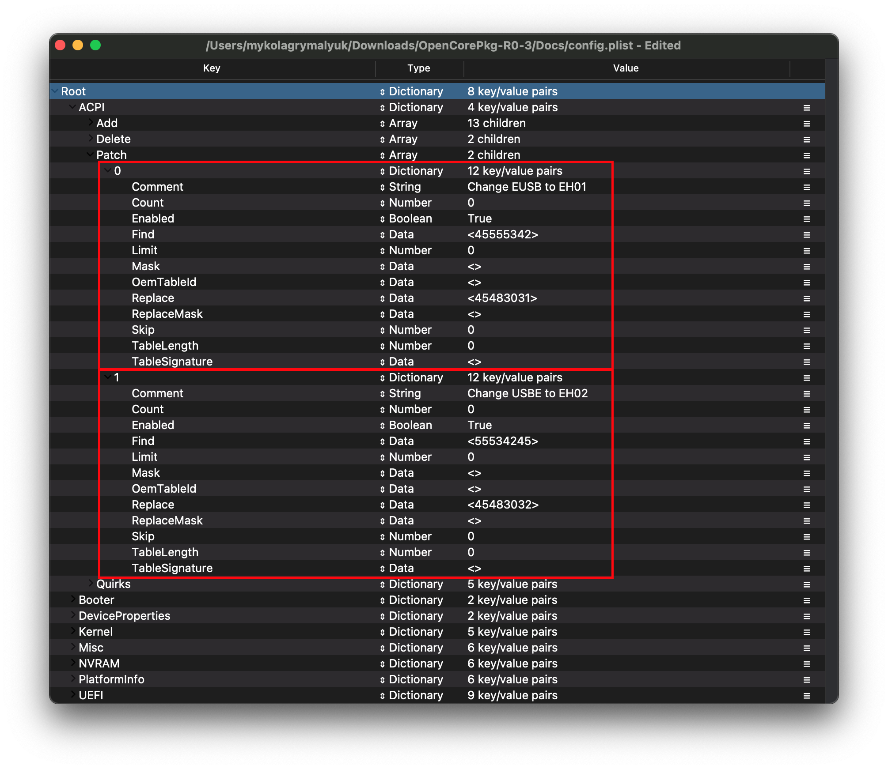

# Sandy and Ivy Bridge-E(HEDT and server)

**Overall**:

* Follow Haswell setup for most config options
  * [Haswell-E](../../config-HEDT/haswell-e.md)
* May need to use [DuetPkg](../../extras/legacy.md) as most Sandy and Ivy Bridge-E motherboards do not support UEFI
* Mavericks(10.9) through Big Sur(11) are officially supported

**ACPI**:

* Use SSDT-EC instead of SSDT-EC-USBX
* May require [IRQ patching](https://dortania.github.io/Getting-Started-With-ACPI/Universal/irq.html)
* May need USB fixes(Under ACPI -> Patch):

EUSB Patch:

| Comment | String | Change EUSB to EH01 |
| :--- | :--- | :--- |
| Enabled | Boolean | YES |
| Count | Number | 0 |
| Limit | Number | 0 |
| Find | Data | 45555342 |
| Replace | Data | 45483031 |

USBE Patch:

| Comment | String | Change USBE to EH02 |
| :--- | :--- | :--- |
| Enabled | Boolean | YES |
| Count | Number | 0 |
| Limit | Number | 0 |
| Find | Data | 55534245 |
| Replace | Data | 45483032 |

Example of what the USB patches should look like:

**Kernel**:

* Ignore the `Emulate` section as the CPUs are properly supported

**SMBIOS**:

* MacPro6,1
