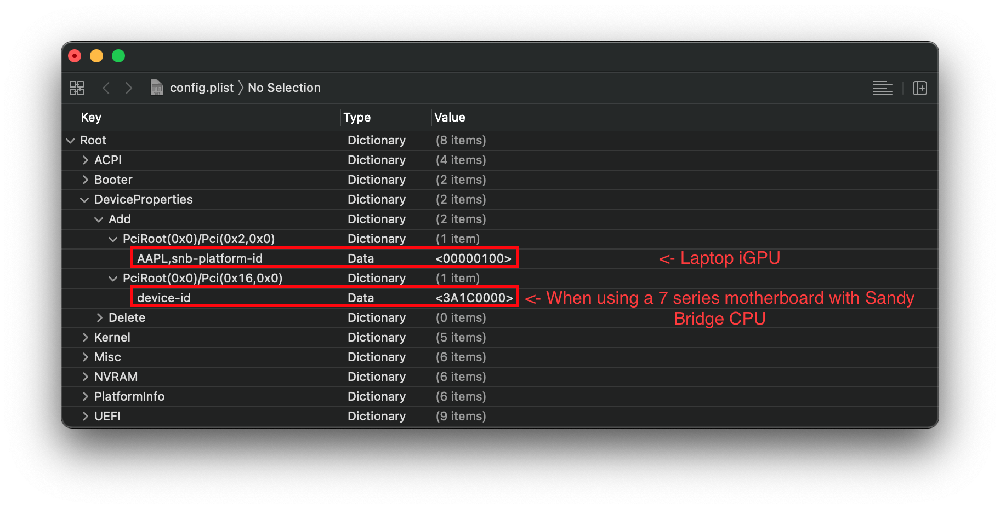

# Sandy Bridge(Second Gen i-series)

Actually almost identical to an Ivy Bridge hack, the main things that need to be changed:

**Overall**:

* Follow Ivy Bridge setup for most config options:
  * [Desktop Ivy Bridge](../../config.plist/ivy-bridge.md)
  * [Laptop Ivy Bridge](../../config-laptop.plist/ivy-bridge.md)
* Must use [DuetPkg](../../extras/legacy.md) as most Sandy Bridge motherboards do not support UEFI
* Mountain Lion(10.8) through High Sierra(10.13) are supported
  * This is due to Lilu requiring 10.8 as minimum to operate
  * macOS Mojave(10.14) through Big Sur(11) is possible with iGPU disabled

**ACPI**

* IMEI will need to be faked if running Sandy Bridge CPU on an Ivy Bridge based chipset(B75, Q75, Q77, H77, Z75, Z77)
  * [SSDT-IMEI](https://github.com/acidanthera/OpenCorePkg/blob/master/Docs/AcpiSamples/SSDT-IMEI.dsl)

**DeviceProperties**:

* Under `PciRoot(0x0)/Pci(0x2,0x0)`, use `AAPL,snb-platform-id` instead of `AAPL,ig-platform-id`
  * Desktop iGPU only(HD 3000 only):
    * `AAPL,snb-platform-id | Data | 10000300`
    * `device-id | Data | 26010000`
  * Desktop iGPU + dGPU(HD 2000/3000):
    * `AAPL,snb-platform-id | Data | 00000500`
    * `device-id | Data | 26010000`
  * Laptop iGPU(HD 3000 only):
    * `AAPL,snb-platform-id | Data | 00000100`

* Under `PciRoot(0x0)/Pci(0x16,0x0)`
  * `device-id | Data | 3A1C0000`
    * This is only required when using the SSDT-IMEI, see above if you need it.
* For Mojave and newer, iGPU must be disabled

Example of config.plist for Sandy Bridge DeviceProperties setup:

| Desktop iGPU only | Desktop dGPU + Headless iGPU | Laptop iGPU |
| :--- | :--- | :--- |
|  |  |  |

**SMBIOS**:

* Desktop:
  * iMac12,1 or iMac12,2 for Lion (10.7) to High Sierra(10.13)
  * iMac13,2 for Mojave(10.14) and Catalina(10.15)
  * iMac14,4 for Big Sur(11)
* Laptop(Lion(10.7) to High Sierra(10.13)):
  * MacBookAir4,1(dual core, 17w, 11")
  * MacBookAir4,2(dual core, 17w, 13")
  * MacBookPro8,1(dual core, 35w, 13")
  * MacBookPro8,2(quad core, 45w, 15")
  * MacBookPro8,3(quad core, 45w, 15")
