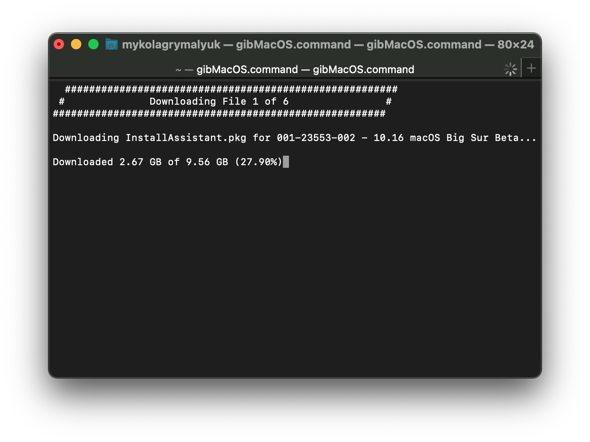
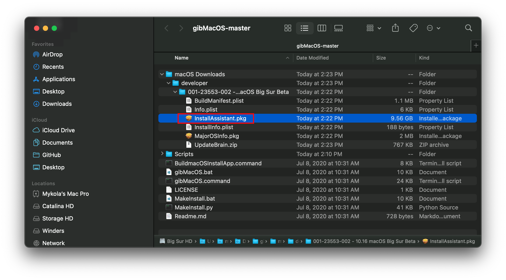
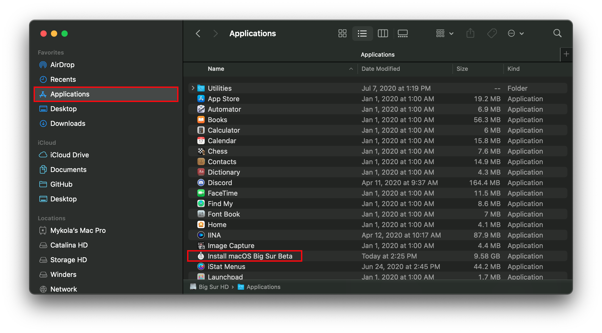
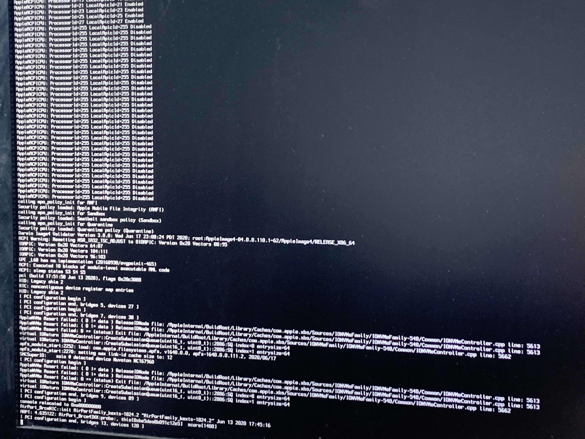

# OpenCore and macOS 11: Big Sur

It's that time of year again and with it, and a new macOS beta has been dropped. Here's all the info you need to get started.

**Reminder that Dortania and any tools mentioned in this guide are neither responsible for any corruption, data loss, or other ill effects that may arise from this guide, including ones caused by typos. You, the end user, must understand this is beta software on unsupported machines so do not pester developers for fixes. Dortania will not be accepting issues regarding this mini-guide except for typos and/or errors.**

**This guide expects you to have a basic understanding of hackintoshing. If you are not familiar with it, we highly recommend you to wait until there is an easier and more straight-forward solution available.**

## Backstory

More a mini-explainer as to why this release is a bit more painful than average macOS releases, the main culprits are as follows:

### `AvoidRuntimeDefrag`

With macOS Big Sur, the `AvoidRuntimeDefrag` Booter quirk in OpenCore broke. Because of this, the macOS kernel will fall flat when trying to boot. Reason for this is due to `cpi_count_enabled_logical_processors` requiring the MADT (APIC) table, and so OpenCore will now copy this table and ensure the kernel can access it. Users will however need a build of OpenCore 0.6.0 with commit [`bb12f5f`](https://github.com/acidanthera/OpenCorePkg/commit/9f59339e7eb8c213e84551df0fdbf9905cd98ca4) or newer to resolve this issue.

### Kernel Collections vs prelinkedkernel

Since 10.7, the prelinkedkernel has been the default way for real macs to boot. This contained a very minimal amount of kexts to get a mac booted. This same bundle is what OpenCore uses to inject kexts, and was hoped to last quite some time. With macOS Big Sur, a huge change happened in where Apple no longer makes it the default form of booting.

Due to the hard work of [@acidanthera](https://github.com/acidanthera), OpenCore gained experimental support for this new format in roughly 2 weeks, and we can now attempt to boot Big Sur on our hackintoshes without a Mac or VM - although you will likely run into some issues along the way.

## Prerequisites

Before we can jump head first into installing Big Sur, we need to go over a few things:

### A supported SMBIOS

Big Sur dropped a few Ivy Bridge and Haswell based SMBIOS from macOS, so see below that yours wasn't dropped:

* iMac14,3 and older
  * Note iMac14,4 is still supported
* MacPro5,1 and older
* MacMini6,x and older
* MacBook7,1 and older
* MacBookAir5,x and older
* MacBookPro10,x and older

If your SMBIOS was supported in Catalina and isn't included above, you're good to go!

### Supported hardware

Not much hardware has been dropped, though the few that have:

* Ivy Bridge CPUs.
  * Unofficially, many have been able to boot with ease.
* Ivy Bridge iGPUs.
  * HD 4000 and HD 2500, initial developer beta forgot to remove drivers but more than likely to be removed in later updates.
* BCM94331CD based Wifi cards.
  * See [Wireless Buyers guide](https://dortania.github.io/Wireless-Buyers-Guide/) for potential cards to upgrade to.

Also note that AMD OSX has updated their patches, but they are experimental and unsupported and you will not obtain support for them.

### Up-to-date kexts, bootloader and config.plist

Ensure you've updated to the latest builds (not releases) of OpenCore and all your kexts, as to avoid any odd incompatibility issues. You can find the latest builds of kexts and OpenCore here:

* [Kext Repo](http://kexts.goldfish64.com/)
* [Driver Repo (contains OpenCore builds too)](http://drivers.goldfish64.com/).

You will also need to ensure you have a few NVRAM variables set:

* **`NVRAM` -> `Add` -> `7C436110-AB2A-4BBB-A880-FE41995C9F82`**:
  * `boot-args`:
    * `-lilubetaall` (Enables Lilu and plugins on beta macOS versions)
      * Newest builds of Lilu and plugins do not require this boot-arg
    * `vsmcgen=1` (works around VirtualSMC, or more specifically Lilu, not properly working in Big Sur)
    * `-disablegfxfirmware` (Works around WhateverGreen failing, **iGPUs only**.
      * Newer builds of WhateverGreen should fix this (v1.4.1)

### Known issues

With Big Sur, quite a bit broke. Mainly the following:

* Lilu
  * Mainly user-space patching has severely broke, meaning certain patches like DRM don't work
  * Kernel-space should be working correctly with v1.4.6
* VirtualSMC
  * Some users may notice that even with `vsmcgen=1` in boot-args, you'll still have VirtualSMC failing. To work around this, you may need to use FakeSMC till vSMC and Lilu issues are resolved.
* Battery status
  * Currently RehabMan's [ACPIBatteryManager](https://bitbucket.org/RehabMan/os-x-acpi-battery-driver/downloads/) is the only working kext for battery status.
  * You can set `MaxKernel` for SMCBatteryManager to `19.99.99` and `MinKernel` for ACPIBatteryManager to `20.0.0` to use SMCBatteryManager for Catalina and below and ACPIBatteryManager for Big Sur (and above).
* AirportBrcmFixup
  * Forcing a specific driver to load with `brcmfx-driver=` may help
  * BCM94352Z users for example may need `brcmfx-driver=2` in boot-args to resolve this, other chipsets will need other variables.
* Intel HEDT hackintoshes failing to boot
  * This is due to Asus and many other OEMs excluding certain regions from your RTC device, to resolve this we can create a new RTC device with the proper regions.
  * OpenCorePkg includes a sample SSDT that goes in-depth: [SSDT-RTC0-RANGE.dsl](https://github.com/acidanthera/OpenCorePkg/blob/master/Docs/AcpiSamples/SSDT-RTC0-RANGE.dsl)

And while not an issue, SIP has now gained a new bit so to properly disable SIP you need to set `csr-active-config` to `FF0F0000`. See here for more info: [Disabling SIP](../../troubleshooting/troubleshooting.md#disabling-sip)

## Installation

With installation, you'll need a few things:

* macOS Big Sur installer
* 12GB+ USB drive
* A Mac, hack, or pre-existing VM to download the installer and create install media
* Latest builds of OpenCore and kexts (see above)

### Grabbing the installer

To grab the Big Sur installer, download the beta profile from Apple's developer portal, then check for updates in System Preferences. If you don't have a developer account, you can use gibMacOS to download it:

Download [gibMacOS](https://github.com/corpnewt/gibMacOS) and open `gibMacOS.command`:


Press `M` to change the Max OS, then enter `10.16` to switch the (update) catalog to the Big Sur one.


Press `C` to change the catalog, then select the number for the developer catalog.


Select the number for the Big Sur beta to start downloading it. (screenshot)



Once finished, open the InstallAssistant.pkg that was downloaded - it will be located in the `gibMacOS/macOS

Downloads/developer/XXX-XXXXX - Install macOS Beta`folder. This package from Apple will create`Install macOS Big Sur Beta.app`in your`/Applications` folder.



Run the InstallAssistant.pkg and point this to whichever drive you're booting off of, this is where the Install.app will be dropped:


Once done, you should find it located in your Applications folder:



### Creating the installer

To create the USB is quite simple, grab your USB drive and open Disk Utility in macOS. Next format as the following:

* Name:   MyVolume
* Format: macOS Journaled
* Scheme: GUID Partition Map


Once this is done, run the following command:

```
sudo /Applications/Install\ macOS\ Big\ Sur\ Beta.app/Contents/Resources/createinstallmedia --volume /Volumes/MyVolume
```

This will take some time so may want to grab a coffee, once done your USB should be good to boot!(Assuming you updated OpenCore and co earlier)

### Installing

Installing macOS 11: Big Sur on a Hackintosh is fairly similar to how previous version of macOS were installed, with the main issues being:

* KernelCollections over prelinkedkernel (discussed above)
* Installation being much longer
  * This is due to the new snapshot feature of the OS
* Certain kexts breaking
  * Mainly Lilu and plugins, though quite obvious when they break
  
For the last one, if you get a kernel panic with Lilu we highly recommend you to update to the latest version with links we provided above. If errors are still not resolved, you may need to disable Lilu outright.

#### Stuck at `Forcing CS_RUNTIME for entitlement`


This is actually the part at where macOS will seal the system volume, and where it may seem that macOS has gotten stuck. **DO NOT RESTART** thinking you're stuck, this will take quite some time to complete.

#### Stuck at `PCI Configuration Begins` for Intel's HEDT boards



As previously mentioned, Intel HEDT motherboards may have some issues revolving around their RTC device in ACPI. To resolve, you'll need to look at your RTC device and see which regions are missing. For more information, see here: [SSDT-RTC0-RANGE.dsl](https://github.com/acidanthera/OpenCorePkg/blob/master/Docs/AcpiSamples/SSDT-RTC0-RANGE.dsl)

#### Stuck on `ramrod`(^^^^^^^^^^^^^)


If you get stuck around the `ramrod` section (specifically, it boots, hits this error, and reboots again back into this, causing a loop), this hints that your SMC emulator is broken. To fix this, you have 2 options:

* Ensure you're using the latest builds of VirtualSMC and Lilu, with the `vsmcgen=1` boot-arg
* Switch over to [Rehabman's FakeSMC](https://bitbucket.org/RehabMan/os-x-fakesmc-kozlek/downloads/) (you can use the `MinKernel`/`MaxKernel` trick mentioned above to restrict FakeSMC to Big Sur and up

And when switching kexts, ensure you don't have both FakeSMC and VirtualSMC enabled in your config.plist, as this will cause a conflict.

#### Some kexts may not be compatible with Big Sur yet

There are a lot of kexts out there, and Big Sur is still pretty new. Not all kexts are working yet, so if you're experiencing a weird kernel panic, one thing you can try is booting with only the essential kexts (Lilu, VirtualSMC/FakeSMC, WhateverGreen) and seeing if it works. If so, you can enable kexts one by one to try to narrow down the issue.

## Virtual Machine Route

If you're still facing issues, or if with a new beta things break, you can try the virtual machine route to install on a disk and then transfer it over to your hack. Follow the following instructions to build install media and then install in a hypervisor.

Note: If you have an AMD CPU, this method isn't going to work.

### Building the Installation Media

Requirements:

* A computer or VM running macOS
* The desired macOS installation software installed to /Applications

Once you have the installation software installed to /Applications you will need to create a VDI of the installation media that will be used to install macOS in your VM. The instructions below are intended to be cut and pasted without editing unless specified.

First, set the IMAGE variable to the name of the installation you are installing. The example defines the image for Big Sur.

```bash
export IMAGE="Install macOS Big Sur Beta"
```

Next, create an empty 16GB image to host the media.

```bash
mkfile -n 16g "${IMAGE}.img"
```

Verify that you have a 16GB file named "Install macOS Beta.img" before continuing.  After that, attach it to your macOS system as a virtual disk using the variable you created earlier.

```bash
export DISK=$(hdiutil attach -imagekey diskimage-class=CRawDiskImage -nomount "${IMAGE}.img"| awk '{printf $1}')
```

Run diskutil list and verify that you have a disk attached that is type "disk image".

```bash
diskutil list
<snip>
/dev/disk4 (disk image):
   #:                       TYPE NAME                    SIZE       IDENTIFIER
   0:                                                   +16.8 GB    disk4
```

Now that the image is mounted, format it to Journaled HFS+.

```bash
diskutil eraseDisk JHFS+ "${IMAGE}" ${DISK}
```

Once the image is formatted, create the installation media.

```bash
sudo "/Applications/${IMAGE}.app/Contents/Resources/createinstallmedia" --nointeraction --volume "/Volumes/${IMAGE}"
```

Now detach or eject the virtual disk.

```bash
### Eject all of the sub volumes first.
for VDISK in $(hdiutil info 2>&1 | awk '/disk[0-9]/ {print $1}'); do hdiutil eject ${VDISK} 2>/dev/null; done
### Next eject the virtual disk itself
hdiutil eject ${DISK}
```

You now have a raw image of the installer. Follow the appropriate page for the hypervisor you'll be choosing:

* [VirtualBox](virtualbox.md)
* [VMware Fusion](fusion.md)
