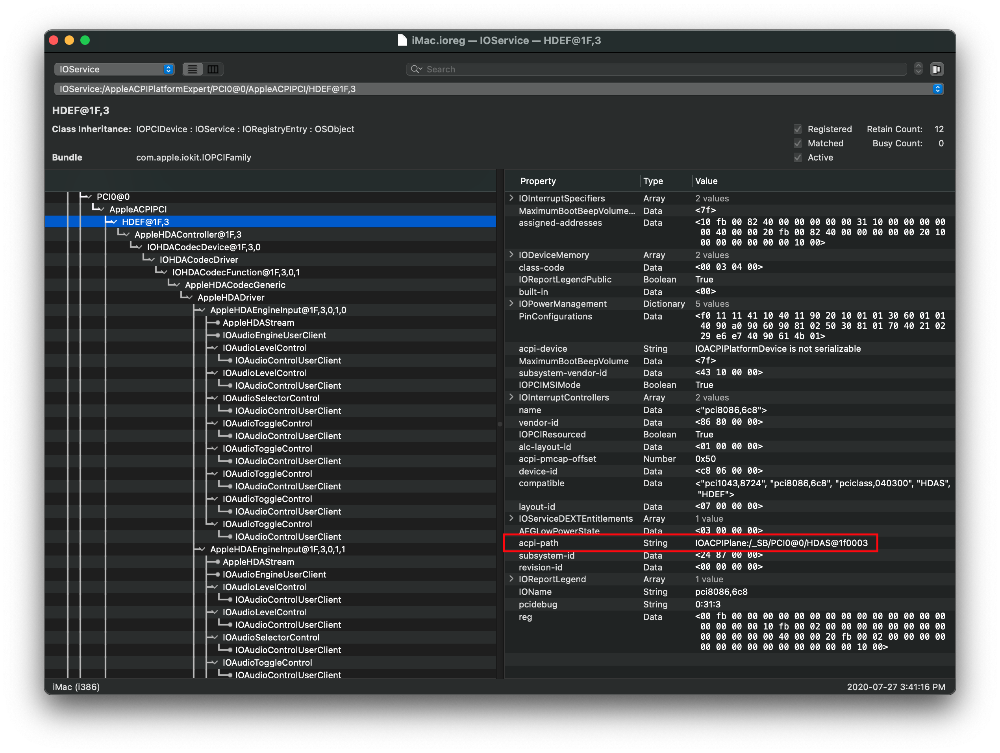
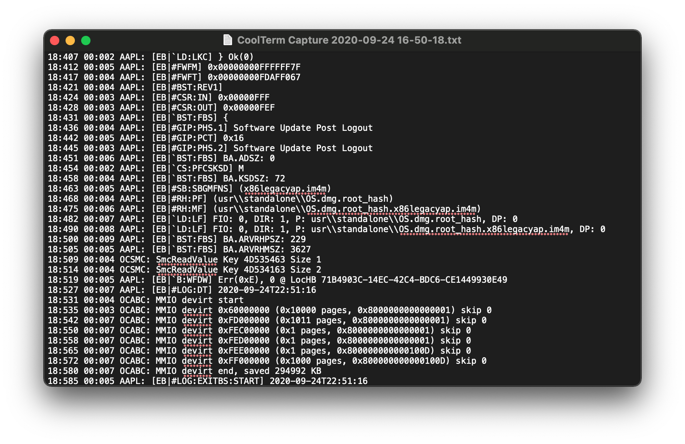

# OpenCore and macOS 11: Big Sur

It's that time of year again and with it, and a new macOS beta has been dropped. Here's all the info you need to get started.

::: tip Reminder

**Dortania and any tools mentioned in this guide are neither responsible for any corruption, data loss, or other ill effects that may arise from this guide, including ones caused by typos. You, the end user, must understand this is beta software on unsupported machines so do not pester developers for fixes. Dortania will not be accepting issues regarding this mini-guide except for typos and/or errors.**

**This guide expects you to have a basic understanding of hackintoshing. If you are not familiar with it, we highly recommend you to wait until Big Sur has been officially released with proper documentation.**

:::

**Note**: macOS 11, Big Sur will require macOS already installed on some machine to create the installer. Windows and Linux users will need to use a macOS VM to create the installer, this is due to the re-architecting of the software catalog

## Table of Contents

* [Backstory](#backstory)
* [Prerequisites](#prerequisites)
  * [A supported SMBIOS](#a-supported-smbios)
  * [Supported hardware](#supported-hardware)
  * [Up-to-date kexts, bootloader and config.plist](#up-to-date-kexts-bootloader-and-config-plist)
  * [Known issues](#known-issues)
* [Installation](#installation)
  * [Grabbing the installer](#grabbing-the-installer)
  * [Creating the installer](#creating-the-installer)
  * [Installing](#installing)
* [Troubleshooting](#troubleshooting)
  * [Stuck at Forcing CS_RUNTIME for entitlement](#stuck-at-forcing-cs-runtime-for-entitlement)
  * [Stuck at PCI Configuration Begins for Intel's X99 and X299 boards](#stuck-at-pci-configuration-begins-for-intel-s-x99-and-x299-boards)
  * [Stuck on ramrod(^^^^^^^^^^^^^)](##stuck-on-ramrod)
  * [X99 Kernel Panic on IOPCIFamily](#x99-kernel-panic-on-iopcifamily)
  * [DeviceProperties injection failing](#deviceproperties-injection-failing)
  * [Keyboard and Mouse broken](#keyboard-and-mouse-broken)
  * [Early Kernel Panic on max_cpus_from_firmware not yet initialized](#early-kernel-panic-on-max-cpus-from-firmware-not-yet-initialized)
  * [Cannot update to newer versions of Big Sur](#cannot-update-to-newer-versions-of-big-sur)
  * [Kernel Panic on Rooting from the live fs](#kernel-panic-on-rooting-from-the-live-fs)

## Backstory

More a mini-explainer as to why this release is a bit more painful than average macOS releases, the main culprits are as follows:

* AvoidRuntimeDefrag
* Kernel Collections vs prelinkedkernel

::: details AvoidRuntimeDefrag issues

### AvoidRuntimeDefrag

With macOS Big Sur, the `AvoidRuntimeDefrag` Booter quirk in OpenCore broke. Because of this, the macOS kernel will fall flat when trying to boot. Reason for this is due to `cpu_count_enabled_logical_processors` requiring the MADT (APIC) table, and so OpenCore will now ensure this table is made accessible to the kernel. This was resolved in 0.6.0 with commit [`bb12f5f`](https://github.com/acidanthera/OpenCorePkg/commit/9f59339e7eb8c213e84551df0fdbf9905cd98ca4)

Note for certain Core2 Duo machines(ex. HP DC7900), you may still get a kernel panic with AvoidRuntimeDefrag enabled. For these odd legacy machine, see here: [Early Kernel Panic on `max_cpus_from_firmware not yet initialized`](#early-kernel-panic-on-max-cpus-from-firmware-not-yet-initialized)

:::

::: details Kernel Collections vs prelinkedkernel

### Kernel Collections vs prelinkedkernel

Since 10.7, the prelinkedkernel has been the default way for real macs to boot. This contained a very minimal amount of kexts to get a mac booted. This same bundle is what OpenCore uses to inject kexts, and was hoped to last quite some time. With macOS Big Sur, a huge change happened in where Apple no longer makes it the default form of booting.

Due to the hard work of [@acidanthera](https://github.com/acidanthera), OpenCore gained experimental support for this new format in roughly 2 weeks (starting with OpenCore 0.6.0), and we can now attempt to boot Big Sur on our hackintoshes without a Mac or VM - although you will likely run into some issues along the way.

:::

## Prerequisites

Before we can jump head first into installing Big Sur, we need to go over a few things:

### A supported SMBIOS

Big Sur dropped a few Ivy Bridge and Haswell based SMBIOS from macOS, so see below that yours wasn't dropped:

* iMac14,3 and older
  * Note iMac14,4 is still supported
* MacPro5,1 and older
* MacMini6,x and older
* MacBook7,1 and older
* MacBookAir5,x and older
* MacBookPro10,x and older

If your SMBIOS was supported in Catalina and isn't included above, you're good to go!

::: details Supported SMBIOS

SMBIOS still supported in macOS Big Sur:

* iMac14,4 and newer
* MacPro6,1 and newer
* iMacPro1,1 and newer
* MacMini7,1 and newer
* MacBook8,1 and newer
* MacBookAir6,x and newer
* MacBookPro11,x and newer

For full list of supported SMBIOS including OS support, see here: [Choosing the right SMBIOS](../smbios-support.md)

:::

For those wanting a simple translation for their Machines:

* iMac13,1 should transition over to using iMac14,4
* iMac13,2 should transition over to using iMac15,1
* iMac14,2 and iMac14,3 should transition over to using iMac15,1
  * Note: AMD CPU users with Nvidia GPUs may find MacPro7,1 more suitable
* iMac14,1 should transition over to iMac14,4

### Supported hardware

Not much hardware has been dropped, though the few that have:

* Official Ivy Bridge U, H and S CPUs.
  * These CPUs will still boot without much issue, but note that no Macs are supported with consumer Ivy Bridge in Big Sur.
  * Ivy Bridge-E CPUs are still supported thanks to being in MacPro6,1
* Ivy Bridge iGPUs slated for removal
  * HD 4000 and HD 2500, however currently these drivers are still present in 11.0.1
* BCM4331 and BCM43224 based Wifi cards.
  * See [Wireless Buyers guide](https://dortania.github.io/Wireless-Buyers-Guide/) for potential cards to upgrade to.
  * Potential work-around is to inject a patched IO80211Family, see here for more details: [IO80211 Patches](https://github.com/khronokernel/IO80211-Patches)
* Certain SATA controllers dropped
  * For some reason, Apple removed the AppleIntelPchSeriesAHCI class from AppleAHCIPort.kext. Due to the outright removal of the class, trying to spoof to another ID (generally done by SATA-unsupported.kext) can fail for many and create instability for others.
  * A partial fix is to block Big Sur's AppleAHCIPort.kext and inject Catalina's version with any conflicting symbols being patched. You can find a sample kext here: [Catalina's patched AppleAHCIPort.kext](https://github.com/dortania/OpenCore-Install-Guide/blob/master/extra-files/CtlnaAHCIPort.kext.zip)
  * This will work in both Catalina and Big Sur so you can remove SATA-unsupported if you want. However we recommend setting the MinKernel value to 20.0.0 to avoid any potential issues.

Other notable changes:

* MSI Navi users no longer require the `ATY,rom`/`-wegnoegpu` patch to boot the installer

### Up-to-date kexts, bootloader and config.plist

Ensure that you have the latest version of OpenCore, kexts and config.plist so it won't have any odd compatibility issues. With beta 10, OpenCore 0.6.3 is required for optimal booting, this will need to be either manually compiled or grabbed from our build-repo:

* [Dortania's Build Repo](https://dortania.github.io/builds/)

If you're unsure what version of OpenCore you're using, you can run the following in terminal:

```sh
nvram 4D1FDA02-38C7-4A6A-9CC6-4BCCA8B30102:opencore-version
```

* Note: The about command will require you to include bit `0x2` in `Misc -> Security -> ExposeSensitiveData`, recommended values for ExposeSensitiveData is `0x6` which includes bits `0x2` and `0x4`.

* Note 2: Beta 10+ will now kernel panic with SecureBootModel, to avoid this you'll need OpenCore 0.6.3+
  * Specifically commit [ba10b5d](https://github.com/acidanthera/OpenCorePkg/commit/1b0041493d4693f9505aa6415d93079ea59f7ab0) or newer

#### AMD Note

**Reminder for AMD Users**: Don't forget to update your kernel patches with those provided by AMD OS X, otherwise you'll be unable to boot Big Sur:

* [Experimental Patches](https://github.com/AMD-OSX/AMD_Vanilla/tree/experimental-opencore)

#### Intel HEDT Note

For X79, X99 and X299 users, pay close attention to the below. Big Sur has added new requirements for ACPI, so you'll need to grab some new SSDTs:

* X79
  * [SSDT-UNC](https://github.com/acidanthera/OpenCorePkg/blob/master/Docs/AcpiSamples/SSDT-UNC.dsl)
* X99
  * [SSDT-UNC](https://github.com/acidanthera/OpenCorePkg/blob/master/Docs/AcpiSamples/SSDT-UNC.dsl)
  * [SSDT-RTC0-RANGE](https://github.com/acidanthera/OpenCorePkg/blob/master/Docs/AcpiSamples/SSDT-RTC0-RANGE.dsl)
* X299
  * [SSDT-RTC0-RANGE](https://github.com/acidanthera/OpenCorePkg/blob/master/Docs/AcpiSamples/SSDT-RTC0-RANGE.dsl)

For those who'd like precompiled files, see here:

* [Getting started with ACPI: Prebuilt SSDTs](https://dortania.github.io/Getting-Started-With-ACPI/ssdt-methods/ssdt-prebuilt.html)

### Known issues

With Big Sur, quite a bit broke. Mainly the following:

* Lilu
  * Mainly user-space patching has severely broke, meaning certain functionality may have broken
  * These include:
    * DiskArbitrationFixup
    * MacProMemoryNotificationDisabler
    * SidecarEnabler
    * SystemProfilerMemoryFixup
    * NoTouchID
    * WhateverGreen's DRM and -cdfon patches
* AirportBrcmFixup
  * Forcing a specific driver to load with `brcmfx-driver=` may help
    * BCM94352Z users for example may need `brcmfx-driver=2` in boot-args to resolve this, other chipsets will need other variables.
  * Setting MaxKernel to 19.9.9 for AirPortBrcm4360_Injector.kext may help. More information [from the repo](https://github.com/acidanthera/AirportBrcmFixup/blob/master/README.md#please-pay-attention)
* SATA Support broken
  * Due to Apple dropping the AppleIntelPchSeriesAHCI class in AppleAHCIPort.kext
  * To resolve, add [Catalina's patched AppleAHCIPort.kext](https://github.com/dortania/OpenCore-Install-Guide/blob/master/extra-files/CtlnaAHCIPort.kext.zip) with the MinKernel set to 20.0.0

And while not an issue, SIP has now gained a new bit so to properly disable SIP you need to set `csr-active-config` to `FF0F0000`. See here for more info: [Disabling SIP](../../troubleshooting/extended/post-issues.md#disabling-sip)

## Installation

For the installation, you'll need a few things:

* macOS Big Sur installer
* 12GB+ USB drive
* A Mac, hack, or pre-existing VM to download the installer and create install media
* Latest builds of OpenCore and kexts (see above)

### Grabbing the installer

To grab the Big Sur installer, download the beta profile from Apple's developer portal or the Apple's public beta profile, then check for updates in System Preferences. If you don't have a developer account and want to use the developer beta, you can use gibMacOS to download it:

Download [gibMacOS](https://github.com/corpnewt/gibMacOS) and open `gibMacOS.command`:


Press `M` to change the Max OS, then enter `10.16` to switch the (update) catalog to the Big Sur one.


Press `C` to change the catalog, then select the number for the developer (for developer beta) or catalog.


Select the number for the Big Sur beta to start downloading it.


Once finished, open the InstallAssistant.pkg that was downloaded - it will be located in the `gibMacOS/macOS Downloads/developer/XXX-XXXXX - Install macOS Beta` folder. This package from Apple will create `Install macOS Big Sur Beta.app` in your `/Applications` folder.


Run the InstallAssistant.pkg and point this to whichever drive you're booting off of, this is where the Install.app will be dropped:


Once done, you should find it located in your Applications folder:


### Creating the installer

To create the USB is quite simple, grab your USB drive and open Disk Utility in macOS. Next format as follows:

* Name:   MyVolume
* Format: macOS Journaled
* Scheme: GUID Partition Map


Once this is done, run the following command:

```
sudo /Applications/Install\ macOS\ Big\ Sur.app/Contents/Resources/createinstallmedia --volume /Volumes/MyVolume
```

This will take some time so you may want to grab a coffee, once done your USB should be good to boot! (Assuming you've finished setting up your new EFI)

### Installing

Installing macOS 11: Big Sur on a Hackintosh is fairly similar to how previous version of macOS were installed, with the main issues being:

* KernelCollections over prelinkedkernel (discussed above)
* Installation being much longer
  * This is due to the new snapshot feature of the OS
* Certain kexts and patches breaking
  * Mainly Lilu and plugins, though quite obvious when they break

For the last one, if you get a kernel panic with Lilu we highly recommend you to update to the latest version with links we provided above. If errors are still not resolved, you may need to disable Lilu outright (so that means you have to remove or disable all kexts that relies on Lilu and replace them with Lilu-independent ones).

## Troubleshooting

### Stuck at `Forcing CS_RUNTIME for entitlement`


This is actually the part at where macOS will seal the system volume, and where it may seem that macOS has gotten stuck. **DO NOT RESTART** thinking you're stuck, this will take quite some time to complete, otherwise you'll break your installation.

### Stuck at `PCI Configuration Begins` for Intel's X99 and X299 boards


As previously mentioned, Intel HEDT motherboards may have some issues revolving around their RTC device in ACPI. To resolve, you'll need to look at your RTC device and see which regions are missing. For more information, see here: [SSDT-RTC0-RANGE.dsl](https://github.com/acidanthera/OpenCorePkg/blob/master/Docs/AcpiSamples/SSDT-RTC0-RANGE.dsl)

### Stuck on `ramrod`(^^^^^^^^^^^^^)


If you get stuck around the `ramrod` section (specifically, it boots, hits this error, and reboots again back into this, causing a loop), this hints that your SMC emulator is broken. To fix this, you have 2 options:

* Ensure you're using the latest builds of VirtualSMC and Lilu, with the `vsmcgen=1` boot-arg
* Switch over to [Rehabman's FakeSMC](https://bitbucket.org/RehabMan/os-x-fakesmc-kozlek/downloads/) (you can use the `MinKernel`/`MaxKernel` trick mentioned above to restrict FakeSMC to Big Sur and up

And when switching kexts, ensure you don't have both FakeSMC and VirtualSMC enabled in your config.plist, as this will cause a conflict.

### X99 Kernel Panic on IOPCIFamily

This is due to an unused uncore PCI Bridges being enabled in ACPI, and so IOPCIFamily will kernel panic when probing unknown devices. To resolve, you'll need to add [SSDT-UNC](https://github.com/acidanthera/OpenCorePkg/blob/master/Docs/AcpiSamples/SSDT-UNC.dsl) to your system

### DeviceProperties injection failing

With Big Sur, macOS has become much pickier with devices being present in ACPI. Especially if you're injecting important properties for WhateverGreen or AppleALC, you may find they're no longer applying. To verify whether your ACPI defines your hardware, check for the `acpi-path` property in [IORegistryExplorer](https://github.com/khronokernel/IORegistryClone/blob/master/ioreg-210.zip):



If no property is found, you'll need to create an SSDT that provides the full pathing as you likely have a PCI Bridge that is not documented in your ACPI tables. An example of this can be found here: [SSDT-BRG0](https://github.com/acidanthera/OpenCorePkg/blob/master/Docs/AcpiSamples/SSDT-BRG0.dsl)

* **Note**: This issue may also pop up in older versions of macOS, however Big Sur is most likely to have issues.

### Keyboard and Mouse broken

For certain legacy systems, you may notice that while the USB ports work your HID-based devices such as the keyboard and mouse may be broken. To resolve this, add the following patch:

::: details IOHIDFamily Patch

config.plist -> Kernel -> Patch:

| Key | Type | Value |
| :--- | :--- | :--- |
| Base | String | _isSingleUser |
| Count | Integer | 1 |
| Enabled | Boolean | True |
| Find | Data | |
| Identifier | String | com.apple.iokit.IOHIDFamily |
| Limit | Integer | 0 |
| Mask | Data | |
| MaxKernel | String | |
| MinKernel | String | 20.0.0 |
| Replace | Data | B801000000C3 |
| ReplaceMask | Data | |
| Skip | Integer | 0 |

[Source](https://applelife.ru/threads/ustanovka-macos-big-sur-11-0-beta-na-intel-pc-old.2944999/page-81#post-884400)

:::

### Early Kernel Panic on `max_cpus_from_firmware not yet initialized`

If you receive an early kernel panic on `max_cpus_from_firmware not yet initialized`, this is due to the new `acpi_count_enabled_logical_processors` method added in macOS Big Sur's kernel. To resolve, please ensure you're on OpenCore 0.6.0 or newer with the `AvoidRuntimeDefrag` Quirk enabled.

* **Note**: Due to how early this kernel panic happens, you may only be able to log it either via serial or rebooting in a known working install of macOS and checking your panic logged in NVRAM.
  * Most users will see this panic simply as `[EB|#LOG:EXITBS:START]`

::: details Example Kernel Panic

On-screen:



Via serial logging or NVRAM:


:::

::: details Legacy Edge Case

On certain hardware, mainly the HP DC7900, the kernel still can't determine exactly how many threads your hardware supports. This will result in the aforementioned kernel panic and so we need to hard code the CPU core's value.

To do this, Add the following patch(replacing the 04 from B8 **04** 00 00 00 C3 with the amount of CPU threads your hardware supports):

| Key | Type | Value |
| :--- | :--- | :--- |
| Base | String | _acpi_count_enabled_logical_processors |
| Count | Integer | 1 |
| Enabled | Boolean | True |
| Find | Data | |
| Identifier | String | Kernel |
| Limit | Integer | 0 |
| Mask | Data | |
| MaxKernel | String | |
| MinKernel | String | 20.0.0 |
| Replace | Data | B804000000C3 |
| ReplaceMask | Data | |
| Skip | Integer | 0 |

:::

### Cannot update to newer versions of Big Sur

Generally there's 2 main culprits:

* [Broken Update Utility](#broken-update-utility)
  * Most common error, try this first
* [Broken Seal](#broken-seal)

#### Broken Update Utility

Generally seen with every beta cycle, simply unenroll and enroll again:

```sh
# Unenroll from beta catalog
sudo /System/Library/PrivateFrameworks/Seeding.framework/Resources/seedutil unenroll
# Enroll back in
sudo /System/Library/PrivateFrameworks/Seeding.framework/Resources/seedutil enroll DeveloperSeed
```

Then check back with settings, and it should pop up. If not, run the following:

```sh
# List software updates via terminal
softwareupdate -l
```

This should help kick the update utility back into gear. If you still have issues, check the [Broken Seal](#broken-seal) section.

#### Broken Seal

With Apple's new snapshotting for the system drive, they now depend heavily on this for OS updates to apply correctly. So when a drove's seal is broken, macOS will refuse to update the drive.

To verify yourself, check that `Snapshot Sealed` returns as YES:

```bash
# List all APFS volumes
diskutil apfs list

# Look for your system volume
Volume disk1s8 A604D636-3C54-4CAA-9A31-5E1A460DC5C0
        ---------------------------------------------------
        APFS Volume Disk (Role):   disk1s8 (System)
        Name:                      Big Sur HD (Case-insensitive)
        Mount Point:               Not Mounted
        Capacity Consumed:         15113809920 B (15.1 GB)
        Sealed:                    Broken
        FileVault:                 No
        |
        Snapshot:                  4202EBE5-288B-4701-BA1E-B6EC8AD6397D
        Snapshot Disk:             disk1s8s1
        Snapshot Mount Point:      /
        Snapshot Sealed:           Yes
```

If it returns `Snapshot Sealed: Broken`, then you'll want to go through the following:

* Update to OpenCore 0.6.3 or newer
  * Specifically commit [ba10b5d](https://github.com/acidanthera/OpenCorePkg/commit/1b0041493d4693f9505aa6415d93079ea59f7ab0) or newer is required
* Revert to older snapshots
  * Mainly for those who have tampered with the system volume
  * See here how to revert: [Rolling back APFS Snapshots](../../troubleshooting/extended/post-issues.md#rolling-back-apfs-snapshot)

### Kernel Panic on `Rooting from the live fs`

Full error:

```
Rooting from the live fs of a sealed volume is not allowed on a RELEASE build
```

This is due to issues around Secure Boot boot being enabled in Beta 10 with older versions of OpenCore. Simply update to 0.6.3 to resolve

* Specifically commit [ba10b5d](https://github.com/acidanthera/OpenCorePkg/commit/1b0041493d4693f9505aa6415d93079ea59f7ab0) or newer is required

## Virtual Machine Route

If you're still facing issues, or if with a new beta things break, you can try the virtual machine route to install on a disk and then transfer it over to your hack. Follow the following instructions to build install media and then install in a hypervisor.

**Note**: If you have an AMD CPU, this method isn't going to work.

### Building the Installation Media

Requirements:

* A computer or VM running macOS
* The desired macOS installation software installed to /Applications

Once you have the installation software installed to /Applications you will need to create a VDI of the installation media that will be used to install macOS in your VM. The instructions below are intended to be cut and pasted without editing unless specified.

First, set the IMAGE variable to the name of the installation you are installing. The example defines the image for Big Sur.

```bash
export IMAGE="Install macOS Big Sur Beta"
```

Next, create an empty 16GB image to host the media.

```bash
mkfile -n 16g "${IMAGE}.img"
```

Verify that you have a 16GB file named "Install macOS Beta.img" before continuing.  After that, attach it to your macOS system as a virtual disk using the variable you created earlier.

```bash
export DISK=$(hdiutil attach -imagekey diskimage-class=CRawDiskImage -nomount "${IMAGE}.img"| awk '{printf $1}')
```

Run diskutil list and verify that you have a disk attached that is type "disk image".

```bash
diskutil list
<snip>
/dev/disk4 (disk image):
   #:                       TYPE NAME                    SIZE       IDENTIFIER
   0:                                                   +16.8 GB    disk4
```

Now that the image is mounted, format it to Journaled HFS+.

```bash
diskutil eraseDisk JHFS+ "${IMAGE}" ${DISK}
```

Once the image is formatted, create the installation media.

```bash
sudo "/Applications/${IMAGE}.app/Contents/Resources/createinstallmedia" --nointeraction --volume "/Volumes/${IMAGE}"
```

Now detach or eject the virtual disk.

```bash
### Eject all of the sub volumes first.
for VDISK in $(hdiutil info 2>&1 | awk '/disk[0-9]/ {print $1}'); do hdiutil eject ${VDISK} 2>/dev/null; done
### Next eject the virtual disk itself
hdiutil eject ${DISK}
```

You now have a raw image of the installer. Follow the appropriate page for the hypervisor you'll be choosing:

* [VirtualBox](virtualbox.md)
* [VMware Fusion](fusion.md)
