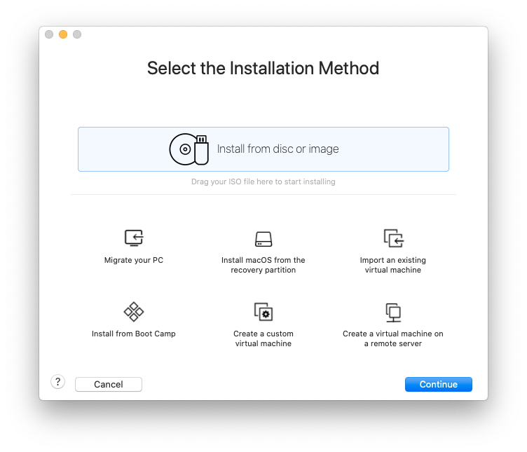
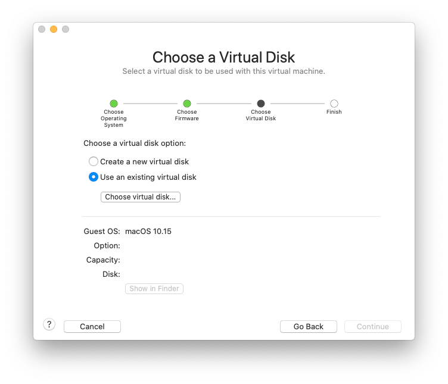
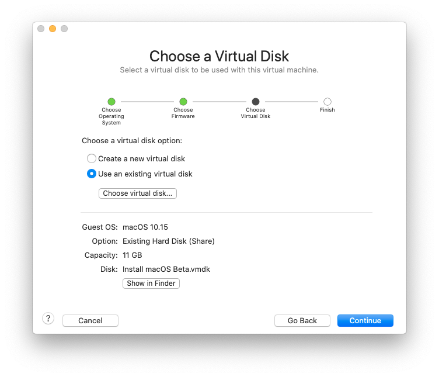
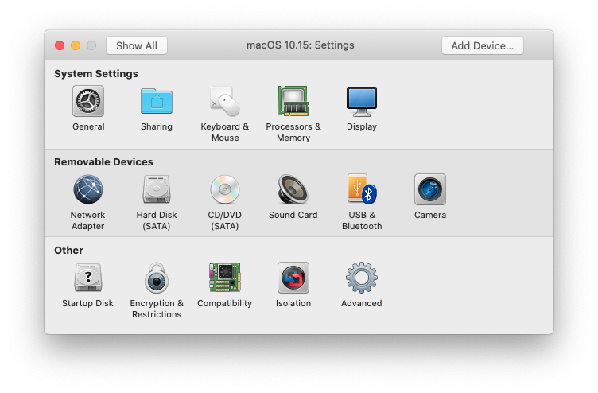
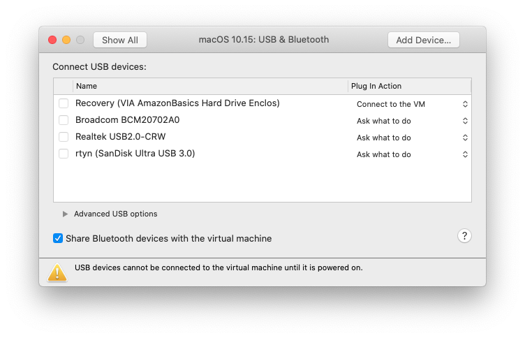
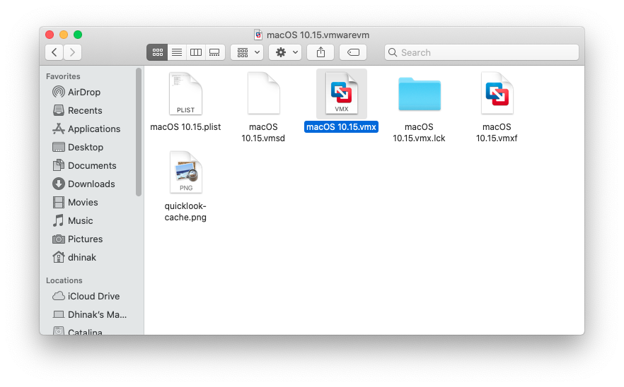
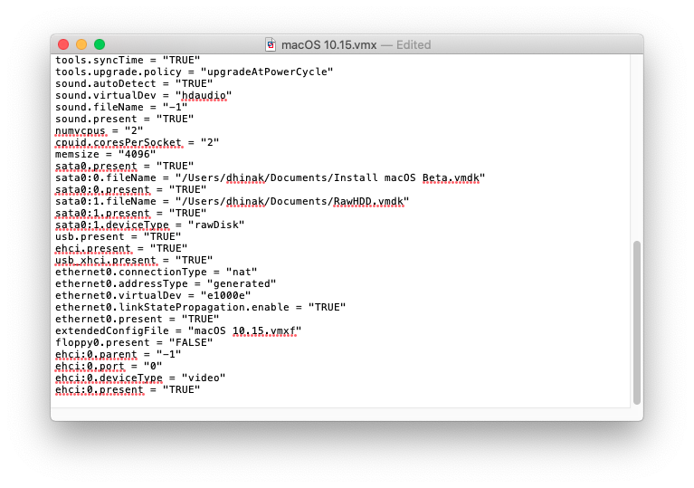
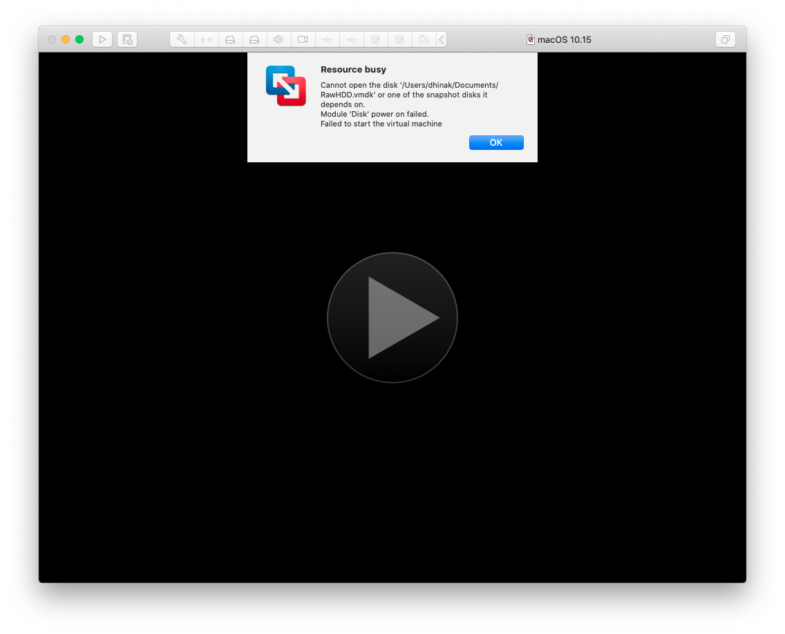
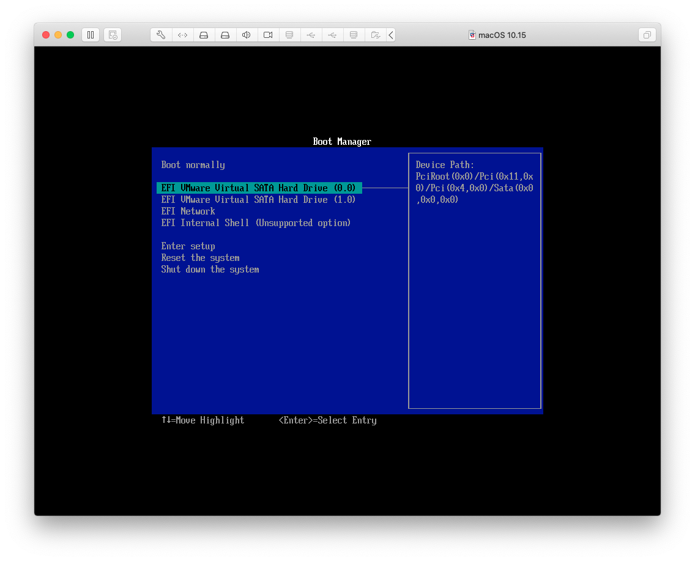

# VMware Fusion

## Requirements

* VMware Fusion
* Java (both the JRE and JDK work)
* A computer running macOS
* The desired macOS installation software installed to /Applications
* A USB attached hard disk or SSD, or an internal disk that can be passed through entirely

## Converting Installation Media

VMware cannot directly use a raw disk image, so we'll create a linked VMDK, which will allow you to use it as a virtual hard drive in VMware Fusion.

Download raw2vmdk from [here](../../extra-files/raw2vmdk.jar), and put it in the same directory as the `.img` file. Then, run the following command:

```bash
### Change "Install macOS Big Sur Beta" if the name of the .img file differs
java -jar raw2vmdk.jar "Install macOS Big Sur Beta.img" "Install macOS Big Sur Beta.vmdk"
```

This will create a VMDK that references the `.img` file (the raw disk image) for VMware to use. If you're going to move this vmdk or transfer it to another computer, you must move the img file along with it.

## Installing macOS Big Sur in VMware Fusion

You have two options here: pass through a raw disk, or pass through an entire USB device. The steps are not that different for both, so they'll be combined here.

1. (Skip this if you are doing USB passthrough) For raw disk passthrough, attach the disk that is your target for macOS installation, and  create a virtual hard disk that references it to use with Fusion.

    Note: You may need to remove the partitions of the disk before using it.

    ```bash
    diskutil list
    # locate the external disk that matches, and replace /dev/disk3 below with the device path.
    sudo /Applications/VMware\ Fusion.app/Contents/Library/vmware-rawdiskCreator create /dev/disk3 fullDevice RawHDD ide
    ```

2. Next, start VMware Fusion. You should see the homepage. If not, close any window that opened and select `File` > `New` from the menu bar.
    
3. Select the "Create a custom virtual machine" option, and select macOS 10.15 (as 10.16/11 isn't available).
    
4. Select "Use an existing virtual disk" at the screen below.
    
5. Then, click "Choose virtual disk" and select the `Install macOS Beta.vmdk` vmdk we made earlier. If you want to make sure VMware does not copy the disk to where you will be storing the VM (for example, if you are low on space), select "Share this virtual disk with the virtual machine that created it".
    
    Once done, it should look like this.
    
6. Hit Continue, then click "Customize Settings". Make sure to save the VM to somewhere that's not the disk you are passing through.

    Once done, you should arrive at a screen that looks like this.
    
7. First, select "Processors & Memory", and set the memory to at least 4096 MB.
8. (If you are doing raw disk passthrough, skip this step) Select "Show All" and click "USB & Bluetooth". Plug in your USB device and under "Plug In Action", change it from "Ask what to do" to "Connect to the VM". It should look similar to this when done. (In this case, "VIA AmazonBasics Hard Drive Enclos" is my device.)
    
    Then, close the window.
9. (If you are doing USB passthrough, skip steps 9 through 13) Close the window and close VMware Fusion. Locate the "macOS 10.15.vmwarevm" (or whatever you named it when saving) folder in Finder, and right click > "Show Package Contents".

    The result should look like the image below.
    
10. Open the vmx (not vmxf or vmx.lck folder) file in TextEdit. It should look something like this:
    
11. Find the lines starting with `sata0:1`:
    
12. Replace all the lines starting with `sata0:1` with the following. Replace `<path/to/vmdk>` with the full path to RawHDD.vmdk, created earlier above.

    Tip: Find it in Finder, then right click, hold down option, and select 'Copy "RawHDD.vmdk" as Pathname' to get the full path easily.

    ```
    sata0:1.fileName = "<path/to/vmdk>"
    sata0:1.present = "TRUE"
    sata0:1.deviceType = "rawDisk"
    ```

    It should look something like the below when done.
    
13. Save and quit TextEdit, and reopen VMware Fusion. Your VM should automatically open, but if not, open it from the Virtual Machine Library.

14. Select "Virtual Machine" > "Power On To Firmware" from the menu bar, so that we can boot to the VM BIOS.

    * (For raw disk passthrough) If you get prompted for your password when you do this, enter it. Even though the prompt mentions Boot Camp disks, it is still working normally.

    * If you get an error that the resource is busy like below, run the following in Terminal and try again:

    ```bash
    diskutil list
    # replace /dev/disk3 below with the proper device path. for raw disk passthrough, it was found before
    sudo diskutil unmountDisk /dev/disk3
    ```

    
15. You should get to the VM Boot Manager, as shown below. Select the first hard drive ("EFI VMware Virtual SATA Hard Drive (0.0)). The VM should start booting the Big Sur installer.
    
16. Complete the installation as you would on any other device.
     the installation is complete, and you are at the Welcome screen, select "Virtual Machine" > "Shut Down" from the menu bar.

    If needed, add your prepared EFI to the EFI partition on the device, then eject it.

    Place the drive back in your hack and boot normally. You now have Big Sur!
