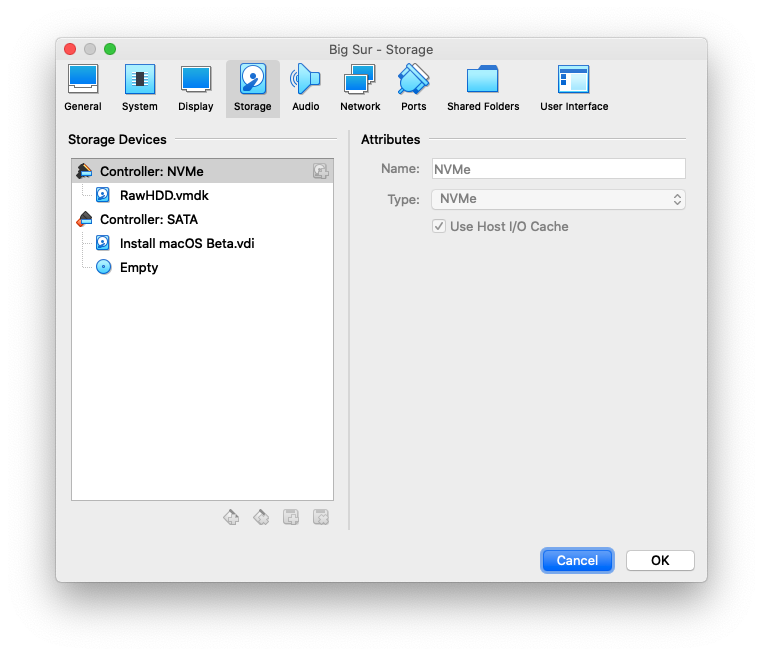

# VirtualBox

## Requirements

* VirtualBox
* A computer running macOS
* The desired macOS installation software installed to /Applications
* A USB attached hard disk or SSD

## Converting Installation Media

VirtualBox cannot directly use a raw disk image, so we're going to convert it to a `VDI`.

`cd` to the location of the disk image and run the following:

```bash
### Change "Install macOS Big Sur Beta" if the name of the .img file differs
VBoxManage convertfromraw "Install macOS Big Sur Beta.img" "Install macOS Big Sur Beta.vdi" --format VDI
```

## Installing macOS in VirtualBox

First, attach the USB disk that is your target for macOS installation, and create a virtual hard disk that references it to use with VirtualBox.  Note: You may need to remove the partitions of the disk before using it.  You will also need to edit the destination device.

```bash
diskutil list
# locate the external disk that matches, and replace /dev/disk3 below with the device path.
sudo VBoxManage internalcommands createrawvmdk -filename RawHDD.vmdk -rawdisk /dev/disk3
```

Next, start VirtualBox as root and create a new macOS virtual machine.

```bash
sudo VirtualBox
```

* Name: Big Sur
* Type: MacOS 64bit

* 2-4 CPU cores
* 4-8 GB RAM
* Do not create a virtual disk.

Attach the disks that you've created in previous steps as shown:



Now, close VirtualBox and add the following properties to the VM to allow it to boot.

```bash
sudo VBoxManage modifyvm "Big Sur" --cpuidset 00000001 000306a9 04100800 7fbae3ff bfebfbff

sudo VBoxManage setextradata "Big Sur" "VBoxInternal/Devices/efi/0/Config/DmiSystemProduct" "iMacPro1,1"

sudo VBoxManage setextradata "Big Sur" "VBoxInternal/Devices/efi/0/Config/DmiSystemVersion" "1.0"

sudo VBoxManage setextradata "Big Sur" "VBoxInternal/Devices/efi/0/Config/DmiBoardProduct" "Mac-7BA5B2D9E42DDD94"

sudo VBoxManage setextradata "Big Sur" "VBoxInternal/Devices/smc/0/Config/DeviceKey" "ourhardworkbythesewordsguardedpleasedontsteal(c)AppleComputerInc"

sudo VBoxManage setextradata "Big Sur" "VBoxInternal/Devices/smc/0/Config/GetKeyFromRealSMC" 1
```

Start VirtualBox as root, and start the VM.  The installer should begin to boot.  Complete the installation as you would on any other device.

```bash
sudo VirtualBox
```

When the installation is complete, and you are at the Welcome screen, send an ACPI shutdown signal to macOS and select shutdown.

Add your prepared EFI to the EFI partition on the USB device, and eject it.

Place the drive back in your hack and boot normally.
