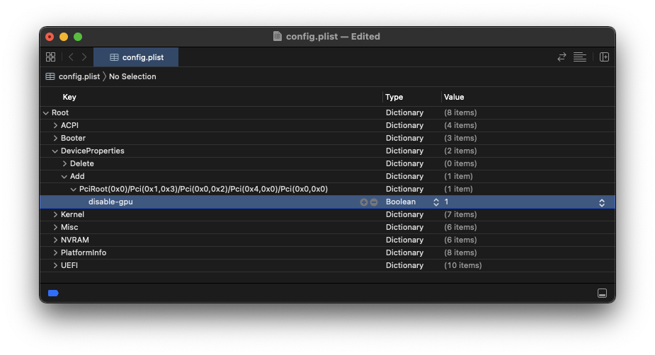

# Disabling GPU

* Supported version: 0.6.5

So you need to hide your unsupported GPU? Well with OpenCore things are slightly different, specifically that we need to specify to which exact device we want to spoof. There are 3 ways we can do this:

* Boot Flag
  * Disables all GPUs except the iGPU
* DeviceProperties
  * Disables GPU on a per-slot basis
* SSDT
  * Disables GPU on a per-slot basis

**CSM must be off in the BIOS for the spoofing to work correctly, especially on AMD CPU based systems.**

### Boot Flag

By far the simplest way, all you need to do is add the following boot-arg:

`-wegnoegpu`

Do note that this will disable all GPUs excluding the iGPU.

### DeviceProperties Method

Here is quite simple, find the PCI route with [gfxutil](https://github.com/acidanthera/gfxutil/releases) and then create a new DeviceProperties section with your spoof:

```
path/to/gfxutil -f GFX0
```

And the output will result in something similar:

```
DevicePath = PciRoot(0x0)/Pci(0x1,0x0)/Pci(0x0,0x0)/Pci(0x0,0x0)/Pci(0x0,0x0)
```

With this, navigate towards `Root -> DeviceProperties -> Add` and add your PCI route with the following properties:

| Key | Type | Value |
| :--- | :--- | :--- |
| name | data | 23646973706C6179 |
| IOName | string | #display |
| class-code | data | FFFFFFFF |



### SSDT Method

There are many ways to find the path but generally, the easiest way is to get into Device Manager under windows and find the PCI path.

Example of device path for `\_SB.PCI0.PEG0.PEGP`:

```

    DefinitionBlock ("", "SSDT", 2, "hack", "spoof", 0x00000000)
    {
       External (_SB_.PCI0.PEG0.PEGP, DeviceObj)    // (from opcode)

       Method (_SB.PCI0.PEG0.PEGP._DSM, 4, NotSerialized)  // _DSM: Device-Specific Method
       {
          If (LOr (LNot (Arg2), LEqual (_OSI ("Darwin"), Zero)))
          {
             Return (Buffer (One)
             {
                0x03
             })
          }

          Return (Package (0x0A)
          {
             "name",
             Buffer (0x09)
             {
                "#display"
             },

             "IOName",
             "#display",
             "class-code",
             Buffer (0x04)
             {
                0xFF, 0xFF, 0xFF, 0xFF
             },

             "vendor-id",
             Buffer (0x04)
             {
                0xFF, 0xFF, 0x00, 0x00
             },

             "device-id",
             Buffer (0x04)
             {
                0xFF, 0xFF, 0x00, 0x00
             }
          })
       }
    }

```

A copy of this SSDT can be found here: [Spoof-SSDT.dsl](https://github.com/dortania/OpenCore-Install-Guide/blob/master/extra-files/Spoof-SSDT.dsl). You will need [MaciASL](https://github.com/acidanthera/MaciASL/releases) to compile this. Remember that `.aml` is assembled and `.dsl` is source code. You can compile with MaciASL by selecting File -> Save As -> ACPI Machine Language.

Source: CorpNewt

## Windows GPU Selection

Depending on your setup, you may find that Windows renders games or applications using an undesired GPU.

Many users only have two GPUs. Nvidia and the Intel HD/UHD IGPU. Since Nvidia no longer works on macOS, they may have the monitor plugged into the motherboards HDMI/DP connection for convenience. As a result, Windows will render all games and applications through the IGPU. You can reroute a specific game or application to a different GPU by going to: Settings > System > Display > Graphics settings


The rendered game or application will have its buffer copied to the IGPU. Which is then displayed to you. This does come with a few downsides:

* GSync will no longer work.
* Nvidia settings can no longer be opened. This requires the display to be connected to the GPU
* Decreased frame rate.
* Increased input latency.
* Refresh rate cap.

If your motherboard only has an HDMI connector for the IGPU, the maximum refresh rate for spec 2.1 is [120Hz](https://www.hdmi.org/spec21Sub/EightK60_FourK120). This assumes your board and monitor are of the same spec. This means your 144Hz monitor is only seeing a maximum of 120Hz as determined by the hardware. This limitation *does not* apply if your board has a DP connector for the IGPU.

If you have more than two GPUs (AMD, Nvidia and Intel), this setting is limited. A monitor connected to the AMD GPU means Windows will only allow you to select the AMD GPU or the Intel IGPU. The Nvidia GPU will not show. In a future version of Windows, this [limitation is removed](https://pureinfotech.com/windows-10-21h1-new-features/#:~:text=Graphics%20settings).

As a recommendation, if you use both operating systems equally and prefer no downsides, your best option is an HDMI or DP switch.
