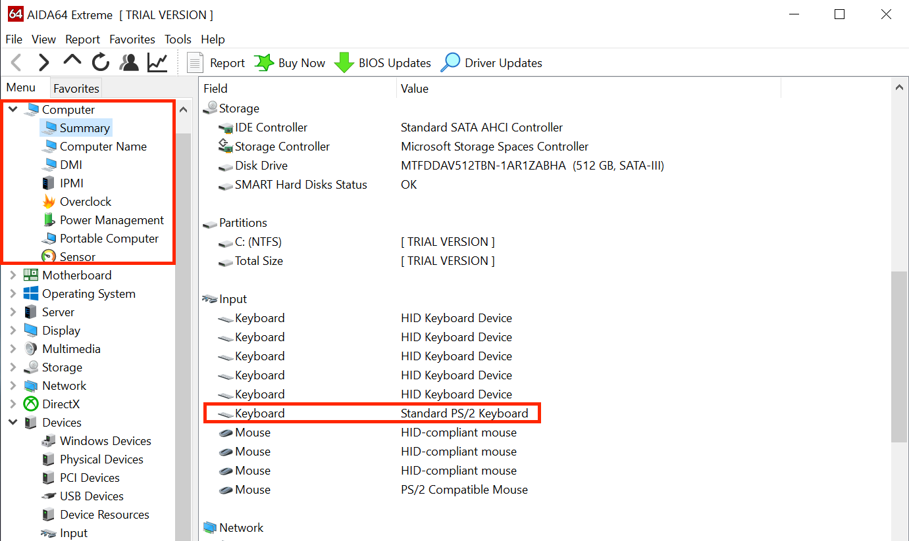

# Finding your hardware

This section is mostly a mini-guide on how to find what hardware you're currently running, this is mainly relevant for laptop and prebuilt users as hardware specs are a bit more difficult to obtain. You can skip this page if you already know what hardware you have.

For this we'll assume you have Windows or Linux installed:

* [Finding hardware using Windows](#finding-hardware-using-windows)
* [Finding hardware using Linux](#finding-hardware-using-linux)

## Finding Hardware using Windows

For this we have mainly 2 options:

* Windows' Built-in DeviceManager
* [AIDA64](https://www.aida64.com/downloads)

Due to the easier to use GUI, we recommend downloading AIDA64 and running this as it's much easier to grab specs. However we'll show you both methods for obtaining hardware specs.

### CPU Model

| AIDA64 | DeviceManager|
| :--- | :--- |
|  |  |

### GPU Model

| AIDA64 | DeviceManager|
| :--- | :--- |
|  |  |

### Chipset Model

| AIDA64 | DeviceManager|
| :--- | :--- |
|  |  |

* Note: Intel SOC based CPUs will have the chipset and other features already on the same die instead of being dedicated chips. This means trying to detect the exact chipset is a bit more difficult

### Keyboard Connection Type

| AIDA64 | DeviceManager|
| :--- | :--- |
|  |  |

### Trackpad Connection Type

| AIDA64 | DeviceManager|
| :--- | :--- |
|  |  |

### Touchscreen Connection Type

### Audio Codec

| AIDA64 | DeviceManager|
| :--- | :--- |
|  |  |

Due to how certain OEMs present device names, the most accurate info you can get with DeviceManager is via the PCI ID(ie. pci 14F1,50F4). This means you'll need to google the ID and figure out the exact device ID, however AIDA64 can present the name properly which is quite a bit easier on the end user.

### Network Controller models

| AIDA64 | DeviceManager|
| :--- | :--- |
|  |  |

Due to how certain OEMs present device names, the most accurate info you can get with DeviceManager is via the PCI ID(ie. pci 14e4,43a0). This means you'll need to google the ID and figure out the exact device ID, however AIDA64 can present the name properly which is quite a bit easier on the end user.

### Drive Model

| AIDA64 | DeviceManager|
| :--- | :--- |
|  |  |

Due to OEMs not providing much details about the drive, you'll need to google a bit which drive matches up with the displayed name.

## Finding Hardware using Linux

For finding hardware using Linux, we'll be using a few tools:

* `cat`
* `pciutils`
* `dmidecode`

Thankfully most Linux distros will come with these tools already installed

### CPU Model

```sh
cat /proc/cpuinfo | grep 'model name'
```

### GPU Model

```sh
lspci | grep -i --color 'vga\|3d\|2d'
```

### Chipset Model

```sh

```

### Keyboard, Trackpad and  Touchscreen Connection Type

```sh
dmesg |grep -i 'input'
```

### Audio Codec

```sh
lspci | grep -i 'audio'
```

### Network Controller models

Basic info: 
```sh
lspci | grep -i 'network'
```

More in-depth info:
```sh
lshw -class network
```

### Drive Model

```sh
lshw -class disk -class storage
```


