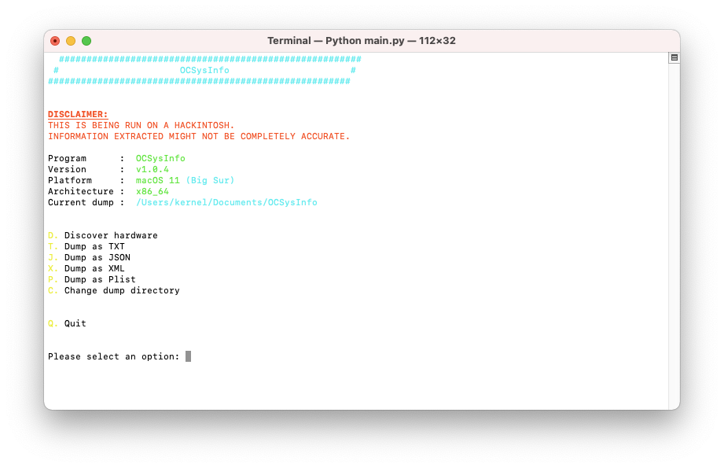
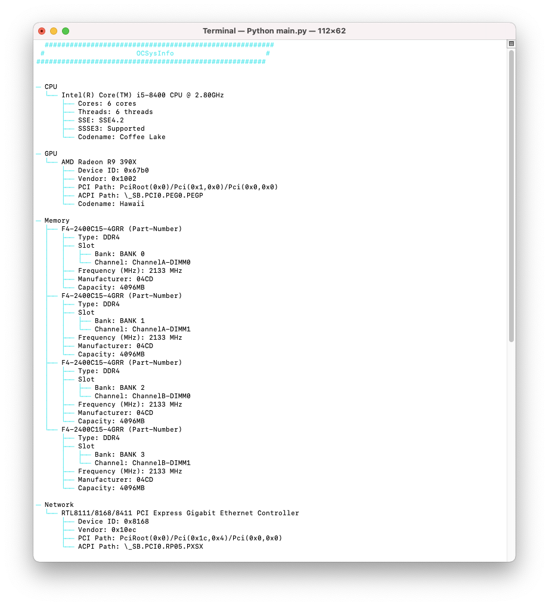
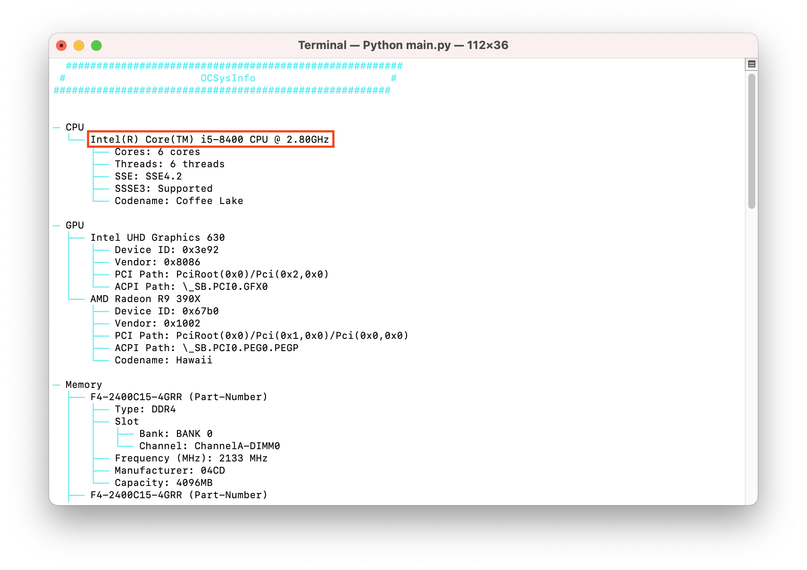
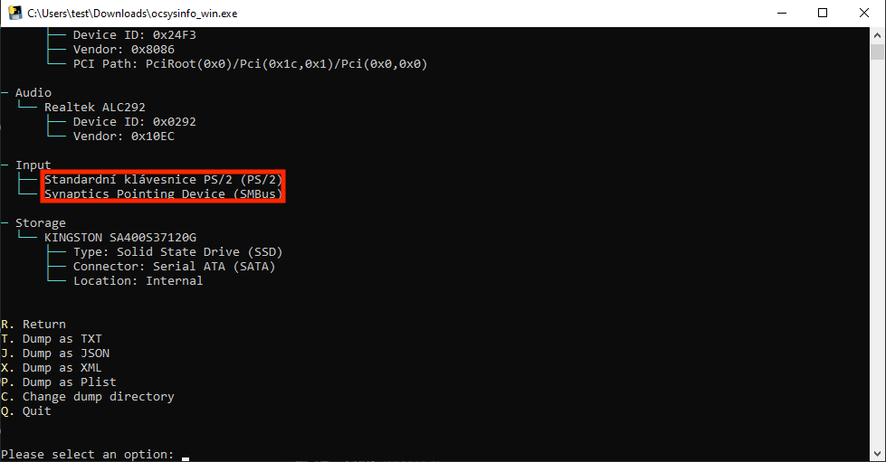
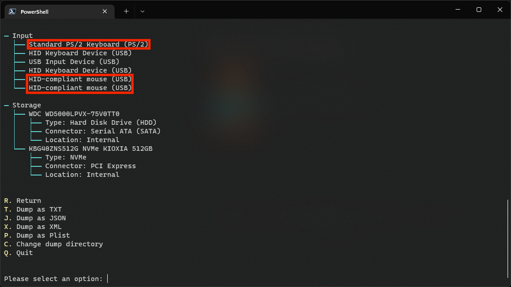
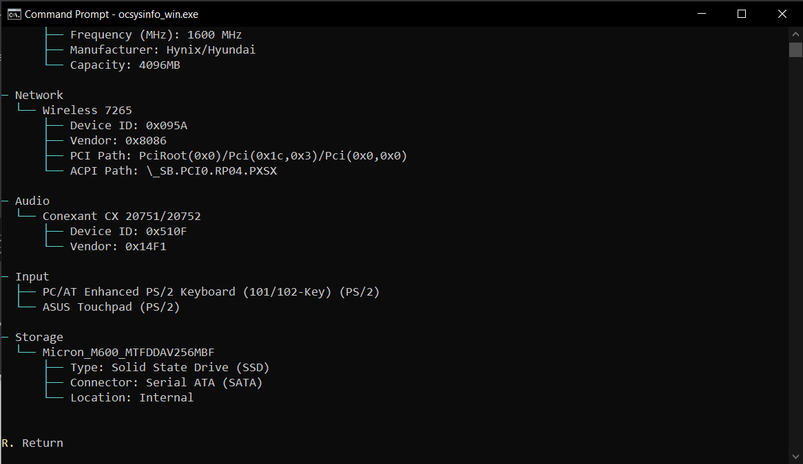
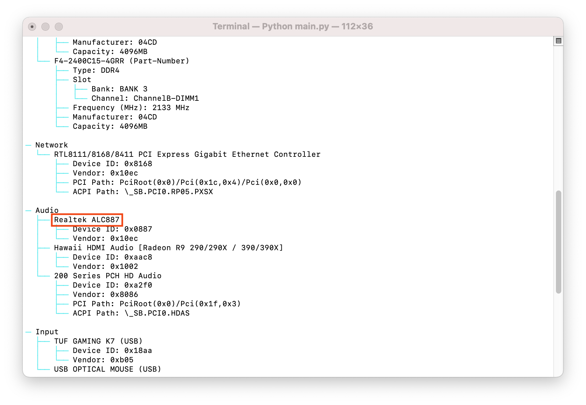
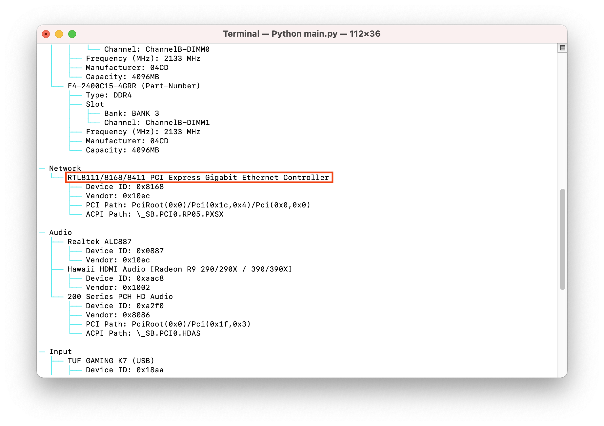
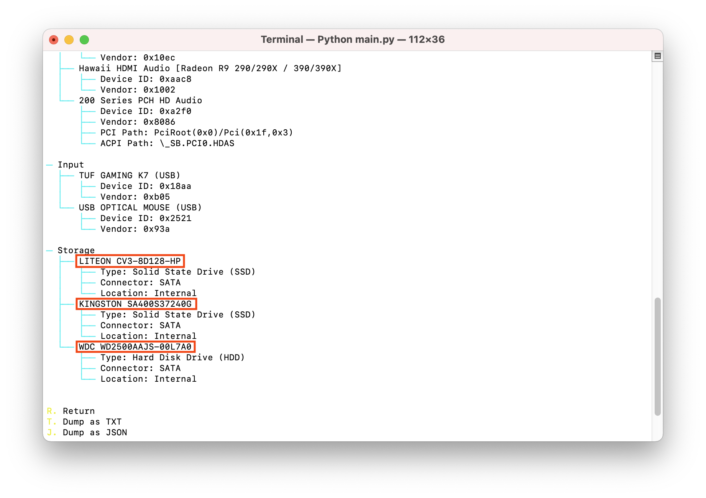

# 查找你的硬件

本节主要是一个关于如何找到当前运行的硬件的迷你指南;这主要与笔记本电脑和预构建用户有关，因为硬件规格有点难以获得。如果你已经知道你有什么硬件，你可以跳过这一页，转到[创建USB](./installer-guide/).

假设你已经安装了Windows或Linux:

[[toc]]

## 使用Windows查找硬件

我们主要有两个选择:

* Windows内置的设备管理器
* [AIDA64](https://www.aida64.com/downloads)

由于使用GUI更容易，我们建议下载AIDA64并运行它，因为它更容易获取规格。然而我们将向你展示这两种方法获取的硬件规格。

### CPU 型号

| AIDA64                                                 | 设备管理器                                                |
|:-------------------------------------------------------|:--------------------------------------------------------------|
|  |  |

### GPU 型号

| AIDA64                                                 | 设备管理器                                                  |
|:-------------------------------------------------------|:--------------------------------------------------------------|
|  |  |

### 芯片组 型号

| AIDA64                                                     | 设备管理器                                                      |
|:-----------------------------------------------------------|:------------------------------------------------------------------|
|  |  |

* 注意:英特尔基于SOC的cpu将在同一个芯片上拥有芯片组和其他功能，而不是专用芯片。这意味着试图检测准确的芯片组有点困难

### 键盘、触控板和触摸屏连接类型

| 设备管理器                                                      |
|:-------------------------------------------------------------------|
|  |

不幸的是，AIDA64没有提供任何关于指针设备的有用信息，因此我们建议使用DeviceManager。

* 你可以找到以下这些设备:
  * `人机界面设备`
  * `键盘`
  * `鼠标和其他指针设备`

* 要查看设备的确切连接类型，请选择指针设备，然后输入` view -> device by connection `。这将明确它是否通过PS2, I2C, SMBus, USB等

根据设备的不同，它可能会在多个名称和连接下显示。主要需要关注的是:
  
:::details SMBus
  
这些将显示为直接PCI设备，如 `Synaptics SMBus Driver` 或 `ELAN SMBus Driver`

* 触摸设备将显示在PS2下的`Synaptics PS2 device`/`Synaptics Pointing Device` 和 PCI的 `Synaptics SMBus Driver`


正如你所看到的，我们在左边的图像中有两个Synaptics设备，但是如果我们仔细看，我们会看到顶部的设备是PS2，而底部的是SMBus。虽然你可以在任何一种模式下使用触控板，但SMBus通常提供更好的手势支持和准确性。

:::

:::details USB

| Device by Type | Device by Connection |
| :--- | :--- |
|  | 

当我们将连接视图切换到`按连接设备`时，这些会显示为“`PS2兼容的触摸板`”，在USB下也会显示为`按连接设备`

:::

:::details I2C


它们几乎总是以微软的HID设备的形式显示，不过也可以以其他触控板的形式显示。但它们总是在I2C下显示。

:::
  
### 音频编解码器

| AIDA64                                                        | 设备管理器                                                     |
|:--------------------------------------------------------------|:------------------------------------------------------------------|
|  |  |

由于某些oem呈现设备名称的方式，您可以通过DeviceManager获得的最准确的信息是通过PCI ID(例如PCI 14F1,50F4)。这意味着您需要谷歌ID并计算出确切的设备ID，然而AIDA64可以正确地显示名称，这对终端用户来说更容易。

### 网络控制器型号

| AIDA64                                                 | 设备管理器                                                |
|:-------------------------------------------------------|:--------------------------------------------------------------|
|  |  |

由于某些oem提供设备名称的方式，您可以通过设备管理器获得的最准确信息是PCI ID(例如 `PCI\VEN_14E4&DEV_43A0` 对应于供应商ID为 `14E4` 和设备ID为 `43A0`). 这意味着你需要谷歌ID并弄清楚确切的设备ID;但是，AIDA64可以正确地显示名称，这要容易得多。

### 硬盘型号

| AIDA64                                                  | 设备管理器                                                 |
|:--------------------------------------------------------|:---------------------------------------------------------------|
|  |  |

由于oem没有提供关于驱动器的很多细节，您将需要谷歌来确定驱动器匹配显示的名称。

## 使用Linux查找硬件

使用Linux查找硬件,我们将使用一些工具:

* `pciutils`
* `dmidecode`

下面是要在终端上运行的命令列表，幸运的是，大多数Linux发行版都已经安装了这些工具。如果没有，您可能会在您的发行版的包管理器中找到它们。

### CPU 型号

```sh
grep -i "model name" /proc/cpuinfo
```

### GPU 型号

```sh
lspci | grep -i --color "vga\|3d\|2d"
```

### 芯片组 型号

```sh
dmidecode -t baseboard
```

### 键盘，触控板和触摸屏连接类型

```sh
dmesg | grep -i input
```

### 音频编解码器

```sh
aplay -l
```

### 网络控制器型号

Basic info:

```sh
lspci | grep -i network
```

More in-depth info:

```sh
lshw -class network
```

### 硬盘型号

```sh
lshw -class disk -class storage
```

## 使用OCSysInfo查找硬件

有两种获取和运行OCSysInfo的方法:

* [预编译二进制文件](https://github.com/KernelWanderers/OCSysInfo/releases)
* 手动克隆 [存储库](https://github.com/KernelWanderers/OCSysInfo)

:::TIP
我们建议您下载[二进制文件](https://github.com/KernelWanderers/OCSysInfo/releases)，因为这是最简单的方法。

如果您想了解关于手动克隆存储库的更多信息，可以查看OCSysInfo[迷你指南](https://github.com/KernelWanderers/OCSysInfo/tree/main/mini-guide).
:::

### 发现硬件

:::WARING
笔记本电脑用户:在我们开始之前，我们建议您断开任何外部USB设备，因为这可能会导致收集的模棱两可或不必要的信息，可能会使您感到困惑。
:::

成功安装并运行应用程序后，你应该看到如下界面:



在这里，你可以输入`d`并按`ENTER`/`RETURN`，然后，你应该会看到一个类似的界面:



### CPU 型号



除了CPU型号，它还列出了CPU的代号、支持的最高SSE版本和SSSE3可用性。

### GPU 型号


在这种情况下,机器有两个gpu:

* iGPU (Intel UHD Graphics 630)
* dGPU (AMD Radeon R9 390X)

除了模型名称，它还列出了gpu的代码，ACPI和PCI路径，随着你在hackintosh之旅的进展，你可能很快就会发现这些代码很有用。

### 键盘和触摸板连接类型

:::details SMBus触摸板

触摸板: `SMBus` <br /> 键盘: `PS/2`

图片来源:[ThatCopy](https://github.com/ThatCopy)
:::

:::details I2C触摸板

触摸板: `I2C` <br /> 键盘: `PS/2`

图片来源:[Mahas](https://github.com/Mahas1)
:::

:::details PS/2触摸板

触摸板: `PS/2` <br /> 键盘: `PS/2`

图片来源:[Tasty0](https://github.com/Tasty0)
:::

### 音频编解码器



### 网络控制器型号



### 硬盘型号


