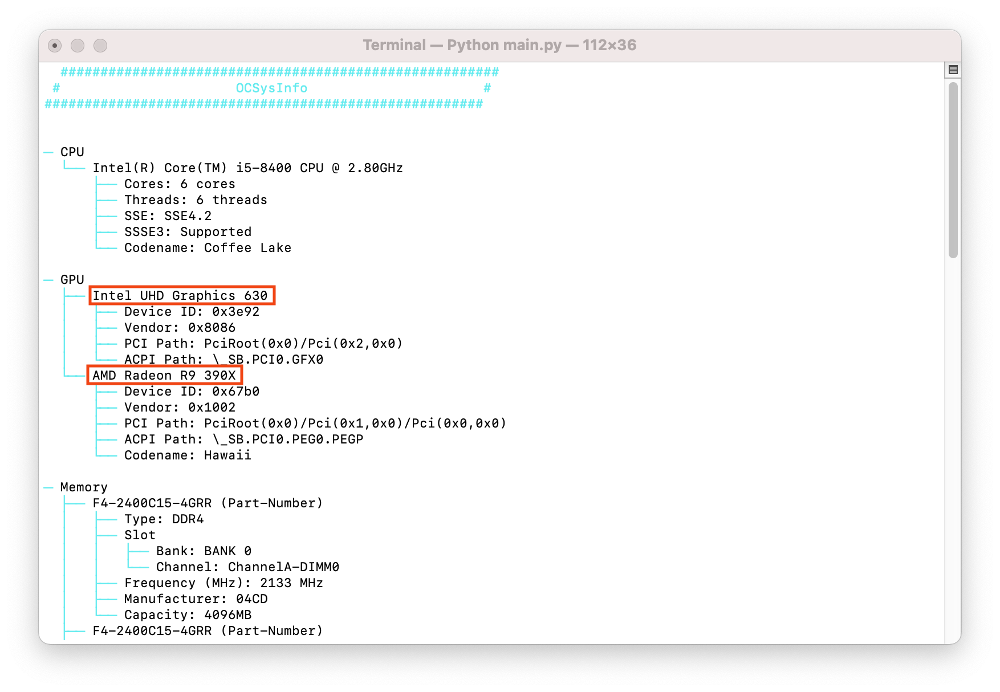
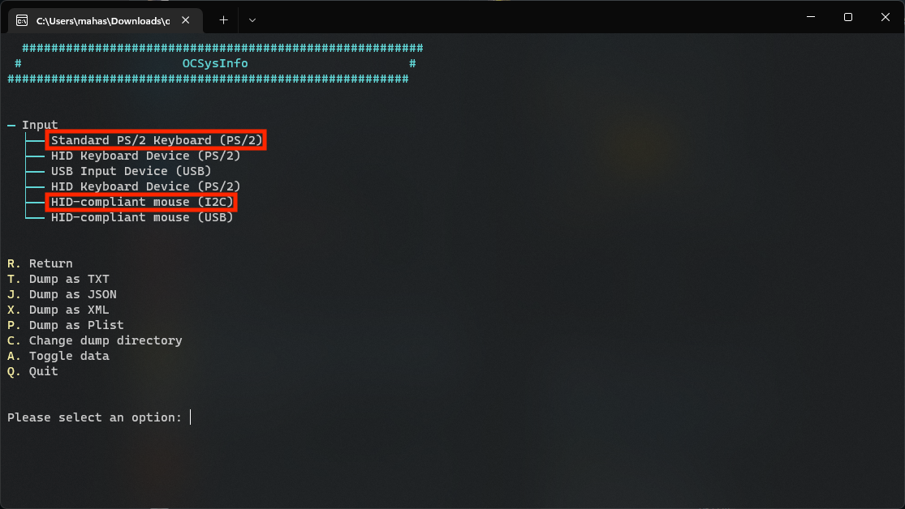

# Finding your hardware

This section is mostly a mini-guide on how to find what hardware you're currently running; this is mainly relevant for laptop and prebuilt users as hardware specs are a bit more difficult to obtain. You can skip this page and head to [Creating the USB](./installer-guide/) if you already know what hardware you have.

For this, we'll assume you have Windows or Linux installed:

[[toc]]

## Finding Hardware using Windows

For this we mainly have 2 options:

* Windows' built-in Device Manager
* [AIDA64](https://www.aida64.com/downloads)

Due to the easier to use GUI, we recommend downloading AIDA64 and running this as it's much easier to grab specs. However we'll show you both methods for obtaining hardware specs.

### CPU Model

| AIDA64                                                 | Device Manager                                                |
|:-------------------------------------------------------|:--------------------------------------------------------------|
|  |  |

### GPU Model

| AIDA64                                                 | DeviceManager                                                 |
|:-------------------------------------------------------|:--------------------------------------------------------------|
|  |  |

### Chipset Model

| AIDA64                                                     | DeviceManager                                                     |
|:-----------------------------------------------------------|:------------------------------------------------------------------|
|  |  |

* Note: Intel SOC based CPUs will have the chipset and other features already on the same die instead of being dedicated chips. This means trying to detect the exact chipset is a bit more difficult

### Keyboard, Trackpad and Touchscreen Connection Type

| DeviceManager                                                      |
|:-------------------------------------------------------------------|
|  |

AIDA64 unfortunately doesn't provide any useful info regarding pointer devices, so we recommend using DeviceManager for this.

* You can find these devices under the following:
  * `Human Interface Devices`
  * `Keyboards`
  * `Mice and other Pointer Devices`

* To view the exact connection type of the device, select the pointer device then enter `View -> Device by Connection`. This will clarify whether it's over PS2, I2C, SMBus, USB, etc

Depending on the device, it may show up under multiple names and connections. The main ones to keep an eye on:
  
::: details SMBus
  
These will show up as a straight PCI device such as `Synaptics SMBus Driver` or `ELAN SMBus Driver`

* Synaptics devices will show up under both PS2 under `Synaptics PS2 device`/`Synaptics Pointing Device` and PCI as `Synaptics SMBus Driver`


As you can see, we get 2 Synaptics devices in the left image, however if we take a closer look we'll see the top device is PS2, while the bottom one is SMBus. While you can use the trackpad in either mode, SMBus generally provides better gesture support and accuracy.

:::

::: details USB

| Device by Type | Device by Connection |
| :--- | :--- |
|  | 

These will show up as a `PS2 Compliant Trackpad`, as well under USB when we switch our connection view to `Device by Connection`

:::

::: details I2C


These will almost always show up as a Microsoft HID device, though can appear as other trackpads as well. They will always show up under I2C though.

:::
  
### Audio Codec

| AIDA64                                                        | DeviceManager                                                     |
|:--------------------------------------------------------------|:------------------------------------------------------------------|
|  |  |

Due to how certain OEMs present device names, the most accurate info you can get with DeviceManager is via the PCI ID(ie. pci 14F1,50F4). This means you'll need to google the ID and figure out the exact device ID, however AIDA64 can present the name properly which is quite a bit easier on the end user.

### Network Controller models

| AIDA64                                                 | Device Manager                                                |
|:-------------------------------------------------------|:--------------------------------------------------------------|
|  |  |

Due to how certain OEMs present device names, the most accurate info you can get with Device Manager is via the PCI ID (ie. `PCI\VEN_14E4&DEV_43A0` corresponds to a vendor ID of `14E4` and a device ID of `43A0`). This means you'll need to Google the ID and figure out the exact device ID; however, AIDA64 can present the name properly which can be quite a bit easier.

### Drive Model

| AIDA64                                                  | Device Manager                                                 |
|:--------------------------------------------------------|:---------------------------------------------------------------|
|  |  |

Due to OEMs not providing much details about the drive, you'll need to Google a bit which drive matches up with the displayed name.

## Finding Hardware using Linux

For finding hardware using Linux, we'll be using a few tools:

* `pciutils`
* `dmidecode`

Below you'll find a list of commands to run in the terminal, thankfully most Linux distros will come with these tools already installed. If not, you will likely find them in your distro's package manager.

### CPU Model

```sh
grep -i "model name" /proc/cpuinfo
```

### GPU Model

```sh
lspci | grep -i --color "vga\|3d\|2d"
```

### Chipset Model

```sh
dmidecode -t baseboard
```

### Keyboard, Trackpad and  Touchscreen Connection Type

```sh
dmesg | grep -i input
```

### Audio Codec

```sh
aplay -l
```

### Network Controller models

Basic info:

```sh
lspci | grep -i network
```

More in-depth info:

```sh
lshw -class network
```

### Drive Model

```sh
lshw -class disk -class storage
```

## Finding Hardware using OCSysInfo

There are 2 methods of obtaining and running OCSysInfo:

* [Precompiled binaries](https://github.com/KernelWanderers/OCSysInfo/releases)
* Manually cloning the [repository](https://github.com/KernelWanderers/OCSysInfo)

::: tip
We recommend you download [the binaries](https://github.com/KernelWanderers/OCSysInfo/releases), as it is the simplest and easiest method.

If you want to learn more about manually cloning the repository, you can check out the OCSysInfo [mini-guide](https://github.com/KernelWanderers/OCSysInfo/tree/main/mini-guide).
:::

### Discovering hardware

::: warning
Laptop users: before we start, we advise you to disconnect any external USB devices, as this may lead to ambiguous or unnecessary information collected which may confuse you.
:::

After you've successfully installed and ran the application, you should be greeted with the following screen:


From here, you can type in `d` and press `ENTER`/`RETURN`, after, you should be greeted with a similar-looking screen:


### CPU Model


Besides the CPU model, it also lists the CPU's codename, highest SSE version supported and SSSE3 availability.

### GPU Model



In this case, the machine has two GPUs:

* iGPU (Intel UHD Graphics 630)
* dGPU (AMD Radeon R9 390X)

Besides the model names, it also lists the GPUs' codename, ACPI & PCI path, which you may soon find useful as you progress in your hackintosh journey.

### Keyboard and Trackpad Connection Type

::: details SMBus Trackpad

Trackpad: `SMBus` <br /> Keyboard: `PS/2`

Credit for providing image: [ThatCopy](https://github.com/ThatCopy)
:::

::: details I2C Trackpad

Trackpad: `I2C` <br /> Keyboard: `PS/2`

Credit for providing image: [Mahas](https://github.com/Mahas1)
:::

::: details PS/2 Trackpad

Trackpad: `PS/2` <br /> Keyboard: `PS/2`

Credit for providing image: [Tasty0](https://github.com/Tasty0)
:::

### Audio codec


### Network models


### Drive model


