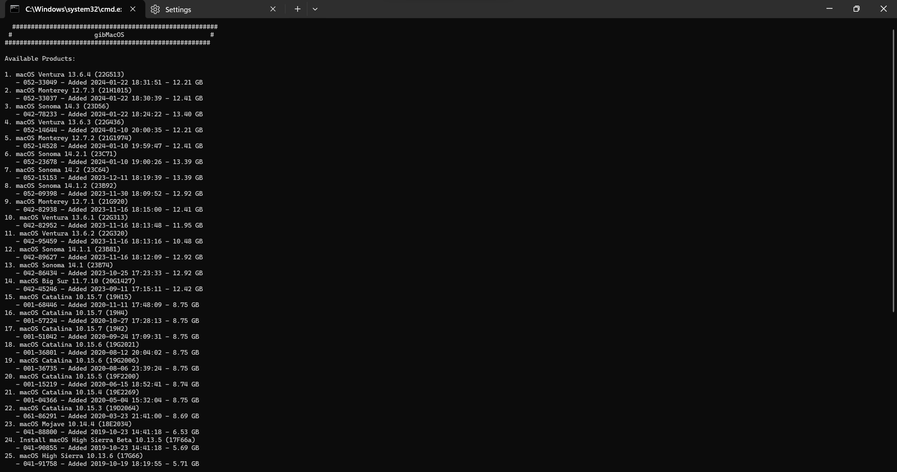

# Making the installer in Linux (Alternate)

While you don't need a fresh install of macOS to use OpenCore, some users prefer having a full installer.

To start you'll need the following:

* 16GB USB Stick (will vary depending on OS version, 16GB will work fine for latest)
* [gibMacOS](https://github.com/acidanthera/OpenCorePkg/releases)
  * This will require Python 3 installed (should be preinstalled)
* [UnPlugged](https://github.com/corpnewt/UnPlugged)
  
## Downloading macOS

Now to start, first cd into [gibMacOS's folder](https://github.com/corpnewt/gibMacOS) and run one of the following commands:


```sh
# Adjust below command to the correct folder
cd ~/Downloads/gibMacOS/
```

From here, you'll want to launch gibMacOS.
```sh
python py gibMacOS.py
```
Now, based off of the image below, select the version you want.



* **macOS 12 and above note**: As recent macOS versions introduce changes to the USB stack, it is highly advisable that you map your USB ports (with USBToolBox) before installing macOS.
  * <span style="color:red"> CAUTION: </span> With macOS 11.3 and newer, [XhciPortLimit is broken resulting in boot loops](https://github.com/dortania/bugtracker/issues/162).
    * If you've already [mapped your USB ports](https://dortania.github.io/OpenCore-Post-Install/usb/) and disabled `XhciPortLimit`, you can boot macOS 11.3+ without issues.

## Now with all this done, head to [Setting up the EFI](./opencore-efi.md) to finish up your work
