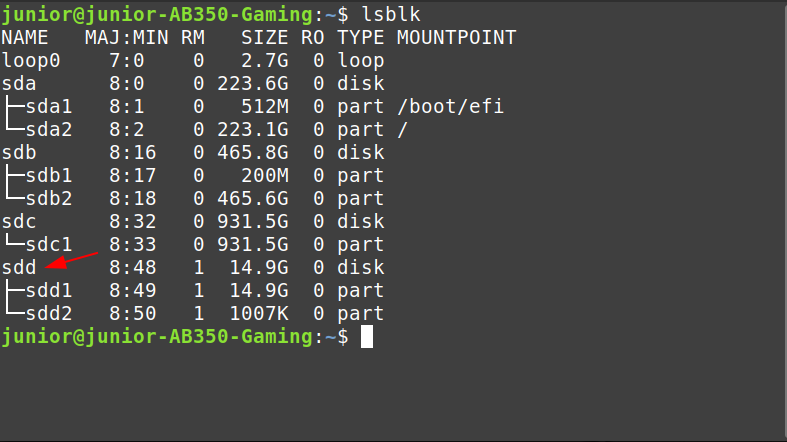
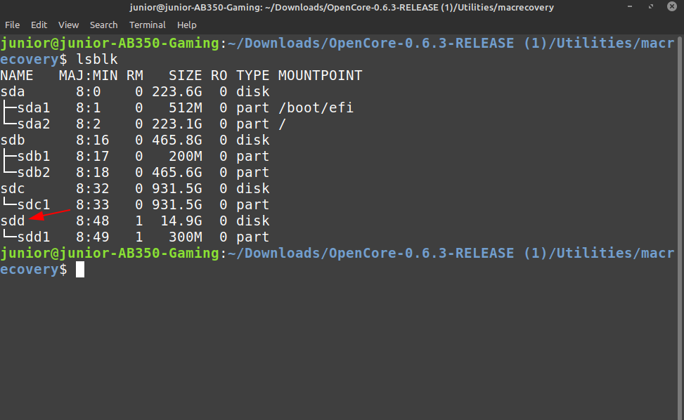
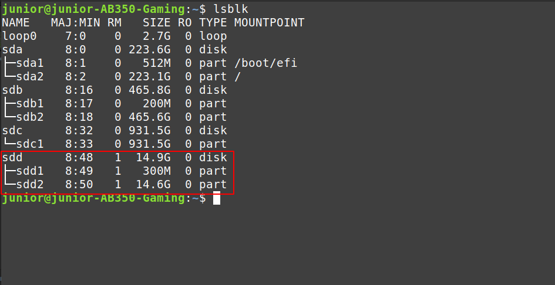
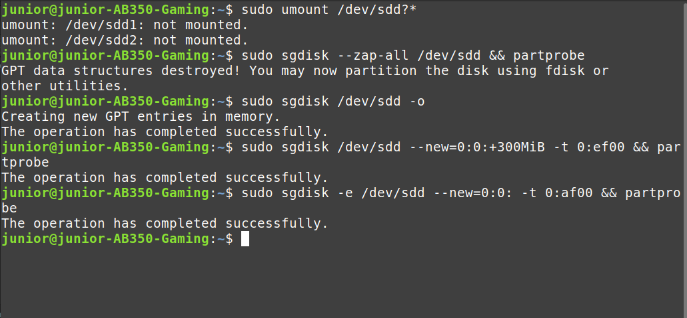
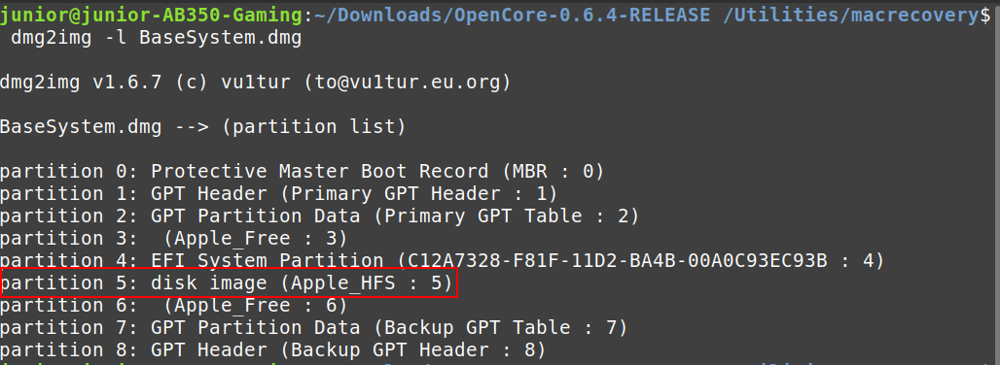
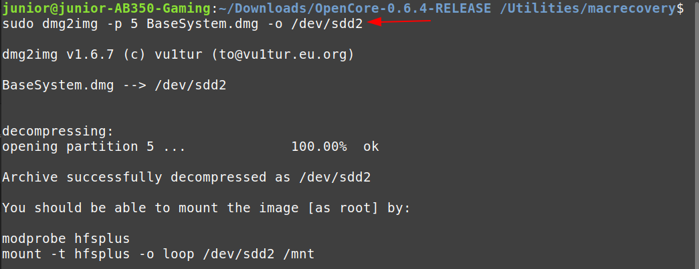

# Making the installer in Linux

* Supported version: 0.6.3

While you don't need a fresh install of macOS to use OpenCore, some users prefer having a fresh slate with their boot manager upgrades.

To start you'll need the following:

* 4GB USB Stick
* [macrecovery.py](https://github.com/acidanthera/OpenCorePkg/releases)

## Downloading macOS

Now to start, first cd into [macrecovery's folder](https://github.com/acidanthera/OpenCorePkg/releases) and run one of the following commands:


```sh
# Adjust below command to the correct folder
cd ~/Downloads/OpenCore-0/Utilities/macrecovery/
```

Next, run one of the following commands depending on the OS you'd like to boot:

```sh
# Lion(10.7):
python ./macrecovery.py -b Mac-2E6FAB96566FE58C -m 00000000000F25Y00 download
python ./macrecovery.py -b Mac-C3EC7CD22292981F -m 00000000000F0HM00 download

# Mountain Lion(10.8):
python ./macrecovery.py -b Mac-7DF2A3B5E5D671ED -m 00000000000F65100 download

# Mavericks(10.9):
python ./macrecovery.py -b Mac-F60DEB81FF30ACF6 -m 00000000000FNN100 download

# Yosemite(10.10):
python ./macrecovery.py -b Mac-E43C1C25D4880AD6 -m 00000000000GDVW00 download

# El Capitan(10.11):
python ./macrecovery.py -b Mac-FFE5EF870D7BA81A -m 00000000000GQRX00 download

# Sierra(10.12):
python ./macrecovery.py -b Mac-77F17D7DA9285301 -m 00000000000J0DX00 download

# High Sierra(10.13)
python ./macrecovery.py -b Mac-7BA5B2D9E42DDD94 -m 00000000000J80300 download
python ./macrecovery.py -b Mac-BE088AF8C5EB4FA2 -m 00000000000J80300 download

# Mojave(10.14)
python ./macrecovery.py -b Mac-7BA5B2DFE22DDD8C -m 00000000000KXPG00 download

# Catalina(10.15)
python ./macrecovery.py -b Mac-00BE6ED71E35EB86 -m 00000000000000000 download

# Latest version
# ie. Big Sur(11)
python ./macrecovery.py -b Mac-E43C1C25D4880AD6 -m 00000000000000000 download
```

From here, run one of those commands in terminal and once finished you'll get an output similar to this:


* **Note**: Depending on the OS, you'll either get BaseSystem or RecoveryImage files. They both act in the same manner so when we reference BaseSystem the same info apples to RecoveryImage

* **macOS 11, Big Sur Note**: As this OS is quite new, there's still some issues with certain systems to resolve. For more information, see here: [OpenCore and macOS 11: Big Sur](../extras/big-sur/README.md)
  * For first time users, we recommend macOS 10.15, Catalina
* **Nvidia GPU Note**: Reminder to verify whether your hardware support newer OSes, see [Hardware Limitations](../macos-limits.md)

## Making the installer

This section will target making the necessary partitions in the USB device. You can use your favorite program be it `gdisk` `fdisk` `parted` `gparted` or `gnome-disks`. This guide will focus on `sgdisk` as it's nice and can change the partition type later on, Ubuntu 18.04, other versions or distros may work)

Credit to [midi1996](https://github.com/midi1996) for his work on the [Internet Install Guide](https://midi1996.github.io/hackintosh-internet-install-gitbook/) guide which this is based off of.

### Method 1

In terminal:

   1. run `lsblk` and determine your USB device block
   
   2. run `sudo umount /dev/xxx?*` replace `/xxx` with your USB block 

   3. run `sudo sgdisk --zap-all /dev/xxx && partprobe` to remove all partitions on the drive  

   4. run `sudo sgdisk /dev/xxx -o` to clear the partition table and make a new GPT one  
  
   5. run `sudo sgdisk /dev/xxx --new=0:0: -t 0:0700 && partprobe` to create a Microsoft basic data partition type   

   6. run `sudo mkfs.vfat -F 32 -n "OPENCORE" /dev/xxx1` to format your USB to FAT32 and named OPENCORE
     
   7. Use `lsblk` to determine your partition's identifiers

   8. then `cd` to `/OpenCore/Utilities/macrecovery/` and you should get to a `.dmg` and `.chunklist` files

   9. mount your USB partition with `udisksctl` (`udisksctl mount -b /dev/xxx1`, no sudo required in most cases)  
 or with `mount` (`sudo mount /xxx1 /where/your/mount/stuff`, sudo is required)
   10. `cd` to your USB drive and `mkdir com.apple.recovery.boot` in the root of your FAT32 USB partition
   11. now `cp` or `rsync` both `BaseSystem.dmg` and `BaseSystem.chunklist` into `com.apple.recovery.boot` folder.
   
### Method 2 (in case 1 didn't work)

In terminal:

   1. run `lsblk` and determine your USB device block
   

   2. run `sudo umount /dev/xxx?*` to umount the USB device

   3. run `sudo sgdisk --zap-all /dev/xxx && partprobe` to remove all partitions on the drive

   4. run `sudo sgdisk /dev/xxx -o` to clear the partition table and make a new GPT one

   5. run `sudo sgdisk /dev/xxx --new=0:0:+300MiB -t 0:ef00 && partprobe` to create a 300MB partition that will be named later on OPENCORE

   6. run `sudo sgdisk -e /dev/xxx --new=0:0: -t 0:af00 && partprobe` for Apple HFS/HFS+ partition type 

   8. Use `lsblk` again to determine the 300MB drive and the other partition
   

   9. run `sudo mkfs.vfat -F 32 -n "OPENCORE" /dev/xxx1` to format the 300MB partition to FAT32, named OPENCORE

   10. then `cd` to `/OpenCore/Utilities/macrecovery/` and you should get to a `.dmg` and `.chunklist` files
   

   11. download `dmg2img` (available on most distros)

   12. run `dmg2img -l BaseSystem.dmg` and determine which partition has `disk image` property
      

   13. run `dmg2img -p <the partition number> -i BaseSystem.dmg -o <your HFS+ partition block>`   
 to extract and write the recovery image to the partition disk

      * It will take some time. A LOT if you're using a slow USB (took me about less than 5 minutes with a fast USB2.0 drive).
    
   14.  mount the Fat32 partition `udisksctl` (`udisksctl mount -b /dev/xxx1`, no sudo required in most cases)  
 or with `mount` (`sudo mount /xxx1 /where/your/mount/stuff`, sudo is required) this is where you will drop your OC EFI folder.

## Now with all this done, head to [Setting up the EFI](./opencore-efi.md) to finish up your work
