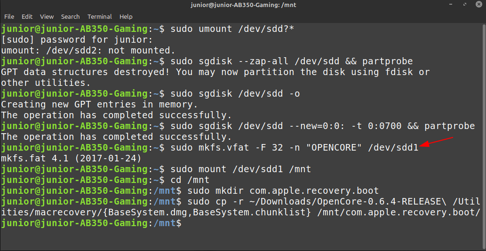

# Making the installer in Linux

* Supported version: 0.6.3

While you don't need a fresh install of macOS to use OpenCore, some users prefer having a fresh slate with their boot manager upgrades.

To start you'll need the following:

* 4GB USB Stick
* [macrecovery.py](https://github.com/acidanthera/OpenCorePkg/releases)

## Downloading macOS

Now to start, first cd into [macrecovery's folder](https://github.com/acidanthera/OpenCorePkg/releases) and run one of the following commands:


```sh
# Adjust below command to the correct folder
cd ~/Downloads/OpenCore-0/Utilities/macrecovery/
```

Next, run one of the following commands depending on the OS you'd like to boot:

```sh
# Lion(10.7):
./macrecovery.py -b Mac-2E6FAB96566FE58C -m 00000000000F25Y00 download
./macrecovery.py -b Mac-C3EC7CD22292981F -m 00000000000F0HM00 download

# Mountain Lion(10.8):
./macrecovery.py -b Mac-7DF2A3B5E5D671ED -m 00000000000F65100 download

# Mavericks(10.9):
./macrecovery.py -b Mac-F60DEB81FF30ACF6 -m 00000000000FNN100 download

# Yosemite(10.10):
./macrecovery.py -b Mac-E43C1C25D4880AD6 -m 00000000000GDVW00 download

# El Capitan(10.11):
./macrecovery.py -b Mac-FFE5EF870D7BA81A -m 00000000000GQRX00 download

# Sierra(10.12):
./macrecovery.py -b Mac-77F17D7DA9285301 -m 00000000000J0DX00 download

# High Sierra(10.13)
./macrecovery.py -b Mac-7BA5B2D9E42DDD94 -m 00000000000J80300 download
./macrecovery.py -b Mac-BE088AF8C5EB4FA2 -m 00000000000J80300 download

# Mojave(10.14)
./macrecovery.py -b Mac-7BA5B2DFE22DDD8C -m 00000000000KXPG00 download

# Catalina(10.15)
./macrecovery.py -b Mac-00BE6ED71E35EB86 -m 00000000000000000 download

# Latest version
# ie. Big Sur(11)
./macrecovery.py -b Mac-E43C1C25D4880AD6 -m 00000000000000000 download
```

From here, run one of those commands in terminal and once finished you'll get an output similar to this:


* **Note**: Depending on the OS, you'll either get BaseSystem or RecoveryImage files. They both act in the same manner so when we reference BaseSystem the same info apples to RecoveryImage

* **macOS 11, Big Sur Note**: As this OS is quite new, there's still some issues with certain systems to resolve. For more information, see here: [OpenCore and macOS 11: Big Sur](../extras/big-sur/README.md)
  * For first time users, we recommend macOS 10.15, Catalina
* **Nvidia GPU Note**: Reminder to verify whether your hardware support newer OSes, see [Hardware Limitations](../macos-limits.md)

## Making the installer

This section will target making the necessary partitions in the USB device. This guide will focus on `p7zip`and  `sgdisk` as we need do extract the Recovery and change the partition type later on, as we need it so that macOS Recovery HD can boot. (the distro used here is Ubuntu 18.04, other versions or distros may work)

Credit to [midi1996](https://github.com/midi1996) for his work on the [Internet Install Guide](https://midi1996.github.io/hackintosh-internet-install-gitbook/) guide which this is based off of.
and to [Broly1](https://github.com/Broly1) for his work on the [Internet Install Guide](https://github.com/Broly1/Hackintosh-linux-Installer).
### Method 1

In terminal:

1. run `ls` to make sure you have the `BaseSystem.dmg`
   

2. Install p7zip on Ubuntu `apt install p7zip-full` Arch `pacman -Sy p7zip` Fedora `dnf install p7zip-plugins`


3. Extract the `.hfs` with `7z e -tdmg BaseSystem.dmg *.hfs`
   

4. Rename the `.hfs` file to `base.hfs`, run `mv *.hfs base.hfs`, renaming isn't necessary but it makes life easier as `dd command` doesn't accept autocompletition and different versions of macOS has different file names with same file extension.

5. run `lsblk` and determine your USB device block
   

6. umount the USB device `sudo umount /dev/xxx?*`

7. Now lests wipe hour USB device with `sudo sgdisk --zap-all /dev/xxx && partprobe` partprobe will let the kernel know changes was made to the partitions so no need to reboot. 

8. Make a Fat32 partition of 300MiB this is where we will put our OC EFI latter on, run `sudo sgdisk /dev/xxx --new=0:0:+300MiB -t 0:ef00 && partprobe` replace `xxx` with your USB device block.

9. Make a HFS+ partition for our BaseSystem, run `sudo sgdisk -e /dev/xxx --new=0:0: -t 0:af00 && partprobe` 
   

10. Copy the BaseSystem to the HFS+ partition,run `sudo dd bs=8M if=base.hfs of=/dev/xxx2 status=progress oflag=sync` 
   

11. Format the the Fat32 partition, run `mkfs.fat -F32 -n OPENCORE /dev/xxx1`
   

12. mount the EFI partition in the /mnt `sudo mount -t vfat /dev/xxx1 /mnt/ -o rw,umask=000` this is where you will add your OC EFI folder.

13. Open Disks and the end result should look like this
   

### Method 2 (in case 1 didn't work)

In terminal:

1. run `lsblk` and determine your USB device block
   
2. run `sudo gdisk /dev/<your USB block>`
   1. if you're asked what partition table to use, select GPT.
      
   2. send `p` to print your block's partitions \(and verify it's the one needed\)
      
   3. send `o` to clear the partition table and make a new GPT one (if not empty)
      1. confirm with `y`
         
   4. send `n`
      1. partition number: keep blank for default
      2. first sector: keep blank for default
      3. last sector: `+200M` to create a 200MB partition that will be named later on OPENCORE
      4. Hex code or GUID: `0700` for Microsoft basic data partition type
      
   5. send `n`
      1. partition number: keep blank for default
      2. first sector: keep blank for default
      3. last sector: keep black for default \(or you can make it `+3G` if you want to partition further the rest of the USB\)
      4. Hex code or GUID: `af00` for Apple HFS/HFS+ partition type
      
   6. send `w`
      * Confirm with `y`
      
      * In some cases a reboot is needed, but rarely, if you want to be sure, reboot your computer. You can also try re-plugging your USB key.
   7. Close `gdisk` by sending `q` (normally it should quit on its own)
3. Use `lsblk` again to determine the 200MB drive and the other partition
   
4. run `sudo mkfs.vfat -F 32 -n "OPENCORE" /dev/<your 200MB partition block>` to format the 200MB partition to FAT32, named OPENCORE
5. then `cd` to `/OpenCore/Utilities/macrecovery/` and you should get to a `.dmg` and `.chunklist` files
   1. mount your USB partition with `udisksctl` (`udisksctl mount -b /dev/<your USB partition block>`, no sudo required in most cases) or with `mount` (`sudo mount /dev/<your USB partition block> /where/your/mount/stuff`, sudo is required)
   2. `cd` to your USB drive and `mkdir com.apple.recovery.boot` in the root of your FAT32 USB partition
   3. download `dmg2img` (available on most distros)
   4. run `dmg2img -l BaseSystem.dmg` and determine which partition has `disk image` property
      
   5. run `dmg2img -p <the partition number> -i BaseSystem.dmg -o <your 3GB+ partition block>` to extract and write the recovery image to the partition disk
      * It will take some time. A LOT if you're using a slow USB (took me about less than 5 minutes with a fast USB2.0 drive).
      

## Now with all this done, head to [Setting up the EFI](./opencore-efi.md) to finish up your work
