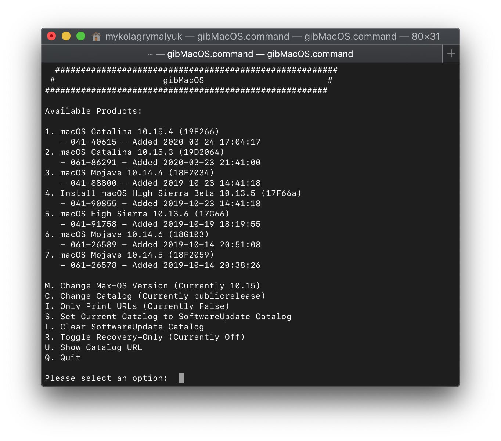
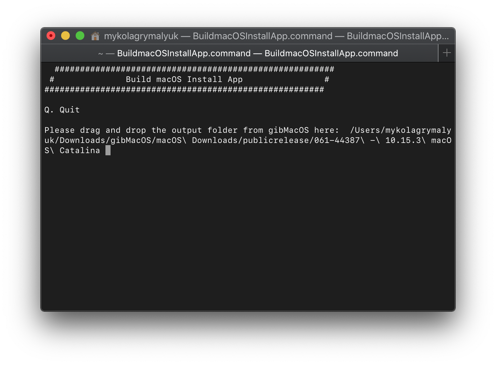
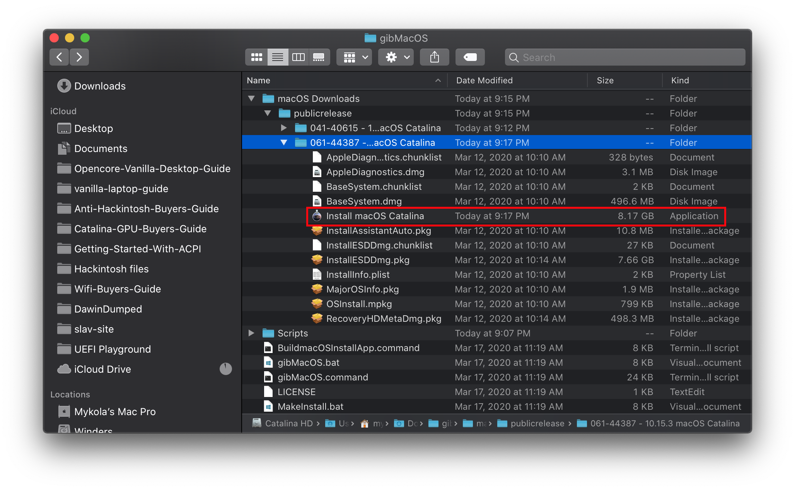

# Making the installer in macOS

* Supported version: 0.5.9

While you don't need a fresh install of macOS to use OpenCore, some users prefer having a fresh slate with their boot manager upgrades.

To start we'll want to grab ourselves a copy of macOS, you can skip this and head to formatting the USB if you're just making a bootable OpenCore stick and not an installer. For everyone else, you can either download macOS from the App Store or with gibMacOS

**Note for legacy users**

1. First follow the [Legacy Install](../extras/legacy.md) section
2. Once completed, continue the guide at the **[Downloading macOS](#downloading-macos)** section

For those needing macOS versions no longer hosted on Apple's catalog(ie. Sierra and older), follow the [Legacy macOS install](https://github.com/dortania/OpenCore-Install-Guide/blob/master/installer-guide/legacy-mac-install.md) guide

## Downloading macOS

From a  macOS machine that meets the requirements of the OS version you want to install, go directly to the AppStore and download the desired OS release the continue and continue to [**Setting up the installer**](#setting-up-the-installer)

For machines that need a specific OS release or can't download from the AppStore, you can use the GibMacOS utility.

Now lets grab [GibMacOS](https://github.com/corpnewt/gibMacOS), unzip on a local directory.

Next run the `gibMacOS.command`:



As you can see, we get a nice list of macOS installers. If you need beta versions of macOS, you can select `C. Change Catalog`. For this example we'll choose 1:


This is going to take a while as we're downloading the entire 8GB+ macOS installer, so highly recommend reading the rest of the guide while you wait.

Once finished, we'll next want to run the `BuildmacOSInstallApp.command`:



You will be prompted for the macOS installer files which were downloaded to `macOS Downloads` folder in the GibMacOS directory.

From the Finder, drill down to the folder containing the downloaded files and either drag it to the command line or "Cmd+C" and paste it to the terminal.

Once the task is completed exit the utility, you will find the Install file in the directory.

Move the newly created image to Applications folder, this will simplify the next section.



## Setting up the installer

Now we'll be formatting the USB to prep for both the macOS installer and OpenCore. We'll want to use macOS Extended(HFS+) with a GUID partition map. What this will do is create 2 partitions. The main `MyVolume` and a second called `EFI` which is used as a boot partition where your firmware will check for boot files.

* Note by default Disk Utility only shows partitions, press Cmd/Win+2 to show all devices(Alternatively you can press the view button)


Next run the `createinstallmedia` command provided by [Apple](https://support.apple.com/en-us/HT201372), note that the command is made for USB's formatted with the name `MyVolume`:

```
sudo /Applications/Install\ macOS\ Catalina.app/Contents/Resources/createinstallmedia --volume /Volumes/MyVolume
```

This will take some time so may want to grab a coffee or continue reading the guide(to be fair you really shouldn't be following this guide step by step without reading the whole thing first)

You can also replace the `createinstallmedia` path with that of where your installer's located, same idea with the drive name.

## Setting up OpenCore's EFI environment

Setting up OpenCore's EFI environment is simple, all you need to do is mount our EFI system partition. This is automatically made when we format with GUID but is unmounted by default, this is where our friend [MountEFI](https://github.com/corpnewt/MountEFI) comes in:


You'll notice that once we open the EFI partition, it's empty. This is where the fun begins.


## Now with all this done, head to [Setting up the EFI](../installer-guide/opencore-efi.md) to finish up your work
