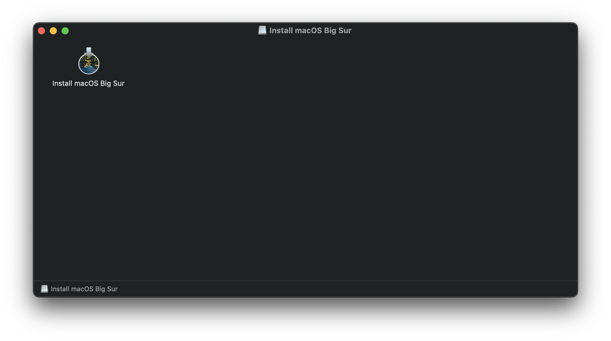

# Making the installer in macOS

* Supported version: 0.6.8

While you don't need a fresh install of macOS to use OpenCore, some users prefer having a fresh slate with their boot manager upgrades.

To start we'll want to grab ourselves a copy of macOS. You can skip this and head to formatting the USB if you're just making a bootable OpenCore stick and not an installer. For everyone else, you can either download macOS from the App Store or with Munki's script.

## Downloading macOS: Modern OS

* This method allows you to download macOS 10.13 and newer, for 10.12 and older see [Downloading macOS: Legacy OS](#downloading-macos-legacy-os)

From a macOS machine that meets the requirements of the OS version you want to install, go directly to the App Store and download the desired OS release and continue to [**Setting up the installer**](#setting-up-the-installer).

For machines that need a specific OS release or can't download from the App Store, you can use the Munki's InstallInstallMacOS utility.

In order to run it, just copy and paste the below command in a terminal window:

```sh
mkdir ~/macOS-installer && cd ~/macOS-installer && curl -O https://raw.githubusercontent.com/munki/macadmin-scripts/main/installinstallmacos.py && sudo python installinstallmacos.py
```


As you can see, we get a nice list of macOS installers. If you need a particular versions of macOS, you can select it by typing the number next to it. For this example we'll choose 10:


* **macOS 11, Big Sur Note**: As this OS is quite new, there's still some issues with certain systems to resolve. For more information, see here: [OpenCore and macOS 11: Big Sur](../extras/big-sur/README.md)
  * For first time users, we recommend macOS 10.15, Catalina
* **Nvidia GPU Note**: Reminder to verify whether your hardware support newer OSes, see [Hardware Limitations](../macos-limits.md)

This is going to take a while as we're downloading the entire 8GB+ macOS installer, so it's highly recommended to read the rest of the guide while you wait.

Once finished, you'll find in your `~/macOS-Installer/` folder a DMG containing the macOS Installer, called `Install_macOS_11.1-20C69.dmg` for example. Mount it and you'll find the installer application.

* Note: We recommend to move the Install macOS.app into the `/Applications` folder, as we'll be executing commands from there.
* Note 2: Running Cmd+Shift+G in Finder will allow you to easily jump to `~/macOS-installer`




From here, jump to [Setting up the installer](#setting-up-the-installer) to finish your work.

## Downloading macOS: Legacy OS

* This method allows you to download much older versions of OS X, currently supporting all Intel versions of OS X(10.4 to current)

  * [Legacy macOS: Offline method](./mac-install-pkg.md)
    * 10.10-10.12 Supported
  * [Legacy macOS: Online method(10.7-10.15 Supported)](./mac-install-recovery.md)
    * 10.7-11 Supported
  * [Legacy macOS: Disk Images](./mac-install-dmg.md)
    * 10.4-10.6 Supported

## Setting up the installer

Now we'll be formatting the USB to prep for both the macOS installer and OpenCore. We'll want to use macOS Extended (HFS+) with a GUID partition map. This will create two partitions: the main `MyVolume` and a second called `EFI` which is used as a boot partition where your firmware will check for boot files.

* Note: By default, Disk Utility only shows partitions – press Cmd/Win+2 to show all devices (alternatively you can press the View button)
* Note 2: Users following "Legacy macOS: Online method" section can skip to [Setting up OpenCore's EFI environment](#setting-up-opencore-s-efi-environment)


Next run the `createinstallmedia` command provided by [Apple](https://support.apple.com/en-us/HT201372). Note that the command is made for USB's formatted with the name `MyVolume`:

```sh
sudo /Applications/Install\ macOS\ Big\ Sur.app/Contents/Resources/createinstallmedia --volume /Volumes/MyVolume
```

This will take some time so you may want to grab a coffee or continue reading the guide (to be fair you really shouldn't be following this guide step by step without reading the whole thing first).

You can also replace the `createinstallmedia` path with that of where your installer's located (same idea with the drive name).

::: details Legacy createinstallmedia Commands

Pulled from Apple's own site: [How to create a bootable installer for macOS](https://support.apple.com/en-us/HT201372)

```sh
# Big Sur
sudo /Applications/Install\ macOS\ Big\ Sur.app/Contents/Resources/createinstallmedia --volume /Volumes/MyVolume

# Catalina
sudo /Applications/Install\ macOS\ Catalina.app/Contents/Resources/createinstallmedia --volume /Volumes/MyVolume

# Mojave
sudo /Applications/Install\ macOS\ Mojave.app/Contents/Resources/createinstallmedia --volume /Volumes/MyVolume

# High Sierra
sudo /Applications/Install\ macOS\ High\ Sierra.app/Contents/Resources/createinstallmedia --volume /Volumes/MyVolume

# Sierra
sudo /Applications/Install\ macOS\ Sierra.app/Contents/Resources/createinstallmedia --volume /Volumes/MyVolume --applicationpath /Applications/Install\ macOS\ Sierra.app

# El Capitan
sudo /Applications/Install\ OS\ X\ El\ Capitan.app/Contents/Resources/createinstallmedia --volume /Volumes/MyVolume --applicationpath /Applications/Install\ OS\ X\ El\ Capitan.app

# Yosemite
sudo /Applications/Install\ OS\ X\ Yosemite.app/Contents/Resources/createinstallmedia --volume /Volumes/MyVolume --applicationpath /Applications/Install\ OS\ X\ Yosemite.app

# Mavericks
sudo /Applications/Install\ OS\ X\ Mavericks.app/Contents/Resources/createinstallmedia --volume /Volumes/MyVolume --applicationpath /Applications/Install\ OS\ X\ Mavericks.app --nointeraction
```

:::

## Legacy Setup

For systems not supporting UEFI boot, see below:

::: details Setting up Legacy Boot

To start, you need the following:

* BootInstall_IA32.tool or BootInstall_X64.tool
  * This can be found in OpenCorePkg under `/Utilties/LegacyBoot/`
* Install USB(Created above)

Within your OpenCore build folder, navigate to `Utilities/LegacyBoot`. Here you'll find a file called `BootInstall_ARCH.tool`. What this does is install DuetPkg to your desired drive.


Now run this tool in terminal **with sudo**(This tool will likely fail otherwise):

```sh
# Replace X64 with IA32 if you have a 32-Bit CPU
sudo ~/Downloads/OpenCore/Utilities/legacyBoot/BootInstall_X64.tool
```


This will give you a list of available disks, choose yours and you will be prompted to write a new MBR. Choose yes`[y]` and you'll be finished.


This will provide you with an EFI partition with either a **bootia32** or **bootx64** file

:::

## Setting up OpenCore's EFI environment

Setting up OpenCore's EFI environment is simple – all you need to do is mount our EFI system partition. This is automatically made when we format with GUID but is unmounted by default, this is where our friend [MountEFI](https://github.com/corpnewt/MountEFI) comes in:


You'll notice that once we open the EFI partition, it's empty. This is where the fun begins.


## Now with all of this done, head to [Setting up the EFI](./opencore-efi.md) to finish up your work
