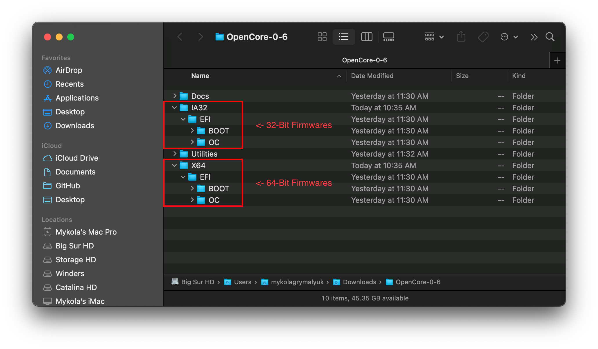
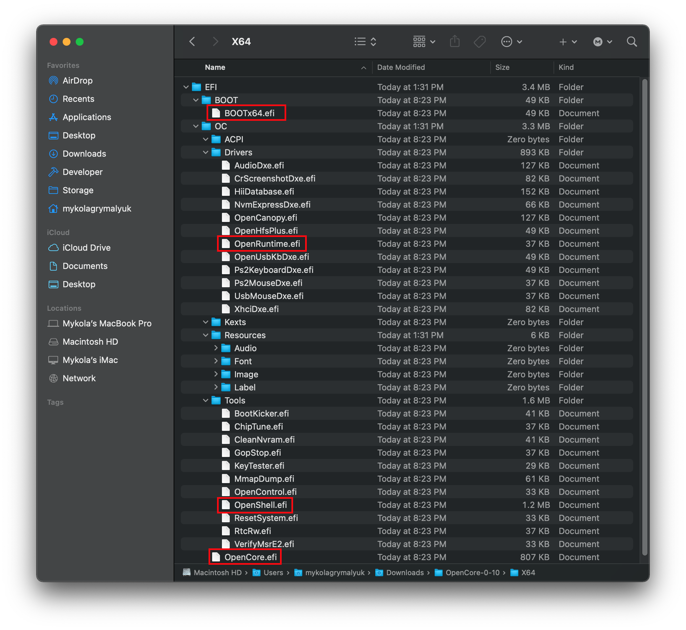
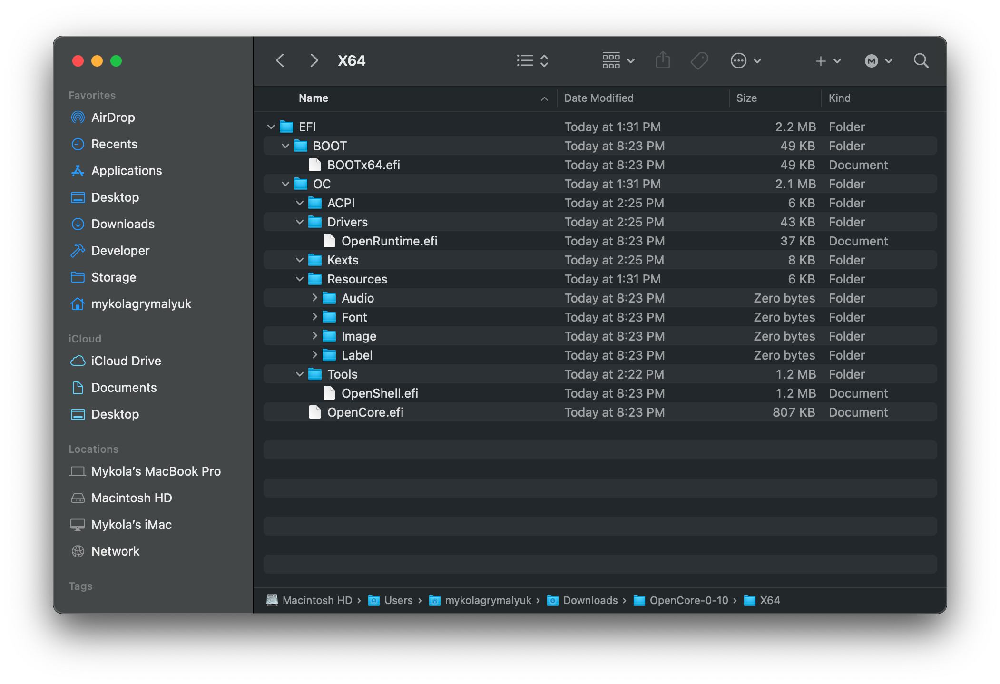
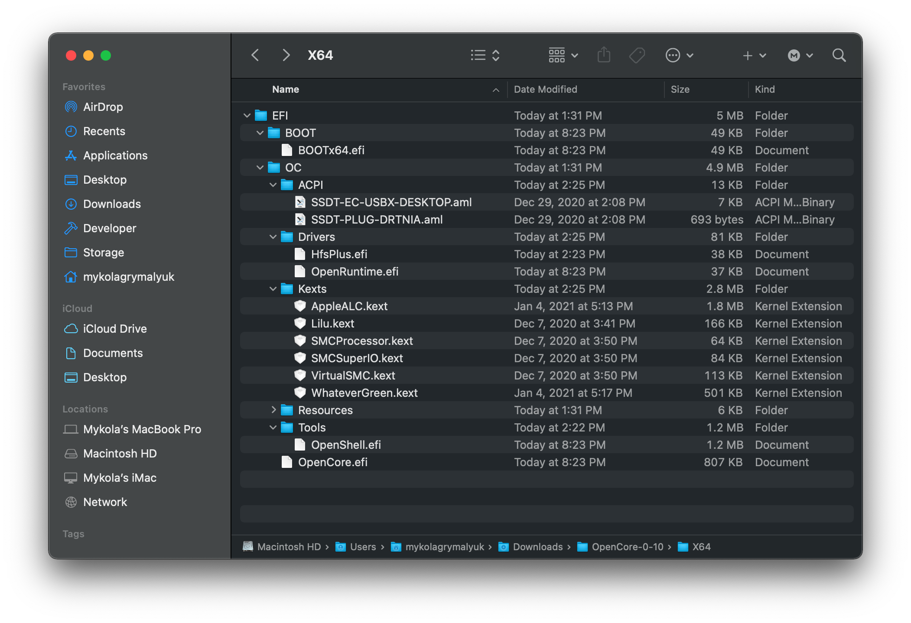

# Adding The Base OpenCore Files

* Supported version: 0.6.5

To setup OpenCore’s folder structure, you’ll want to grab the EFI folder found in [OpenCorePkg's releases](https://github.com/acidanthera/OpenCorePkg/releases/). Note that they will be under either the IA32 or X64 folders, the former for 32-bit Firmwares and the latter for 64-bit Firmwares:

Regarding DEBUG versus RELEASE version:

* **DEBUG**: Can greatly help with debugging boot issues, however can add some noticeable delay to boot times(ie. 3-5 seconds to get to the picker). Once installed you can easily transition to RELEASE
* **RELEASE**: Much snappier boot times, however virtually no useful DEBUG info is provided in OpenCore making troubleshooting much more difficult.

And once downloaded, place the EFI folder(from OpenCorePkg) on the root of your EFI partition:

**Note**:

* **Windows users:** you'll want to place the EFI folder on the root of the USB drive you made earlier
* **Linux users:** This is the `OPENCORE` partition we created earlier
  * Note that Method 1 only creates 1 partition, while Method 2 creates 2 partitions

Now lets open up our EFI folder and see what's inside:

Now something you'll notice is that it comes with a bunch of files in `Drivers` and `Tools` folder, we don't want most of these:

* **Remove from Drivers:**
  * AudioDxe.efi
    * Unrelated to Audio support in macOS
  * CrScreenshotDxe.efi
    * Used for taking screenshots in UEFI, not needed by us
  * OpenUsbKbDxe.efi
    * Used for OpenCore picker on **legacy systems running DuetPkg**, [not recommended and even harmful on Ivy Bridge and newer](https://applelife.ru/threads/opencore-obsuzhdenie-i-ustanovka.2944066/page-176#post-856653)
  * UsbMouseDxe.efi
    * similar idea to OpenUsbKbDxe, should only be needed on legacy systems using DuetPkg
  * NvmExpressDxe.efi
    * Used for Haswell and older when no NVMe driver is built into the firmware
  * XhciDxe.efi
    * Used for Sandy Bridge and older when no XHCI driver is built into the firmware
    * Only needed if you're using a USB 3.0 expansion card in an older machine
  * HiiDatabase.efi
    * Used for fixing GUI support like OpenShell.efi on Sandy Bridge and older
    * Not required for booting
  * OpenCanopy.efi
    * This is OpenCore's optional GUI, we'll be going over how to set this up in [Post Install](https://dortania.github.io/OpenCore-Post-Install/cosmetic/gui.html) so remove this for now
  * Ps2KeyboardDxe.efi + Ps2MouseDxe.efi
    * Pretty obvious when you need this, USB keyboard and mouse users don't need it
    * Reminder: PS2 ≠ USB

* **Remove everything from Tools:**
  * Way to many to list them all, but I recommend keeping OpenShell.efi for troubleshooting purposes

A cleaned up EFI:

Now you can place **your** necessary firmware drivers(.efi) into the _Drivers_ folder and Kexts/ACPI into their respective folders. See [Gathering Files](../ktext.md) for more info on which files you should be using.

* Please note that UEFI drivers from Clover are not supported with OpenCore!(EmuVariableUEFI, AptioMemoryFix, OsxAptioFixDrv, etc). Please see the [Clover firmware driver conversion](https://github.com/dortania/OpenCore-Install-Guide/blob/master/clover-conversion/clover-efi.md) for more info on supported drivers and those merged into OpenCore.

Here's what a populated EFI ***can*** look like (yours will be different):

**Reminder**:

* SSDTs and custom DSDTs(`.aml`) go in ACPI folder
* Kexts(`.kext`) go in Kexts folder
* Firmware drivers(`.efi`) go in the Drivers folder

# Now with all this done, head to [Gathering Files](../ktext.md) to get the needed kexts and firmware drivers
