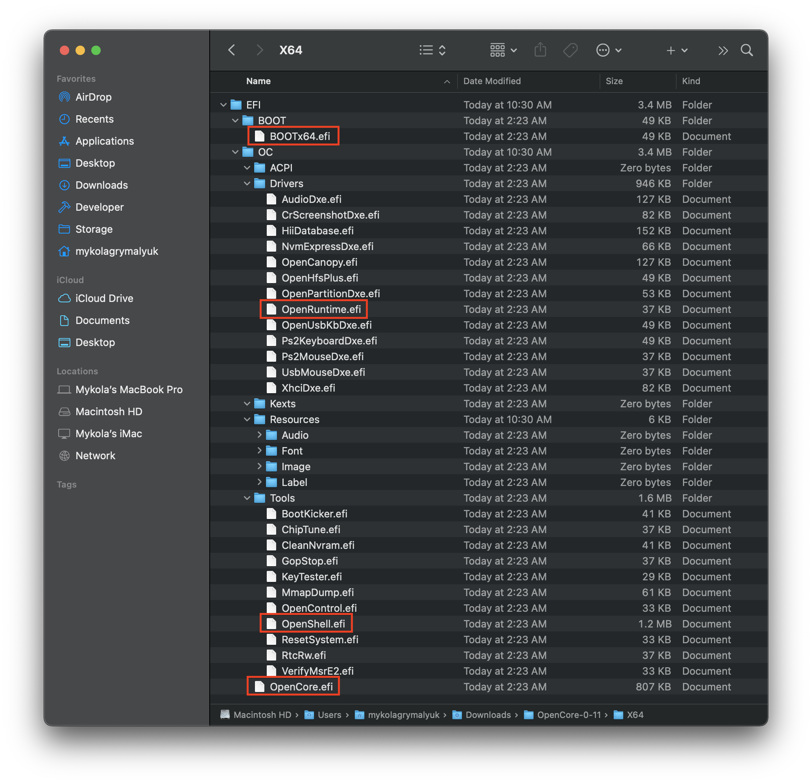

# Agregando los archivos base de OpenCore

* Versión soportada: 0.5.9

Para configurar la estructura de carpetas de OpenCore, debes tomar la carpeta EFI que se encuentra en los [lanzamientos de OpenCore](https://github.com/acidanthera/OpenCorePkg/releases/) y colocarla en la raíz de tu partición EFI

* Usuarios de Windows: Esto ya estará en la partición `BOOT` de tu USB, el cual fue creado por MakeInstall
* Usuarios de linux: Esta es la partición `OPENCORE` creada anteriormente
  * Cabe mencionar que el método 1 sólo crea una partición, mientras que el método dos crea dos particiones

Algo que te darás cuenta es que esta carpeta viene con varios archivos en las subcarpetas `Drivers` y `Tools`, no queremos la mayoría de estos.

* **Eliminar de drivers:**
  * AudioDxe.efi
    * No relacionado con el soporte de audio en macOS
  * CrScreenshotDxe.efi
    * Se usa para tomar capturas de pantalla en UEFI, no es necesario para nosotros
  * OpenUsbKbDxe.efi
    * Se utiliza para el menú de selección de OpenCore en **sistemas Legacy que ejecutan DuetPkg**, [no recomendado e incluso dañino en Ivy Bridge y posterior](https://applelife.ru/threads/opencore-obsuzhdenie-i-ustanovka.2944066/page-176#post-856653)
  * UsbMouseDxe.efi
    * idea similar a OpenUsbKbDxe, solo debería ser necesaria en sistemas Legacy que usan DuetPkg
  * NvmExpressDxe.efi
    * Se utiliza para Haswell y versiones anteriores cuando no hay un controlador NVMe integrado en el firmware
  * XhciDxe.efi
    * Se usa para Sandy Bridge y versiones anteriores cuando no hay un controlador XHCI integrado en el firmware
  * HiiDatabase.efi
    * Se usa para arreglar el soporte de GUI como OpenShell.efi en Sandy Bridge y versiones anteriores
  * OpenCanopy.efi
    * Testa es la GUI opcional de OpenCore, veremos cómo configurar esto en [Post Instalación](https://dortania.github.io/OpenCore-Post-Install/cosmetic/gui.html), así que elimina esto por ahora
  * Ps2KeyboardDxe.efi + Ps2MouseDxe.efi
    * Es bastante obvio en qué casos los lo necesitas, los usuarios de teclado y mouse USB no lo necesitan
    * Recordatorio: PS2 ≠ USB

* **Borra todo de la carpeta "tools"**
  * Son demasiados para enumerarlos a todos, pero recomiendo mantener OpenShell.efi para solucionar eventuales problemas.

Una EFI limpia:

Ahora puedes colocar **tus** drivers de firmware necesarios (.efi) en la carpeta _Drivers_ y Kexts / ACPI en sus respectivas carpetas. Ten en cuenta que los drivers UEFI de Clover no son compatibles con OpenCore (EmuVariableUEFI, AptioMemoryFix, OsxAptioFixDrv, etc.). Consulta la [Página de conversión de drivers del firmware de Clover](https://github.com/dortania/OpenCore-Install-Guide/blob/master/clover-conversion/clover-efi.md) para obtener más información sobre los drivers compatibles y aquellos fusionados en OpenCore.
Así es como ***puede*** verse un EFI poblado (el tuyo probablemente será diferente):

**Recordatorio**:

* Los SSDTs y DSDTs personalizados (`.aml`) van en la carpeta ACPI
* Los Kexts(`.kext`) van en la carpeta Kexts
* Los drivers del Firmware (`.efi`) van el la carpeta Drivers

# Ahora, con todo esto hecho

... dirígete a [Recolectando archivos](/ktext.md) a obtener los kexts y drivers del firmware que necesitas.
