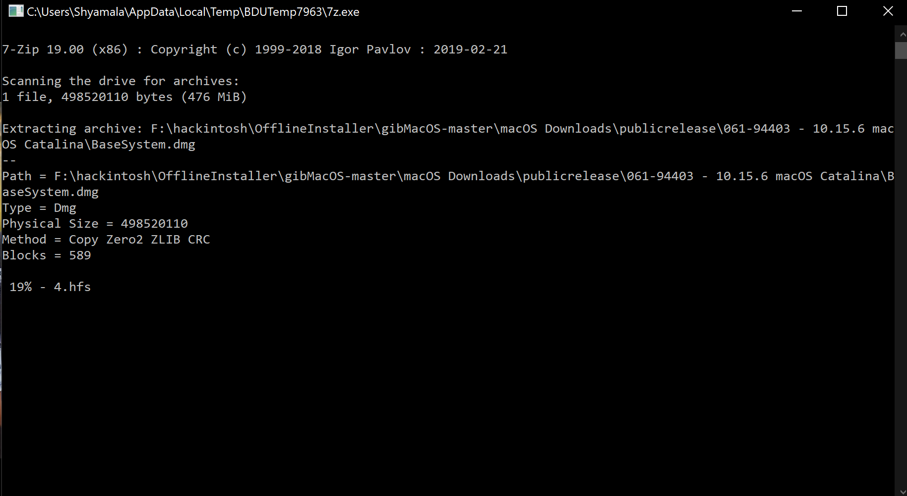
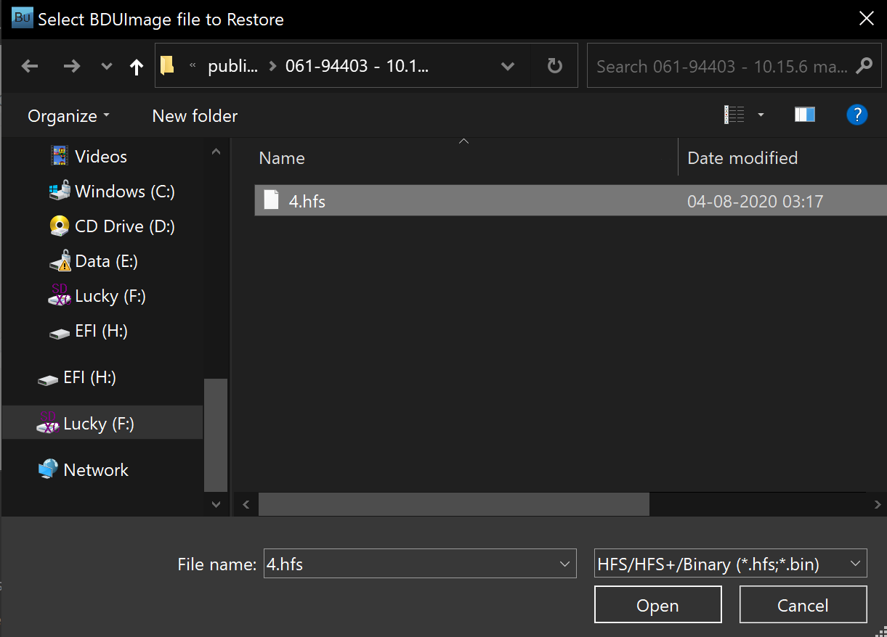

# Making the installer in Windows

* Supported version: 0.6.0

While you don't need a fresh install of macOS to use OpenCore, some users prefer having a fresh slate with their boot manager upgrades.

## Prerequisites for network installer

* 4GB USB Stick
* [GibMacOS](https://github.com/corpnewt/gibMacOS)

## Prerequisites for offline installer

* 12GB USB Stick
* [GibMacOS](https://github.com/corpnewt/gibMacOS)

## Downloading macOS

To start, open gibMacOS.bat as Admin and if only want t download  network installer select `Toggle Recovery-Only` this will only download the offline installer:

Now search through for your desired version of macOS, for this example we'll choose option 5 for macOS Catalina:

This will download the installer to `\gibmacos-master\macOS Downloads\publicrelease\xxx-xxxxx - 1x.x.x macOS xxx`

## Making the installer

* [Making the network installer](#making-the-network-installer)
* [Making the offline installer](#making-the-offline-installer)

### Making the network installer

Next open `MakeInstall.bat` as Admin and select your drive with option O for OpenCore( ex: 1O).

Once your drive is formatted, it will then ask you for the `RecoveryHDMetaDMG.pkg` that we downloaded earlier. Top left of the file window will let you copy the file path:

MakeInstall will finish up by installing OpenCore to your USB's EFI System Partition, you can find this partition labeled as `BOOT`:

### Making the offline installer

To make an offline installer

1. Plug in your USB Stick if you didn't
2. extract BDU and run it

3. Go to Options-->Configuration
4. Select Not Install, Boot Records as `Clover` and name it `EFI` and leave everything as is and press OK.

5. now select your USB Stick and press format.
Now that we have a EFI and installer partitions lets add the installer to the installer partition
6. Go to Tools--> Extract HFS(HFS+) partition from DMG-files and here go to the location where your downloaded files from GibMacOS are located and select the BaseSystem.dmg and then select where you want to save the output

7. now a Command Prompt will open and it will create 4.hfs in the location you selected this will take some time so be patient after that you will get a pop up HFS Volume Extracted click OK and continue

8. Now we have to expand our USB Stick By pressing + in BDU then select the second partition

9. now press restore and select the 4.hfs we extracted before

## Now with all this done, head to [Setting up the EFI](../installer-guide/opencore-efi.md) to finish up your work
