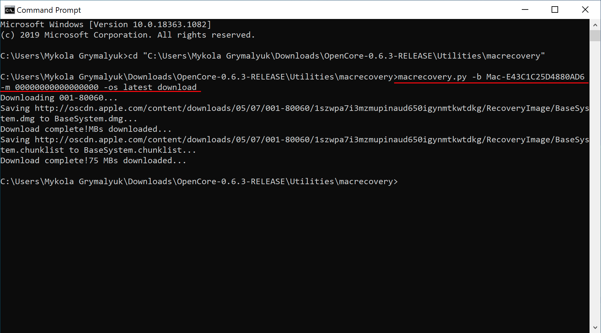
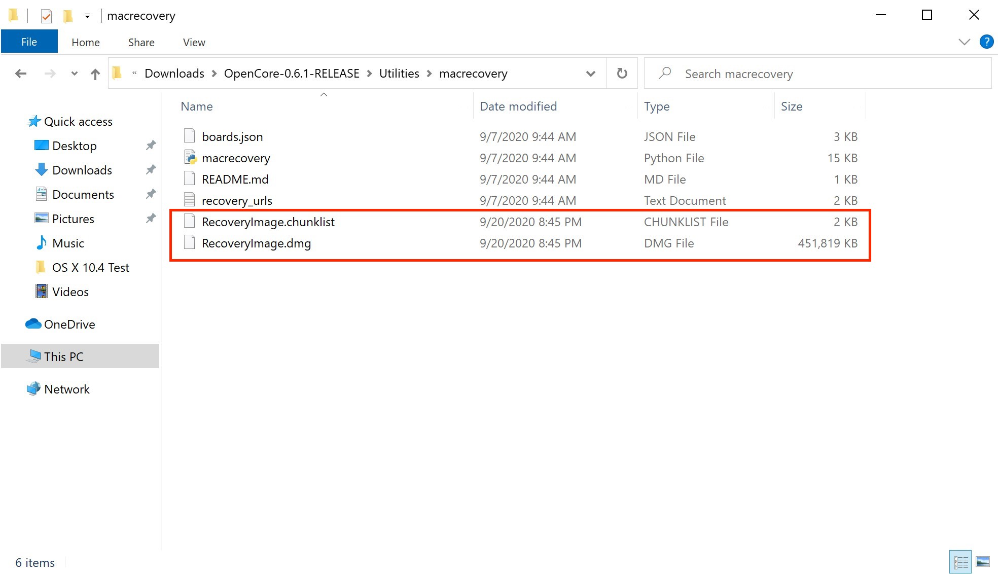
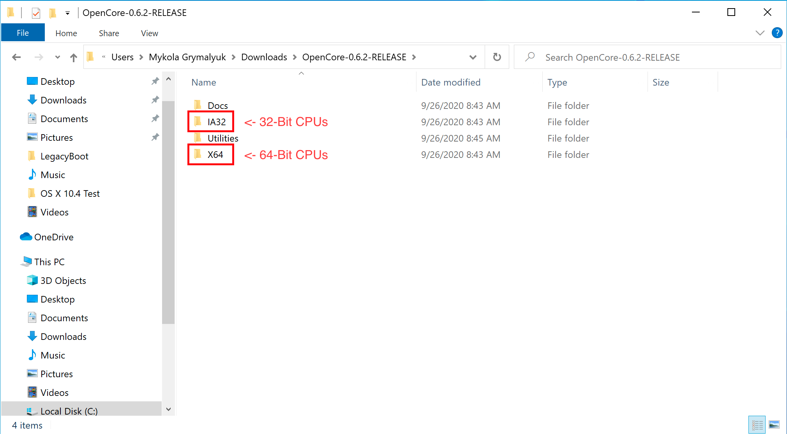
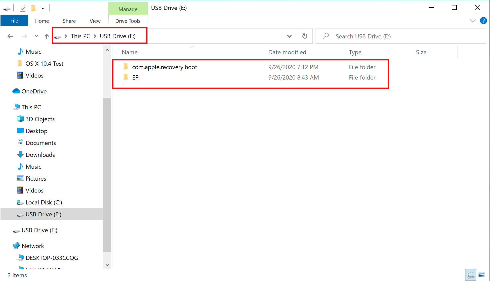
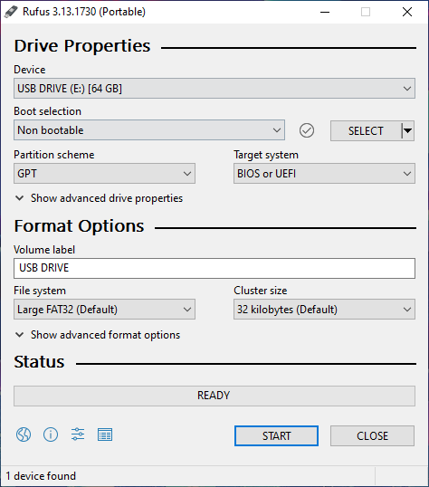
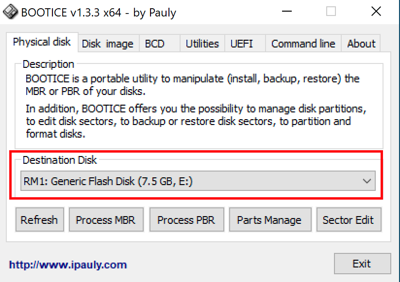
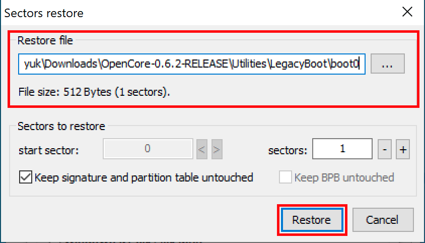

# Making the installer in Windows

* Supported version: 0.6.5

While you don't need a fresh install of macOS to use OpenCore, some users prefer having a fresh slate with their boot manager upgrades.

To start you'll need the following:

* 4GB USB Stick

* For USB larger than 16 GB to format in FAT32 use [Rufus method](#rufus-method)

* [macrecovery.py](https://github.com/acidanthera/OpenCorePkg/releases)
  * This will require [Python installed](https://www.python.org/downloads/)

## Downloading macOS

To grab legacy installers is super easy, first grab a copy of [OpenCorePkg](https://github.com/acidanthera/OpenCorePkg/releases) and head to `/Utilities/macrecovery/`. Next copy the folder path for the macrecovery folder:


From here, you'll want to open up a Command Prompt and cd into the macrecovery folder that we copied earlier:

```sh
cd Paste_Folder_Path
```


Now run one of the following depending on what version of macOS you want(Note these scripts rely on [Python](https://www.python.org/downloads/) support, please install if you haven't already):

```sh
# Lion(10.7):
python macrecovery.py -b Mac-2E6FAB96566FE58C -m 00000000000F25Y00 download
python macrecovery.py -b Mac-C3EC7CD22292981F -m 00000000000F0HM00 download

# Mountain Lion(10.8):
python macrecovery.py -b Mac-7DF2A3B5E5D671ED -m 00000000000F65100 download

# Mavericks(10.9):
python macrecovery.py -b Mac-F60DEB81FF30ACF6 -m 00000000000FNN100 download

# Yosemite(10.10):
python macrecovery.py -b Mac-E43C1C25D4880AD6 -m 00000000000GDVW00 download

# El Capitan(10.11):
python macrecovery.py -b Mac-FFE5EF870D7BA81A -m 00000000000GQRX00 download

# Sierra(10.12):
python macrecovery.py -b Mac-77F17D7DA9285301 -m 00000000000J0DX00 download

# High Sierra(10.13)
python macrecovery.py -b Mac-7BA5B2D9E42DDD94 -m 00000000000J80300 download
python macrecovery.py -b Mac-BE088AF8C5EB4FA2 -m 00000000000J80300 download

# Mojave(10.14)
python macrecovery.py -b Mac-7BA5B2DFE22DDD8C -m 00000000000KXPG00 download

# Catalina(10.15)
python macrecovery.py -b Mac-00BE6ED71E35EB86 -m 00000000000000000 download

# Latest version
# ie. Big Sur(11)
python macrecovery.py -b Mac-E43C1C25D4880AD6 -m 00000000000000000 download

# Note, Apple has temporarily removed Big Sur from the Recovery Catalog
# Expect Apple to resolve this sometime after the holidays
```

* **macOS 11, Big Sur Note**: As this OS is quite new, there's still some issues with certain systems to resolve. For more information, see here: [OpenCore and macOS 11: Big Sur](../extras/big-sur/README.md)
  * For first time users, we recommend macOS 10.15, Catalina
* **Nvidia GPU Note**: Reminder to verify whether your hardware support newer OSes, see [Hardware Limitations](../macos-limits.md)

This will take some time, however once you're finished you should get either BaseSystem or RecoveryImage files:



| BaseSystem | RecoveryImage |
| :--- | :--- |
| |  |

Now with our installer downloaded, we'll next want to format out USB.

## Making the installer

Here we'll be formatting our USB and adding macOS onto it, we have 2 options:

* [Disk Management method](#disk-management-method)
  * GUI Based, simplest way
  * Only UEFI systems are supported(ex. 2012+)
* [Rufus method](#rufus-method)
  * GUI Based, simplest way
  * For larger USB drives(16GB+)
* [diskpart method](#diskpart-method)
  * Command line based, little more work
  * Required for legacy systems(ie. non-UEFI, pre-2012)

### Disk Management method

Simply open up Disk Management, and format your USB as FAT32:

1. Right click the Start Button on your task bar and select Disk Management.
2. You should see all of your partitions and disks. On the bottom half, you'll see your devices. Find your USB.
3. You'll want to format the USB to have a FAT32 partition.

* If you have multiple partitions on the USB, right click each partition and click Delete Volume for your USB (This will remove data, make sure you have backups and only remove partitions from your USB)
  * Right click the unallocated space and create a new simple volume. Make sure it is FAT32 and at least a gigabyte or two big. Name it "EFI".
* Otherwise, right click the partition on the USB and click Format and set it to FAT32.


Next, go to the root of this USB drive and create a folder called `com.apple.recovery.boot`. Then move the downloaded BaseSystem or RecoveryImage files. Please ensure you copy over both the .dmg and .chunklist files to this folder:


Now grab OpenCorePkg you downloaded earlier and open it:



Here we see both IA32(32 Bit CPUs) and X64(64 Bit CPUs) folders, choose the one that's most appropriate to your hardware and open it. Next grab the EFI folder inside and place this on the root of the USB drive along side com.apple.recovery.boot. Once done it should look like this:



### Rufus method

1. Download [Rufus](https://rufus.ie/)
2. Set the BOOT selection as not bootable
3. Set File System as Large FAT32
4. Click Start
5. Delete all file autorun in USB Drive partition



Next, go to the root of this USB drive and create a folder called `com.apple.recovery.boot`. Then move the downloaded BaseSystem or RecoveryImage files. Please ensure you copy over both the .dmg and .chunklist files to this folder:


Now grab OpenCorePkg you downloaded earlier and open it:


Here we see both IA32(32 Bit CPUs) and X64(64 Bit CPUs) folders, choose the one that's most appropriate to your hardware and open it. Next grab the EFI folder inside and place this on the root of the USB drive along side com.apple.recovery.boot. Once done it should look like this:


### diskpart method

::: details diskpart method

Press Windows + R and enter `diskpart`.

Now run the following:

```sh
# List available disks
list disk
# Select your disk(ie. disk 1)
select disk 1
# Format the drive
clean
# Convert to GPT
# Due to an odd bug with BOOTICE and DuetPkg, MBR disks will fail to boot
convert gpt
# Create a new partition
create partition primary
# Select your partition
# Running clean ensures we only have 1 partition so it will be "partition 1"
select partition 1
# Format the drive as FAT32
format fs=fat32 quick
# Assign a drive letter(ie. Drive E, ensure it's not currently in use)
ASSIGN LETTER=E
```

Next, go to the root of this USB drive and create a folder called `com.apple.recovery.boot`. Then move the downloaded BaseSystem or RecoveryImage files. Please ensure you copy over both the .dmg and .chunklist files to this folder:


Now grab OpenCorePkg you downloaded earlier and open it:


Here we see both IA32(32 Bit CPUs) and X64(64 Bit CPUs) folders, choose the one that's most appropriate to your hardware and open it. Next grab the EFI folder inside and place this on the root of the USB drive along side com.apple.recovery.boot. Once done it should look like this:


::: details Legacy Install Setup

If your firmware does not support UEFI, see below instructions:

To start, you'll need the following:

* [7-Zip](https://www.7-zip.org)
* [BOOTICE](https://www.majorgeeks.com/files/details/bootice_64_bit.html)
* [OpenCorePkg](https://github.com/acidanthera/OpenCorePkg/releases)

Next, open up BOOTICE and ensure you've selected the right drive.



Next, enter "Process MBR" then select "Restore MBR" and select the **boot0** file from `Utilities/LegacyBoot/` in OpenCorePkg:

| Restore MBR | Restore boot0 file |
| :--- | :--- |
|  |  |

Then head back to the main screen and select "Process PBR" then "Restore PBR". From here, choose the **Boot1f32** file from `Utilities/LegacyBoot/` in OpenCorePkg:

| Restore PBR | Restore boot1f32 file |
| :--- | :--- |
|  |  |

Once this is done, head back to your USB and do 1 final thing. Grab either the **bootx64**(64 Bit CPUs) or **bootia32**(32 Bit CPUs) file from `Utilities/LegacyBoot/` and place it on the root of your drive. **Rename this file to boot** to ensure DuetPkg can properly:


:::

## Now with all this done, head to [Setting up the EFI](./opencore-efi.md) to finish up your work
