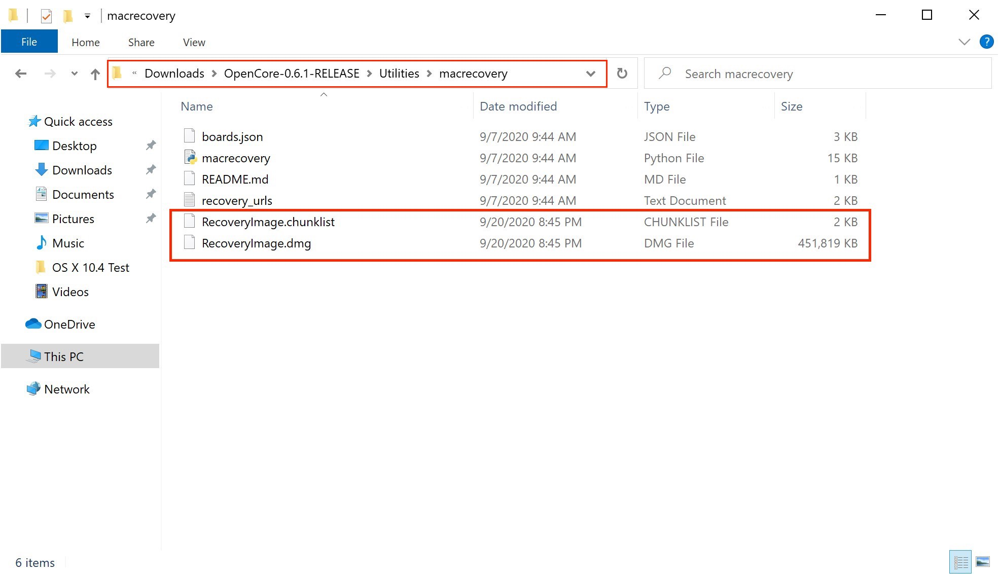
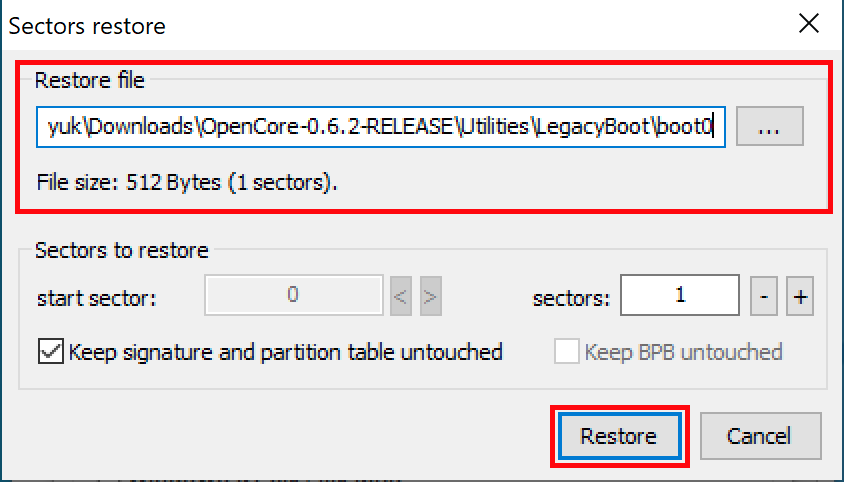
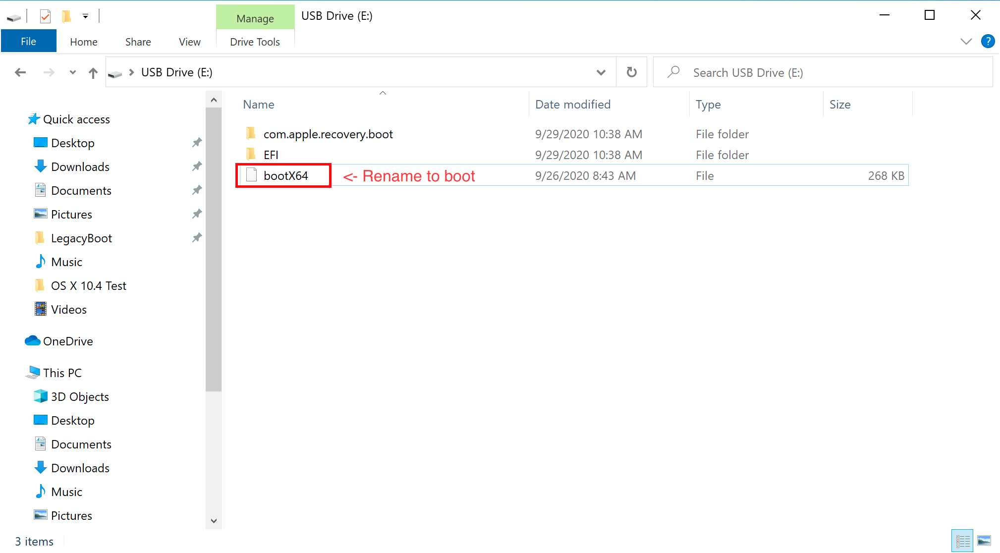

# 在 Windows 中制作安装程序

虽然你不需要重新安装macOS来使用OpenCore，但一些用户更喜欢使用全新的引导管理器升级。

开始之前，你需要做好以下准备：

* 4GB 的 U 盘

* 对于大于 16GB 的 USB ，使用 [Rufus method](#rufus-method) 格式化成 FAT32。

* [macrecovery.py](https://github.com/acidanthera/OpenCorePkg/releases)
  * 这需要 [安装 Python 3](https://www.python.org/downloads/)

## 下载 macOS

要获取传统的安装程序非常容易，首先获取 [OpenCorePkg](https://github.com/acidanthera/OpenCorePkg/releases) 然后转到 `/Utilities/macrecovery/`. 接下来，单击当前文件夹路径旁边的，输入 `cmd` ，在当前目录中打开命令提示符:


现在根据你想要的macOS版本运行以下其中之一(注意这些脚本依赖于[Python 3](https://www.python.org/downloads/) 支持，如果你还没有安装请安装):

```sh
# Lion (10.7):
python3 macrecovery.py -b Mac-2E6FAB96566FE58C -m 00000000000F25Y00 download
python3 macrecovery.py -b Mac-C3EC7CD22292981F -m 00000000000F0HM00 download

# Mountain Lion (10.8):
python3 macrecovery.py -b Mac-7DF2A3B5E5D671ED -m 00000000000F65100 download

# Mavericks (10.9):
python3 macrecovery.py -b Mac-F60DEB81FF30ACF6 -m 00000000000FNN100 download

# Yosemite (10.10):
python3 macrecovery.py -b Mac-E43C1C25D4880AD6 -m 00000000000GDVW00 download

# El Capitan (10.11):
python3 macrecovery.py -b Mac-FFE5EF870D7BA81A -m 00000000000GQRX00 download

# Sierra (10.12):
python3 macrecovery.py -b Mac-77F17D7DA9285301 -m 00000000000J0DX00 download

# High Sierra (10.13)
python3 macrecovery.py -b Mac-7BA5B2D9E42DDD94 -m 00000000000J80300 download
python3 macrecovery.py -b Mac-BE088AF8C5EB4FA2 -m 00000000000J80300 download

# Mojave (10.14)
python3 macrecovery.py -b Mac-7BA5B2DFE22DDD8C -m 00000000000KXPG00 download

# Catalina (10.15)
python3 macrecovery.py -b Mac-00BE6ED71E35EB86 -m 00000000000000000 download

# Big Sur (11)
python3 macrecovery.py -b Mac-42FD25EABCABB274 -m 00000000000000000 download

# Monterey (12)
python3 macrecovery.py -b Mac-FFE5EF870D7BA81A -m 00000000000000000 download

# Latest version
# ie. Ventura (13)
python3 macrecovery.py -b Mac-4B682C642B45593E -m 00000000000000000 download
```

* **macOS 12及以上版本注意**: 由于最新版本的 macOS 对 USB 栈进行了更改，因此强烈建议您在安装 macOS 之前(使用 USBToolBox )映射USB端口。
  * <span style="color:red"> 注意: </span> 在 macOS 11.3 及更新版本中，[XhciPortLimit被破坏导致启动循环](https://github.com/dortania/bugtracker/issues/162).
    * 如果你已经[映射了你的USB端口](https://dortania.github.io/OpenCore-Post-Install/usb/) 并且禁用了 `XhciPortLimit` ，那么你可以正常启动 macOS 11.3+。

这需要一些时间，但是一旦你完成，你应该得到BaseSystem或RecoveryImage文件:


| BaseSystem | RecoveryImage |
| :--- | :--- |
| |  |

现在安装程序已经下载完毕，接下来我们要格式化USB。

## 制作安装程序

在这里，我们将格式化我们的 USB 并将 macOS 添加到其中，我们有两个选择:

* [磁盘管理方法](#disk-management-method)
  * 基于GUI，最简单的方式
  * 仅支持UEFI系统(例如:2012+)
* [Rufus 方法](#rufus-method)
  * 基于GUI，最简单的方式
  * 用于更大的USB驱动器(16GB以上)
* [diskpart 方法](#diskpart-method)
  * 基于命令行，更多的工作
  * 传统系统所需(如：非uefi, 2012年之前)

### 磁盘管理方法

只需打开磁盘管理，并将USB格式化为FAT32:

1. 右键单击任务栏上的“开始”按钮并选择“磁盘管理”。
2. 您应该会看到所有分区和磁盘。在下半部分，你会看到你的设备。找到你的USB。
3. 你需要将USB格式化为FAT32分区。

* 如果你在USB上有多个分区，右键单击每个分区并单击USB的删除卷(这将删除数据，确保你有备份，只删除USB的分区)
  * 点击右键未分配的空间,创建一个新的简单卷。请确保它是FAT32，并且至少有1g或2g大。命名为“EFI”。
* 否则，右键单击USB上的分区，单击“格式化”，设置为FAT32。


接下来，在这个u盘的根目录下创建一个名为`com.apple.recovery.boot`的文件夹。然后移动下载的 baseSystem 或 RecoveryImage 文件。请确保将 .dmg 和 .chunklist 文件都复制到这个文件夹:


现在获取之前下载的 OpenCorePkg 并打开它:


这里我们看到 IA32(32位cpu) 和 X64(64位cpu) 文件夹，选择一个最适合你的硬件，并打开它。接下来，抓取里面的EFI文件夹，并将其与 com.apple.recovery.boot 一起放在USB驱动器的根目录上。完成后，它看起来应该像这样:


### Rufus 方法

1. 下载 [Rufus](https://rufus.ie/)
2. 将BOOT选项设置为“无引导”
3. 设置文件系统为 Large FAT32
4. 单击“开始”
5. 删除u盘分区中所有“autorun”文件


接下来，在这个u盘的根目录下创建一个名为 `com.apple.recovery.boot` 的文件夹。然后移动下载的 baseSystem 或 RecoveryImage 文件。请确保将 .dmg 和 .chunklist 文件都复制到这个文件夹:


现在获取之前下载的 OpenCorePkg 并打开它:


这里我们看到 IA32(32位cpu) 和 X64(64位cpu) 文件夹，选择一个最适合你的硬件，并打开它。接下来，抓取里面的EFI文件夹，并将其与 com.apple.recovery.boot 一起放在USB驱动器的根目录上。完成后，它看起来应该像这样:


### diskpart 方法

::: details diskpart 方法

按 Windows+R 并输入 `diskpart` 。

现在运行以下命令:

```sh
# List available disks
list disk
# Select your disk(ie. disk 1)
select disk 1
# Format the drive
clean
# Convert to GPT
# Due to an odd bug with BOOTICE and DuetPkg, MBR disks will fail to boot
convert gpt
# Create a new partition
create partition primary
# Select your partition
# Running clean ensures we only have 1 partition so it will be "partition 1"
select partition 1
# Format the drive as FAT32
format fs=fat32 quick
# Assign a drive letter(ie. Drive E, ensure it's not currently in use)
ASSIGN LETTER=E
```

接下来，在这个u盘的根目录下创建一个名为 `com.apple.recovery.boot` 的文件夹。然后移动下载的 baseSystem 或 RecoveryImage 文件。请确保将 .dmg 和 .chunklist 文件都复制到这个文件夹:


现在获取之前下载的 OpenCorePkg 并打开它:


这里我们看到 IA32(32位cpu) 和 X64(64位cpu) 文件夹，选择一个最适合你的硬件，并打开它。接下来，抓取其中的EFI文件夹，并将其与 com.apple.recovery.boot 放在USB驱动器的根目录下。完成后，它看起来应该像这样:


::: details 传统安装设置

如果您的固件不支持UEFI，请参阅以下说明:

首先，你需要以下东西:

* [7-Zip](https://www.7-zip.org)
* [BOOTICE](https://www.majorgeeks.com/files/details/bootice_64_bit.html)
* [OpenCorePkg](https://github.com/acidanthera/OpenCorePkg/releases)

接下来，打开 BOOTICE 并确保选择了正确的驱动器。


接下来，输入“Process MBR”，然后选择“Restore MBR”，并在 OpenCorePkg 中从 `Utilities/LegacyBoot/` 中选择 **boot0** 文件:

| Restore MBR | Restore boot0 file |
| :--- | :--- |
|  |  |

返回主界面，选择 "Process PBR" 然后选择 "Restore PBR". 从 OpenCorePkg 的 `Utilities/LegacyBoot/` 中选择 **boot1f32** 文件:

| Restore PBR | Restore boot1f32 file |
| :--- | :--- |
|  |  |

一旦完成，回到你的USB，做最后一件事。从 `Utilities/LegacyBoot/` 中获取 **bootx64** (64位cpu)或 **bootia32** (32位cpu)文件，并将其放在驱动器的根目录下。 **将这个文件重命名为boot** 以确保DuetPkg可以正常运行:



:::

## 现在所有这些都完成了，前往[设置EFI](./opencore-efi.md)来完成你的工作
