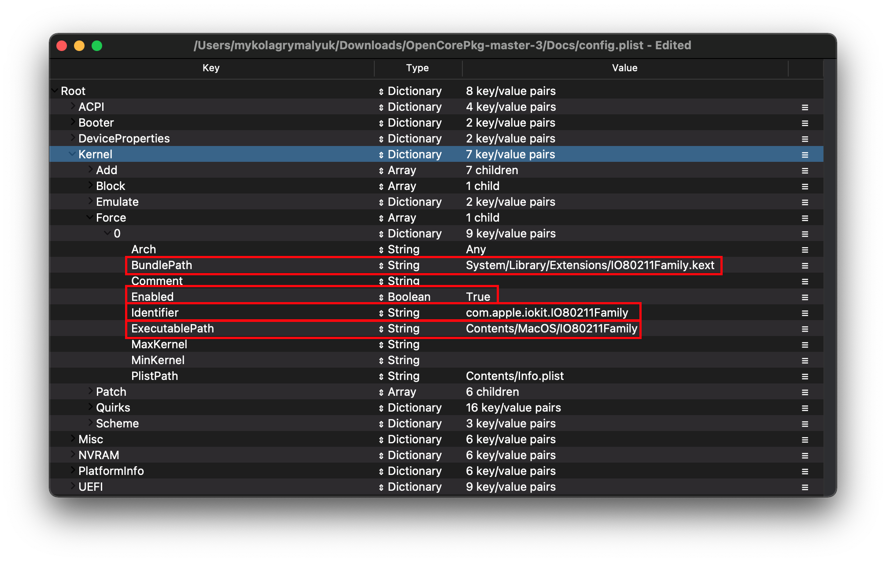

# 收集文件

本节是为引导macOS收集杂项文件，我们希望你在开始之前很好地了解你的硬件，并希望在此之前制作一个Hackintosh，因为我们不会在这里深入探讨。

> 知道我的硬件是否被支持的最好的方法是什么?

请参阅 [**硬件限制页面**](macos-limits.md) ，以更好地了解macOS启动需要什么，Clover和OpenCore之间的硬件支持非常相似。

> 有什么方法可以找出我有什么硬件?

参见前一页:[查找硬件](./find-hardware.md)

[[toc]]

## 固件驱动

固件驱动程序是OpenCore在UEFI环境中使用的驱动程序。它们主要是通过扩展OpenCore的补丁功能或在OpenCore选择器(例如HFS驱动器)中向您显示不同类型的驱动器来启动机器。

* **位置说明**: 这些文件 **必须** 放在 `EFI/OC/Drivers/`目录下

### 通用

::: tip 必需的驱动程序

对于大多数系统，你只需要 2个 `.efi` 的驱动程序启动和运行:

* [HfsPlus.efi](https://github.com/acidanthera/OcBinaryData/blob/master/Drivers/HfsPlus.efi)(<span style="color:red">必需</span>)
  * 需要查看HFS卷(例如:macOS安装程序和恢复分区/映像). **不要混合使用其他HFS驱动**
  * 对于Sandy Bridge和更老的(以及低端Ivy Bridge(i3和Celerons))，请参阅下面的传统部分
* [OpenRuntime.efi](https://github.com/acidanthera/OpenCorePkg/releases)(<span style="color:red">必需</span>)
  * 替代 [AptioMemoryFix.efi](https://github.com/acidanthera/AptioFixPkg), 用作OpenCore的扩展，以帮助修补boot.efi用于NVRAM修复和更好的内存管理。
  * 提醒，这是捆绑在我们之前下载的OpenCorePkg中

:::

### 传统用户

除上述外，如果您的硬件不支持UEFI(2011年和更早的时代)，那么您将需要以下内容。请密切关注每一个条目，因为你可能不需要全部使用这4个条目:

* [OpenUsbKbDxe.efi](https://github.com/acidanthera/OpenCorePkg/releases)
  * 用于在 **行DuetPkg的传统系统**,上的OpenCore picker， [不推荐，甚至在UEFI(Ivy Bridge和更新的)上有害)](https://applelife.ru/threads/opencore-obsuzhdenie-i-ustanovka.2944066/page-176#post-856653)
* [HfsPlusLegacy.efi](https://github.com/acidanthera/OcBinaryData/blob/master/Drivers/HfsPlusLegacy.efi)
  * HfsPlus的传统变体，用于缺乏RDRAND指令支持的系统。这通常见于Sandy Bridge和更老的(以及低端的Ivy Bridge(i3和Celerons))
  * 不要将其与HfsPlus.efi混合使用，根据您的硬件选择其中之一
* [OpenPartitionDxe](https://github.com/acidanthera/OpenCorePkg/releases)
  * 需要在OS X 10.7到10.9上引导恢复
    * 此文件与OpenCorePkg捆绑在EFI/OC/Drivers下
    * 注意:OpenDuet用户(例如:没有UEFI)将内置此驱动程序，不需要它

这些文件将放在EFI的Drivers文件夹中

::: details 32位的详细信息

对于那些使用32位cpu的处理器，您也需要获取这些驱动程序

* [HfsPlus32](https://github.com/acidanthera/OcBinaryData/blob/master/Drivers/HfsPlus32.efi)
  * 替代HfsPlusLegacy，但用于32位cpu，不要将其与其他HFS.efi驱动程序混合

:::

## Kexts

kext是**k**ernel**ext**ension,你可以把它想象成macOS的驱动程序，这些文件将进入你EFI中的Kexts文件夹。

* **Windows和Linux注意**: kext看起来就像操作系统中的普通文件夹，**仔细检查** 你正在安装的文件夹是否有可见的.kext扩展名(如果缺少，不要手动添加)。
  * 如果任何kext还包含一个 `.dSYM` 文件，你可以简单地删除它。它们只用于调试目的。
* **位置注意**: 这些文件 **必须** 放在 `EFI/OC/Kexts/` 目录下。

下面列出的大多数kext都可以在[build repo](http://dortania.github.io/builds/)中**预编译**。这里的kext在每次有新的提交时都被编译。

### 必须拥有

::: tip 必需的kext

如果没有下面的2个，系统就无法启动:

* [Lilu](https://github.com/acidanthera/Lilu/releases)(<span style="color:red">必需</span>)
  * 一个为许多进程打补丁的kext，这是AppleALC、WhateverGreen、VirtualSMC和许多其他kext所必需的。没有Lilu，他们就无法工作。
  * 请注意，虽然Lilu早在Mac OS X 10.4版本就支持，但许多插件只能在较新的版本上使用。
* [VirtualSMC](https://github.com/acidanthera/VirtualSMC/releases)(<span style="color:red">必需</span>)
  * 模拟真实mac上的SMC芯片，没有这个macOS将无法启动
  * 要求Mac OS x10.4或更新版本

:::

### VirtualSMC插件

以下插件不需要引导,仅仅添加额外的硬件监控等系统功能。除非另有说明，这些插件都是随VirtualSMC附带的

::: tip

虽然VirtualSMC支持10.4，但插件可能需要更新的版本。

:::

* SMCProcessor.kext
  * 用于监控Intel CPU温度
  * 不适用于AMD CPU系统
  * 要求Mac OS X 10.7或更新版本
* [SMCAMDProcessor](https://github.com/trulyspinach/SMCAMDProcessor)
  * 用于监控AMD zen系统的CPU温度
  * **正在积极开发中，可能不稳定**
  * 需要 AMDRyzenCPUPowerManagement (参见 [AMD CPU 专用的 Kexts](ktext.md#amd-cpu-specific-kexts))
  * 需要macOS 10.13或更新版本
* [SMCRadeonGPU](https://github.com/aluveitie/RadeonSensor)
  * 用于监控AMD GPU系统上的GPU温度
  * 需要来自相同存储库的RadeonSensor
  * 需要macOS 11或更新版本
* SMCSuperIO.kext
  * 用于监控风扇转速
  * 不适用于基于AMD CPU的系统
  * 需要Mac OS X 10.6或更新的版本
* SMCLightSensor.kext
  * 用于笔记本电脑的环境光传感器
  * **如果你没有环境光传感器，请不要使用。 (例如台式电脑), 否则会导致问题**
  * 需要Mac OS X 10.6或更新的版本
* SMCBatteryManager.kext
  * 用于测量笔记本电脑的电池读数
  * **不要在台式机上使用**
  * 需要Mac OS X 10.4或更新的版本
* SMCDellSensors.kext
  * 允许对支持系统管理模式(SMM)的戴尔机器的风扇进行更精细的监控和控制
  * **如果你没有支持的Dell机器，请不要使用**, 主要是Dell笔记本电脑可以从这个kext中受益
  * 需要Mac OS X 10.7或更新的版本

### 显示

* [WhateverGreen](https://github.com/acidanthera/WhateverGreen/releases)(<span style="color:red">必需</span>)
  * 用于图形补丁、DRM修复、板号检查、帧缓冲区修复等;所有gpu都受益于这个kext。
  * 注意SSDT-PNLF.dsl文件只适用于笔记本电脑和AIOs，请参阅[开始使用ACPI](https://dortania.github.io/Getting-Started-With-ACPI/) 以获取更多信息
  * 需要Mac OS X 10.6或更新的版本

### 声音

* [AppleALC](https://github.com/acidanthera/AppleALC/releases)
  * 用于AppleHDA补丁，允许支持大多数集成的声音控制器
  * AppleALCU.kext 是AppleALC的精简版，只支持数字音频，但你仍然可以使用 AppleALC.kext 在数字音频系统上
  * AMD 15h/16h 可能使用AppleALC有问题。而 Ryzen/Threadripper 系统很少支持mic
  * 需要OS X 10.4或更新版本
  
::: details 传统声音 Kext

对于那些计划引导10.7或更老版本的用户，可以选择这些kext:

* [VoodooHDA](https://sourceforge.net/projects/voodoohda/)
  * 需要OS X 10.6或更新版本
  
* [VoodooHDA-FAT](https://github.com/khronokernel/Legacy-Kexts/blob/master/FAT/Zip/VoodooHDA.kext.zip)
  * 与上述类似，但是支持32位和64位内核，因此非常适合OS X 10.4-5引导和32位的cpu

:::

### 网络适配器

在这里，我们假设您知道系统有什么网卡，提醒您产品规格页面很可能会列出网卡的类型。

* [IntelMausi](https://github.com/acidanthera/IntelMausi/releases)
  * 对于大多数Intel网卡，基于I211的芯片组将需要SmallTreeIntel82576 kext
  * Intel的82578、82579、I217、I218和I219网卡得到官方支持
  * 需要OS X 10.9或更新版本，10.6-10.8旧的操作系统用户可以使用IntelSnowMausi代替
* [AppleIGB](https://github.com/donatengit/AppleIGB/releases)
  * 需要在macOS Monterey及以上版本上运行I211网卡
  * 可能在一些网卡上有不稳定的问题，建议留在Big Sur上并使用SmallTree
  * 大多数运行Intel网卡的AMD主板都需要
  * 需要macOS 12及以上版本
* [SmallTreeIntel82576](https://github.com/khronokernel/SmallTree-I211-AT-patch/releases)
  * 在macOS版本上运行到Big Sur的I211网卡需要，基于SmallTree kext，但补丁支持I211(在macOS 12 [Monterey](./extras/monterey.md#ethernet) 或以上不起作用)
  * 大多数运行Intel网卡的AMD主板都需要
  * 需要OS X 10.9-12(v1.0.6)， macOS 10.13-14(v1.2.5)， macOS 10.15+(v1.3.0)
* [AtherosE2200Ethernet](https://github.com/Mieze/AtherosE2200Ethernet/releases)
  * 需要Atheros和Killer NICs
  * 需要OS X 10.8或更新的版本
  * 注意:Atheros Killer E2500模型实际上是基于Realtek的，对于这些系统，请使用[RealtekRTL8111](https://github.com/Mieze/RTL8111_driver_for_OS_X/releases) 代替
* [RealtekRTL8111](https://github.com/Mieze/RTL8111_driver_for_OS_X/releases)
  * 用于Realtek的千兆以太网
  * v2.2.0及以下版本需要OS X 10.8及以上，v2.2.2版本需要macOS 10.12及以上，v2.3.0及以上版本需要macOS 10.14及以上
  * **注意:** 有时最新版本的kext可能无法在让您的以太网正常工作。如果你看到这个问题，请尝试旧版本。
* [LucyRTL8125Ethernet](https://www.insanelymac.com/forum/files/file/1004-lucyrtl8125ethernet/)
  * 用于Realtek的2.5Gb以太网
  * 需要macOS 10.15或更新的版本
* 对于英特尔的I225-V网卡，补丁在桌面 [Comet Lake DeviceProperties](config.plist/comet-lake.md#deviceproperties) 部分中提到，不需要kext。
  * 需要macOS 10.15或更新的版本
* 对于英特尔的I350网卡，补丁在HEDT [Sandy and Ivy Bridge-E DeviceProperties](config-HEDT/ivy-bridge-e.md#deviceproperties) 部分中提到，不需要kext。
  * 需要OS X 10.10或更新的版本

::: details 传统网络适配器的Kexts

无论是传统的macOS安装还是旧的PC硬件。

* [AppleIntele1000e](https://github.com/chris1111/AppleIntelE1000e/releases)
  * 主要用于基于10/100MBe的Intel以太网控制器
  * 需要10.6或更新的版本
* [RealtekRTL8100](https://www.insanelymac.com/forum/files/file/259-realtekrtl8100-binary/)
  * 主要用于基于10/100MBe的Realtek以太网控制器
  * 需要macOS 10.12或更新的v2.0.0+
* [BCM5722D](https://github.com/chris1111/BCM5722D/releases)
  * 主要适用于基于BCM5722的Broadcom以太网控制器
  * 需要OS X 10.6或更新的版本

:::

还请记住，某些网卡实际上在macOS中是原生支持的:

::: details 原生网络适配器

#### Aquantia 系列

```md
# AppleEthernetAquantiaAqtion.kext
pci1d6a,1    = Aquantia AQC107
pci1d6a,d107 = Aquantia AQC107
pci1d6a,7b1  = Aquantia AQC107
pci1d6a,80b1 = Aquantia AQC107
pci1d6a,87b1 = Aquantia AQC107
pci1d6a,88b1 = Aquantia AQC107
pci1d6a,89b1 = Aquantia AQC107
pci1d6a,91b1 = Aquantia AQC107
pci1d6a,92b1 = Aquantia AQC107
pci1d6a,c0   = Aquantia AQC113
pci1d6a,4c0  = Aquantia AQC113
```

**注意**: 由于许多aquania NICs上有一些过时的固件，您可能需要在Linux/Windows中更新固件，以确保它与macos兼容。

#### Intel 系列

```md
# AppleIntel8254XEthernet.kext
pci8086,1096 = Intel 80003ES2LAN
pci8086,100f = Intel 82545EM
pci8086,105e = Intel 82571EB/82571GB

# AppleIntelI210Ethernet.kext
pci8086,1533 = Intel I210
pci8086,15f2 = Intel I225LM (macOS 10.15新增)

# Intel82574L.kext
pci8086,104b = Intel 82566DC
pci8086,10f6 = Intel 82574L

```

#### Broadcom 系列

```md
# AppleBCM5701Ethernet.kext
pci14e4,1684 = Broadcom BCM5764M
pci14e4,16b0 = Broadcom BCM57761
pci14e4,16b4 = Broadcom BCM57765
pci14e4,1682 = Broadcom BCM57762
pci14e4,1686 = Broadcom BCM57766
```

:::

### USB

* USBToolBox ([tool](https://github.com/USBToolBox/tool) 和 [kext](https://github.com/USBToolBox/kext))
  * 用于Windows和macOS的USB映射工具。
  * 强烈建议在安装macOS之前映射你的USB端口，以避免任何端口限制问题
  * 功能
    * 支持从Windows和macOS映射(Linux支持正在进行中)
    * 可以使用USBToolBox kext或本地Apple kext构建一个地图(AppleUSBHostMergeProperties)
    * 支持多种匹配方式
    * 支持配套端口(Windows)

* [XHCI-unsupported](https://github.com/RehabMan/OS-X-USB-Inject-All)
  * 非原生USB控制器需要
  * 基于AMD CPU的系统不需要这个
  * 需要这些的常见芯片组:
    * H370
    * B360
    * H310
    * Z390 (Mojave和更新版本不需要)
    * X79
    * X99
    * ASRock Intel 主板 (B460/Z490+板不需要)

### WiFi 和 蓝牙

#### 非原生蓝牙卡

* [BlueToolFixup](https://github.com/acidanthera/BrcmPatchRAM/releases)
  * 为macOS 12+蓝牙协议栈打补丁以支持第三方卡
  * 所有非原生(非苹果博通、英特尔等)蓝牙卡都需要
  * 包含在[BrcmPatchRAM](#broadcom) zip文件中
  * **不要在macOS 11和更早的版本使用**

#### Intel

* [AirportItlwm](https://github.com/OpenIntelWireless/itlwm/releases)
  * 增加了对多种英特尔无线卡的支持，并通过IO80211Family集成在恢复中原生工作
  * 需要macOS 10.13或更新版本，并且需要Apple的安全引导才能正常运行
* [Itlwm](https://github.com/OpenIntelWireless/itlwm/releases)
  * 对于无法启用苹果安全引导的系统，可选择AirportItlwm
  * 需要 [Heliport](https://github.com/OpenIntelWireless/HeliPort/releases)
  * 它将被视为以太网卡，你必须通过Heliport连接Wi-Fi
  * **在macOS恢复中不起作用**
* [IntelBluetoothFirmware](https://github.com/OpenIntelWireless/IntelBluetoothFirmware/releases)
  * 当与英特尔无线网卡配对时，为macOS添加蓝牙支持
  * 除了修补macOS中的bug之外，还可以使用IntelBTPatcher(包含)
  * 需要macOS 10.13或更新的版本
  * 在macOS 10.13到11中，你还需要intelbluetooth oothinjector(包含)

::: details 更多关于启用airportlwm的信息

要使用OpenCore启用AirportItlwm支持，你需要:

* 启用 `Misc -> Security -> SecureBootModel` 将其设置为 `Default` 或其他有效值
  * 这将在本指南后面和安装后指南中讨论: [Apple Secure Boot](https://sumingyd.github.io/OpenCore-Post-Install/universal/security/applesecureboot.html)
* 如果你不能启用SecureBootModel，你仍然可以强制注入IO80211Family(**非常不建议**)
  * 在config.plist文件的 `Kernel -> Force` 下设置以下内容。  (本指南稍后将讨论):
  


:::

#### Broadcom

* [AirportBrcmFixup](https://github.com/acidanthera/AirportBrcmFixup/releases)
  * 用于为非apple /非fenvi Broadcom卡打补丁 **不能在Intel, Killer, Realtek等上工作**
  * 需要OS X 10.10或更新的版本
  * 关于Big Sur参见[Big Sur 已知问题](./extras/big-sur#known-issues) 了解关于AirPortBrcm4360驱动器的额外步骤。
* [BrcmPatchRAM](https://github.com/acidanthera/BrcmPatchRAM/releases)
  * 用于在Broadcom蓝牙芯片组上上传固件，所有非apple /非fenvi机场卡都需要。
  * 与BrcmFirmwareData.kext配对
    * BrcmPatchRAM3用于10.15+(必须与BrcmBluetoothInjector配对)
    * BrcmPatchRAM2为10.11-10.14
    * BrcmPatchRAM为10.8-10.10
  * 在macOS 10.11到macOS 11中，你还需要brcmbluetooth oothinjector(包含)

::: details BrcmPatchRAM加载顺序

`Kernel -> Add`中的顺序应该是:

1. BrcmBluetoothInjector (如果需要)
2. BrcmFirmwareData
3. BrcmPatchRAM3 (或 BrcmPatchRAM2/BrcmPatchRAM)

BlueToolFixup可以在Lilu之后的任何地方使用。

然而，ProperTree将为您处理此问题，因此您无需担心

:::

### AMD CPU 专用 kexts

* [XLNCUSBFIX](https://cdn.discordapp.com/attachments/566705665616117760/566728101292408877/XLNCUSBFix.kext.zip)
  * AMD FX系统的USB修复，不建议Ryzen使用
  * 需要macOS 10.13或更新的版本
* [VoodooHDA](https://sourceforge.net/projects/voodoohda/)
  * 用于FX系统和前面板Mic+ Ryzen系统的音频支持，不要与AppleALC混合。音频质量明显比Zen cpu上的AppleALC差
  * 需要OS X 10.6或更新的版本
  * 不建议在macOS 11.3或更高版本上使用此kext，因为您需要修改macOS文件系统并禁用SIP
* [AMDRyzenCPUPowerManagement](https://github.com/trulyspinach/SMCAMDProcessor)
  * Ryzen系统的CPU电源管理
  * **正在积极开发中，可能不稳定**
  * 需要macOS 10.13或更新的版本

### 额外

* [AppleMCEReporterDisabler](https://github.com/acidanthera/bugtracker/files/3703498/AppleMCEReporterDisabler.kext.zip)
  * 在macOS 12.3和更高版本的AMD系统上，以及macOS 10.15和更高版本的双插槽Intel系统上都需要安装。
  * 受影响的smbios:
    * MacPro6,1
    * MacPro7,1
    * iMacPro1,1
* [CpuTscSync](https://github.com/lvs1974/CpuTscSync/releases)
  * 需要同步TSC的英特尔HEDT和服务器主板,没有这个macOS可能非常慢甚至无法开机。
  * **不能在AMD cpu上工作**
  * 需要OS X 10.8或更新的版本
* [NVMeFix](https://github.com/acidanthera/NVMeFix/releases)
  * 用于修复非apple NVMe上的电源管理和初始化
  * 需要macOS 10.14或更新的版本
* [SATA-Unsupported](https://github.com/khronokernel/Legacy-Kexts/blob/master/Injectors/Zip/SATA-unsupported.kext.zip)
  * 增加了对大量SATA控制器的支持，主要适用于在macOS中遇到SATA驱动器问题的笔记本电脑。我们建议首先进行测试。
  * Big Sur+ 注: [CtlnaAHCIPort](https://github.com/dortania/OpenCore-Install-Guide/blob/master/extra-files/CtlnaAHCIPort.kext.zip) 将需要使用，因为许多控制器被从二进制本身删除
    * Catalina 和更老的则不必担心
* [CPUTopologyRebuild](https://github.com/b00t0x/CpuTopologyRebuild)
  * 一个实验性的Lilu插件，用于优化Alder Lake的异构核心配置。 **只适用于Alder Lake cpu**
* [RestrictEvents](https://github.com/acidanthera/RestrictEvents)
  * 为macOS的各种功能打补丁，请参阅[这个说明](https://github.com/acidanthera/RestrictEvents#boot-arguments) 了解更多信息

::: details 传统SATA kext

* [AHCIPortInjector](https://github.com/khronokernel/Legacy-Kexts/blob/master/Injectors/Zip/AHCIPortInjector.kext.zip)
  * 传统的SATA/AHCI注入器，主要适用于Penryn时代的老旧机器
* [ATAPortInjector](https://github.com/khronokernel/Legacy-Kexts/blob/master/Injectors/Zip/ATAPortInjector.kext.zip)
  * 传统的ATA注入器，主要与IDE和ATA设备相关(例如:当BIOS中没有AHCI选项时)
  
:::

### 笔记本电脑输入

要弄清楚你使用的是什么样的键盘和触控板，请检查Windows中的设备管理器或Linux中的 `dmesg | grep -i input`

::: warning

大多数笔记本电脑的键盘是PS2 !即使你有I2C、USB或SMBus触控板，你也会想要使用VoodooPS2。

:::

#### PS2键盘/触摸板

* [VoodooPS2](https://github.com/acidanthera/VoodooPS2/releases)
  * 适用于各种PS2键盘，鼠标和触摸板
  * 需要macOS 10.11或更新的MT2 (Magic Trackpad 2)功能
* [RehabMan's VoodooPS2](https://bitbucket.org/RehabMan/os-x-voodoo-ps2-controller/downloads/)
  * 适用于带有PS2键盘、鼠标和触控板的旧系统，或者当你不想使用VoodooInput时
  * 支持macOS 10.6 +

#### SMBus 触摸板

* [VoodooRMI](https://github.com/VoodooSMBus/VoodooRMI/releases)
  * 用于带有Synaptics SMBus触控板的系统
  * 需要macOS 10.11或更新版本的MT2功能
  * 依赖于Acidanthera的VoodooPS2
* [VoodooSMBus](https://github.com/VoodooSMBus/VoodooSMBus/releases)
  * 适用于带有ELAN SMBus触控板的系统
  * 目前支持macOS 10.14或更新版本

#### I2C/USB HID 设备

* [VoodooI2C](https://github.com/VoodooI2C/VoodooI2C/releases)
  * 支持macOS 10.11 +
  * 连接到I2C控制器，允许插件与I2C触摸板交谈
  * 使用以下插件仍然需要VoodooI2C USB设备
  * 必须与一个或多个插件配对，如下所示:

::: tip VoodooI2C 插件

| 连接类型 | 插件 | 说明 |
| :--- | :--- | :--- |
| Multitouch HID | VoodooI2CHID | 可以与I2C/USB触摸屏和触摸板一起使用 |
| ELAN Proprietary | VoodooI2CElan | ELAN1200+需要VoodooI2CHID代替 |
| FTE1001 touchpad | VoodooI2CFTE | |
| Atmel Multitouch Protocol | VoodooI2CAtmelMXT | |
| Synaptics HID | [VoodooRMI](https://github.com/VoodooSMBus/VoodooRMI/releases) | I2C Synaptic触控板(只在I2C模式下需要VoodooI2C) |
| Alps HID | [AlpsHID](https://github.com/blankmac/AlpsHID/releases) | 可与USB或I2C Alps触控板使用。主要出现在戴尔(Dell)笔记本电脑和惠普(HP)的一些EliteBook机型上 |

:::

#### 杂项

* [ECEnabler](https://github.com/1Revenger1/ECEnabler/releases)
  * 修复在许多设备上读取电池状态(允许读取超过8位的EC字段)
  * 支持OS X 10.7及以上版本(10.4 - 10.6版本不需要)
* [BrightnessKeys](https://github.com/acidanthera/BrightnessKeys/releases)
  * 自动修复亮度快捷键

请参考 [Kexts.md](https://github.com/acidanthera/OpenCorePkg/blob/master/Docs/Kexts.md) 获得支持的kext的完整列表

## SSDTs

你在AcpiSamples文件夹中看到所有的ssdt，想知道你是否需要它们。对于我们来说，我们将介绍**您在配置的特定ACPI部分中需要的ssdt.plist**，因为您需要的ssd是特定于平台的。有些甚至是特定于系统的，需要配置它们，如果我现在给您一个可供选择的ssd列表，您很容易就会迷失方向。

[ACPI入门](https://sumingyd.github.io/Getting-Started-With-ACPI/) 有一个关于ssdt的扩展部分，包括在不同的平台上编译它们。

A quick TL;DR of needed SSDTs(这是源代码，你必须将它们编译到.aml文件中):

### 台式电脑

| Platforms | **CPU** | **EC** | **AWAC** | **NVRAM** | **USB** |
| :-------: | :-----: | :----: | :------: | :-------: | :-----: |
| Penryn | N/A | [SSDT-EC](https://dortania.github.io/Getting-Started-With-ACPI/Universal/ec-fix.html) | N/A | N/A | N/A |
| Lynnfield and Clarkdale | ^^ | ^^ | ^^ | ^^ | ^^ |
| SandyBridge | [CPU-PM](https://dortania.github.io/OpenCore-Post-Install/universal/pm.html#sandy-and-ivy-bridge-power-management) (Run in Post-Install) | ^^ | ^^ | ^^ | ^^ |
| Ivy Bridge | ^^ | ^^ | ^^ | ^^ | ^^ |
| Haswell | [SSDT-PLUG](https://dortania.github.io/Getting-Started-With-ACPI/Universal/plug.html) | ^^ | ^^ | ^^ | ^^ |
| Broadwell | ^^ | ^^ | ^^ | ^^ | ^^ |
| Skylake | ^^ | [SSDT-EC-USBX](https://dortania.github.io/Getting-Started-With-ACPI/Universal/ec-fix.html) | ^^ | ^^ | ^^ |
| Kaby Lake | ^^ | ^^ | ^^ | ^^ | ^^ |
| Coffee Lake | ^^ | ^^ | [SSDT-AWAC](https://dortania.github.io/Getting-Started-With-ACPI/Universal/awac.html) | [SSDT-PMC](https://dortania.github.io/Getting-Started-With-ACPI/Universal/nvram.html) | ^^ |
| Comet Lake | ^^ | ^^ | ^^ | N/A | [SSDT-RHUB](https://dortania.github.io/Getting-Started-With-ACPI/Universal/rhub.html) |
| AMD (15/16h) | N/A | ^^ | N/A | ^^ | N/A |
| AMD (17/19h) | [SSDT-CPUR for B550 and A520](https://github.com/dortania/Getting-Started-With-ACPI/blob/master/extra-files/compiled/SSDT-CPUR.aml) | ^^ | ^^ | ^^ | ^^ |

### 高端台式电脑

| Platforms | **CPU** | **EC** | **RTC** | **PCI** |
| :-------: | :-----: | :----: | :-----: | :-----: |
| Nehalem and Westmere | N/A | [SSDT-EC](https://dortania.github.io/Getting-Started-With-ACPI/Universal/ec-fix.html) | N/A | N/A |
| Sandy Bridge-E | ^^ | ^^ | ^^ | [SSDT-UNC](https://dortania.github.io/Getting-Started-With-ACPI/Universal/unc0) |
| Ivy Bridge-E | ^^ | ^^ | ^^ | ^^ |
| Haswell-E | [SSDT-PLUG](https://dortania.github.io/Getting-Started-With-ACPI/Universal/plug.html) | [SSDT-EC-USBX](https://dortania.github.io/Getting-Started-With-ACPI/Universal/ec-fix.html) | [SSDT-RTC0-RANGE](https://dortania.github.io/Getting-Started-With-ACPI/Universal/awac.html) | ^^ |
| Broadwell-E | ^^ | ^^ | ^^ | ^^ |
| Skylake-X | ^^ | ^^ | ^^ | N/A |

### 笔记本电脑

| Platforms | **CPU** | **EC** | **Backlight** | **I2C Trackpad** | **AWAC** | **USB** | **IRQ** |
| :-------: | :-----: | :----: | :-----------: | :--------------: | :------: | :-----: | :-----: |
| Clarksfield and Arrandale | N/A | [SSDT-EC](https://dortania.github.io/Getting-Started-With-ACPI/Universal/ec-fix.html) | [SSDT-PNLF](https://dortania.github.io/Getting-Started-With-ACPI/Laptops/backlight.html) | N/A | N/A | N/A | [IRQ SSDT](https://dortania.github.io/Getting-Started-With-ACPI/Universal/irq.html) |
| SandyBridge | [CPU-PM](https://dortania.github.io/OpenCore-Post-Install/universal/pm.html#sandy-and-ivy-bridge-power-management) (Run in Post-Install) | ^^ | ^^ | ^^ | ^^ | ^^ | ^^ |
| Ivy Bridge | ^^ | ^^ | ^^ | ^^ | ^^ | ^^ | ^^ |
| Haswell | [SSDT-PLUG](https://dortania.github.io/Getting-Started-With-ACPI/Universal/plug.html) | ^^ | ^^ | [SSDT-GPI0](https://dortania.github.io/Getting-Started-With-ACPI/Laptops/trackpad.html) | ^^ | ^^ | ^^ |
| Broadwell | ^^ | ^^ | ^^ | ^^ | ^^ | ^^ | ^^ |
| Skylake | ^^ | [SSDT-EC-USBX](https://dortania.github.io/Getting-Started-With-ACPI/Universal/ec-fix.html) | ^^ | ^^ | ^^ | ^^ | N/A |
| Kaby Lake | ^^ | ^^ | ^^ | ^^ | ^^ | ^^ | ^^ |
| Coffee Lake (8th Gen) and Whiskey Lake | ^^ | ^^ | [SSDT-PNLF](https://dortania.github.io/Getting-Started-With-ACPI/Laptops/backlight.html) | ^^ | [SSDT-AWAC](https://dortania.github.io/Getting-Started-With-ACPI/Universal/awac.html) | ^^ | ^^ |
| Coffee Lake (9th Gen) | ^^ | ^^ | ^^ | ^^ | ^^ | ^^ | ^^ |
| Comet Lake | ^^ | ^^ | ^^ | ^^ | ^^ | ^^ | ^^ |
| Ice Lake | ^^ | ^^ | ^^ | ^^ | ^^ | [SSDT-RHUB](https://dortania.github.io/Getting-Started-With-ACPI/Universal/rhub.html) | ^^ |

继续:

| Platforms | **NVRAM** | **IMEI** |
| :-------: | :-------: | :------: |
| Clarksfield and Arrandale | N/A | N/A |
| Sandy Bridge | ^^| [SSDT-IMEI](https://dortania.github.io/Getting-Started-With-ACPI/Universal/imei.html) |
| Ivy Bridge | ^^ | ^^ |
| Haswell | ^^ | N/A |
| Broadwell | ^^ | ^^ |
| Skylake | ^^ | ^^ |
| Kaby Lake | ^^ | ^^ |
| Coffee Lake (8th Gen) and Whiskey Lake | ^^ | ^^ |
| Coffee Lake (9th Gen) | [SSDT-PMC](https://dortania.github.io/Getting-Started-With-ACPI/Universal/nvram.html) | ^^ |
| Comet Lake | N/A | ^^ |
| Ice Lake | ^^ | ^^ |

# 现在，所有这些都完成了，前往 [ACPI入门](https://sumingyd.github.io/Getting-Started-With-ACPI/)
