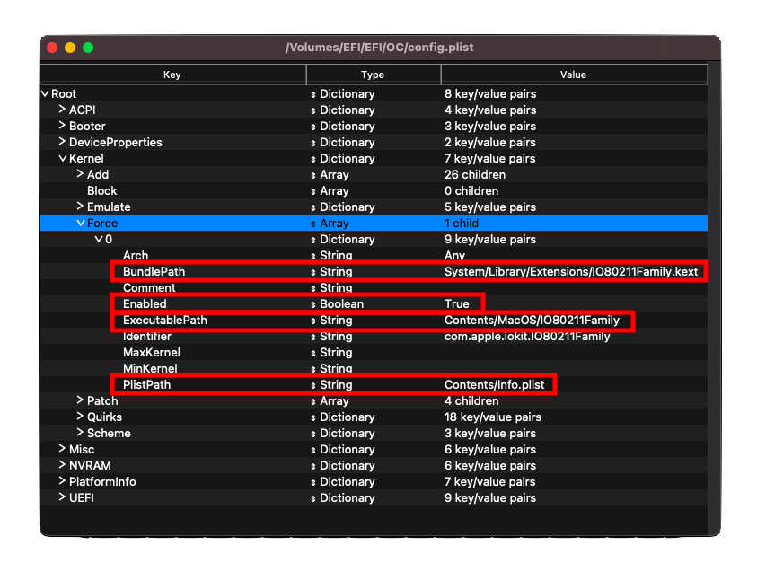

# Gathering files

This section is for gathering miscellaneous files for booting macOS, we do expect you to know your hardware well before starting and hopefully made a Hackintosh before as we won't be deep diving in here.

> What's the best way to figure out if my hardware is supported?

See the [**Hardware Limitations page**](macos-limits.md) for some better insight into what macOS requires to boot, hardware support between Clover and OpenCore are quite similar.

> What are some ways to figure out what hardware I have?

See the page before: [Finding your hardware](./find-hardware.md)

[[toc]]

## Firmware Drivers

Firmware drivers are drivers used by OpenCore in the UEFI environment. They're mainly required to boot a machine, either by extending OpenCore's patching ability or showing you different types of drives in the OpenCore picker(ie. HFS drives).

* **Location Note**: These files **must** be placed under `EFI/OC/Drivers/`

### Universal

::: tip Required Drivers

For the majority of systems, you'll only need 2 `.efi` drivers to get up and running:

* [HfsPlus.efi](https://github.com/acidanthera/OcBinaryData/blob/master/Drivers/HfsPlus.efi)(<span style="color:red">Required</span>)
  * Needed for seeing HFS volumes(ie. macOS Installers and Recovery partitions/images). **Do not mix other HFS drivers**
  * For Sandy Bridge and older(as well as low end Ivy Bridge(i3 and Celerons), see the legacy section below
* [OpenRuntime.efi](https://github.com/acidanthera/OpenCorePkg/releases)(<span style="color:red">Required</span>)
  * Replacement for [AptioMemoryFix.efi](https://github.com/acidanthera/AptioFixPkg), used as an extension for OpenCore to help with patching boot.efi for NVRAM fixes and better memory management.
  * Reminder this was bundled in OpenCorePkg we downloaded earlier

:::

### Legacy users

In addition to the above, if your hardware doesn't support UEFI(2011 and older era) then you'll need the following. Pay close attention to each entry as you may not need all 4:

* [OpenUsbKbDxe.efi](https://github.com/acidanthera/OpenCorePkg/releases)
  * Used for OpenCore picker on **legacy systems running DuetPkg**, [not recommended and even harmful on UEFI(Ivy Bridge and newer)](https://applelife.ru/threads/opencore-obsuzhdenie-i-ustanovka.2944066/page-176#post-856653)
* [HfsPlusLegacy.efi](https://github.com/acidanthera/OcBinaryData/blob/master/Drivers/HfsPlusLegacy.efi)
  * Legacy variant of HfsPlus, used for systems that lack RDRAND instruction support. This is generally seen on Sandy Bridge and older(as well as low end Ivy Bridge(i3 and Celerons))
  * Don't mix this with HfsPlus.efi, choose one or the other depending on your hardware
* [OpenPartitionDxe](https://github.com/acidanthera/OpenCorePkg/releases)
  * Required to boot recovery on OS X 10.7 through 10.9
    * This file is bundled with OpenCorePkg under EFI/OC/Drivers
    * Note: OpenDuet users(ie. without UEFI) will have this driver built-in, not requiring it
  * Not required for OS X 10.10, Yosemite and newer

These files will go in your Drivers folder in your EFI

::: details 32-Bit specifics

For those with 32-Bit CPUs, you'll want to grab these drivers as well

* [HfsPlus32](https://github.com/acidanthera/OcBinaryData/blob/master/Drivers/HfsPlus32.efi)
  * Alternative to HfsPlusLegacy but for 32-bit CPUs, don't mix this with other HFS .efi drivers

:::

## Kexts

A kext is a **k**ernel **ext**ension, you can think of this as a driver for macOS, these files will go into the Kexts folder in your EFI.

* **Windows and Linux note**: Kexts will look like normal folders in your OS, **double check** that the folder you are installing has a .kext extension visible(and do not add one manually if it's missing).
  * If any kext also includes a `.dSYM` file, you can simply delete it. They're only for debugging purposes.
* **Location Note**: These files **must** be placed under `EFI/OC/Kexts/`.

Most kexts listed below can be found **pre-compiled** in the [build repo](http://dortania.github.io/builds/). Kexts here are compiled each time there's a new commit.

### Must haves

::: tip Required Kexts

Without the below 2, no system is bootable:

* [Lilu](https://github.com/acidanthera/Lilu/releases)(<span style="color:red">Required</span>)
  * A kext to patch many processes, required for AppleALC, WhateverGreen, VirtualSMC and many other kexts. Without Lilu, they will not work.
  * Note that while Lilu supports as early as Mac OS X 10.4, many plugins only work on newer versions.
* [VirtualSMC](https://github.com/acidanthera/VirtualSMC/releases)(<span style="color:red">Required</span>)
  * Emulates the SMC chip found on real macs, without this macOS will not boot
  * Requires Mac OS X 10.4 or newer

:::

### VirtualSMC Plugins

The below plugins are not required to boot, and merely add extra functionality to the system like hardware monitoring. Unless otherwise specified, these plugins come with VirtualSMC

::: tip

While VirtualSMC supports 10.4, plugins may require newer versions.

:::

* SMCProcessor.kext
  * Used for monitoring Intel CPU temperature
  * Not for AMD CPU based systems
  * Requires Mac OS X 10.7 or newer
* [SMCAMDProcessor](https://github.com/trulyspinach/SMCAMDProcessor)
  * Used for monitoring CPU temperature on AMD Zen-based systems
  * **Under active development, potentially unstable**
  * Requires AMDRyzenCPUPowerManagement (see [AMD CPU Specific Kexts](ktext.md#amd-cpu-specific-kexts))
  * Requires macOS 10.13 or newer
* [SMCRadeonGPU](https://github.com/aluveitie/RadeonSensor)
  * Used for monitoring GPU temperature on AMD GPU systems
  * Requires RadeonSensor from the same repository
  * Requires macOS 11 or newer
* SMCSuperIO.kext
  * Used for monitoring fan speed
  * Not for AMD CPU based systems
  * Requires Mac OS X 10.6 or newer
* SMCLightSensor.kext
  * Used for the ambient light sensor on laptops
  * **Do not use if you don't have an ambient light sensor (ie. desktops), can cause issues otherwise**
  * Requires Mac OS X 10.6 or newer
* SMCBatteryManager.kext
  * Used for measuring battery readouts on laptops
  * **Do not use on desktops**
  * Requires Mac OS X 10.4 or newer
* SMCDellSensors.kext
  * Allows for finer monitoring and control of the fans on Dell machines supporting System Management Mode (SMM)
  * **Do not use if you do not have a supported Dell machine**, mainly Dell laptops can benefit from this kext
  * Requires Mac OS X 10.7 or newer

### Graphics

* [WhateverGreen](https://github.com/acidanthera/WhateverGreen/releases)(<span style="color:red">Required</span>)
  * Used for graphics patching, DRM fixes, board ID checks, framebuffer fixes, etc; all GPUs benefit from this kext.
  * Note the SSDT-PNLF.dsl file included is only required for laptops and AIOs, see [Getting started with ACPI](https://dortania.github.io/Getting-Started-With-ACPI/) for more info
  * Requires Mac OS X 10.6 or newer

### Audio

* [AppleALC](https://github.com/acidanthera/AppleALC/releases)
  * Used for AppleHDA patching, allowing support for the majority of on-board sound controllers
  * AppleALCU.kext is a pared down version of AppleALC that only supports digital audio - but you can still use AppleALC.kext on digital audio-only systems
  * AMD 15h/16h may have issues with AppleALC and Ryzen/Threadripper systems rarely have mic support
  * Requires OS X 10.4 or newer
  
::: details Legacy Audio Kext

For those who plan to boot 10.7 and older may want to opt for these kexts instead:

* [VoodooHDA](https://sourceforge.net/projects/voodoohda/)
  * Requires OS X 10.6 or newer
  
* [VoodooHDA-FAT](https://github.com/khronokernel/Legacy-Kexts/blob/master/FAT/Zip/VoodooHDA.kext.zip)
  * Similar to the above, however supports 32 and 64-Bit kernels so perfect for OS X 10.4-5 booting and 32-Bit CPUs

:::

### Ethernet

Here we're going to assume you know what ethernet card your system has, reminder that product spec pages will most likely list the type of network card.

* [IntelMausi](https://github.com/acidanthera/IntelMausi/releases)
  * Required for the majority of Intel NICs, chipsets that are based off of I211 will need the SmallTreeIntel82576 kext
  * Intel's 82578, 82579, I217, I218 and I219 NICs are officially supported
  * Requires OS X 10.9 or newer, 10.6-10.8 users can use IntelSnowMausi instead for older OSes
* [AppleIGB](https://github.com/donatengit/AppleIGB/releases)
  * Required for I211 NICs running on macOS Monterey and above
  * Might have instability issues on some NICs, recommended to stay on Big Sur and use SmallTree
  * Required for most AMD boards running Intel NICs
  * Requires macOS 12 and above
* [SmallTreeIntel82576](https://github.com/khronokernel/SmallTree-I211-AT-patch/releases)
  * Required for I211 NICs running on macOS versions up to Big Sur, based off of the SmallTree kext but patched to support I211 (doesn't work on macOS 12 [Monterey](./extras/monterey.md#ethernet) or above)
  * Required for most AMD boards running Intel NICs
  * Requires OS X 10.9-12(v1.0.6), macOS 10.13-14(v1.2.5), macOS 10.15+(v1.3.0)
* [AtherosE2200Ethernet](https://github.com/Mieze/AtherosE2200Ethernet/releases)
  * Required for Atheros and Killer NICs
  * Requires OS X 10.8 or newer
  * Note: Atheros Killer E2500 models are actually Realtek based, for these systems please use [RealtekRTL8111](https://github.com/Mieze/RTL8111_driver_for_OS_X/releases) instead
* [RealtekRTL8111](https://github.com/Mieze/RTL8111_driver_for_OS_X/releases)
  * For Realtek's Gigabit Ethernet
  * Requires OS X 10.8 and up for versions v2.2.0 and below, macOS 10.12 and up for version v2.2.2, macOS 10.14 and up for versions v2.3.0 and up
  * **NOTE:** Sometimes the latest version of the kext might not work properly with your Ethernet. If you see this issue, try older versions.
* [LucyRTL8125Ethernet](https://www.insanelymac.com/forum/files/file/1004-lucyrtl8125ethernet/)
  * For Realtek's 2.5Gb Ethernet
  * Requires macOS 10.15 or newer
* For Intel's I225-V NICs, patches are mentioned in the desktop [Comet Lake DeviceProperties](config.plist/comet-lake.md#deviceproperties) section. No kext is required.
  * Requires macOS 10.15 or newer
* For Intel's I350 NICs, patches are mentioned in the HEDT [Sandy and Ivy Bridge-E DeviceProperties](config-HEDT/ivy-bridge-e.md#deviceproperties) section. No kext is required.
  * Requires OS X 10.10 or newer

::: details Legacy Ethernet Kexts

Relevant for either legacy macOS installs or older PC hardware.

* [AppleIntele1000e](https://github.com/chris1111/AppleIntelE1000e/releases)
  * Mainly relevant for 10/100MBe based Intel Ethernet controllers
  * Requires 10.6 or newer
* [RealtekRTL8100](https://www.insanelymac.com/forum/files/file/259-realtekrtl8100-binary/)
  * Mainly relevant for 10/100MBe based Realtek Ethernet controllers
  * Requires macOS 10.12 or newer with v2.0.0+
* [BCM5722D](https://github.com/chris1111/BCM5722D/releases)
  * Mainly relevant for BCM5722 based Broadcom Ethernet controllers
  * Requires OS X 10.6 or newer

:::

And also keep in mind certain NICs are actually natively supported in macOS:

::: details Native Ethernet Controllers

#### Aquantia Series

```md
# AppleEthernetAquantiaAqtion.kext
pci1d6a,1    = Aquantia AQC107
pci1d6a,d107 = Aquantia AQC107
pci1d6a,7b1  = Aquantia AQC107
pci1d6a,80b1 = Aquantia AQC107
pci1d6a,87b1 = Aquantia AQC107
pci1d6a,88b1 = Aquantia AQC107
pci1d6a,89b1 = Aquantia AQC107
pci1d6a,91b1 = Aquantia AQC107
pci1d6a,92b1 = Aquantia AQC107
pci1d6a,c0   = Aquantia AQC113
pci1d6a,4c0  = Aquantia AQC113
```

**Note**: Due to some outdated firmware shipped on many Aquantia NICs, you may need to update the firmware in Linux/Windows to ensure it's macOS-compatible.

#### Intel Series

```md
# AppleIntel8254XEthernet.kext
pci8086,1096 = Intel 80003ES2LAN
pci8086,100f = Intel 82545EM
pci8086,105e = Intel 82571EB/82571GB

# AppleIntelI210Ethernet.kext
pci8086,1533 = Intel I210
pci8086,15f2 = Intel I225LM (Added in macOS 10.15)

# Intel82574L.kext
pci8086,104b = Intel 82566DC
pci8086,10f6 = Intel 82574L

```

#### Broadcom Series

```md
# AppleBCM5701Ethernet.kext
pci14e4,1684 = Broadcom BCM5764M
pci14e4,16b0 = Broadcom BCM57761
pci14e4,16b4 = Broadcom BCM57765
pci14e4,1682 = Broadcom BCM57762
pci14e4,1686 = Broadcom BCM57766
```

:::

### USB

* USBToolBox ([tool](https://github.com/USBToolBox/tool) and [kext](https://github.com/USBToolBox/kext))
  * USB mapping tool for Windows and macOS.
  * It is highly advisable to map your USB ports before you install macOS to avoid any port limit issues
  * Features
    * Supports mapping from Windows and macOS (Linux support in progress)
    * Can build a map using either the USBToolBox kext or native Apple kexts (AppleUSBHostMergeProperties)
    * Supports multiple ways of matching
    * Supports companion ports (on Windows)

* [XHCI-unsupported](https://github.com/RehabMan/OS-X-USB-Inject-All)
  * Needed for non-native USB controllers
  * AMD CPU based systems don't need this
  * Common chipsets needing this:
    * H370
    * B360
    * H310
    * Z390 (not needed on Mojave and newer)
    * X79
    * X99
    * ASRock Intel boards (B460/Z490+ boards do not need it however)

### WiFi and Bluetooth

#### Non-Native Bluetooth Cards

* [BlueToolFixup](https://github.com/acidanthera/BrcmPatchRAM/releases)
  * Patches the macOS 12+ Bluetooth stack to support third-party cards
  * Needed for all non-native (non-Apple Broadcom, Intel, etc) Bluetooth cards
  * Included in the [BrcmPatchRAM](#broadcom) zip
  * **Do not use on macOS 11 and earlier**

#### Intel

* [AirportItlwm](https://github.com/OpenIntelWireless/itlwm/releases)
  * Adds support for a large variety of Intel wireless cards and works natively in recovery thanks to IO80211Family integration
  * Requires macOS 10.13 or newer and requires Apple's Secure Boot to function correctly
* [Itlwm](https://github.com/OpenIntelWireless/itlwm/releases)
  * Alternative to AirportItlwm for systems where Apple's Secure Boot cannot be enabled
  * Requires [Heliport](https://github.com/OpenIntelWireless/HeliPort/releases)
  * It will be treated as an Ethernet card, and you will have to connect to Wi-Fi via Heliport
  * **Does not work in macOS recovery**
* [IntelBluetoothFirmware](https://github.com/OpenIntelWireless/IntelBluetoothFirmware/releases)
  * Adds Bluetooth support to macOS when paired with an Intel wireless card
  * Use IntelBTPatcher (included) in addition to patch bugs in macOS
  * Requires macOS 10.13 or newer
  * On macOS 10.13 through 11, you also need IntelBluetoothInjector (included)

::: details More info on enabling AirportItlwm

To enable AirportItlwm support with OpenCore, you'll need to either:

* Enable `Misc -> Security -> SecureBootModel` by either setting it as `Default` or some other valid value
  * This is discussed both later on in this guide and in the post-install guide: [Apple Secure Boot](https://dortania.github.io/OpenCore-Post-Install/universal/security/applesecureboot.html)
* If you cannot enable SecureBootModel, you can still force inject IO80211Family (**highly discouraged**)
  * Set the following under `Kernel -> Force` in your config.plist (discussed later in this guide):
  


:::

#### Broadcom

* [AirportBrcmFixup](https://github.com/acidanthera/AirportBrcmFixup/releases)
  * Used for patching non-Apple/non-Fenvi Broadcom cards, **will not work on Intel, Killer, Realtek, etc**
  * Requires OS X 10.10 or newer
  * For Big Sur see [Big Sur Known Issues](./extras/big-sur#known-issues) for extra steps regarding AirPortBrcm4360 drivers.
* [BrcmPatchRAM](https://github.com/acidanthera/BrcmPatchRAM/releases)
  * Used for uploading firmware on Broadcom Bluetooth chipset, required for all non-Apple/non-Fenvi Airport cards.
  * To be paired with BrcmFirmwareData.kext
    * BrcmPatchRAM3 for 10.15+ (must be paired with BrcmBluetoothInjector)
    * BrcmPatchRAM2 for 10.11-10.14
    * BrcmPatchRAM for 10.8-10.10
  * On macOS 10.11 through macOS 11, you also need BrcmBluetoothInjector (included)

::: details BrcmPatchRAM Load order

The order in `Kernel -> Add` should be:

1. BrcmBluetoothInjector (if needed)
2. BrcmFirmwareData
3. BrcmPatchRAM3 (or BrcmPatchRAM2/BrcmPatchRAM)

BlueToolFixup can be anywhere after Lilu.

However ProperTree will handle this for you, so you need not concern yourself

:::

### AMD CPU Specific kexts

* [XLNCUSBFIX](https://cdn.discordapp.com/attachments/566705665616117760/566728101292408877/XLNCUSBFix.kext.zip)
  * USB fix for AMD FX systems, not recommended for Ryzen
  * Requires macOS 10.13 or newer
* [VoodooHDA](https://sourceforge.net/projects/voodoohda/)
  * Audio for FX systems and front panel Mic+Audio support for Ryzen system, do not mix with AppleALC. Audio quality is noticeably worse than AppleALC on Zen CPUs
  * Requires OS X 10.6 or newer
  * Using this kext on macOS 11.3 and above is not recommended as you need to modify the macOS filesystem and disable SIP
* [AMDRyzenCPUPowerManagement](https://github.com/trulyspinach/SMCAMDProcessor)
  * CPU power management for Ryzen systems
  * **Under active development, potentially unstable**
  * Requires macOS 10.13 or newer

### Extras

* [AppleMCEReporterDisabler](https://github.com/acidanthera/bugtracker/files/3703498/AppleMCEReporterDisabler.kext.zip)
  * Required on macOS 12.3 and later on AMD systems, and on macOS 10.15 and later on dual-socket Intel systems.
  * Affected SMBIOSes:
    * MacPro6,1
    * MacPro7,1
    * iMacPro1,1
* [CpuTscSync](https://github.com/lvs1974/CpuTscSync/releases)
  * Needed for syncing TSC on some of Intel's HEDT and server motherboards, without this macOS may be extremely slow or even unbootable.
  * **Does not work on AMD CPUs**
  * Requires OS X 10.8 or newer
* [NVMeFix](https://github.com/acidanthera/NVMeFix/releases)
  * Used for fixing power management and initialization on non-Apple NVMe
  * Requires macOS 10.14 or newer
* [SATA-Unsupported](https://github.com/khronokernel/Legacy-Kexts/blob/master/Injectors/Zip/SATA-unsupported.kext.zip)
  * Adds support for a large variety of SATA controllers, mainly relevant for laptops which have issues seeing the SATA drive in macOS. We recommend testing without this first.
  * Big Sur+ Note: [CtlnaAHCIPort](https://github.com/dortania/OpenCore-Install-Guide/blob/master/extra-files/CtlnaAHCIPort.kext.zip) will need to be used instead due to numerous controllers being dropped from the binary itself
    * Catalina and older need not concern
* [CPUTopologyRebuild](https://github.com/b00t0x/CpuTopologyRebuild)
  * An experimental Lilu plugin that optimizes Alder Lake's heterogeneous core configuration. **Only for Alder Lake CPUs**
* [RestrictEvents](https://github.com/acidanthera/RestrictEvents)
  * Patch various functions of macOS, see [the README](https://github.com/acidanthera/RestrictEvents#boot-arguments) for more info
* [EmeraldSDHC](https://github.com/acidanthera/EmeraldSDHC)
  * macOS kernel extension for eMMC support. Currently only supports eMMC/MMC cards at up to HS200 speeds.  This driver is currently a work in progress and may experience poor performance or be nonfunctional on some devices. SD cards are currently not supported at this time.

::: details Legacy SATA Kexts

* [AppleIntelPIIXATA.kext](https://github.com/dortania/OpenCore-Legacy-Patcher/blob/d20d9975c144728da7ae2543d65422f53dabaa2d/payloads/Kexts/Misc/AppleIntelPIIXATA-v1.0.0.zip)
  * Legacy IDE and ATA kext for older Core 2 Duo/Quad and Pentium 4 systems. Needed for macOS 11 (Big Sur) and newer as this kext was dropped in macOS 10.15 (Catalina)
* [AHCIPortInjector](https://github.com/khronokernel/Legacy-Kexts/blob/master/Injectors/Zip/AHCIPortInjector.kext.zip)
  * Legacy SATA/AHCI injector, mainly relevant for older machines of the Penryn era
* [ATAPortInjector](https://github.com/khronokernel/Legacy-Kexts/blob/master/Injectors/Zip/ATAPortInjector.kext.zip)
  * Legacy ATA injector, mainly relevant for IDE and ATA devices (ie. when no AHCI option is present in the BIOS)
  * Is dependent on AppleIntelPIIXATA.kext, which needs to be included when using macOS 11 (Big Sur) and newer
  
:::

### Laptop Input

To figure out what kind of keyboard and trackpad you have, check Device Manager in Windows or `dmesg | grep -i input` in Linux

::: warning

Most laptop keyboards are PS2! You will want to grab VoodooPS2 even if you have an I2C, USB, or SMBus trackpad.

:::

#### PS2 Keyboards/Trackpads

* [VoodooPS2](https://github.com/acidanthera/VoodooPS2/releases)
  * Works with various PS2 keyboards, mice, and trackpads
  * Requires macOS 10.11 or newer for MT2 (Magic Trackpad 2) functions
* [RehabMan's VoodooPS2](https://bitbucket.org/RehabMan/os-x-voodoo-ps2-controller/downloads/)
  * For older systems with PS2 keyboards, mice, and trackpads, or when you don't want to use VoodooInput
  * Supports macOS 10.6+

#### SMBus Trackpads

* [VoodooRMI](https://github.com/VoodooSMBus/VoodooRMI/releases)
  * For systems with Synaptics SMBus trackpads
  * Requires macOS 10.11 or newer for MT2 functions
  * Depends on Acidanthera's VoodooPS2
* [VoodooSMBus](https://github.com/VoodooSMBus/VoodooSMBus/releases)
  * For systems with ELAN SMBus Trackpads
  * Supports macOS 10.14 or newer currently

#### I2C/USB HID Devices

* [VoodooI2C](https://github.com/VoodooI2C/VoodooI2C/releases)
  * Supports macOS 10.11+
  * Attaches to I2C controllers to allow plugins to talk to I2C trackpads
  * USB devices using the below plugins still need VoodooI2C
  * Must be paired with one or more plugins shown below:

::: tip VoodooI2C Plugins

| Connection type | Plugin | Notes |
| :--- | :--- | :--- |
| Multitouch HID | VoodooI2CHID | Can be used with I2C/USB Touchscreens and Trackpads |
| ELAN Proprietary | VoodooI2CElan | ELAN1200+ require VoodooI2CHID instead |
| FTE1001 touchpad | VoodooI2CFTE | |
| Atmel Multitouch Protocol | VoodooI2CAtmelMXT | |
| Synaptics HID | [VoodooRMI](https://github.com/VoodooSMBus/VoodooRMI/releases) | I2C Synaptic Trackpads (Requires VoodooI2C ONLY for I2C mode) |
| Alps HID | [AlpsHID](https://github.com/blankmac/AlpsHID/releases) | Can be used with USB or I2C Alps trackpads. Mostly seen on Dell laptops and some HP EliteBook models |

:::

#### Misc

* [ECEnabler](https://github.com/1Revenger1/ECEnabler/releases)
  * Fixes reading battery status on many devices (Allows reading EC fields over 8 bits long)
  * Supports OS X 10.7 and above (not needed on 10.4 - 10.6)
* [BrightnessKeys](https://github.com/acidanthera/BrightnessKeys/releases)
  * Fixes brightness keys automatically

Please refer to [Kexts.md](https://github.com/acidanthera/OpenCorePkg/blob/master/Docs/Kexts.md) for a full list of supported kexts

## SSDTs

So you see all those SSDTs in the AcpiSamples folder and wonder whether you need any of them. For us, we will be going over what SSDTs you need in **your specific ACPI section of the config.plist**, as the SSDTs you need are platform specific. With some even system specific where they need to be configured and you can easily get lost if I give you a list of SSDTs to choose from now.

[Getting started with ACPI](https://dortania.github.io/Getting-Started-With-ACPI/) has an extended section on SSDTs including compiling them on different platforms.

A quick TL;DR of needed SSDTs(This is source code, you will have to compile them into a .aml file):

### Desktop

| Platforms | **CPU** | **EC** | **AWAC** | **NVRAM** | **USB** |
| :-------: | :-----: | :----: | :------: | :-------: | :-----: |
| Penryn | N/A | [SSDT-EC](https://dortania.github.io/Getting-Started-With-ACPI/Universal/ec-fix.html) | N/A | N/A | N/A |
| Lynnfield and Clarkdale | ^^ | ^^ | ^^ | ^^ | ^^ |
| SandyBridge | [CPU-PM](https://dortania.github.io/OpenCore-Post-Install/universal/pm.html#sandy-and-ivy-bridge-power-management) (Run in Post-Install) | ^^ | ^^ | ^^ | ^^ |
| Ivy Bridge | ^^ | ^^ | ^^ | ^^ | ^^ |
| Haswell | [SSDT-PLUG](https://dortania.github.io/Getting-Started-With-ACPI/Universal/plug.html) | ^^ | ^^ | ^^ | ^^ |
| Broadwell | ^^ | ^^ | ^^ | ^^ | ^^ |
| Skylake | ^^ | [SSDT-EC-USBX](https://dortania.github.io/Getting-Started-With-ACPI/Universal/ec-fix.html) | ^^ | ^^ | ^^ |
| Kaby Lake | ^^ | ^^ | ^^ | ^^ | ^^ |
| Coffee Lake | ^^ | ^^ | [SSDT-AWAC](https://dortania.github.io/Getting-Started-With-ACPI/Universal/awac.html) | [SSDT-PMC](https://dortania.github.io/Getting-Started-With-ACPI/Universal/nvram.html) | ^^ |
| Comet Lake | ^^ | ^^ | ^^ | N/A | [SSDT-RHUB](https://dortania.github.io/Getting-Started-With-ACPI/Universal/rhub.html) |
| AMD (15/16h) | N/A | ^^ | N/A | ^^ | N/A |
| AMD (17/19h) | [SSDT-CPUR for B550 and A520](https://github.com/dortania/Getting-Started-With-ACPI/blob/master/extra-files/compiled/SSDT-CPUR.aml) | ^^ | ^^ | ^^ | ^^ |

### High End Desktop

| Platforms | **CPU** | **EC** | **RTC** | **PCI** |
| :-------: | :-----: | :----: | :-----: | :-----: |
| Nehalem and Westmere | N/A | [SSDT-EC](https://dortania.github.io/Getting-Started-With-ACPI/Universal/ec-fix.html) | N/A | N/A |
| Sandy Bridge-E | ^^ | ^^ | ^^ | [SSDT-UNC](https://dortania.github.io/Getting-Started-With-ACPI/Universal/unc0) |
| Ivy Bridge-E | ^^ | ^^ | ^^ | ^^ |
| Haswell-E | [SSDT-PLUG](https://dortania.github.io/Getting-Started-With-ACPI/Universal/plug.html) | [SSDT-EC-USBX](https://dortania.github.io/Getting-Started-With-ACPI/Universal/ec-fix.html) | [SSDT-RTC0-RANGE](https://dortania.github.io/Getting-Started-With-ACPI/Universal/awac.html) | ^^ |
| Broadwell-E | ^^ | ^^ | ^^ | ^^ |
| Skylake-X | ^^ | ^^ | ^^ | N/A |

### Laptop

| Platforms | **CPU** | **EC** | **Backlight** | **I2C Trackpad** | **AWAC** | **USB** | **IRQ** |
| :-------: | :-----: | :----: | :-----------: | :--------------: | :------: | :-----: | :-----: |
| Clarksfield and Arrandale | N/A | [SSDT-EC](https://dortania.github.io/Getting-Started-With-ACPI/Universal/ec-fix.html) | [SSDT-PNLF](https://dortania.github.io/Getting-Started-With-ACPI/Laptops/backlight.html) | N/A | N/A | N/A | [IRQ SSDT](https://dortania.github.io/Getting-Started-With-ACPI/Universal/irq.html) |
| SandyBridge | [CPU-PM](https://dortania.github.io/OpenCore-Post-Install/universal/pm.html#sandy-and-ivy-bridge-power-management) (Run in Post-Install) | ^^ | ^^ | ^^ | ^^ | ^^ | ^^ |
| Ivy Bridge | ^^ | ^^ | ^^ | ^^ | ^^ | ^^ | ^^ |
| Haswell | [SSDT-PLUG](https://dortania.github.io/Getting-Started-With-ACPI/Universal/plug.html) | ^^ | ^^ | [SSDT-GPI0](https://dortania.github.io/Getting-Started-With-ACPI/Laptops/trackpad.html) | ^^ | ^^ | ^^ |
| Broadwell | ^^ | ^^ | ^^ | ^^ | ^^ | ^^ | ^^ |
| Skylake | ^^ | [SSDT-EC-USBX](https://dortania.github.io/Getting-Started-With-ACPI/Universal/ec-fix.html) | ^^ | ^^ | ^^ | ^^ | N/A |
| Kaby Lake | ^^ | ^^ | ^^ | ^^ | ^^ | ^^ | ^^ |
| Coffee Lake (8th Gen) and Whiskey Lake | ^^ | ^^ | [SSDT-PNLF](https://dortania.github.io/Getting-Started-With-ACPI/Laptops/backlight.html) | ^^ | [SSDT-AWAC](https://dortania.github.io/Getting-Started-With-ACPI/Universal/awac.html) | ^^ | ^^ |
| Coffee Lake (9th Gen) | ^^ | ^^ | ^^ | ^^ | ^^ | ^^ | ^^ |
| Comet Lake | ^^ | ^^ | ^^ | ^^ | ^^ | ^^ | ^^ |
| Ice Lake | ^^ | ^^ | ^^ | ^^ | ^^ | [SSDT-RHUB](https://dortania.github.io/Getting-Started-With-ACPI/Universal/rhub.html) | ^^ |

Continuing:

| Platforms | **NVRAM** | **IMEI** |
| :-------: | :-------: | :------: |
| Clarksfield and Arrandale | N/A | N/A |
| Sandy Bridge | ^^| [SSDT-IMEI](https://dortania.github.io/Getting-Started-With-ACPI/Universal/imei.html) |
| Ivy Bridge | ^^ | ^^ |
| Haswell | ^^ | N/A |
| Broadwell | ^^ | ^^ |
| Skylake | ^^ | ^^ |
| Kaby Lake | ^^ | ^^ |
| Coffee Lake (8th Gen) and Whiskey Lake | ^^ | ^^ |
| Coffee Lake (9th Gen) | [SSDT-PMC](https://dortania.github.io/Getting-Started-With-ACPI/Universal/nvram.html) | ^^ |
| Comet Lake | N/A | ^^ |
| Ice Lake | ^^ | ^^ |

# Now with all this done, head to [Getting Started With ACPI](https://dortania.github.io/Getting-Started-With-ACPI/)
