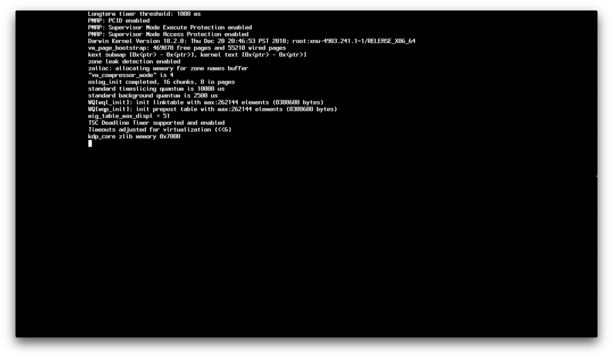
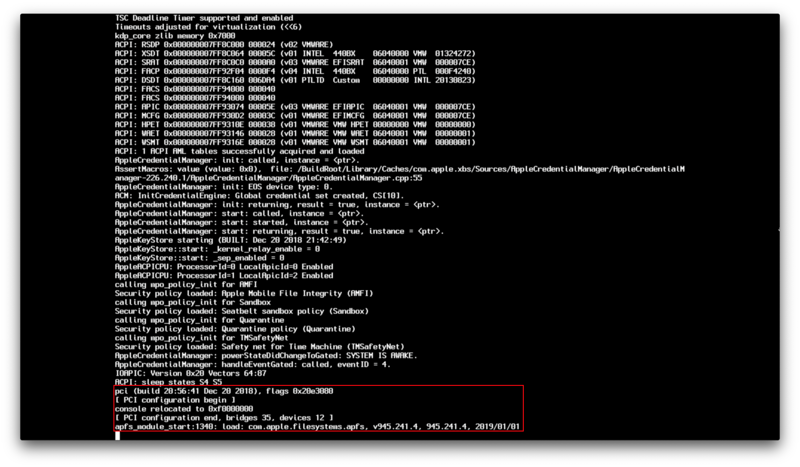
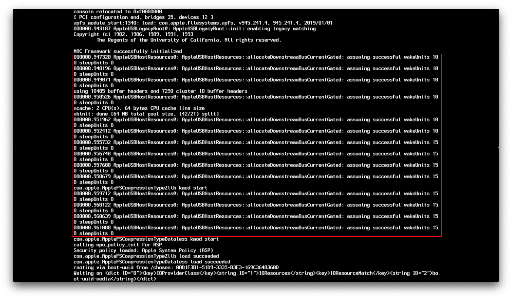
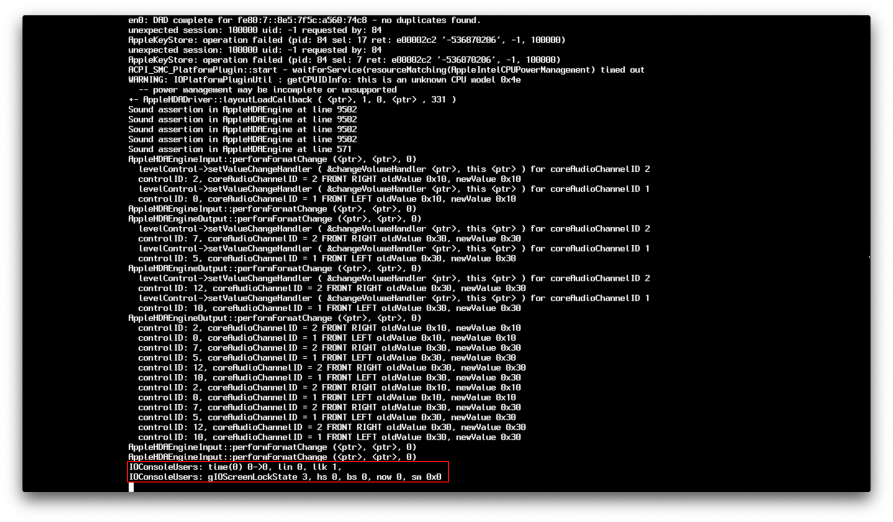

# Understanding the macOS Boot Process

* Supported version: 0.6.5

So with troubleshooting a hackintosh, it can be a bit difficult to really understand *where* you're getting stuck as the exact keyword you're trying to search for may not match anything on google. While this page won't solve all your issues, it should at least help better understand where in the macOS boot-process you're getting stuck and hopefully give some ideas as to why you're stuck.

## OpenCore Booting

This section will be brief, as OpenCore boot issues are fairly rare and usually simple user error:

* System powers on and searches for boot devices
* System locates BOOTx64.efi on your OpenCore USB under EFI/BOOT/
* BOOTx64.efi is loaded which then chain-loads OpenCore.efi from EFI/OC/
* NVRAM Properties are applied
* EFI drivers are loaded from EFI/OC/Drivers
* Graphics Output Protocol(GOP) is installed
* ACPI Tables are loaded from EFI/OC/ACPI
* SMBIOS Data is applied
* OpenCore loads and shows you all possible boot options
* You now boot your macOS installer

If you're having issues booting at this point, main things to check for:

* [Stuck on `no vault provided!`](./extended/opencore-issues.md#stuck-on-no-vault-provided)
* [Can't see macOS partitions](./extended/opencore-issues.md#can-t-see-macos-partitions)
* [Booting OpenCore reboots to BIOS](./extended/opencore-issues.md#booting-opencore-reboots-to-bios)

For the rest of the possible issues, see here:

* [OpenCore booting issues](./extended/opencore-issues.md)

## boot.efi Handoff


This is where macOS's bootloader(boot.efi) comes onto the scene, specifically what it does is prep the environment for the kernel to load and where OpenCore injects kexts. If you're getting stuck at this point, there's likely an issue with loading the kernel, main culprits:

* [Stuck on EndRandomSeed](./extended/kernel-issues.md#stuck-on-endrandomseed)
* [Stuck on `[EB|#LOG:EXITBS:START]`](./extended/kernel-issues.md#stuck-on-eb-log-exitbs-start)
* [`Couldn't allocate runtime area` errors](./extended/kernel-issues.md#couldn-t-allocate-runtime-area-errors)

For the rest of the possible issues, see here:

* [Kernel Issues](./extended/kernel-issues.md)

**Note**: In macOS 10.15.4, Apple changed the boot.efi debugging protocol, so things will look quite a bit different from before but all the same rules still apply

## XNU/Kernel Handoff

Now that boot.efi has setup everything for us, we now get to watch the kernel do it's thing. This section is commonly referred as the [Rooting phase](https://developer.apple.com/library/archive/documentation/Darwin/Conceptual/KernelProgramming/booting/booting.html):



This section is where SMBIOS data is verified, ACPI tables/Kexts are loaded and macOS tries to get everything in order. Failures here are generally a result of:

* Corrupted SSDTs
* Corrupted kexts(or incorrectly setup under your config.plist -> Kernel -> Add)
* Messed up memory map

See here for more troubleshooting info:

* [Kernel Panic `Cannot perform kext summary`](./extended/kernel-issues.md#kernel-panic-cannot-perform-kext-summary)
* [Kernel Panic on `Invalid frame pointer`](./extended/kernel-issues.md#kernel-panic-on-invalid-frame-pointer)



Now here we have `[ PCI configurations begin ]`, this section can be seen as a hardware test for our systems, kexts and SSDTs we injected, and where IOKit starts hardware probs to find devices to attach to.

The main things that are tested here:

* Embedded Controllers
* Storage(NVMe, SATA, etc)
* PCI/e
* NVRAM
* RTC
* PS2 and I2C

For more specific info on how to get around this area, see here:

* [Stuck on `RTC...`, `PCI Configuration Begins`, `Previous Shutdown...`, `HPET`, `HID: Legacy...`](./extended/kernel-issues.md#stuck-on-rtc-pci-configuration-begins-previous-shutdown-hpet-hid-legacy)



This is where the 15 port limit and USB mapping comes into play, and where the infamous "Waiting for Root Device" errors pops in, main things to check for:

* ["Waiting for Root Device" or Prohibited Sign error](./extended/kernel-issues.md#waiting-for-root-device-or-prohibited-sign-error)


This is where our FakeSMC/VirtualSMC come into the scene and do their magic, DSMOS itself is a kext that verifies if your system has an SMC and will request a key. If this key is missing, then DSMOS will not decrypt the rest of the binaries and you'll get stuck here. You may also get stuck at AppleACPICPU which is just the same error.

* [kextd stall[0]: AppleACPICPU](./extended/kernel-issues.md#kextd-stall-0-appleacpicpu)

```
Your karma check for today:
There once was a user that whined
his existing OS was so blind,
he'd do better to pirate an OS that ran great
but found his hardware declined.
Please don't steal Mac OS!
Really, that's way uncool.
(C) Apple Computer, Inc.
```

Source: Dont Steal Mac OS X.kext


This is where Apple's audio driver comes in, and where AppleALC shines. Generally rare to see issues here but if you do, try disabling AppleALC and any other audio related kexts.



And here we get to the GPU driver initialization, and where WhateverGreen also does its magic. Generally errors here are due to the GPU and not WhateverGreen itself, main culprits:

* [Stuck on or near `IOConsoleUsers: gIOScreenLock...`](./extended/kernel-issues.md#stuck-on-or-near-ioconsoleusers-gioscreenlock-giolockstate-3)
* [Black screen after `IOConsoleUsers: gIOScreenLock...` on Navi](./extended/kernel-issues.md#black-screen-after-ioconsoleusers-gioscreenlock-on-navi)

## macOS Handoff


And you've finally got past all that verbose! If you're getting stuck at the Apple logo after all that verbose, then there's a couple things to check for:

* [macOS frozen right before login](./extended/kernel-issues.md#macos-frozen-right-before-login)
* [Black screen after `IOConsoleUsers: gIOScreenLock...` on Navi](./extended/kernel-issues.md#black-screen-after-ioconsoleusers-gioscreenlock-on-navi)
* [Frozen in the macOS installer after 30 seconds](./extended/userspace-issues.md#frozen-in-the-macos-installer-after-30-seconds)
