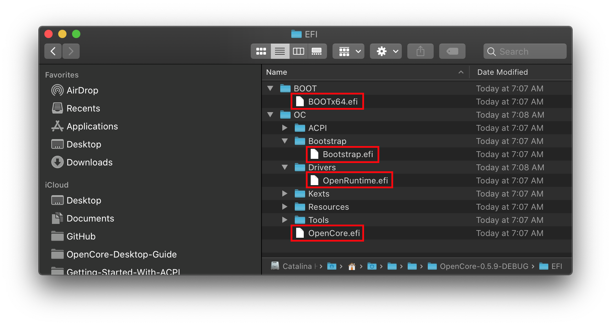
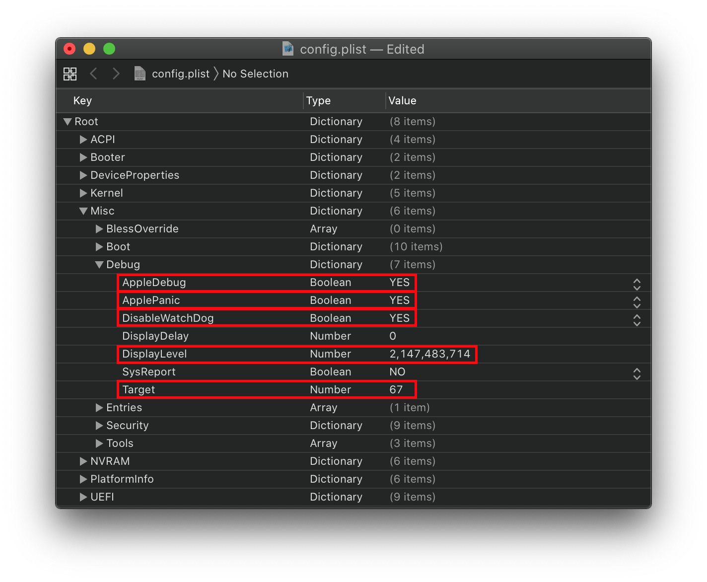

# OpenCore Debugging

* Supported version: 0.6.5

Needing to figure out why you're getting issues or stalling? Well, you've come to the right place:

* [File Swap](#file-swaps)
* [Config Changes](#config-changes)
* [Disabling all logging](#disabling-all-logging)

## File Swaps

To start, make sure you're using either the `DEBUG` or `NOOPT` versions of OpenCore. This will provide much more info than the `RELEASE` version, the specific files that need to be swapped:

* EFI/BOOT/
  * `BOOTx64.efi`
* EFI/OC/Bootstrap/
  * `Bootstrap.efi`
* EFI/OC/Drivers/
  * `OpenRuntime.efi`
  * `OpenCanopy.efi`(if you're using it)
* EFI/OC/
  * `OpenCore.efi`

* **Note**: Generally best to debug systems without OpenCanopy, if required make sure this file is from DEBUG else there will be virtually no debug information.

## Config Changes

Next, head to your config.plist and locate the `Misc` section, we have a couple entries we'll want to play with here:

### Misc

Here we'll want to enable the following:

* **AppleDebug**: YES
  * Provides much more debugging information, specifically relating to boot.efi and will also store the log to disk.

* **ApplePanic**: YES
  * This will allow kernel panics to be stored to disk, highly recommend keeping `keepsyms=1` in boot-args to preserve as much info as possible.

* **DisableWatchdog**: YES
  * Disables the UEFI watchdog, used for when OpenCore is stalling on something non-critical.

* **Target**: `67`(or calculate one below)
  * Used for enabling different levels of debugging

| Value | Comment |
| :--- | :--- |
| `0x01` | Enable Logging |
| `0x02` | Enable Onscreen debug |
| `0x04` | Enable logging to Data Hub. |
| `0x08` | Enable serial port logging. |
| `0x10` | Enable UEFI variable logging. |
| `0x20` | Enable non-volatile UEFI variable logging. |
| `0x40` | Enable logging to file. |

To calculate the target, we can use a HEX calculator and then convert it to decimal. For us we want to have our values on stored onto a .txt file for later viewing:

* `0x01` — Enable Logging
* `0x02` — Enable Onscreen debug
  * Note this can heavily increase boot times on firmwares with poor GOP implementations
* `0x10` — Enable UEFI variable logging.
* `0x40` — Enable logging to file.

`0x01` + `0x02` + `0x10` + `0x40` = `0x53`

`0x53` converted to decimal becomes `83`

So we can set `Misc` -> `Debug` -> `Target` -> `83`

* **DisplayLevel**: `2147483714`(or calculate one below)
  * Used for setting what is logged

| Value | Comment |
| :--- | :--- |
| `0x00000002` | DEBUG_WARN in DEBUG, NOOPT, RELEASE. |
| `0x00000040` | DEBUG_INFO in DEBUG, NOOPT. |
| `0x00400000` | DEBUG_VERBOSE in custom builds. |
| `0x80000000` | DEBUG_ERROR in DEBUG, NOOPT, RELEASE. |

  A full list can be found in [DebugLib.h](https://github.com/tianocore/edk2/blob/UDK2018/MdePkg/Include/Library/DebugLib.h).

For us we just want the following:

* `0x00000002` — DEBUG_WARN in DEBUG, NOOPT, RELEASE.
* `0x00000040` — DEBUG_INFO in DEBUG, NOOPT.
* `0x80000000` — DEBUG_ERROR in DEBUG, NOOPT, RELEASE.

Just like with `Target`, we use a HEX calculator then convert to decimal:

`0x80000042` Converted to decimal `Misc` -> `Debug` -> `DisplayLevel` -> `2147483714`

Once done, your config.plist should look like this:

## Disabling all logging

To remove all file logging, and debug messages, simply swap out all your OpenCore files for those in RELEASE like we did before in [File Swap](#file-swap) section.

Lastly, to remove writing to disk set the following:

* AppleDebug = `NO`
* ApplePanic = `NO`
* Target = `0`
