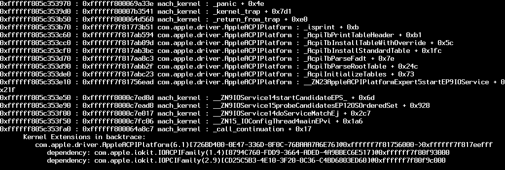

# 内核空间问题

从最初启动macOS安装程序到弹出安装GUI之前的问题。

[[toc]]

## 卡在 `[EB|#LOG:EXITBS:START]`

本节将分为3部分，请仔细阅读。

* [启动器问题](#启动器问题)
* [内核补丁问题](#kernel-patch-issues)
* [UEFI 问题](#uefi-issues)
* [虚拟机问题](#virtual-machine-issues)

### 启动器问题

在Booter部分需要注意的主要问题有:

* **DevirtualiseMmio**
  * 某些MMIO空间仍然需要正常工作，所以你需要在 Booter -> MmioWhitelist 中排除这些区域或完全禁用此选项。 更多信息在这里: [Using DevirtualiseMmio](../../extras/kaslr-fix.md#using-devirtualisemmio)
  * 对于TRx40用户，启用此功能
  * 对于X99的用户，禁用这种功能，因为它会被某些固件破坏

* **SetupVirtualMap**
  * 大多数固件都需要这个功能，如果没有这个功能，内核崩溃就很常见，所以如果还没有启用它的话就启用它
    * 主要是Z390和更老的版本需要启用这个功能
    * 但是，某些固件(主要是2020年以上)不能使用这种特性，因此实际上可能会导致这种内核崩溃:
      * 英特尔(Intel)的Ice Lake系列
      * 英特尔Comet Lake系列(B460, H470, Z490等)
      * 英特尔Comet Lake系列(B460, H470, Z490等)
        * 许多B450和X470板2020年底BIOS更新也包括在内
      * AMD的TRx40
      * QEMU等虚拟机
      * X299 2020+ BIOS更新(这适用于2019年底或2020+发布的最新BIOS上的其他X299板)

* **EnableWriteUnprotector**

  * 另一个问题可能是macOS与CR0寄存器的写保护冲突，为了解决这个问题，我们有两个选择:
    * 如果您的固件支持MATs(2018+固件):
      * EnableWriteUnprotector -> False
      * RebuildAppleMemoryMap -> True
      * SyncRuntimePermissions -> True
    * 对于旧的固件:
      * EnableWriteUnprotector -> True
      * RebuildAppleMemoryMap -> False
      * SyncRuntimePermissions -> False
    * 注意:一些笔记本电脑(例如：Dell Inspiron 5370)即使有MATs支持也会在启动时停止，在这种情况下你有两个选择:
      * 启动与旧固件功能组合(即：使用EnableWriteUnprotector 并禁用 `RebuildAppleMemoryMap` + `SyncRuntimePermissions`)
      * 启用 `DevirtualiseMmio` 并遵循[MmioWhitelist指南](https://sumingyd.github.io/OpenCore-Install-Guide/extras/kaslr-fix.html)

关于对MATs的支持，针对EDK 2018构建的固件将支持这一点，许多oem甚至已经增加了对Skylake笔记本电脑的支持。问题是它不是总是明显的，如果一个OEM已经更新固件，你可以检查OpenCore日志是否支持它([查看这里如何获取日志](../debug.html)):

```
OCABC: MAT support is 1
```

* 注意:`1`表示支持MATs，而`0`表示不支持。

### 内核补丁问题

本节将分为英特尔和AMD用户两部分:

#### AMD 用户

* 缺少[内核补丁](https://github.com/AMD-OSX/AMD_Vanilla)(only适用于AMD cpu，确保它们是OpenCore补丁而不是Clover。Clover使用“MatchOS”，而OpenCore有 `MinKernel` 和 `Maxkernel`)
  * 请注意，过时的内核补丁也会有同样的效果，请确保您使用的是AMD OS X的最新补丁

#### Intel 用户

* **AppleXcpmCfgLock** 和 **AppleCpuPmCfgLock**
  * 缺少CFG或XCPM补丁，请启用 `AppleXcpmCfgLock` 和 `AppleCpuPmCfgLock`
    * Haswell和更新版本只需要AppleXcpmCfgLock
    * Ivy Bridge和更老的只需要AppleCpuPmCfgLock
      * 如果运行10.10或更高版本，Broadwell及更老版本需要AppleCpuPmCfgLock
  * 或者你可以正确地禁用CFG-Lock:[修复CFG锁](https://sumingyd.github.io/OpenCore-Post-Install/misc/msr-lock.html)
* **AppleXcpmExtraMsrs**
  * 也可能需要，这通常指的是Pentiums, HEDT和其他macOS原生不支持的特定系统。

#### Intel 老用户

对于macOS Big Sur，许多固件在确定CPU核心数时都存在问题，因此会过早出现内核崩溃，无法进行啰嗦模式的错误显示。通过serial命令，你会看到如下提示:

```
max_cpus_from_firmware not yet initialized
```

解决:

* 在Booter -> Quirks下启用 `AvoidRuntimeDefrag`
  * 这应该适用于大多数固件

然而，在某些机器上，如HP Compaq DC 7900，固件仍然会出现问题，因此我们需要强制设置CPU核心数。只有在AvoidRuntimeDefrag不起作用时，才使用下面的补丁:

::: details 旧CPU核心补丁

为此，添加以下补丁(用硬件支持的CPU线程数量替换B8 **04** 00 00 C3中的04):

| Key | Type | Value |
| :--- | :--- | :--- |
| Base | String | _acpi_count_enabled_logical_processors |
| Count | Integer | 1 |
| Enabled | Boolean | True |
| Find | Data | |
| Identifier | String | Kernel |
| Limit | Integer | 0 |
| Mask | Data | |
| MaxKernel | String | |
| MinKernel | String | 20.0.0 |
| Replace | Data | `B804000000C3` |
| ReplaceMask | Data | |
| Skip | Integer | 0 |

:::

### UEFI 问题

* **ProvideConsoleGop**
  * 需要过渡到下一个屏幕，这最初是AptioMemoryFix的一部分，但现在在OpenCore中以这个功能提供。可以在UEFI -> Output下找到
  * 注意，从0.5.6开始，sample.plist默认启用了这个功能
* **IgnoreInvalidFlexRatio**
  * 这是Broadwell和更老的所需要的。**AMD和Skylake或更新版本不支持**

## 卡在 EndRandomSeed

与上面相同的问题，请参阅此处了解更多详细信息: [卡在 `[EB|#LOG:EXITBS:START]`](#stuck-on-eb-log-exitbs-start)

## 在OpenCore中选择macOS分区后卡住

与上面相同的问题，请参阅此处了解更多详细信息: [卡在 `[EB|#LOG:EXITBS:START]`](#stuck-on-eb-log-exitbs-start)

* 注意:启用[DEBUG OpenCore](../debug.html) 也可以帮助揭示一些信息

## Getting the error X64 Exception Type... 有关AMD FX系统

此错误可能有多种原因:

* 此错误可能有多种原因:

  也可以称为遗留引导支持，加载遗留选项rom /OPROMs

* ProvideCurrentCpuInfo功能(统一补丁所需)与您的固件不兼容:

  这意味着您需要使用[旧版本的补丁](https://github.com/AMD-OSX/AMD_Vanilla/blob/06a9a7f30d139fa3ae897ed2469222c92e99fcad/15h_16h/patches.plist) 和Big Sur或更早的版本。下载上面链接的旧补丁后，将它们合并到config.plist 中(确保先删除旧补丁)。

一个例子:


## 内核崩溃 `Invalid frame pointer`

这是由于您设置的`Booter -> Quirks`的一些问题，主要检查:

* `DevirtualiseMmio`
  * 某些MMIO空间仍然需要正确运行，因此您需要在Booter -> MmioWhitelist中排除这些区域或完全禁用此功能
  * 更多信息:[使用 DevirtualiseMmio](../../extras/kaslr-fix.md#using-devirtualisemmio)

* `SetupVirtualMap`
  * 大多数固件都需要这个功能，如果没有这个功能，内核崩溃就很常见，所以如果还没有启用它的话就启用它
    * 但是，某些固件无法处理这种情况，因此实际上可能会导致这种内核错误:
      * 英特尔(Intel)的Ice Lake系列
      * 英特尔的Comet Lake系列
      * AMD 的 B550
      * AMD 的 A520
      * AMD 的 TRx40
      * QEMU等虚拟机
  
另一个问题可能是macOS与CR0寄存器的写保护冲突，要解决这个问题，我们有两个选项:

* 如果您的固件支持MATs(2018+固件):
  * EnableWriteUnprotector -> False
  * RebuildAppleMemoryMap -> True
  * SyncRuntimePermissions -> True
* 对于旧的固件:
  * EnableWriteUnprotector -> True
  * RebuildAppleMemoryMap -> False
  * SyncRuntimePermissions -> False

关于对MATs的支持，针对EDK 2018构建的固件将支持这一点，许多oem甚至已经增加了对Skylake笔记本电脑的支持。问题是它不是总是明显的，如果一个OEM已经更新了固件，你可以检查OpenCore日志是否你的支持:

```
OCABC: MAT support is 1
```

注意:“1”表示支持MATs，而“0”表示不支持。

## 启动预引导卷时卡在 `[EB|LD:OFS] Err(0xE)`

完整的错误:

```
[EB|`LD:OFS] Err(0xE) @ OPEN (System\\Library\\PrelinkedKernels\\prelinkedkernel)
```

当预引导卷没有正确更新时可能会发生这种情况，要修复这个问题，您需要启动到recovery并修复它:

1. 在UEFI -> APFS下启用JumpstartHotplug(没有这个选项，macOS Big Sur恢复可能无法启动)
2. 启动进入恢复
3. 打开终端并运行以下命令:

```bash
# First, find your Preboot volume
diskutil list

# From the below list, we can see our Preboot volume is disk5s2
/dev/disk5 (synthesized):
   #:                       TYPE NAME                    SIZE       IDENTIFIER
   0:      APFS Container Scheme -                      +255.7 GB   disk5
                                 Physical Store disk4s2
   1:                APFS Volume ⁨Big Sur HD - Data⁩       122.5 GB   disk5s1
   2:                APFS Volume ⁨Preboot⁩                 309.4 MB   disk5s2
   3:                APFS Volume ⁨Recovery⁩                887.8 MB   disk5s3
   4:                APFS Volume ⁨VM⁩                      1.1 MB     disk5s4
   5:                APFS Volume ⁨Big Sur HD⁩              16.2 GB    disk5s5
   6:              APFS Snapshot ⁨com.apple.os.update-...⁩ 16.2 GB    disk5s5s

# Now mount the Preboot volume
diskutil mount disk5s2

# Next run updatePreboot on the Preboot volume
diskutil apfs updatePreboot /volume/disk5s2
```

最后重启

## 卡在 `OCB: LoadImage failed - Security Violation`

```
OCSB: No suitable signature - Security Violation
OCB: Apple Secure Boot prohibits this boot entry, enforcing!
OCB: LoadImage failed - Security Violation
```

这是由于缺少预先引导卷上的过期苹果安全引导清单导致加载失败，如果您设置了SecureBootModel，则这些文件丢失的原因实际上是macOS中的一个bug。

要解决这个问题，你可以采取以下方法之一:

* 禁用 SecureBootModel
  * 设置 `Misc -> Security -> SecureBootModel -> Disabled`
* 重新安装最新版本的macOS
* 或将安全启动清单从`/usr/standalone/i386`复制到`/Volumes/Preboot/<UUID>/System/Library/CoreServices`
  * 注意，你很可能需要通过终端这样做，因为预引导卷不容易通过Finder编辑
  
要通过终端来做到这一点:

```bash
# 首先，找到Preboot卷
diskutil list

# 从下面的列表中，我们可以看到Preboot卷是disk5s2
/dev/disk5 (synthesized):
   #:                       类型名称                    大小       标识符
   0:      APFS Container Scheme -                      +255.7 GB   disk5
                                 Physical Store disk4s2
   1:                APFS Volume ⁨Big Sur HD - Data⁩       122.5 GB   disk5s1
   2:                APFS Volume ⁨Preboot⁩                 309.4 MB   disk5s2
   3:                APFS Volume ⁨Recovery⁩                887.8 MB   disk5s3
   4:                APFS Volume ⁨VM⁩                      1.1 MB     disk5s4
   5:                APFS Volume ⁨Big Sur HD⁩              16.2 GB    disk5s5
   6:              APFS Snapshot ⁨com.apple.os.update-...⁩ 16.2 GB    disk5s5s

# 现在挂载Preboot卷
diskutil mount disk5s2

# CD到预引导卷中
# 注意实际的卷在/System/Volumes/Preboot下面
cd /System/Volumes/Preboot

# 获取UUID
ls
 46923F6E-968E-46E9-AC6D-9E6141DF52FD
 CD844C38-1A25-48D5-9388-5D62AA46CFB8

# 如果显示了多个版本(即双启动多个版本的macOS)，则会显示
# 需要确定哪个UUID是正确的。
# 确定最简单的方法是打印.disk_label.contentDetails的值
# 每个卷的
cat ./46923F6E-968E-46E9-AC6D-9E6141DF52FD/System/Library/CoreServices/.disk_label.contentDetails
 Big Sur HD%

cat ./CD844C38-1A25-48D5-9388-5D62AA46CFB8/System/Library/CoreServices/.disk_label.contentDetails
 Catalina HD%

# 接下来复制安全引导文件
# 用UUID值替换CD844C38-1A25-48D5-9388-5D62AA46CFB8
cd ~
sudo cp -a /usr/standalone/i386/. /System/Volumes/Preboot/CD844C38-1A25-48D5-9388-5D62AA46CFB8/System/Library/CoreServices
```

## 卡在 `OCABC: Memory pool allocation failure - Not Found`

这是由于不正确的BIOS设置:

* 4g以上解码是启用的（Above4GDecoding）
* CSM被禁用(在某些板上启用Windows8.1/10 WHQL模式可以执行相同的操作)
  * 注意，在某些笔记本电脑上，必须启用CSM
* BIOS是最新的(众所周知，Z390和HEDT的固件编写得很糟糕)

## 卡在 `Buffer Too Small`

* 在BIOS中启用4G以上解码（Above4GDecoding）

## 卡在 `Plist only kext has CFBundleExecutable key`

配置列表中缺少或不正确的`可执行路径`，应该通过重新运行ProperTree的快照工具(Cmd/Ctrl+R)来解决。

## 卡在 `This version of Mac OS X is not supported: Reason Mac...`

当该版本的macOS不再支持SMBIOS时发生此错误，请确保在`PlatformInfo->Generic`中设置了`Automatic`。有关支持的SMBIOS及其操作系统的完整列表，请参见这里:[选择正确的SMBIOS](../../extras/smbios-support.md)

::: details macOS 10.15、Catalina支持的SMBIOS

* iMac13,x+
* iMacPro1,1
* MacPro6,1+
* Macmini6,x+
* MacBook8,1+
* MacBookAir5,x+
* MacBookPro9,x+

:::

::: details macOS 11, Big Sur支持的SMBIOS

* iMac14,4+
* iMacPro1,1
* MacPro6,1+
* Macmini7,1+
* MacBook8,1+
* MacBookAir6,x+
* MacBookPro11,x+

:::

::: details macOS 12, Monterey支持的SMBIOS

* iMac16,1+
* iMacPro1,1
* MacPro6,1+
* Macmini7,1+
* MacBook9,1+
* MacBookAir7,1+
* MacBookPro11,3+

:::

::: details macOS 13、Ventura支持的SMBIOS

* iMac18,x+
* iMacPro1,1
* MacPro7,1
* Macmini8,1
* MacBook10,1
* MacBookAir8,1+
* MacBookPro14,x+

:::

## `Couldn't allocate runtime area` 错误

参见[修正KASLR滑块值](../../extras/kaslr-fix.md)

## 卡在 `RTC...`, `PCI Configuration Begins`, `Previous Shutdown...`, `HPET`, `HID: Legacy...`

这个区域是许多PCI设备第一次设置和配置的地方，也是大多数启动问题发生的地方。其他名称包括:

* `apfs_module_start...`,
* `Waiting for Root device`,
* `Waiting on...IOResources...`,
* `previous shutdown cause...`

主要检查的地方:

* **缺少 EC 补丁**:
  * 确保在你的 EFI/OC/ACPI 和 ACPI->Add 中都有 EC SSDT， **再次检查它是否启用**
  * 如果你还没有ACPI，请点击这里: [开始使用ACPI](https://dortania.github.io/Getting-Started-With-ACPI/)
* **IRQ 冲突**:
  * 最常见的是在旧的笔记本电脑和预构建，运行SSDTTime的FixHPET选项，并将产生的SSDT-hpet.aml和ACPI补丁添加到配置中(没有ACPI补丁，SSDT将无法工作)
* **PCI 分配问题**:
  * **更新你的BIOS**, 确保它是最新的。大多数oem在旧的固件上的PCI分配非常不稳定，特别是AMD
  * 确保在BIOS中启用Above4G，如果没有可用选项，则添加`npci=0x2000`或`npci=0x3000`(一次尝试一个)引导参数。
    * 一些X99和X299板(如GA-X299-UD4)可能需要npci引导参数和Above4G启用
    * AMD CPU注意:**在引导参数中不要同时启用Above4G设置和npci设置，它们会冲突**
    * 2020+ BIOS注意:当启用Above4G时，Resizable BAR支持可能成为可用的。如果启用，请确保Booter -> Quirks -> ResizeAppleGpuBars设置为`0`。
  * 其他重要的BIOS设置:禁用CSM，启用Windows 8.1/10 UEFI模式
* **NVMe 或 SATA 问题**:
  * 有时，如果使用了坏的SATA控制器或不支持的NVMe驱动器，你通常会被卡在这里。你可以检查的内容:
    * 不使用三星PM981或Micron 2200S NVMe SSD
    * 三星970 EVO Plus运行最新的固件(旧的固件以不稳定和停滞著称，[查看更多信息](https://www.samsung.com/semiconductor/minisite/ssd/download/tools/))
    * SATA热插拔在BIOS中被禁用(在基于AMD CPU的系统上通常会导致问题)
    * 确保NVMe驱动器在BIOS中设置为NVMe模式(一些BIOS有一个bug，你可以将NVMe驱动器设置为SATA)
* **NVRAM 故障**:
  * HEDT和300系列主板常见问题，你有几个路径可以走:
    * 消费者英特尔300系列:看[开始使用 ACPI](https://dortania.github.io/Getting-Started-With-ACPI/)制作SSDT-PMC.aml
    * HEDT(ie X99):请参阅[模拟NVRAM](https://dortania.github.io/OpenCore-Post-Install/misc/nvram.html)关于如何停止NVRAM写入，注意，安装时您不需要运行脚本。只需设置config.plist

* **RTC 缺失**:
  * 通常在Intel的300+系列(即Z370, Z490)上发现，这是由默认禁用RTC时钟引起的。请参阅[开始使用ACPI](https://dortania.github.io/Getting-Started-With-ACPI/)创建SSDT-AWAC.aml
  * X99和X299的RTC设备坏了，所以需要用SSDT-RTC0-RANGE修复。请参阅[开始使用ACPI](https://dortania.github.io/Getting-Started-With-ACPI/)创建上述文件
  * 惠普的一些固件编写人员也禁用了HP 250g6上的RTC，但实际上没有办法重新启用它
    * 已知受影响型号:`HP 15-DA0014dx`， `HP 250 G6`
    * 对于被这样的硬件所困扰的用户，你需要创建一个假的RTC时钟供macOS使用。有关更多细节，请参阅开始使用ACPI，以及下面的图像示例:

一个被禁用且无法启用的RTC是什么样子的示例(注意，没有像`STAS`那样的值来重新启用它):


## 卡在 ACPI table loading on B550


如果你在用AMD B550或A520主板加载ACPI表时遇到问题，请添加以下SSDT:

* [SSDT-CPUR.aml](https://github.com/dortania/Getting-Started-With-ACPI/blob/master/extra-files/compiled/SSDT-CPUR.aml)

请记住将此SSDT添加到EFI/OC/ACPI **和** ACPI下的config plist -> add (ProperTree的快照函数可以为您完成此工作)

## "Waiting for Root Device" 或 Prohibited Sign 错误

* 其他名称: Stop Sign, Scrambled

这通常被认为是USB或SATA的错误，有几种方法可以修复:

### USB 的问题

这假设你只是引导安装程序USB，而不是macOS本身。

* 如果你达到了15个端口的限制，你需要做一个[USB地图](https://sumingyd.github.io/OpenCore-Post-Install/usb/)

* 另一个问题可能是，某些固件不会将USB所有权传递给macOS
  * `UEFI -> Quirks -> ReleaseUsbOwnership -> True`
  * 在BIOS中启用EHCI/XHCI切换也可以修复这个问题

* 有时，如果USB插入3.x端口，将其插入2.0端口可以修复此错误，反之亦然。

* 对于AMD的15h和16h cpu，您可能需要添加以下内容:
  * [XLNCUSBFix.kext](https://cdn.discordapp.com/attachments/566705665616117760/566728101292408877/XLNCUSBFix.kext.zip)

* 如果XLNCUSBFix仍然不起作用，那么在XLNCUSBFix旁边尝试以下操作:
  * [AMD StopSign-fixv5](https://cdn.discordapp.com/attachments/249992304503291905/355235241645965312/StopSign-fixv5.zip)

* X299用户:启用Above4G解码
  * X299上的奇怪固件bug，否则USB会损坏

*  ACPI中缺少USB端口:
  * 对于英特尔的Coffee Lake及更老版本，我们推荐使用[USBInjectAll](https://bitbucket.org/RehabMan/os-x-usb-inject-all/downloads/)
  * 对于英特尔的 Ice Lake 和 Comet Lake, 我们推荐 [SSDT-RHUB](https://github.com/dortania/Getting-Started-With-ACPI/blob/master/extra-files/compiled/SSDT-RHUB.aml)
    * SSDTTime的 `7. USB Reset` USB复位的选项可以做同样的事情
  * 对于AMD,运行SSDTTime的 `7. USB Reset` 选项，并将提供的SSDT-RHUB添加到您的EFI和config.plist
  
### SATA 问题

在极少数情况下(主要是笔记本电脑)，SATA控制器不受macOS的正式支持。为了解决这个问题，我们需要做以下几件事:

* 在BIOS中设置“SATA”为“AHCI”模式
  * macOS不支持硬件RAID或IDE模式。
  * 注意已经使用英特尔快速存储技术(RST, Windows和Linux软RAID)的驱动器将无法在macOS中访问。
* [SATA-unsupported.kext](https://github.com/khronokernel/Legacy-Kexts/blob/master/Injectors/Zip/SATA-unsupported.kext.zip)
  * 增加对模糊SATA控制器的支持，通常是笔记本电脑。
  * 对于非常传统的SATA控制器， [AHCIPortInjector.kext](https://www.insanelymac.com/forum/files/file/436-ahciportinjectorkext/) 可能更合适。
* [Catalina的补丁 AppleAHCIPort.kext](https://sumingyd.com/dortania/OpenCore-Install-Guide/blob/master/extra-files/CtlnaAHCIPort.kext.zip)
  * 对于运行macOS 11、Big Sur和有问题的用户。这向后移植了已知的工作的Catalina kext，这个kext不需要SATA-unsupported

注意，只有在将macOS安装到驱动器后，你才会遇到这个问题，启动macOS安装程序不会因为SATA问题而出错。

## X99 上的 IOPCIFamily 内核崩溃

对于那些从英特尔运行X99平台的人，请阅读以下内容:

* 启用以下内核补丁:
  * AppleCpuPmCfgLock
  * AppleXcpmCfgLock
  * AppleXcpmExtraMsrs
* 你有以下ssd:
  * SSDT-UNC(如果没有，请参阅[开始使用ACPI](https://dortania.github.io/Getting-Started-With-ACPI/) 创建上述文件)

## Stuck on or near `IOConsoleUsers: gIOScreenLock...`/`gIOLockState (3...`

This is right before the GPU is properly initialized, verify the following:

* GPU is UEFI capable(GTX 7XX/2013+)
* CSM is off in the BIOS
  * May need to be enabled on laptops
* Forcing PCIe 3.0 link speed
* Double check that ig-platform-id and device-id are valid if running an iGPU.
  * Desktop UHD 630's may need to use `00009B3E` instead
* Trying various [WhateverGreen Fixes](https://github.com/acidanthera/WhateverGreen/blob/master/Manual/FAQ.IntelHD.en.md)
  * `-igfxmlr` boot argument. This can also manifest as a "Divide by Zero" error.
* Coffee Lake iGPU users may also need `igfxonln=1` in 10.15.4 and newer

## Scrambled Screen on laptops

Enable CSM in your UEFI settings. This may appear as "Boot legacy ROMs" or other legacy setting.

## Black screen after `IOConsoleUsers: gIOScreenLock...` on Navi

* Add `agdpmod=pikera` to boot args
* Switch between different display outputs
* Try running MacPro7,1 SMBIOS with the boot-arg `agdpmod=ignore`

For MSI Navi users, you'll need to apply the patch mentioned here: [Installer not working with 5700XT #901](https://github.com/acidanthera/bugtracker/issues/901)

Specifically, add the following entry under `Kernel -> Patch`:

::: details MSI Navi Patch

```
Base:
Comment: Navi VBIOS Bug Patch
Count: 1
Enabled: YES
Find: 4154592C526F6D2300
Identifier: com.apple.kext.AMDRadeonX6000Framebuffer
Limit: 0
Mask:
MinKernel: 19.00.00
MaxKernel: 19.99.99
Replace: 414D442C526F6D2300
ReplaceMask:
Skip: 0
```

:::

Note: macOS 11, Big Sur no longer requires this patch for MSI Navi.

## Kernel Panic `Cannot perform kext summary`

Generally seen as an issue surrounding the prelinked kernel, specifically that macOS is having a hard time interpreting the ones we injected. Verify that:

* Your kexts are in the correct order(master then plugins, Lilu always before the plugins)
* Kexts with executables have them and plist only kexts don't(ie. USBmap.kext, XHCI-unspported.kext, etc does not contain an executable)
* Don't include multiple of the same kexts in your config.plist(ie. including multiple copies of VoodooInput from multiple kexts, we recommend choosing the first kext in your config's array and disable the rest)

Note: this error may also look very similar to [Kernel Panic on `Invalid frame pointer`](#kernel-panic-on-invalid-frame-pointer)

## Kernel Panic `AppleIntelMCEReporter`

With macOS Catalina, dual socket support is broken, and a fun fact about AMD firmware is that some boards will actually report multiple socketed CPUs. To fix this, add [AppleMCEReporterDisabler](https://github.com/acidanthera/bugtracker/files/3703498/AppleMCEReporterDisabler.kext.zip) to both EFI/OC/Kexts and config.plist -> Kernel -> Add

## Kernel Panic `AppleIntelCPUPowerManagement`

This is likely due to faulty or outright missing NullCPUPowerManagement. To fix the issue, remove NullCPUPowerManagement from `Kernel -> Add` and `EFI/OC/Kexts` then enable `DummyPowerManagement` under `Kernel -> Emulate`

* **Note**: On older Intel CPUs(ie. Penryn and older), it may be due to IRQ conflicts or the HPET device being disabled. To resolve, you have 2 options:
  * [SSDTTime's FixHPET Option](https://dortania.github.io/Getting-Started-With-ACPI/ssdt-methods/ssdt-easy.html)
  * Forcing the HPET Device on
  
::: details Forcing the HPET Device on

Under ACPI -> Patch:

| Comment | String | Force HPET Online |
| :--- | :--- | :--- |
| Enabled | Boolean | YES |
| Count | Number | 0 |
| Limit | Number | 0 |
| Find | Data | `A010934F53464C00` |
| Replace | Data | `A40A0FA3A3A3A3A3` |

:::

## Kernel Panic `AppleACPIPlatform` in 10.13



On macOS 10.13, High Sierra the OS is much stricter with ACPI tables, [specifically a bug with how headers were handled](https://alextjam.es/debugging-appleacpiplatform/). To resolve, enable `NormalizeHeaders` under ACPI -> Quirks in your config.plist

## macOS frozen right before login

This is a common example of screwed up TSC, for most system add [CpuTscSync](https://github.com/lvs1974/CpuTscSync)

The most common way to see the TSC issue:

Case 1    |  Case 2
:-------------------------:|:-------------------------:
  |  

## Keyboard works but trackpad does not

Make sure that VoodooInput is listed *before* VoodooPS2 and VoodooI2C kexts in your config.plist.

::: details VoodooI2C Troubleshooting

Check the order that your kexts load - make they match what is shown under [Gathering Files](../../ktext.md):

1. VoodooGPIO, VoodooInput, and VoodooI2CServices in any order (Found under VoodooI2C.kext/Contents/PlugIns)
2. VoodooI2C
3. Satellite/Plugin Kext

Make sure you have SSDT-GPIO in EFI/OC/ACPI and in your config.plist under ACPI -> Add in your config.plist. If you are still having issues, reference the [Getting Started With ACPI GPIO page](https://dortania.github.io/Getting-Started-With-ACPI/Laptops/trackpad.html).

:::

## `kextd stall[0]: AppleACPICPU`

This is due to either a missing SMC emulator or broken one, make sure of the following:

* Lilu and VirtualSMC are both in EFI/OC/kexts and in your config.plist
* Lilu is before VirtualSMC in the kext list
* Last resort is to try [FakeSMC](https://github.com/CloverHackyColor/FakeSMC3_with_plugins) instead, **do not have both VirtualSMC and FakeSMC enabled**

## Kernel Panic on AppleIntelI210Ethernet

For those running Comet lake motherboards with the I225-V NIC, you may experience a kernel panic on boot due to the I210 kext. To resolve this, make sure you have the correct PciRoot for your Ethernet. This commonly being either:

* PciRoot(0x0)/Pci(0x1C,0x1)/Pci(0x0, 0x0)
  * By default, this is what Asus and Gigabyte motherboards use
* PciRoot(0x0)/Pci(0x1C,0x4)/Pci(0x0,0x0)
  * Some OEMs may use this instead
  
For those who can to your PciRoot manually, you'll want to install macOS fully and run the following with [gfxutil](https://github.com/acidanthera/gfxutil/releases):

```
/path/to/gfxutil | grep -i "8086:15f3"
```

This should spit out something like this:

```
00:1f.6 8086:15f3 /PC00@0/GBE1@1F,6 = PciRoot(0x0)/Pci(0x1F,0x6)
```

The ending `PciRoot(0x0)/Pci(0x1F,0x6)` is what you want to add in your config.plist with device-id of `F2150000`

## Kernel panic on "Wrong CD Clock Frequency" with Icelake laptop


To resolve this kernel panic, ensure you have `-igfxcdc` in your boot-args.

## Kernel panic on "cckprng_int_gen"

Full panic:

```
"cckprng_int_gen: generator has already been sealed"
```

This is likely to be 1 of 2 things:

* Missing SMC Emulator(ie. no VirtualSMC in your config.plist or EFI)
  * Add [VirtualSMC.kext](https://github.com/acidanthera/VirtualSMC/releases) to your config.plist and EFI
* Incorrect SSDT usage with SSDT-CPUR

For the latter, ensure you're only using SSDT-CPUR with **B550 and A520**. Do not use on X570 or older hardware(ie. B450 or A320)

## Stuck at `Forcing CS_RUNTIME for entitlement` in Big Sur


This is actually the part at where macOS will seal the system volume, and where it may seem that macOS has gotten stuck. **DO NOT RESTART** thinking you're stuck, this will take quite some time to complete.

## Stuck on `ramrod`(^^^^^^^^^^^^^)


If you get stuck around the `ramrod` section (specifically, it boots, hits this error, and reboots again back into this, causing a loop), this hints that your SMC emulator is broken. To fix this, you have 2 options:

* Ensure you're using the latest builds of VirtualSMC and Lilu, with the `vsmcgen=1` boot-arg
* Switch over to [Rehabman's FakeSMC](https://bitbucket.org/RehabMan/os-x-fakesmc-kozlek/downloads/) (you can use the `MinKernel`/`MaxKernel` trick mentioned above to restrict FakeSMC to Big Sur and up

And when switching kexts, ensure you don't have both FakeSMC and VirtualSMC enabled in your config.plist, as this will cause a conflict.

## Virtual Machine Issues

* VMWare 15 is known to get stuck on `[EB|#LOG:EXITBS:START]`. VMWare 16 resolves the problem.

## Reboot on "AppleUSBHostPort::createDevice: failed to create device" on macOS 11.3+

This is due to [XhciPortLimit breaking with macOS 11.3 and newer](https://github.com/dortania/bugtracker/issues/162), to resolve this, you **must** disable XhciPortLimit under Kernel -> Quirks. Please ensure you've [mapped your USB ports correctly](https://dortania.github.io/OpenCore-Post-Install/usb/) before doing so.
