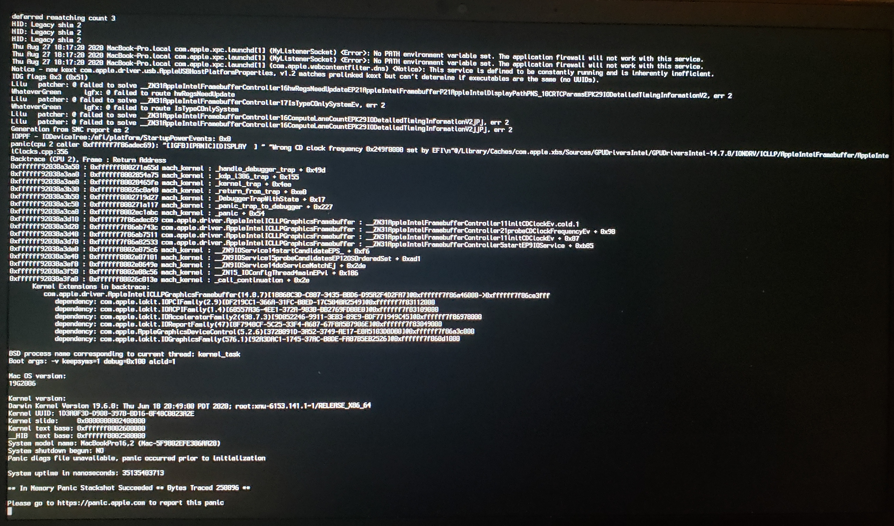

# Kernel Issues

* Supported version: 0.6.5

Issues surrounding from initial booting the macOS installer to right before the install GUI pops up.

* [Stuck on `[EB|#LOG:EXITBS:START]`](#stuck-on-eb-log-exitbs-start)
* [Stuck on EndRandomSeed](#stuck-on-endrandomseed)
* [Stuck after selecting macOS partition in OpenCore](#stuck-after-selecting-macos-partition-in-opencore)
* [Kernel Panic on `Invalid frame pointer`](#kernel-panic-on-invalid-frame-pointer)
* [Stuck on [EB|LD:OFS] Err(0xE) when booting preboot volume](#stuck-on-eb-ld-ofs-err-0xe-when-booting-preboot-volume)
* [Stuck on `OCB: LoadImage failed - Security Violation`](#stuck-on-ocb-loadimage-failed-security-violation)
* [Stuck on `OCABC: Memory pool allocation failure - Not Found`](#stuck-on-ocabc-memory-pool-allocation-failure-not-found)
* [Stuck on `Buffer Too Small`](#stuck-on-buffer-too-small)
* [Stuck on `Plist only kext has CFBundleExecutable key`](#stuck-on-plist-only-kext-has-cfbundleexecutable-key)
* [Stuck on `This version of Mac OS X is not supported: Reason Mac...`](#stuck-on-this-version-of-mac-os-x-is-not-supported-reason-mac)
* [`Couldn't allocate runtime area` errors?](#couldn-t-allocate-runtime-area-errors)
* [Stuck on `RTC...`, `PCI ConfigurationBegins`, `Previous Shutdown...`, `HPET`, `HID: Legacy...`](#stuck-on-rtc-pci-configuration-begins-previous-shutdown-hpet-hid-legacy)
* [Stuck at ACPI Table loading on B550](#stuck-at-acpi-table-loading-on-b550)
* ["Waiting for Root Device" or Prohibited Sign error](#waiting-for-root-device-or-prohibited-sign-error)
* [Kernel panic with IOPCIFamily on X99](#kernel-panic-with-iopcifamily-on-x99)
* [Stuck on or near `IOConsoleUsers: gIOScreenLock...`](#stuck-on-or-near-ioconsoleusers-gioscreenlock-giolockstate-3)
* [Scrambled Screen on laptops](#scrambled-screen-on-laptops)
* [Black screen after `IOConsoleUsers: gIOScreenLock...` on Navi](#black-screen-after-ioconsoleusers-gioscreenlock-on-navi)
* [Kernel Panic `Cannot perform kext summary`](#kernel-panic-cannot-perform-kext-summary)
* [Kernel Panic `AppleIntelMCEReporter`](#kernel-panic-appleintelmcereporter)
* [Kernel Panic `AppleIntelCPUPowerManagement`](#kernel-panic-appleintelcpupowermanagement)
* [Keyboard works but trackpad does not](#keyboard-works-but-trackpad-does-not)
* [`kextd stall[0]: AppleACPICPU`](#kextd-stall-0-appleacpicpu)
* [Kernel Panic on AppleIntelI210Ethernet](#kernel-panic-on-appleinteli210ethernet)
* [Kernel panic on "Wrong CD Clock Frequency" with Icelake laptop](#kernel-panic-on-wrong-cd-clock-frequency-with-icelake-laptop)
* [Stuck at `Forcing CS_RUNTIME for entitlement` in Big Sur](#stuck-at-forcing-cs-runtime-for-entitlement-in-big-sur)
* [Stuck on `ramrod`(^^^^^^^^^^^^^)](#stuck-on-ramrod)

## Stuck on `[EB|#LOG:EXITBS:START]`

This section will be split into 3 parts, so pay close attention:

* [Booter Issues](#booter-issues)
* [Kernel Patch Issues](#kernel-patch-issues)
* [UEFI Issues](#uefi-issues)
* [Virtual Machine Issues](#virtual-machine-issues)

### Booter Issues

The main culprits to watch for in the Booter section are:

* **DevirtualiseMmio**
  * Certain MMIO spaces are still required to function correctly, so you'll need to either exclude these regions in Booter -> MmioWhitelist or disable this quirk outright. More info here: [Using DevirtualiseMmio](../../extras/kaslr-fix.md#using-devirtualisemmio)
  * For TRx40 users, enable this quirk
  * For X99 users, disable this quirk as it breaks with some firmwares

* **SetupVirtualMap**
  * This quirk is required for the majority of firmwares and without it it's very common to kernel panic here, so enable it if not already
    * Mainly Z390 and older require this quirk enabled
    * However, certain firmwares(mainly 2020+) do not work with this quirk and so may actually cause this kernel panic:
      * Intel's Ice Lake series
      * Intel's Comet Lake series(B460, H470, Z490, etc)
      * AMD's B550 and A520(Latest BIOS on X570 are also included now)
        * Many B450 and X470 boards with late 2020 BIOS updates are also included
      * AMD's TRx40
      * VMs like QEMU
      * X299 2020+ BIOS updates(This applies to other X299 boards on the latest BIOS that released either in late 2019 or 2020+)

* **EnableWriteUnprotector**

  * Another issue may be that macOS is conflicting with the write protection from CR0 register, to resolve this we have 2 options:
    * If your firmware supports MATs(2018+ firmwares):
      * EnableWriteUnprotector -> False
      * RebuildAppleMemoryMap -> True
      * SyncRuntimePermissions -> True
    * For older firmwares:
      * EnableWriteUnprotector -> True
      * RebuildAppleMemoryMap -> False
      * SyncRuntimePermissions -> False
    * Note: Some laptops(ex. Dell Inspiron 5370) even with MATs support will halt on boot up, in these cases you'll have two options:
      * Boot with the old firmware quirk combo(ie. With EnableWriteUnprotector and disable `RebuildAppleMemoryMap` + `SyncRuntimePermissions`)
      * Enable `DevirtualiseMmio` and follow [MmioWhitelist guide](https://dortania.github.io/OpenCore-Install-Guide/extras/kaslr-fix.html)

Regarding MATs support, firmwares built against EDK 2018 will support this and many OEMs have even added support all the way back to Skylake laptops. Issue is it's not always obvious if an OEM has updated the firmware, you can check the OpenCore logs whether yours supports it([See here how to get a log](../debug.html)):

```
OCABC: MAT support is 1
```

* Note: `1` means it supports MATs, while `0` means it does not.

### Kernel Patch Issues

This section will be split between Intel and AMD users:

#### AMD Users

* Missing [kernel patches](https://github.com/AMD-OSX/AMD_Vanilla/tree/opencore)(only applies for AMD CPUs, make sure they're OpenCore patches and not Clover. Clover uses `MatchOS` while OpenCore has `MinKernel` and `Maxkernel`)
  * Note outdated kernel patches will also have the same effect please ensure you're using the latest patches from AMD OS X

#### Intel Users

* **AppleXcpmCfgLock** and **AppleCpuPmCfgLock**
  * Missing CFG or XCPM patches, please enable `AppleXcpmCfgLock` and `AppleCpuPmCfgLock`
    * Haswell and newer only need AppleXcpmCfgLock
    * Ivy Bridge and older only need AppleCpuPmCfgLock
      * Broadwell and older need AppleCpuPmCfgLock if running 10.10 or older
  * Alternatively you can properly disable CFG-Lock: [Fixing CFG Lock](https://dortania.github.io/OpenCore-Post-Install/misc/msr-lock.html)
* **AppleXcpmExtraMsrs**
  * May also be required, this is generally meant for Pentiums, HEDT and other odd systems not natively supported in macOS.

#### Legacy Intel users

For macOS Big Sur, many firmwares have issues determining the CPU core count and thus will kernel panic too early for screen printing. Via serial, you can see the following panic:

```
max_cpus_from_firmware not yet initialized
```

To resolve:

* Enable `AvoidRuntimeDefrag` under Booter -> Quirks
  * This should work for most firmwares

However on certain machines like the HP Compaq DC 7900, the firmware will still panic so we need to force a CPU core count value. Only use the below patch if AvoidRuntimeDefrag didn't work:

::: details Legacy CPU Core patch

To do this, Add the following patch(replacing the 04 from B8 **04** 00 00 00 C3 with the amount of CPU threads your hardware supports):

| Key | Type | Value |
| :--- | :--- | :--- |
| Base | String | _acpi_count_enabled_logical_processors |
| Count | Integer | 1 |
| Enabled | Boolean | True |
| Find | Data | |
| Identifier | String | Kernel |
| Limit | Integer | 0 |
| Mask | Data | |
| MaxKernel | String | |
| MinKernel | String | 20.0.0 |
| Replace | Data | B804000000C3 |
| ReplaceMask | Data | |
| Skip | Integer | 0 |

:::

### UEFI Issues

* **ProvideConsoleGop**
  * Needed for transitioning to the next screen, this was originally part of AptioMemoryFix but is now within OpenCore as this quirk. Can be found under UEFI -> Output
  * Note as of 0.5.6, this quirk is enabled by default in the sample.plist
* **IgnoreInvalidFlexRatio**
  * This is needed for Broadwell and older. **Not for AMD and Skylake or newer**

## Stuck on EndRandomSeed

Same issues above, see here for more details: [Stuck on `[EB|#LOG:EXITBS:START]`](#stuck-on-eb-log-exitbs-start)

## Stuck after selecting macOS partition in OpenCore

Same issues above, see here for more details: [Stuck on `[EB|#LOG:EXITBS:START]`](#stuck-on-eb-log-exitbs-start)

* Note: Enabling [DEBUG OpenCore](../debug.html) can help shed some light as well

## Kernel Panic on `Invalid frame pointer`

So this is due to some issue around the `Booter -> Quirks` you set, main things to check for:

* `DevirtualiseMmio`
  * Certain MMIO spaces are still required to function correctly, so you'll need to either exclude these regions in Booter -> MmioWhitelist or disable this quirk outright
  * More info here: [Using DevirtualiseMmio](../../extras/kaslr-fix.md#using-devirtualisemmio)

* `SetupVirtualMap`
  * This quirk is required for the majority of firmwares and without it it's very common to kernel panic here, so enable it if not already
    * However, certain firmwares do not work with this quirk and so may actually cause this kernel panic:
      * Intel's Ice Lake series
      * Intel's Comet Lake series
      * AMD's B550
      * AMD's A520
      * AMD's TRx40
      * VMs like QEMU
  
Another issue may be that macOS is conflicting with the write protection from CR0 register, to resolve this we have 2 options:

* If your firmware supports MATs(2018+ firmwares):
  * EnableWriteUnprotector -> False
  * RebuildAppleMemoryMap -> True
  * SyncRuntimePermissions -> True
* For older firmwares:
  * EnableWriteUnprotector -> True
  * RebuildAppleMemoryMap -> False
  * SyncRuntimePermissions -> False

Regarding MATs support, firmwares built against EDK 2018 will support this and many OEMs have even added support all the way back to Skylake laptops. Issue is it's not always obvious if an OEM has updated the firmware, you can check the OpenCore logs whether yours supports it:

```
OCABC: MAT support is 1
```

Note: `1` means it supports MATs, while `0` means it does not.

## Stuck on `[EB|LD:OFS] Err(0xE)` when booting preboot volume

Full error:

```
[EB|`LD:OFS] Err(0xE) @ OPEN (System\\Library\\PrelinkedKernels\\prelinkedkernel)
```

This can happen when the preboot volume isn't properly updated, to fix this you'll need to boot into recovery and repair it:

1. Enable JumpstartHotplug under UEFI -> APFS(Recovery may not boot on macOS Big Sur without this option)
2. Boot into recovery
3. Open the terminal, and run the following:

```bash
# First, find your Preboot volume
diskutil list

# From the below list, we can see our Preboot volume is disk5s2
/dev/disk5 (synthesized):
   #:                       TYPE NAME                    SIZE       IDENTIFIER
   0:      APFS Container Scheme -                      +255.7 GB   disk5
                                 Physical Store disk4s2
   1:                APFS Volume ⁨Big Sur HD - Data⁩       122.5 GB   disk5s1
   2:                APFS Volume ⁨Preboot⁩                 309.4 MB   disk5s2
   3:                APFS Volume ⁨Recovery⁩                887.8 MB   disk5s3
   4:                APFS Volume ⁨VM⁩                      1.1 MB     disk5s4
   5:                APFS Volume ⁨Big Sur HD⁩              16.2 GB    disk5s5
   6:              APFS Snapshot ⁨com.apple.os.update-...⁩ 16.2 GB    disk5s5s

# Now mount the Preboot volume
diskutil mount disk5s2

# Next run updatePreboot on the Preboot volume
diskutil apfs updatePreboot /volume/disk5s2
```

Then finally reboot

## Stuck on `OCB: LoadImage failed - Security Violation`

```
OCSB: No suitable signature - Security Violation
OCB: Apple Secure Boot prohibits this boot entry, enforcing!
OCB: LoadImage failed - Security Violation
```

This is due to missing outdated Apple Secure Boot manifests present on your preboot volume resulting is a failure to load if you have SecureBootModel set, reason for these files being missing is actually a bug in macOS.

To resolve this you can do one of the following:

* Disable SecureBootModel
  * ie. set `Misc -> Secuirty -> SecureBootModel -> Disabled`
* Reinstall macOS with the latest version
* Or copy over the Secure Boot manifests from `/usr/standalone/i386` to `/Volumes/Preboot/<UUID>/System/Library/CoreServices`
  * Note you will most likely need to do this via terminal as the Preboot volume isn't easily editable via the Finder
  
To do this via terminal:

```bash
# First, find your Preboot volume
diskutil list

# From the below list, we can see our Preboot volume is disk5s2
/dev/disk5 (synthesized):
   #:                       TYPE NAME                    SIZE       IDENTIFIER
   0:      APFS Container Scheme -                      +255.7 GB   disk5
                                 Physical Store disk4s2
   1:                APFS Volume ⁨Big Sur HD - Data⁩       122.5 GB   disk5s1
   2:                APFS Volume ⁨Preboot⁩                 309.4 MB   disk5s2
   3:                APFS Volume ⁨Recovery⁩                887.8 MB   disk5s3
   4:                APFS Volume ⁨VM⁩                      1.1 MB     disk5s4
   5:                APFS Volume ⁨Big Sur HD⁩              16.2 GB    disk5s5
   6:              APFS Snapshot ⁨com.apple.os.update-...⁩ 16.2 GB    disk5s5s

# Now mount the Preboot volume
diskutil mount disk5s2

# CD into your Preboot volume
# Note the actual volume is under /System/Volumes/Preboot
cd /System/Volumes/Preboot

# Grab your UUID
ls
 46923F6E-968E-46E9-AC6D-9E6141DF52FD
 CD844C38-1A25-48D5-9388-5D62AA46CFB8

# If multiple show up(ie. you dual boot multiple versions of macOS), you will
# need to determine which UUID is correct.
# Easiest way to determine is printing the value of .disk_label.contentDetails
# of each volume.
cat ./46923F6E-968E-46E9-AC6D-9E6141DF52FD/System/Library/CoreServices/.disk_label.contentDetails
 Big Sur HD%

cat ./CD844C38-1A25-48D5-9388-5D62AA46CFB8/System/Library/CoreServices/.disk_label.contentDetails
 Catalina HD%

# Next lets copy over the secure boot files
# Replace CD844C38-1A25-48D5-9388-5D62AA46CFB8 with your UUID value
cd ~
sudo cp -a /usr/standalone/i386/. /System/Volumes/Preboot/CD844C38-1A25-48D5-9388-5D62AA46CFB8/System/Library/CoreServices
```

## Stuck on `OCABC: Memory pool allocation failure - Not Found`

This is due to incorrect BIOS settings:

* Above4GDecoding is Enabled
* CSM is Disabled(Enabling Windows8.1/10 WHQL Mode can do the same on some boards)
  * Note on some laptops, CSM must be enabled
* BIOS is up-to-date(Z390 and HEDT are known for having poorly written firmwares)

## Stuck on `Buffer Too Small`

* Enable Above4GDecoding in the BIOS

## Stuck on `Plist only kext has CFBundleExecutable key`

Missing or incorrect `Executable path` in your config.plist, this should be resolved by re-running ProperTree's snapshot tool(Cmd/Ctrl+R).

## Stuck on `This version of Mac OS X is not supported: Reason Mac...`

This error happens when SMBIOS is one no longer supported by that version of macOS, make sure values are set in `PlatformInfo->Generic` with `Automatic` enabled. For a full list of supported SMBIOS and their OSes, see here: [Choosing the right SMBIOS](../../extras/smbios-support.md)

::: details Supported SMBIOS in macOS 10.15, Catalina

* iMac13,x+
* iMacPro1,1
* MacPro6,1+
* Macmini6,x+
* MacBook8,1+
* MacBookAir5,x+
* MacBookPro9,x+

:::

::: details Supported SMBIOS in macOS 11, Big Sur

* iMac14,4+
* iMacPro1,1
* MacPro6,1+
* Macmini7,1+
* MacBook8,1+
* MacBookAir6,x+
* MacBookPro11,x+

:::

## `Couldn't allocate runtime area` errors

See [Fixing KASLR slide values](../../extras/kaslr-fix.md)

## Stuck on `RTC...`, `PCI Configuration Begins`, `Previous Shutdown...`, `HPET`, `HID: Legacy...`

Well this general area is where a lot of PCI devices are first setup and configured, and is where most booting issues will happen. Other names include:

* `apfs_module_start...`,
* `Waiting for Root device`,
* `Waiting on...IOResources...`,
* `previous shutdown cause...`

The main places to check:

* **Missing EC patch**:
  * Make sure you have your EC SSDT both in EFI/OC/ACPI and ACPI -> Add, **double check it's enabled.**
  * If you don't have one, grab it here: [Getting started with ACPI](https://dortania.github.io/Getting-Started-With-ACPI/)
* **IRQ conflict**:
  * Most common on older laptops and pre-builts, run SSDTTime's FixHPET option and add the resulting SSDT-HPET.aml and ACPI patches to your config( the SSDT will not work without the ACPI patches)
* **PCI allocation issue**:
  * **UPDATE YOUR BIOS**, make sure it's on the latest. Most OEMs have very broken PCI allocation on older firmwares, especially AMD
  * Make sure either Above4G is enabled in the BIOS, if no option available then add `npci=0x2000` to boot args.
    * Some X99 and X299 boards(ie. GA-X299-UD4) may require both npci boot-arg and Above4G enabled
    * AMD CPU Note: **Do not have both the Above4G setting enabled and npci in boot args, they will conflict**
  * Other BIOS settings that are important: CSM disabled, Windows 8.1/10 UEFI Mode enabled
* **NVMe or SATA issue**:
  * Sometimes if either a bad SATA controller or an unsupported NVMe drive are used, you can commonly get stuck here. Things you can check:
    * Not using either a Samsung PM981 or Micron 2200S NVMe SSD
    * Samsung 970EvoPlus running the latest firmware(older firmwares were known for instability and stalls, [see here for more info](https://www.samsung.com/semiconductor/minisite/ssd/download/tools/))
    * SATA Hot-Plug is disabled in the BIOS(more commonly to cause issues on AMD CPU based systems)
    * Ensure NVMe drives are set as NVMe mode in BIOS(some BIOS have a bug where you can set NVMe drives as SATA)
* **NVRAM Failing**:
  * Common issue HEDT and 300 series motherboards, you have a couple paths to go down:
    * 300 Series Consumer Intel: See [Getting started with ACPI](https://dortania.github.io/Getting-Started-With-ACPI/) on making SSDT-PMC.aml
    * HEDT(ie. X99): See [Emulating NVRAM](https://dortania.github.io/OpenCore-Post-Install/misc/nvram.html) on how to stop NVRAM write, note that for install you do not need to run the script. Just setup the config.plist

* **RTC Missing**:
  * Commonly found on Intel's 300+ series(ie. Z370, Z490), caused by the RTC clock being disabled by default. See [Getting started with ACPI](https://dortania.github.io/Getting-Started-With-ACPI/) on creating an SSDT-AWAC.aml
  * X99 and X299 have broken RTC devices, so will need to be fixed with SSDT-RTC0-RANGE. See [Getting started with ACPI](https://dortania.github.io/Getting-Started-With-ACPI/) on creating said file
  * Some drunk firmware writer at HP also disabled the RTC on the HP 250 G6 with no way to actually re-enable it
    * Known affected models: `HP 15-DA0014dx`, `HP 250 G6`
    * For users cursed with such hardware you'll need to create a fake RTC clock for macOS to play with. See getting started with ACPI for more details, as well as below image example:

Example of what a disabled RTC with no way to enable looks like(note that there is no value to re-enable it like `STAS`):


## Stuck at ACPI table loading on B550


If you're getting stuck at or near ACPI table loading with an AMD B550 or A520 motherboard, add the following SSDT:

* [SSDT-CPUR.aml](https://github.com/dortania/Getting-Started-With-ACPI/blob/master/extra-files/compiled/SSDT-CPUR.aml)

And please remember to add this SSDT to both EFI/OC/ACPI **and** your config.plist under ACPI -> Add(ProperTree's snapshot function can do this for you)

## "Waiting for Root Device" or Prohibited Sign error

* Other names: Stop Sign, Scrambled

This is generally seen as a USB or SATA error, couple ways to fix:

### USB Issues

This assumes you're only booting the installer USB and not macOS itself.

* If you're hitting the 15 port limit, you can temporarily get around this with `XhciPortLimit` but for long term use, we recommend making a [USBmap](https://dortania.github.io/OpenCore-Post-Install/usb/)
  * `Kernel -> Quirks -> XhciPortLimit -> True`

* Another issue can be that certain firmware won't pass USB ownership to macOS
  * `UEFI -> Quirks -> ReleaseUsbOwnership -> True`
  * Enabling XHCI Handoff in the BIOS can fix this as well

* Sometimes, if the USB is plugged into a 3.x port, plugging it into a 2.0 port can fix this error.

* For AMD's 15h and 16h CPUs, you may need to add the following:
  * [XLNCUSBFix.kext](https://cdn.discordapp.com/attachments/566705665616117760/566728101292408877/XLNCUSBFix.kext.zip)

* If XLNCUSBFix still doesn't work, then try the following:
  * [AMD StopSign-fixv5](https://cdn.discordapp.com/attachments/249992304503291905/355235241645965312/StopSign-fixv5.zip)

* X299 Users: Enable Above4G Decoding
  * Odd firmware bug on X299 where USB breaks otherwise

* Missing USB ports in ACPI:
  * For Intel's Coffee Lake and older, we recommend using [USBInjectAll](https://bitbucket.org/RehabMan/os-x-usb-inject-all/downloads/)
  * For Intel's Ice Lake and Comet Lake, we recommend [SSDT-RHUB](https://github.com/dortania/Getting-Started-With-ACPI/blob/master/extra-files/compiled/SSDT-RHUB.aml)
    * SSDTTime's `7. USB Reset` option can do the same
  * For AMD, run SSDTTime's `7. USB Reset` option and add the provided SSDT-RHUB to your EFI and config.plist
  
### SATA Issues

On rare occasions(mainly laptops), the SATA controller isn't officially supported by macOS. To resolve this, we'll want to do a few things:

* Set SATA to AHCI mode in the BIOS
  * macOS doesn't support hardware RAID or IDE mode properly.
  * Note drives already using Intel Rapid Storage Technology(RST, soft RAID for Windows and Linux) will not be accessible in macOS.
* [SATA-unsupported.kext](https://github.com/khronokernel/Legacy-Kexts/blob/master/Injectors/Zip/SATA-unsupported.kext.zip)
  * Adds support to obscure SATA controllers, commonly being laptops.
  * For very legacy SATA controllers, [AHCIPortInjector.kext](https://www.insanelymac.com/forum/files/file/436-ahciportinjectorkext/) may be more suitable.
* [Catalina's patched AppleAHCIPort.kext](https://github.com/dortania/OpenCore-Install-Guide/blob/master/extra-files/CtlnaAHCIPort.kext.zip)
  * For users running macOS 11, Big Sur and having issues. This backports the known working Catalina kext, SATA-unsupported is not needed with this kext

Note that you will only experience this issue after installing macOS onto the drive, booting the macOS installer will not error out due to SATA issues.

## Kernel panic with IOPCIFamily on X99

For those running the X99 platform from Intel, please go over the following:

* The following kernel patches are enabled:
  * AppleCpuPmCfgLock
  * AppleXcpmCfgLock
  * AppleXcpmExtraMsrs
* You have the following SSDTs:
  * SSDT-UNC(if not, see [Getting started with ACPI](https://dortania.github.io/Getting-Started-With-ACPI/) on creating said file)

## Stuck on or near `IOConsoleUsers: gIOScreenLock...`/`gIOLockState (3...`

This is right before the GPU is properly initialized, verify the following:

* GPU is UEFI capable(GTX 7XX/2013+)
* CSM is off in the BIOS
  * May need to be enabled on laptops
* Forcing PCIe 3.0 link speed
* Double check that ig-platform-id and device-id are valid if running an iGPU.
  * Desktop UHD 630's may need to use `00009B3E` instead
* Trying various [WhateverGreen Fixes](https://github.com/acidanthera/WhateverGreen/blob/master/Manual/FAQ.IntelHD.en.md)
  * `-igfxmlr` boot argument. This can also manifest as a "Divide by Zero" error.
* Coffee Lake iGPU users may also need `igfxonln=1` in 10.15.4 and newer

## Scrambled Screen on laptops

Enable CSM in your UEFI settings. This may appear as "Boot legacy ROMs" or other legacy setting.

## Black screen after `IOConsoleUsers: gIOScreenLock...` on Navi

* Add `agdpmod=pikera` to boot args
* Switch between different display outputs
* Try running MacPro7,1 SMBIOS with the boot-arg `agdpmod=ignore`

For MSI Navi users, you'll need to apply the patch mentioned here: [Installer not working with 5700XT #901](https://github.com/acidanthera/bugtracker/issues/901)

Specifically, add the following entry under `Kernel -> Patch`:

::: details MSI Navi Patch

```
Base:
Comment: Navi VBIOS Bug Patch
Count: 1
Enabled: YES
Find: 4154592C526F6D2300
Identifier: com.apple.kext.AMDRadeonX6000Framebuffer
Limit: 0
Mask:
MinKernel: 19.00.00
MaxKernel: 19.99.99
Replace: 414D442C526F6D2300
ReplaceMask:
Skip: 0
```

:::

Note: macOS 11, Big Sur no longer requires this patch for MSI Navi.

## Kernel Panic `Cannot perform kext summary`

Generally seen as an issue surrounding the prelinked kernel, specifically that macOS is having a hard time interpreting the ones we injected. Verify that:

* Your kexts are in the correct order(master then plugins, Lilu always before the plugins)
* Kexts with executables have them and plist only kexts don't(ie. USBmap.kext, XHCI-unspported.kext, etc does not contain an executable)
* Don't include multiple of the same kexts in your config.plist(ie. including multiple copies of VoodooInput from multiple kexts, we recommend choosing the first kext in your config's array and disable the rest)

Note: this error may also look very similar to [Kernel Panic on `Invalid frame pointer`](#kernel-panic-on-invalid-frame-pointer)

## Kernel Panic `AppleIntelMCEReporter`

With macOS Catalina, dual socket support is broken, and a fun fact about AMD firmware is that some boards will actually report multiple socketed CPUs. To fix this, add [AppleMCEReporterDisabler](https://github.com/acidanthera/bugtracker/files/3703498/AppleMCEReporterDisabler.kext.zip) to both EFI/OC/Kexts and config.plist -> Kernel -> Add

## Kernel Panic `AppleIntelCPUPowerManagement`

This is likely due to faulty or outright missing NullCPUPowerManagement. To fix the issue, remove NullCPUPowerManagement from `Kernel -> Add` and `EFI/OC/Kexts` then enable `DummyPowerManagement` under `Kernel -> Emulate`

* **Note**: On older Intel CPUs(ie. Penryn and older), it may be due to IRQ conflicts or the HPET device being disabled. To resolve, you have 2 options:
  * [SSDTTime's FixHPET Option](https://dortania.github.io/Getting-Started-With-ACPI/ssdt-methods/ssdt-easy.html)
  * Forcing the HPET Device on
  
::: details Forcing the HPET Device on

Under ACPI -> Patch:

| Comment | String | Force HPET Online |
| :--- | :--- | :--- |
| Enabled | Boolean | YES |
| Count | Number | 0 |
| Limit | Number | 0 |
| Find | Data | A010934F53464C00 |
| Replace | Data | A40A0FA3A3A3A3A3 |

:::

## macOS frozen right before login

This is a common example of screwed up TSC, for most system add [CpuTscSync](https://github.com/lvs1974/CpuTscSync)

The most common way to see the TSC issue:

Case 1    |  Case 2
:-------------------------:|:-------------------------:
  |  

## Keyboard works but trackpad does not

Make sure that VoodooInput is listed *before* VoodooPS2 and VoodooI2C kexts in your config.plist.

::: details VoodooI2C Troubleshooting

Check the order that your kexts load - make they match what is shown under [Gathering Files](../../ktext.md):

1. VoodooGPIO, VoodooInput, and VoodooI2CServices in any order (Found under VoodooI2C.kext/Contents/PlugIns)
2. VoodooI2C
3. Satellite/Plugin Kext

Make sure you have SSDT-GPIO in EFI/OC/ACPI and in your config.plist under ACPI -> Add in your config.plist. If you are still having issues, reference the [Getting Started With ACPI GPIO page](https://dortania.github.io/Getting-Started-With-ACPI/Laptops/trackpad.html).

:::

## `kextd stall[0]: AppleACPICPU`

This is due to either a missing SMC emulator or broken one, make sure of the following:

* Lilu and VirtualSMC are both in EFI/OC/kexts and in your config.plist
* Lilu is before VirtualSMC in the kext list
* Last resort is to try FakeSMC instead, **do not have both VirtualSMC and FakeSMC enabled**

## Kernel Panic on AppleIntelI210Ethernet

For those running Comet lake motherboards with the i225-V NIC, you may experience a kernel panic on boot due to the i210 kext. To resolve this, make sure you have the correct PciRoot for your Ethernet. This commonly being either:

* PciRoot(0x0)/Pci(0x1C,0x1)/Pci(0x0, 0x0)
  * By default, this is what Asus and Gigabyte motherboards use
* PciRoot(0x0)/Pci(0x1C,0x4)/Pci(0x0,0x0)
  * Some OEMs may use this instead
  
For those who can to your PciRoot manually, you'll want to install macOS fully and run the following with [gfxutil](https://github.com/acidanthera/gfxutil/releases):

```
/path/to/gfxutil | grep -i "8086:15f3"
```

This should spit out something like this:

```
00:1f.6 8086:15f3 /PC00@0/GBE1@1F,6 = PciRoot(0x0)/Pci(0x1F,0x6)
```

The ending `PciRoot(0x0)/Pci(0x1F,0x6)` is what you want to add in your config.plist with device-id of `F2150000`

## Kernel panic on "Wrong CD Clock Frequency" with Icelake laptop



To resolve this kernel panic, ensure you have `-igfxcdc` in your boot-args.

## Kernel panic on "cckprng_int_gen"

Full panic:

```
"cckprng_int_gen: generator has already been sealed"
```

This is likely to be 1 of 2 things:

* Missing SMC Emulator(ie. no VirtualSMC in your config.plist or EFI)
  * Add [VirtualSMC.kext](https://github.com/acidanthera/VirtualSMC/releases) to your config.plist and EFI
* Incorrect SSDT usage with SSDT-CPUR

For the latter, ensure you're only using SSDT-CPUR with **B550 and A520**. Do not use on X570 or older hardware(ie. B450 or A320)

## Stuck at `Forcing CS_RUNTIME for entitlement` in Big Sur


This is actually the part at where macOS will seal the system volume, and where it may seem that macOS has gotten stuck. **DO NOT RESTART** thinking you're stuck, this will take quite some time to complete.

## Stuck on `ramrod`(^^^^^^^^^^^^^)


If you get stuck around the `ramrod` section (specifically, it boots, hits this error, and reboots again back into this, causing a loop), this hints that your SMC emulator is broken. To fix this, you have 2 options:

* Ensure you're using the latest builds of VirtualSMC and Lilu, with the `vsmcgen=1` boot-arg
* Switch over to [Rehabman's FakeSMC](https://bitbucket.org/RehabMan/os-x-fakesmc-kozlek/downloads/) (you can use the `MinKernel`/`MaxKernel` trick mentioned above to restrict FakeSMC to Big Sur and up

And when switching kexts, ensure you don't have both FakeSMC and VirtualSMC enabled in your config.plist, as this will cause a conflict.

### Virtual Machine Issues

* VMWare 15 is known to get stuck on `[EB|#LOG:EXITBS:START]`. VMWare 16 resolves the problem.
