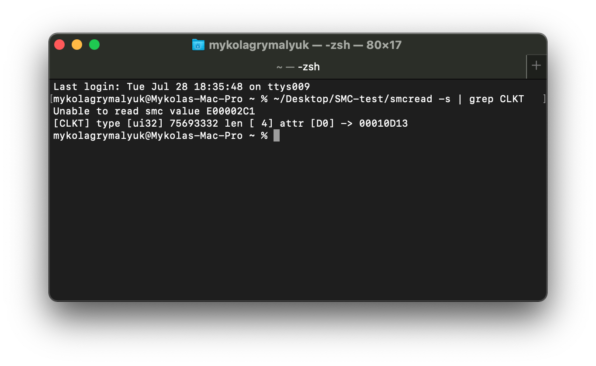
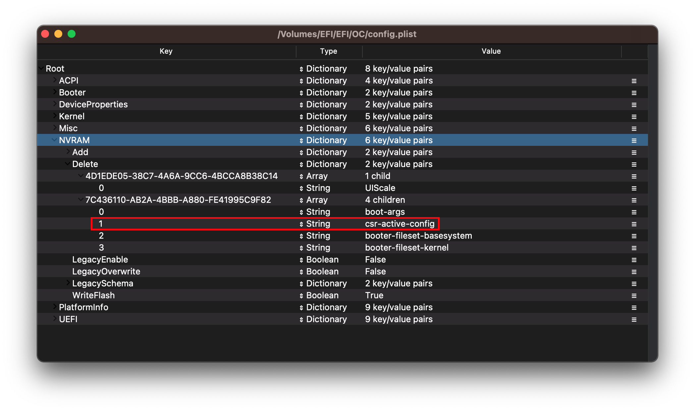
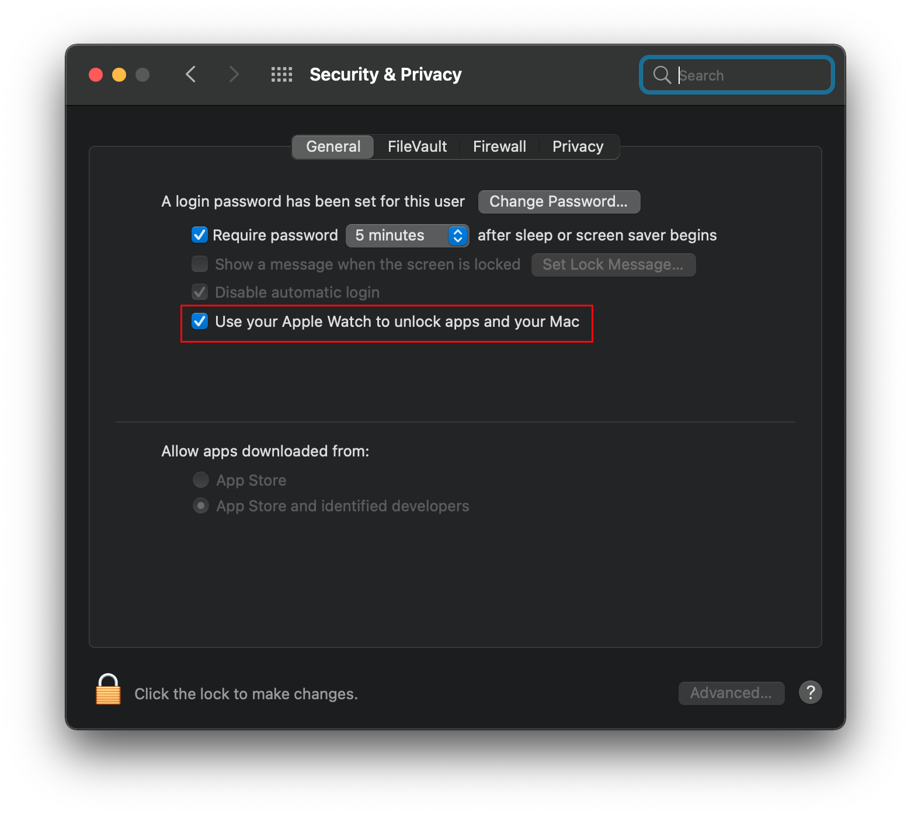

# Post-Install Issues

* Supported version: 0.6.5

Issues revolving around macOS once properly installed.

* [Broken iMessage and Siri](#broken-imessage-and-siri)
* [No on-board audio](#no-on-board-audio)
* [BIOS reset or sent into Safemode after reboot/shutdown?](#bios-reset-or-sent-into-safemode-after-reboot-shutdown)
* [Synaptics PS2 based trackpad doesn't work](#synaptics-ps2-based-trackpad-doesn-t-work)
* [Fix for Dell breakless PS2 keyboard keys](#fix-for-dell-breakless-ps2-keyboard-keys)
* [macOS GPU acceleration missing on AMD X570](#macos-gpu-acceleration-missing-on-amd-x570)
* [DRM Broken](#drm-broken)
* ["Memory Modules Misconfigured" on MacPro7,1](#memory-modules-misconfigured-on-macpro7-1)
* [Apps crashing on AMD](#apps-crashing-on-amd)
* [AssetCache Content Caching unavailable in virtual machine](#assetcache-content-caching-unavailable-in-virtual-machine)
* [Coffee Lake systems failing to wake](#coffee-lake-systems-failing-to-wake)
* [No temperature/fan sensor output](#no-temperature-fan-sensor-output)
* ["You can't change the startup disk to the selected disk" error](#you-can-t-change-the-startup-disk-to-the-selected-disk-error)
* [macOS waking up with the wrong time](#macos-waking-up-with-the-wrong-time)
* [No Volume/Brightness control on external monitors](#no-volume-brightness-control-on-external-monitors)
* [Disabling SIP](#disabling-sip)
* [Rolling back APFS Snapshots](#rolling-back-apfs-snapshots)
* [Apple Watch Unlock Issues](#apple-watch-unlock-issues)
* [4K iGPU output issues over HDMI](#4k-igpu-output-issues-over-hdmi)

## Broken iMessage and Siri

Refer to [Fixing iServices](https://dortania.github.io/OpenCore-Post-Install/universal/iservices.html) section

## No on-board audio

Refer to [Fixing Audio with AppleALC](https://dortania.github.io/OpenCore-Post-Install/) section

## BIOS reset or sent into Safemode after reboot/shutdown

Refer to [Fixing RTC/CMOS Resets](https://dortania.github.io/OpenCore-Post-Install/misc/rtc.html) section

## Synaptics PS2 based trackpad doesn't work

You can try to use [SSDT-Enable_DynamicEWMode.dsl](https://github.com/acidanthera/VoodooPS2/blob/master/Docs/ACPI/SSDT-Enable_DynamicEWMode.dsl).
First, you have to open Device Manager, and head to the following:

```
Device Manager -> Mice and other pointing devices -> Double click on your trackpad -> Properties -> Details > BIOS device name
```

Then grab [SSDT-Enable_DynamicEWMode.dsl](https://github.com/acidanthera/VoodooPS2/blob/master/Docs/ACPI/SSDT-Enable_DynamicEWMode.dsl)
By default, this uses PCI0.LPCB.PS2K for the pathing. you'll want to rename accordingly.

```c
External (_SB_.PCI0.LPCB.PS2K, DeviceObj) <- Rename this

    Name(_SB.PCI0.LPCB.PS2K.RMCF, Package()  <- Rename this

```

Then compile with MaciASL, copy to your OC/ACPI folder, and add it to your config, and you should be good to go.

* Note: Although this will work for most cases, the trackpad may be laggy and you may not be able to use the physical buttons ([more details](https://github.com/acidanthera/bugtracker/issues/890)). If you can live without the trackpad, this may be better:

Find the ACPI path of your mouse (see above), then grab [SSDT-DisableTrackpadProbe.dsl](https://github.com/acidanthera/VoodooPS2/blob/master/Docs/ACPI/SSDT-DisableTrackpadProbe.dsl). By default, this uses PCI0.LPCB.PS2K so you have to change that to your ACPI path if necessary:

```c
External (_SB_.PCI0.LPCB.PS2K, DeviceObj) <- Rename this

    Name(_SB.PCI0.LPCB.PS2K.RMCF, Package() <- Rename this
```

## Fix for Dell breakless PS2 keyboard keys

For those with issues surrounding key presses not releasing(ie. pressing infinitely), you'll want to enable VoodooPS2's Dell profile.

First of all, you need to find the path to your ACPI keyboard object in the Device Manager:

```
Device Manager -> Keyboards -> Double click on your keyboard -> Properties -> Details > BIOS device name
```

After this, grab [SSDT-KEY-DELL-WN09.dsl](https://github.com/acidanthera/VoodooPS2/blob/master/Docs/ACPI/SSDT-KEY-DELL-WN09.dsl) and change the ACPI path to the one found above as needed:

```c
External (_SB_.PCI0.LPCB.PS2K, DeviceObj) <- Rename this

    Method(_SB.PCI0.LPCB.PS2K._DSM, 4) <- Rename this
```

## macOS GPU acceleration missing on AMD X570

Verify the following:

* GPU is UEFI capable(GTX 7XX/2013+)
* CSM is off in the BIOS
* Forcing PCIe 3.0 link speed

## DRM Broken

Refer to [Fixing DRM](https://dortania.github.io/OpenCore-Post-Install/universal/drm.html) section

## "Memory Modules Misconfigured" on MacPro7,1

Follow guide listed here:

* [Fixing MacPro7,1 Memory Errors](https://dortania.github.io/OpenCore-Post-Install/universal/memory.html)

## Apps crashing on AMD

~~Easy fix, buy Intel~~

So with AMD, whenever Apple calls CPU specific functions the app will either not work or outright crash. Here are some apps and their "fixes":

* Adobe Products don't always work
  * Some fixes can be found here: [Adobe Fixes](https://adobe.amd-osx.com/)
  * Do note these fixes just disables functionality, they're not really fixes
* Virtual Machine running off of AppleHV's framework will not work(ie: Parallels 15, VMware)
  * VirtualBox works fine as it doesn't use AppleHV
  * VMware 10 and older can work as well
  * Parallels 13.1.0 and older are known to work as well
* Docker broken
  * Docker toolbox is the only solution as it's based off of VirtualBox, many features are unavailable with this version
* IDA Pro won't install
  * There's an Intel specific check in the installer, app itself is likely fine
* 15/16h CPU web pages crashing
  * Follow directions here after UPDATE 5: [Fix web pages](https://www.insanelymac.com/forum/topic/335877-amd-mojave-kernel-development-and-testing/?do=findComment&comment=2661857)

## Sleep crashing on AMD

This is generally seen on AMD who use the chipset's USB controller, specifically for the Ryzen series and newer. The main way to tell if you're having issues with this is checking logs after either sleeping or waking:

* In terminal:
  * `log show --last 1d | grep "Wake reason"` verify it

Should result in something like this:

```
Sleep transition timed out after 180 seconds while calling power state change callbacks. Suspected bundle: com.apple.iokit.IOUSBHostFamily.
```

You can double check which controller is XHC0 via IOReg and checking the Vendor ID(1022 for AMD chipset). The fix for this sleep issue is either:

* Avoid the chipset USB all together(ideally set `_STA = 0x0` to disable the controller outright with an SSDT)
* Correct the USBX power properties to what the controller expects

## AssetCache Content Caching unavailable in virtual machine

Errors such as:

```bash
$ sudo AssetCacheManagerUtil activate
AssetCacheManagerUtil[] Failed to activate content caching: Error Domain=ACSMErrorDomain Code=5 "virtual machine"...
```

arise due to `VMM` flag being exposed by sysctl.

Apply [VmAssetCacheEnable](https://github.com/ofawx/VmAssetCacheEnable) kernel patch to disguise the flag and allow normal operation.

## Coffee Lake systems failing to wake

In macOS 10.15.4, there were some changes made to AGPM that can cause wake issues on Coffee Lake systems. Specifically displays hooked up to the iGPU would fail to wake. To resolve this:

* Add `igfxonln=1` to boot-args
* Make sure you're using [WhateverGreen v1.3.8](https://github.com/acidanthera/WhateverGreen/releases) or newer

## No temperature/fan sensor output

So couple things:

* iStat Menus doesn't yet support MacPro7,1 readouts
* VirtualSMC's bundled sensors do not support AMD

For iStat, you'll have to wait for an update. For AMD users, you can use either:

* [SMCAMDProcessor](https://github.com/trulyspinach/SMCAMDProcessor/releases)
  * Still in early beta but great work has been done, note it's been mainly tested on Ryzen
* [FakeSMC3_with_plugins](https://github.com/CloverHackyColor/FakeSMC3_with_plugins/releases)

**Note for AMD with FakeSMC**:

* FileVault support requires more work with FakeSMC
* Make sure no other SMC kexts are present, specifically those from [VirtualSMC](https://github.com/acidanthera/VirtualSMC/releases)

## "You can't change the startup disk to the selected disk" error

This is commonly caused by irregular partition setup of the Windows drive, specifically that the EFI is not the first partition. To fix this, we need to enable this quirk:

* `PlatformInfo -> Generic -> AdviseWindows -> True`


## Selecting Startup Disk doesn't apply correctly

If you're having issues with Startup Disk correctly applying your new boot entry, this is most likely caused by a missing `DevicePathsSupported` in your I/O Registry. To resolve this, ensure you are using `PlatformInfo -> Automatic -> True`

Example of missing `DevicePathsSupported`:

* [Default DevicePath match failure due to different PciRoot #664](https://github.com/acidanthera/bugtracker/issues/664#issuecomment-663873846)

## macOS waking up with the wrong time

An odd quirk some people may notice is that from wake, macOS will have the incorrect time for a bit before self-correcting with network time check. The root cause of this issue is most likely due to your RTC not ticking, and can be resolved with a new CMOS battery(note that Z270 and newer are quite picky with voltage so choose carefully).

To verify whether your RTC is working correctly:

* Download [VirtualSMC v1.1.5+](https://github.com/acidanthera/virtualsmc/releases) and run the smcread tool:

```bash
/path/to/smcread -s | grep CLKT
```



This should provide you with a hexadecimal value, and once converted it should equal time elapsed from Midnight relative to Cupertino.

So for this example, we'll grab our value(`00010D13`) then convert it to decimal and finally divide it by 3600. This should result in the approximate time elapsed(in seconds) since midnight relative to Cupertino

* 00010D13 (Convert to HEX)-> 68883 (Divided by 3600 so we get hours)-> 19.13h(so 19:07:48)

Next you'll want to put your hack to sleep for a bit and wake it, then check the CLKT value once more to see whether it deviated more or if it has a set difference. If you find it didn't actually tick much of at all from the elapsed time, you'll need to look into buying a new battery(with proper voltage)

## No Volume/Brightness control on external monitors

Oddly enough, macOS has locked down digital audio from having control. To bring back some functionality, the app [MonitorControl](https://github.com/the0neyouseek/MonitorControl/releases) has done great work on improving support in macOS

## Time inconsistency between macOS and Windows

This is due to macOS using Universal Time while Windows relies on Greenwhich time, so you'll need to force one OS to a different way of measuring time. We highly recommend modifying Windows instead as it's far less destructive and painful:

* [Install Bootcamp utilities](https://dortania.github.io/OpenCore-Post-Install/multiboot/bootcamp.html)
* [Modify Windows' registry](https://superuser.com/q/494432)

## Disabling SIP

SIP or more properly known as System Integrity Protection, is a security technology that attempts to prevent any malicious software and the end user from damaging the OS. First introduced with OS X El Capitan, SIP has grown over time to control more and more things in macOS, including limiting edits to restricted file locations and 3rd party kext loading with `kextload`(OpenCore is unaffected as kexts are injected at boot). To resolve this, Apple has provided numerous configuration options in the NVRAM variable `csr-active-config` which can either be set in the macOS recovery environment or with OpenCore's NVRAM section(The latter will be discussed below).

You can choose different values to enable or disable certain flags of SIP. Some useful tools to help you with these are [CsrDecode](https://github.com/corpnewt/CsrDecode) and [csrstat](https://github.com/JayBrown/csrstat-NG). Common values are as follows (bytes are pre-hex swapped for you, and note that they go under NVRAM -> Add -> 7C436110-AB2A-4BBB-A880-FE41995C9F82 -> csr-active-config):

* `00000000` - SIP completely enabled (0x0).
* `03000000` - Disable kext signing (0x1) and filesystem protections (0x2).
* `FF030000` - Disable all [flags in macOS High Sierra](https://opensource.apple.com/source/xnu/xnu-4570.71.2/bsd/sys/csr.h.auto.html) (0x3ff).
* `FF070000` - Disable all [flags in macOS Mojave](https://opensource.apple.com/source/xnu/xnu-4903.270.47/bsd/sys/csr.h.auto.html) and in [macOS Catalina](https://opensource.apple.com/source/xnu/xnu-6153.81.5/bsd/sys/csr.h.auto.html) (0x7ff) as Apple introduced a value for executable policy.
* `FF0F0000` - Disable all flags in macOS Big Sur (0xfff) which has another new [flag for authenticated root](https://eclecticlight.co/2020/06/25/big-surs-signed-system-volume-added-security-protection/).

**Note**: Disabling SIP with OpenCore is quite a bit different compared to Clover, specifically that NVRAM variables will not be overwritten unless explicitly told so under the `Delete` section. So if you've already set SIP once either via OpenCore or in macOS, you must override the variable:

* `NVRAM -> Block -> 7C436110-AB2A-4BBB-A880-FE41995C9F82 -> csr-active-config`
  


## Writing to the macOS system partition

With macOS Catalina and newer, Apple split the OS and user data into 2 volumes where the system volume is read-only by default. To make these drives writable we'll need to do a few things:

**macOS Catalina**

1. [Disable SIP](#disabling-sip)
2. Mount drive as writable (Run `sudo mount -uw /` in terminal)

**macOS Big Sur**

1. [Disable SIP](#disabling-sip)
2. Mount drive as writable (See below link for command)

* Note: Due to how OS updates work in macOS Big Sur and newer, changing the system volume can in fact break OS updates. Please edit with caution

Commands based off of Apple's KDK documents:

```bash
# First, create a mount point for your drive
mkdir ~/livemount

# Next, find your System volume
diskutil list

# From the below list, we can see our System volume is disk5s5
/dev/disk5 (synthesized):
   #:                       TYPE NAME                    SIZE       IDENTIFIER
   0:      APFS Container Scheme -                      +255.7 GB   disk5
                                 Physical Store disk4s2
   1:                APFS Volume ⁨Big Sur HD - Data⁩       122.5 GB   disk5s1
   2:                APFS Volume ⁨Preboot⁩                 309.4 MB   disk5s2
   3:                APFS Volume ⁨Recovery⁩                887.8 MB   disk5s3
   4:                APFS Volume ⁨VM⁩                      1.1 MB     disk5s4
   5:                APFS Volume ⁨Big Sur HD⁩              16.2 GB    disk5s5
   6:              APFS Snapshot ⁨com.apple.os.update-...⁩ 16.2 GB    disk5s5s

# Mount the drive(ie. disk5s5)
sudo mount -o nobrowse -t apfs  /dev/disk5s5 ~/livemount

# Now you can freely make any edits to the System volume

# If you edited either the S*/L*/Kernel, S*/L*/Extensions or L*/Extensions,
# you will need to rebuild the kernel cache
sudo kmutil install --volume-root ~/livemount --update-all

# Finally, once done editing the system volume we'll want to create a new snapshot
sudo bless --folder ~/livemount/System/Library/CoreServices --bootefi --create-snapshot
```

## Rolling back APFS Snapshots

With macOS Big Sur, the system volume is now snapshotted allowing you to roll back in case of issues with system updates breaking due to a broken seal. Thanks to new snapshots being created with every OS update, we've got quite a bit to roll back too.

To roll back, you'll first need to reboot into Recovery partition then select "Restore From Time Machine Backup":


* [Credit to Lifewire for image](https://www.lifewire.com/roll-back-apfs-snapshots-4154969)

## Apple Watch Unlock issues

For those with Apple Watch Unlock issues, verify the following:

* You have a supported Apple Wireless card with Bluetooth Low Energy(4.0+)
* Your watch and Mac are signed in with the same account
* iServices working correctly(ie. iMessage)
* There's an option to Unlock with Apple Watch under Security and Privacy setting in System Preferences



If the above are met, and you still have unlock issues we recommend running through the below guide:

* [Fixing Auto Unlock](https://forums.macrumors.com/threads/watchos-7-beta-5-unlock-mac-doesnt-work.2250819/page-2?post=28904426#post-28904426)

## 4K iGPU output issues over HDMI

For machines with HDMI 2.0 capable ports with resolutuion issues, verify the following:

* 4k output works correctly in Windows
* Monitor is set explicitly to HDMI 2.0
  * If using an HDMI to DisplayPort converter, ensure the monitor is set to DisplayPort1.2 or higher
* Ensure enough iGPU memory has been allocated
  * For Broadwell and newer, 64MB is expected to be allocated
  * Machines relying on WhateverGreen's `framebuffer-stolenmem` property should know this can cause 4k output issues. Please ensure you can set the iGPU's memory to 64MB allowing you to remove these properties
* Laptops and many desktop users may need this boot-arg:
  * `-cdfon`

For all other troubleshooting, please reference [WhateverGreen's Intel docs](https://github.com/acidanthera/WhateverGreen/blob/master/Manual/FAQ.IntelHD.en.md)
