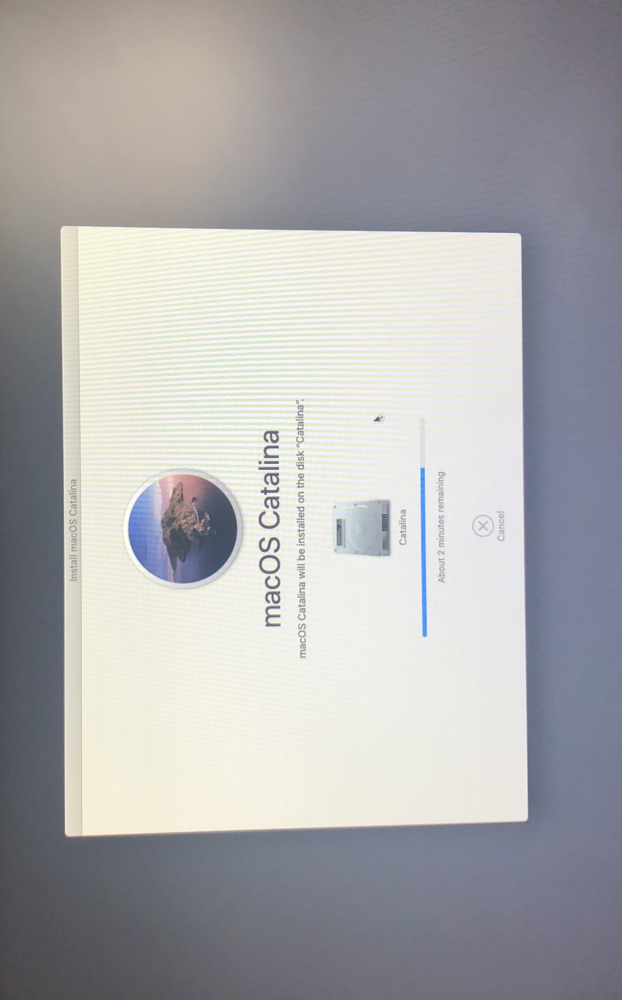
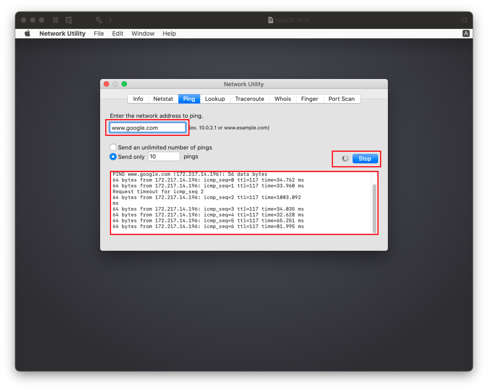

# Userspace Issues

* Supported version: 0.6.5

Issues regarding once you've booted the installer and the GUI has loaded.

* [macOS installer in Russian](#macos-installer-in-russian)
* [macOS Installer being damaged](#macos-installer-being-damaged)
* [Stuck on or near `IOConsoleUsers: gIOScreenLock...`](#stuck-on-or-near-ioconsoleusers-gioscreenlock-giolockstate-3)
* [Scrambled Screen on laptops](#scrambled-screen-on-laptops)
* [Black screen after `IOConsoleUsers: gIOScreenLock...` on Navi](#black-screen-after-ioconsoleusers-gioscreenlock-on-navi)
* [Frozen in the macOS installer after 30 seconds](#frozen-in-the-macos-installer-after-30-seconds)
* [15h/16h CPU reboot after Data & Privacy screen](#_15h-16h-cpu-reboot-after-data-privacy-screen)
* [macOS frozen right before login](#macos-frozen-right-before-login)
* [MediaKit reports not enough space](#mediakit-reports-not-enough-space)
* [DiskUtility failing to erase](#diskutility-failing-to-erase)
* [SATA Drives Not Shown in Disk Utility](#sata-drives-not-shown-in-diskutility)
* [Stuck at 2 minutes remaining](#stuck-at-2-minutes-remaining)
* [The recovery server cannot get contacted](#the-recovery-server-cannot-get-contacted)
* [Keyboard and Mouse broken in Big Sur](#keyboard-and-mouse-broken-in-big-sur)
* [Stuck on `Your Mac needs a firmware update in order to install to this volume`](#stuck-on-your-mac-needs-a-firmware-update-in-order-to-install-to-this-volume)

## macOS installer in Russian

Default sample config is in Russian because slavs rule the Hackintosh world, check your `prev-lang:kbd` value under `NVRAM -> Add -> 7C436110-AB2A-4BBB-A880-FE41995C9F82`. Set to `656e2d55533a30` for American: en-US:0 and a full list can be found in [AppleKeyboardLayouts.txt](https://github.com/acidanthera/OpenCorePkg/blob/master/Utilities/AppleKeyboardLayouts/AppleKeyboardLayouts.txt). For those using with a simple text editor(ie. UEFI Shell, Notepad++, etc), `656e2d55533a30` will become `ZW4tVVM6MA==`

You may also need to reset NVRAM in the boot picker as well

* Note: Thinkpad laptops are known to be semi-bricked after an NVRAM reset in OpenCore, we recommend resetting NVRAM by updating the BIOS on these machines.

Still didn't work? Well time for the big guns. We'll force remove that exact property and let OpenCore rebuild it:

`NVRAM -> Block -> 7C436110-AB2A-4BBB-A880-FE41995C9F82 -> Item 0` then set it Type `String` and Value `prev-lang:kbd`


## macOS Installer being damaged

If you've download macOS before October 2019, you likely have an expired macOS Installer certificate, there's 2 ways to fix this:

* Download newest copy of macOS
* Change date in terminal to when the certificate was valid

For the latter:

* Disconnect all networking devices(Ethernet, disable WiFi)
* In the recovery terminal set to September 1st, 2019:

```
date 0901000019
```

## Stuck on or near `IOConsoleUsers: gIOScreenLock...`/`gIOLockState (3...`

This is right before the GPU is properly initialized, verify the following:

* GPU is UEFI capable(GTX 7XX/2013+)
* CSM is off in the BIOS
* Forcing PCIe 3.0 link speed
* Double check that ig-platform-id and device-id are valid if running an iGPU.
  * Desktop UHD 630's may need to use `00009B3E` instead
* Trying various [WhateverGreen Fixes](https://github.com/acidanthera/WhateverGreen/blob/master/Manual/FAQ.IntelHD.en.md)
  * `-igfxmlr` boot argument. This can also manifest as a "Divide by Zero" error.
* Coffee Lake iGPU users may also need `igfxonln=1` in 10.15.4 and newer

## Scrambled Screen on laptops

Enable CSM in your UEFI settings. This may appear as "Boot legacy ROMs" or other legacy setting.

## Black screen after `IOConsoleUsers: gIOScreenLock...` on Navi

* Add `agdpmod=pikera` to boot args
* Switch between different display outputs
* Try running MacPro7,1 SMBIOS with the boot-arg `agdpmod=ignore`

For MSI Navi users, you'll need to apply the patch mentioned here: [Installer not working with 5700XT #901](https://github.com/acidanthera/bugtracker/issues/901)

Specifically, add the following entry under `Kernel -> Patch`:

```
Base:
Comment: Navi VBIOS Bug Patch
Count: 1
Enabled: YES
Find: 4154592C526F6D2300
Identifier: com.apple.kext.AMDRadeonX6000Framebuffer
Limit: 0
Mask:
MinKernel:
MaxKernel:
Replace: 414D442C526F6D2300
ReplaceMask:
Skip: 0
```

## Frozen in the macOS installer after 30 seconds

This is likely due to faulty or outright missing NullCPUPowerManagement, the one hosted on AMD OSX's Vanilla Guide is corrupted. Go yell at Shannee to fix it. To fix the issue, remove NullCPUPowerManagement from `Kernel -> Add` and `EFI/OC/Kexts` then enable `DummyPowerManagement` under `Kernel -> Emulate`

## 15h/16h CPU reboot after Data & Privacy screen

Follow directions here after UPDATE 2: [Fix Data and Privacy reboot](https://www.insanelymac.com/forum/topic/335877-amd-mojave-kernel-development-and-testing/?do=findComment&comment=2658085)

## macOS frozen right before login

This is a common example of screwed up TSC, for most system add [CpuTscSync](https://github.com/lvs1974/CpuTscSync)

For Skylake-X, many firmwares including Asus and EVGA won't write to all cores. So we'll need to reset the TSC on cold boot and wake with [TSCAdjustReset](https://github.com/interferenc/TSCAdjustReset). Compiled version can be found here: [TSCAdjustReset.kext](https://github.com/dortania/OpenCore-Install-Guide/blob/master/extra-files/TSCAdjustReset.kext.zip). Note that you **must** open up the kext(ShowPackageContents in finder, `Contents -> Info.plist`) and change the Info.plist -> `IOKitPersonalities -> IOPropertyMatch -> IOCPUNumber` to the number of CPU threads you have starting from `0`(i9 7980xe 18 core would be `35` as it has 36 threads total)

The most common way to see the TSC issue:

Case 1    |  Case 2
:-------------------------:|:-------------------------:
  |  

## MediaKit reports not enough space

This error is due to a small EFI, by default Windows will create a 100MB EFI whereas macOS will expect 200MB. To get around this you have 2 way to go:

* Expand the EFI of the drive to 200MB(See Google on how)
* Format the entire drive instead of just the partition
  * Note by default Disk Utility only shows partitions, press Cmd/Win+2 to show all devices(Alternatively you can press the view button)

Default           |  Show All Devices(Cmd+2)
:-------------------------:|:-------------------------:
  |  

## DiskUtility failing to erase

This is either 1(or more) of 5 issues:

* Formatting partition and not the drive, see [MediaKit reports not enough space](#mediakit-reports-not-enough-space)
* DiskUtility has an odd bug where it will fail on first erase, try erasing again
* SATA Hot-plug support in the BIOS is causing issues(try disabling this option)
* Old firmware, make sure the drive is on the latest firmware
* And finally, you may just have a bad drive

## SATA Drives Not Shown in DiskUtility

* Make sure SATA Mode is AHCI in bios
* Certain SATA controllers may not be officially supported by macOS, for these cases you'll want to grab [CtlnaAHCIPort.kext](https://github.com/dortania/OpenCore-Install-Guide/blob/master/extra-files/CtlnaAHCIPort.kext.zip)
  * For very legacy SATA controllers, [AHCIPortInjector.kext](https://www.insanelymac.com/forum/files/file/436-ahciportinjectorkext/) may be more suitable.

## Stuck at 2 minutes remaining



This error is directly related to the stage at which macOS will write certain NVRAM variables for your system to boot next, and so when there's issues revolving around NVRAM it'll stall here.

To resolve, we have a few options:

* 300 series Intel Fix(ie. Z390):
  * [SSDT-PMC](https://dortania.github.io/Getting-Started-With-ACPI/)
* Others can set the following in their config.plist:
  * LegacyEnable -> YES
  * LegacyOverwrite -> YES
  * WriteFlash -> YES

## The recovery server cannot get contacted

If you made your installer in Windows or Linux, then this means your USB installer is recovery based. What this means is that only a small portion of the macOS installer is on disk while the rest must be downloaded from Apple servers in the installer. And reason we do not include full installer guides is due to unstable HFS drivers and other utilities that commonly end up with data corruption.

To resolve the error, you have a few options:

* Ensure you have a working Ethernet or WiFi connection
  * Open `Network Utility` under `Utilties` header in the installer and see if your Network Card shows up
    * If you network card **doesn't** show up, it's likely you're missing the right Network kext
      * Please refer here: [Ethernet Kexts](../../ktext.md#ethernet) and [Finding your hardware](../../find-hardware.md)
    * If the network card **does** show up, next run `ping -c3 www.google.com` in the installer's terminal to ensure your network connection is working
      * If nothing shows, either your network or kexts are acting up
        * We recommend trying older variants of kexts in cases where newer builds have weird bugs with your hardware
      * If it does return something, then the issue is on Apple's end. You'll simply need to try to install again another time unfortunately

| Check NIC | Ping |
| :--- | :--- |
|  |  |

## Keyboard and Mouse broken in Big Sur

For certain legacy systems(ie. Core2 Duo/2010 and older), you may notice that while the USB ports work your HID-based devices such as the keyboard and mouse may be broken. To resolve this, add the following patch:

::: details IOHIDFamily Patch

config.plist -> Kernel -> Patch:

| Key | Type | Value |
| :--- | :--- | :--- |
| Base | String | _isSingleUser |
| Count | Integer | 1 |
| Enabled | Boolean | True |
| Find | Data | |
| Identifier | String | com.apple.iokit.IOHIDFamily |
| Limit | Integer | 0 |
| Mask | Data | |
| MaxKernel | String | |
| MinKernel | String | 20.0.0 |
| Replace | Data | B801000000C3 |
| ReplaceMask | Data | |
| Skip | Integer | 0 |

[Source](https://applelife.ru/threads/ustanovka-macos-big-sur-11-0-beta-na-intel-pc-old.2944999/page-81#post-884400)

:::

## Stuck on `Your Mac needs a firmware update in order to install to this volume`

If you're being prompted to update your firmware to install with an APFS volume, this likely indicates an outdated SMBIOS table. First, verify the following:

* You have `PlatformInfo -> Automatic` enabled
* `UpdateSMBIOSMode` is set to `Create`
  * For Dell and VIAO machines, ensure that `CustomSMBIOSGuid` is enabled and `UpdateSMBIOSMode` is set to `Custom` instead
* Using a SMBIOS supported in this version of macOS
  * ie. you're not using `-no_compat_check`
* You're using the latest version of OpenCore

If you still receive this error, then there's likely some outdated SMBIOS info in OpenCore itself. We recommend changing to a similar SMBIOS and see if this is resolved. For a full list of SMBIOS, see here: [Choosing the right SMBIOS](../../extras/smbios-support.html)
