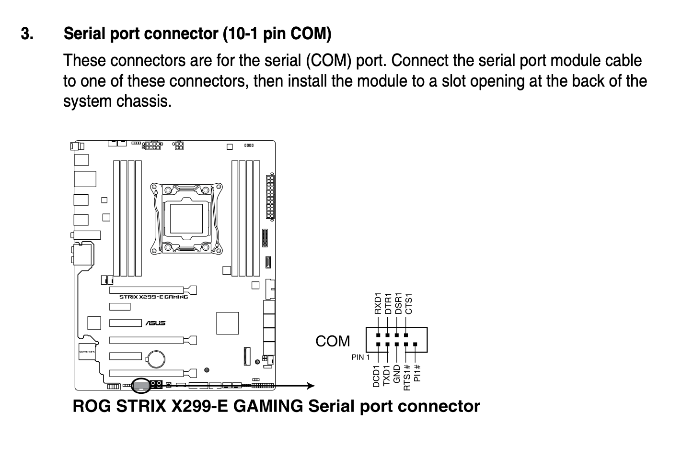
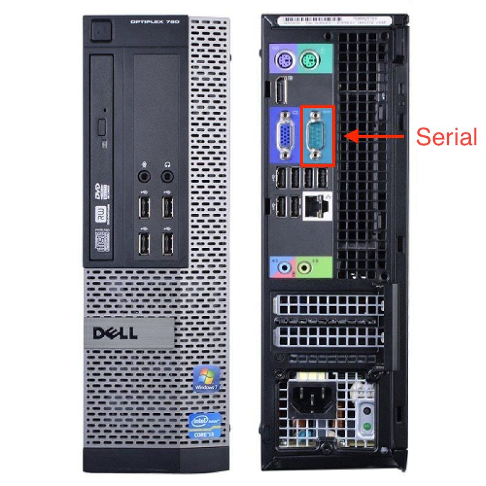
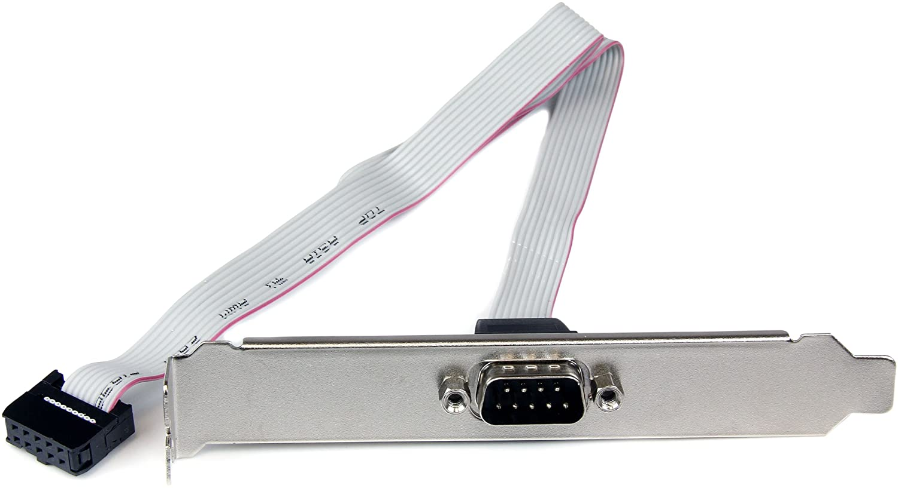
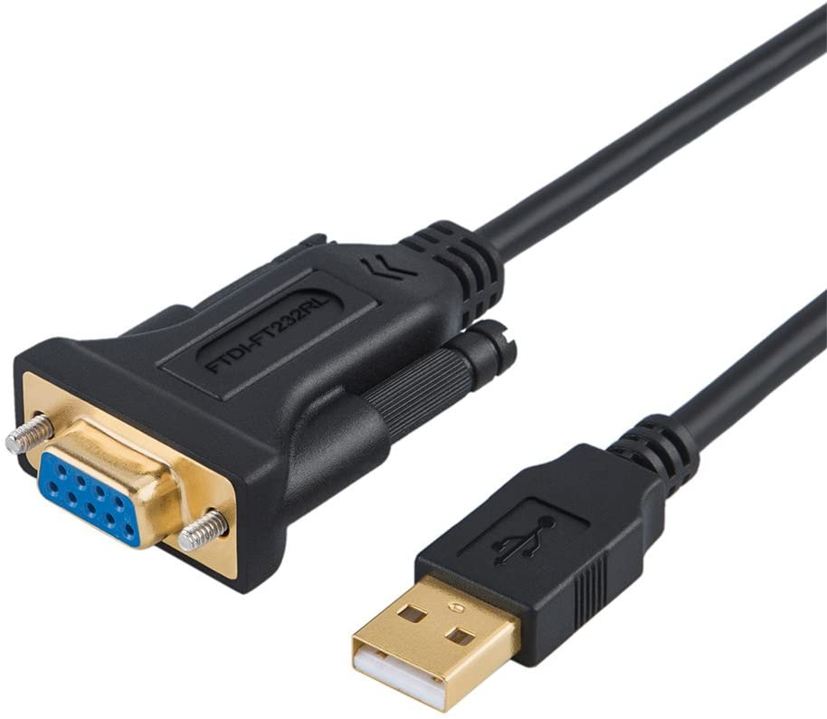
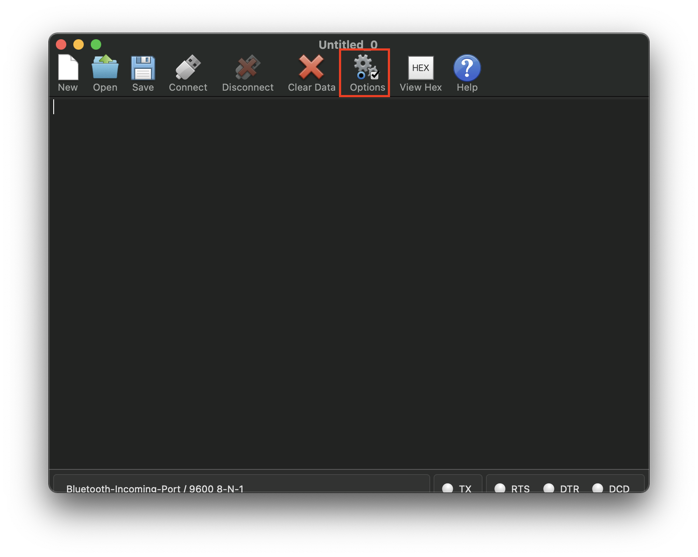
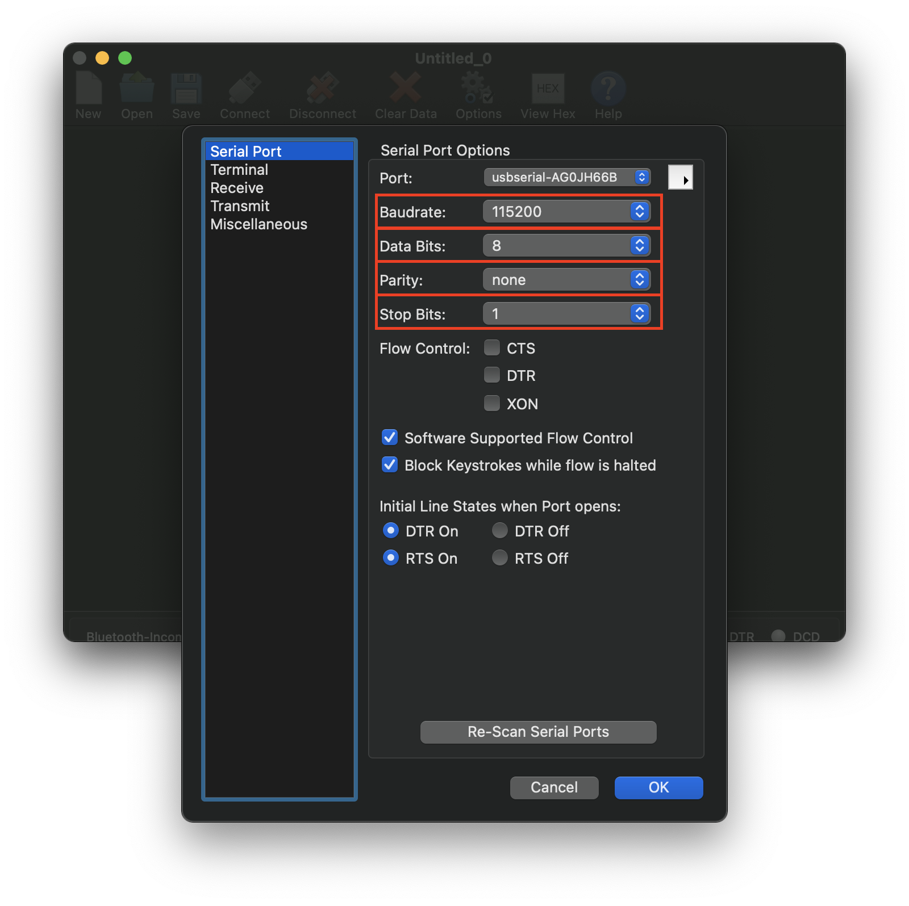
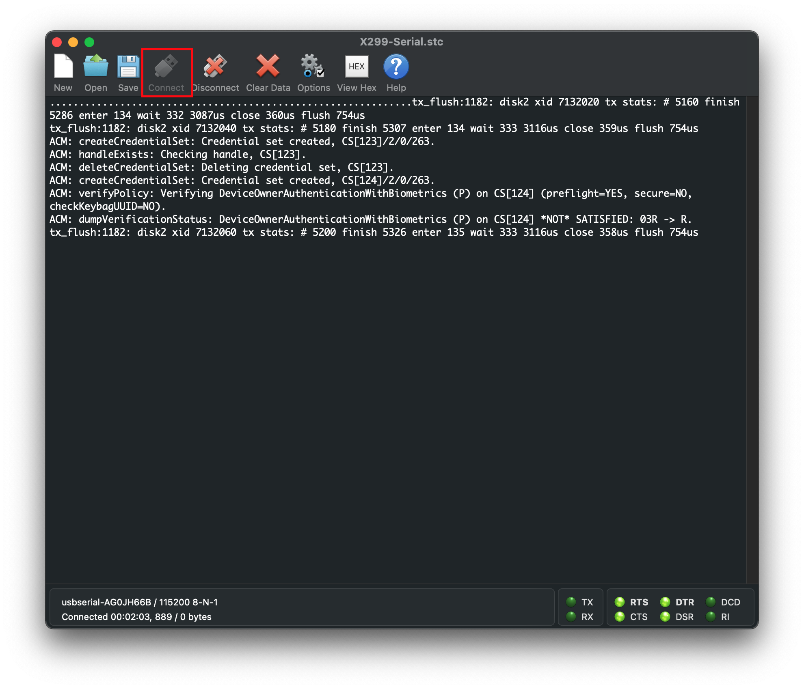
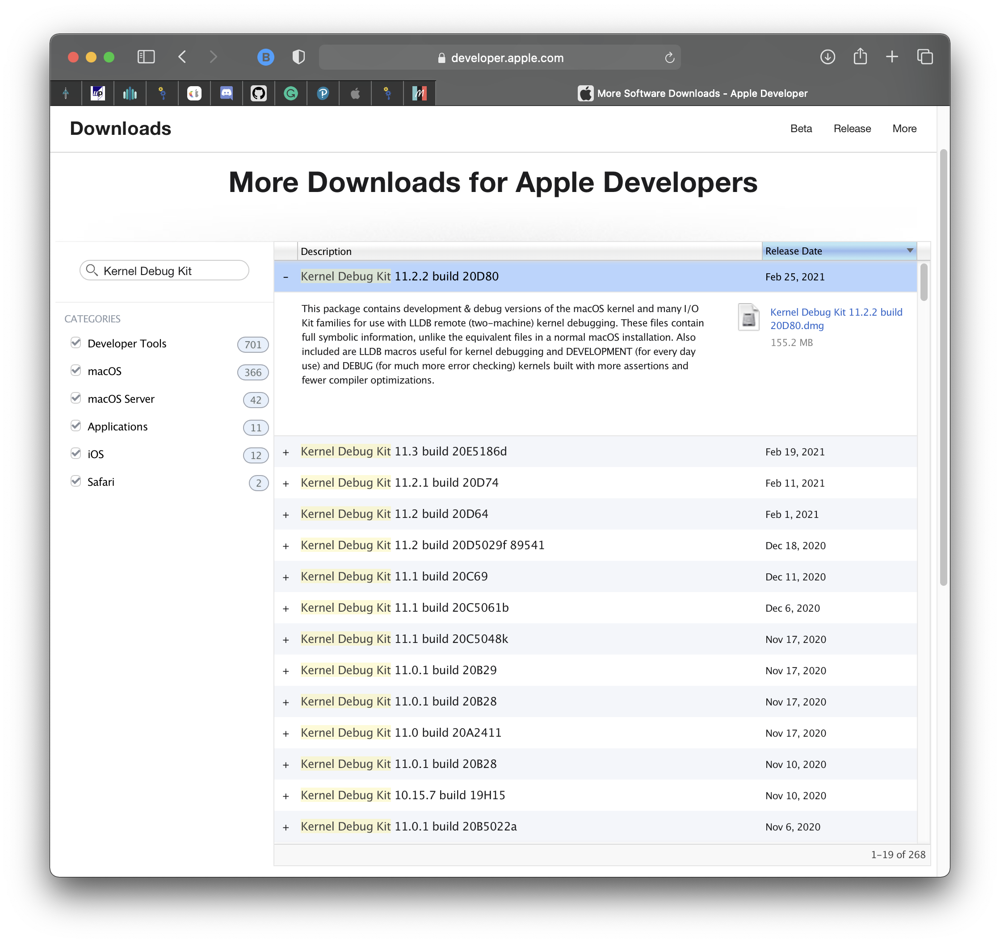
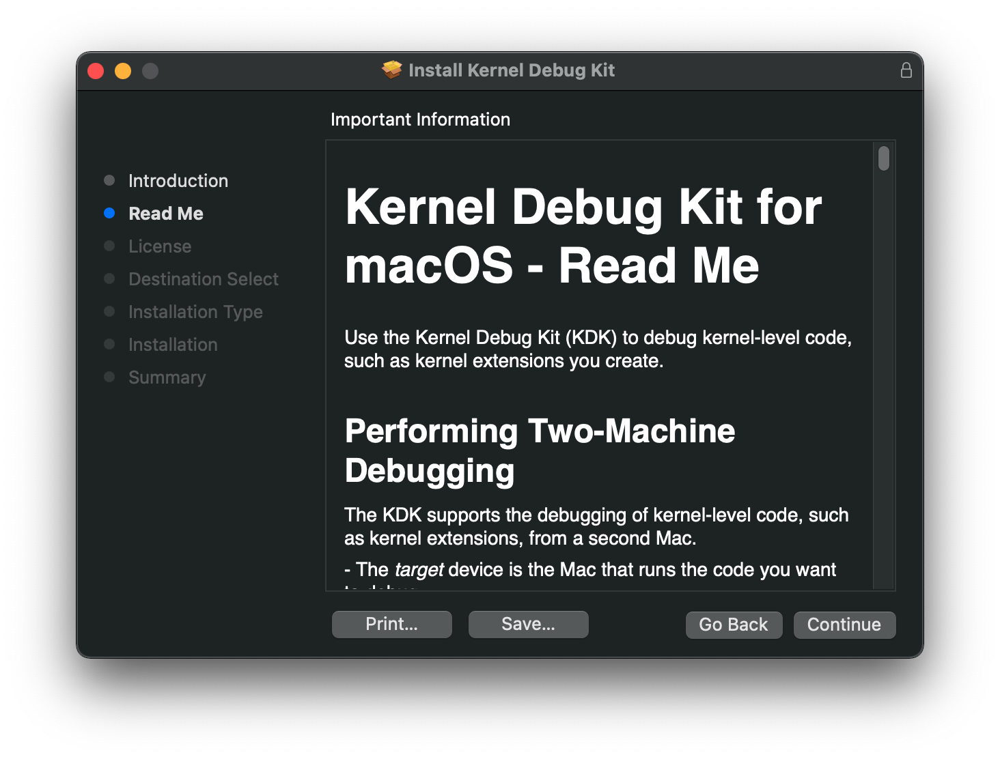

# System Debugging: In-depth

This section will go a bit deeper into the troubleshooting rabbit hole, specifically focusing on more low level debugging with proper debug output and optional serial setup.

**Note**: 99% of users do not need this level of debugging, this is only for the hardcore or extreme edge-cases.

* [EFI Setup](#efi-setup)
* [Config.plist Setup](#config-plist-setup)
* [Serial Setup (Optional)](#serial-setup-optional)
  * [CoolTerm Setup](#coolterm-setup)
* [Kernel Debug Kits (Optional)](#kernel-debug-kits-optional)
  * [KDK on an Installed OS](#kdk-on-an-installed-os)
  * [Uninstalling the KDK](#uninstalling-the-kdk)

## EFI Setup

For most part, there's fairly minimal changes required. Main things we recommend are DEBUG version of **OpenCore** and all your **kexts**. This can help ensure you get all the necessary data, see here for more details on OpenCore debugging: [OpenCore debugging](./debug.md)

Besides just using DEBUG variants of OpenCore and kexts, these tools can also help out greatly:

* [DebugEnhancer.kext](https://github.com/acidanthera/DebugEnhancer/releases)
  * Helps greatly with kernel debugging while also patching [kern.msgbuf to 10485760](https://github.com/acidanthera/DebugEnhancer/blob/4495911971011a1a7a0ffe8605d6ca4b341f67d9/DebugEnhancer/kern_dbgenhancer.cpp#L131) and allowing a much larger kernel-log.
  * Note this kext cannot start with kernel initialization, so early logs are not patched until the kext is loaded right before PCI Configuration Stage
  
* [SSDT-DBG](https://gist.github.com/al3xtjames/39ebea4d615c8aed829109a9ea2cd0b5)
  * Enables debug statements from your ACPI tables, helping for in-OS ACPI event debugging
  * Note you will need to [compile the SSDT](https://dortania.github.io/Getting-Started-With-ACPI/Manual/compile.html)
  
## Config.plist Setup

For serial setup, OpenCore actually makes this quite straight forward.

### Misc

* **SerialInt**: YES
  * Performs serial port initialization
* **Target**: `67`
  * Enables debug output with OpenCore
  * Target = 75 adds the additional serial output flag(0x08) if you [plan to use serial](#serial-setup-optional)
  * You can calculate your own vale here: [OpenCore debugging](./debug.md)
  
### NVRAM

#### boot-args

Here we get to set some variables that will help us with debug output, for us we'll be using the following boot-args:

```
-v keepsyms=1 debug=0x12a msgbuf=1048576
```

Now lets go over what each arg does:

* **-v**
  * Enables verbose output
* **keepsyms=1**
  * Ensures symbols are kept during kernel panics, which are greatly helpful for troubleshooting
* **debug=0x12a**
  * Combination of `DB_KPRT`(0x8), `DB_KDP_BP_DIS`(0x32), `DB_KDP_GETC_ENA(0x200)`
  * A full list of values can be found here: [debug.h](https://github.com/apple/darwin-xnu/blob/master/osfmk/kern/debug.h#L419L447)
* **msgbuf=1048576**
  * Sets the kernel's message buffer size, this helps with getting proper logs during boot
  * 1048576 is 1MB(/1024^2), can be larger if required
  * Note not required with DebugEnhancer.kext, however for early kernel logs it's still required

**Other helpful boot-args**:

Depending on what you're debugging, you may also find these boot-args extremely helpful:

* **-liludbgall**
  * Enables debugging on Lilu and any other plugins, though note that this requires DEBUG versions of the kexts
* **io=0xff**
  * Enables IOKit debugging, with greater output. Be aware that the logging-amount of this parameter will be huge and will slow down the system. Especially while booting.
* **igdebug=0xff**
  * Enables iGPU related debugging, helpful when working with iGPU systems
* **serial=5**
  * Redirects output to serial if you [plan to use serial](#serial-setup-optional)
  * Recommended for early kernel output before PCI Configuration
* **acpi_layer=0x8**
  * Enables `ACPI_TABLES` debug, see [acoutput.h](https://github.com/acpica/acpica/blob/master/source/include/acoutput.h) for more information
  * `0xFFFFFFFF` alternatively enables all layers
* **acpi_level=0x2**
  * Sets `ACPI_LV_DEBUG_OBJECT` debug, see [acoutput.h](https://github.com/acpica/acpica/blob/master/source/include/acoutput.h) for more information
  * `0xFFFF5F` alternatively implies `ACPI_ALL_COMPONENTS`

## Serial Setup(Optional)

* [Hardware Setup](#hardware-setup)
* [EFI Setup](#efi-setup)
* [Config.plist Setup](#config-plist-setup)

While optional, serial can be super helpful in grabbing all the important info flooding your PC. It's also the only way to properly log super early kernel panics(such as things right after `[EB|#LOG:EXITBS:START]`)

For this setup, you'll need a few things:

* A serial header/port on the test machine
* A serial-to-serial or serial-to-USB cable
* A second machine to receive the serial logging(with either Serial or USB)
* Software to monitor the serial output
  * For this guide, we'll use [CoolTerm](https://freeware.the-meiers.org) as it supports macOS, Linux, Windows and even Raspberry Pi's
  * `screen` and other methods are also supported

### Hardware Setup

For this example, we'll be using an Asus X299-E Strix board which does have a serial header. To verify whether your board comes with one, check the owners or service manual and search for the serial/COM port:



As you can see, we have a COM port on the bottom of our motherboard and even provides us with a diagram for manually hooking up our serial pins if you're not using a 9/10 Pin Serial Header to DB9 adapter.

Alternatively, some machine come with DB9 Serial ports right on the rear IO such as this Dell Optiplex 780 SFF(note that VGA and Serial are **not** the same connector):



For my X299 setup, I'm using a simple [Serial header to DB9](https://www.amazon.ca/gp/product/B001Y1F0HW/ref=ppx_yo_dt_b_asin_title_o00_s00?ie=UTF8&psc=1), then a [DB9 to USB  RS 232 adapter](https://www.amazon.ca/gp/product/B075YGKFC1/ref=ppx_yo_dt_b_asin_title_o00_s01?ie=UTF8&psc=1) which finally terminates at my laptop:

| Serial header to DB9 | DB9 to USB  RS 232 adapter |
| :--- | :--- |
|  |  |

The OpenCore manual generally recommends CP21202-based UART devices:

> To obtain the log during boot you can make the use of serial port debugging. Serial port debugging is enabled in Target, e.g. 0xB for onscreen with serial. OpenCore uses 115200 baud rate, 8 data bits, no parity, and 1 stop bit. For macOS your best choice are CP2102-based UART devices. Connect motherboard TX to USB UART RX, and motherboard GND to USB UART GND. Use screen utility to get the output, or download GUI software, such as CoolTerm.
> Note: On several motherboards (and possibly USB UART dongles) PIN naming may be incorrect. It is very common to have GND swapped with RX, thus you have to connect motherboard “TX” to USB UART GND, and motherboard “GND” to USB UART RX.

**Important reminder**: Don't forget to also enable the serial port in your BIOS, most motherboards will disable it by default

### CoolTerm Setup

Now lets fire up [CoolTerm](https://freeware.the-meiers.org) and set a few options. When you open CoolTerm, you'll likely be greeted with a simple window. Here select the Options entry:




Here we're given quite a few options, but the mains ones we care about are:

* Port: Ensure this matches with your serial controller.
* Baudrate = 115200
* Data Bits = 8
* Parity = none
* Stop Bit = 1

Next save these settings, and select the Connect entry. This will provide you a live log from serial:



To record, simply head to `Connections -> Capture to Text/Binary File -> Start...(Cmd+R)`:


## Kernel Debug Kits (Optional)

* [KDK on an Installed OS](#kdk-on-an-installed-os)
* [Uninstalling the KDK](#uninstalling-the-kdk)

Kernel Debug Kits(KDKs) are a great way to get even more logging information from the kernel and core kexts, KDKs specifically are debug versions of macOS's core foundation provided from Apple themselves. They include both more logging as well as ASSERTs allowing you to more directly see issues with your setup. Note however we will not be discussing bridged debugging or `lldb` usage.

<span style="color:red"> CAUTION: </span> Installing KDKs on work machines can lead to issues with OS updates as well as bricked installs. Please debug on dedicated macOS installs to avoid data loss

To start, we'll first need a minimum of a [free developer account](https://developer.apple.com/support/compare-memberships/) from Apple. Once you've signed up for a minimum of a free tier, you can now access KDKs from the [More Downloads page](https://developer.apple.com/download/more/):

* Note: Free tiers will be limited to release KDKs, only beta KDKs are provided for [paid developer accounts](https://developer.apple.com/support/compare-memberships/)
* Note 2: Apple hosts KDKs as far back as OS X 10.5, Leopard so don't worry about your OS not being supported



To determine which KDK build you need with beta builds, run the following in terminal:

```sh
sw_vers | grep "BuildVersion"
```

For this, I will be downloading Kernel Debug Kit 11.3 build 20E5186d. Once downloaded, mount the disk image and you'll find the KDK installer. By default, the KDK will only install itself for "Performing Two-Machine Debugging" and will provide zero extra benefit on the host machine for kernel debugging by default.

### KDK on an Installed OS

To enable debugging on the host machine, you'll need to do the following:

1. Run the KDK Install pkg
2. Disable SIP(OS X 10.11+)
3. Mount root partition as writable(macOS 10.15+)
4. Install debug kernel and kexts
5. Update boot-args
6. Reboot and check your work

#### 1. Run the KDK Install pkg

Simply run the pkg as normal:



Once installed, you'll find the KDK components such as the debug kernel located at `/Library/Developer/KDKs`:


#### 2. Disabling SIP

* Applicable for OS X 10.11, El Capitan and newer

To disable SIP, users have 2 choices:

* Disable via Recovery

* [Disable via config.plist](./extended/post-issues.md#disabling-sip)

Generally we highly recommend recovery to easily revert with NVRAM reset, however some users may require SIP to be disabled through NVRAM wipes as well.

For the former, simply reboot into macOS Recovery, open terminal and run the following:

```sh
csrutil disable
csrutil authenticated-root disable # Big Sur+
```

Reboot, and SIP will have been adjusted accordingly. You can run `csrutil status` in terminal to verify it worked.

* <span style="color:red"> CAUTION: </span> For users relying on [OpenCore's ApECID feature](https://dortania.github.io/OpenCore-Post-Install/universal/security/applesecureboot.html#apecid), please be aware this **must** be disabled to use the KDK.

#### 3. Mount root partition as writable

* Applicable for macOS 10.15, Catalina and newer

Mounting the root volume as writable is easy, however the process is a bit long:

```bash
# Big Sur+
# First, create a mount point for your drive
mkdir ~/livemount

# Next, find your System volume
diskutil list

# From the below list, we can see our System volume is disk5s5
/dev/disk5 (synthesized):
   #:                       TYPE NAME                    SIZE       IDENTIFIER
   0:      APFS Container Scheme -                      +255.7 GB   disk5
                                 Physical Store disk4s2
   1:                APFS Volume ⁨Big Sur HD - Data⁩       122.5 GB   disk5s1
   2:                APFS Volume ⁨Preboot⁩                 309.4 MB   disk5s2
   3:                APFS Volume ⁨Recovery⁩                887.8 MB   disk5s3
   4:                APFS Volume ⁨VM⁩                      1.1 MB     disk5s4
   5:                APFS Volume ⁨Big Sur HD⁩              16.2 GB    disk5s5
   6:              APFS Snapshot ⁨com.apple.os.update-...⁩ 16.2 GB    disk5s5s

# Mount the drive(ie. disk5s5)
sudo mount -o nobrowse -t apfs  /dev/disk5s5 ~/livemount

# Now you can freely make any edits to the System volume
```

```bash
# Catalina only
sudo mount -uw /
```

#### 4. Install debug kernel and kexts

Now we install our KDK into the system:

```bash
# Install KDK to System Volume
# Ensure to replace <KDK Version>
# For 10.15 and older, swap livemount with /Volumes/<Target Volume>
sudo ditto /Library/Developer/KDKs/<KDK Version>/System ~/livemount/System

# Rebuild the kernel cache(Big Sur and newer)
sudo kmutil install --volume-root ~/livemount --update-all

# Rebuild the kernel cache(Catalina and older)
sudo kextcache -invalidate /Volumes/<Target Volume>

# Finally, once done editing the system volume
# we'll want to create a new snapshot (Big Sur and newer)
sudo bless --folder ~/livemount/System/Library/CoreServices --bootefi --create-snapshot
```

#### 5. Update boot-args

Now that you've finished setting up the KDK and installed it, we now need to tell boot.efi which kernel to use. You have 2 options to choose from:

* `kcsuffix=debug` (removed with Big Sur)
* `kcsuffix=development`
* `kcsuffix=kasan`

`development` arg will set the new default debug kernel in Big Sur, while `kasan` is a much more logging intensive kernel that incorporates [AddressSanitizer](https://github.com/google/sanitizers/wiki/AddressSanitizer).

Once you've decided which kernel is ideal for you, add the kcsuffix arg to your boot-args in your config.plist

#### 6. Reboot and check your work

Assuming everything was done correctly, you'll now want to reboot and check that the correct kernel was booted:

```sh
sysctl kern.osbuildconfig
 kern.osbuildconfig: kasan
```

And as we can see, we're successfully booting a KASAN kernel.

### Uninstalling the KDK

Uninstalling the KDK is fairly simple, however can be a bit destructive if not care.

1. Mount root partition as writable(macOS 10.15+)
2. Remove debug kernel and kexts
3. Re-enable SIP
4. Clean boot-args
5. Reboot and check your work

Steps:

#### 1. Mount root partition as writable(macOS 10.15+)

```bash
# Big Sur+
# First, create a mount point for your drive
# Skip of still present from mounting volume last time
mkdir ~/livemount

# Next, find your System volume
diskutil list

# From the below list, we can see our System volume is disk5s5
/dev/disk5 (synthesized):
   #:                       TYPE NAME                    SIZE       IDENTIFIER
   0:      APFS Container Scheme -                      +255.7 GB   disk5
                                 Physical Store disk4s2
   1:                APFS Volume ⁨Big Sur HD - Data⁩       122.5 GB   disk5s1
   2:                APFS Volume ⁨Preboot⁩                 309.4 MB   disk5s2
   3:                APFS Volume ⁨Recovery⁩                887.8 MB   disk5s3
   4:                APFS Volume ⁨VM⁩                      1.1 MB     disk5s4
   5:                APFS Volume ⁨Big Sur HD⁩              16.2 GB    disk5s5
   6:              APFS Snapshot ⁨com.apple.os.update-...⁩ 16.2 GB    disk5s5s

# Mount the drive (ie. disk5s5)
sudo mount -o nobrowse -t apfs  /dev/disk5s5 ~/livemount
```

```bash
# Catalina only
sudo mount -uw /
```

#### 2. Remove debug kernel and kexts

```bash
# Revert to old snapshot (Big Sur+)
sudo bless --mount ~/livemount --bootefi --last-sealed-snapshot
```

```bash
# Reset kernel cache (Catalina and older)
sudo rm /System/Library/Caches/com.apple.kext.caches/Startup/kernelcache.de*
sudo rm /System/Library/PrelinkedKernels/prelinkedkernel.de*
sudo kextcache -invalidate /
```

#### 3. Re-enable SIP

* Recovery commands(if previously changed via recovery):

```sh
csrutil enable
csrutil authenticated-root enable # Big Sur+
```

* config.plist changes(if previously changed via config.plist):
  * [Enabling via config.plist](./extended/post-issues.md#disabling-sip)
  
#### 4. Clean boot-args

Don't forget to remove `kcsuffix=` in your boot-args

#### 5. Reboot and check your work

Assuming everything was done correctly, you'll now want to reboot and check that the correct kernel was booted:

```sh
sysctl kern.osbuildconfig
 kern.osbuildconfig: release
```

And as we can see, we're successfully booting a KASAN kernel.
