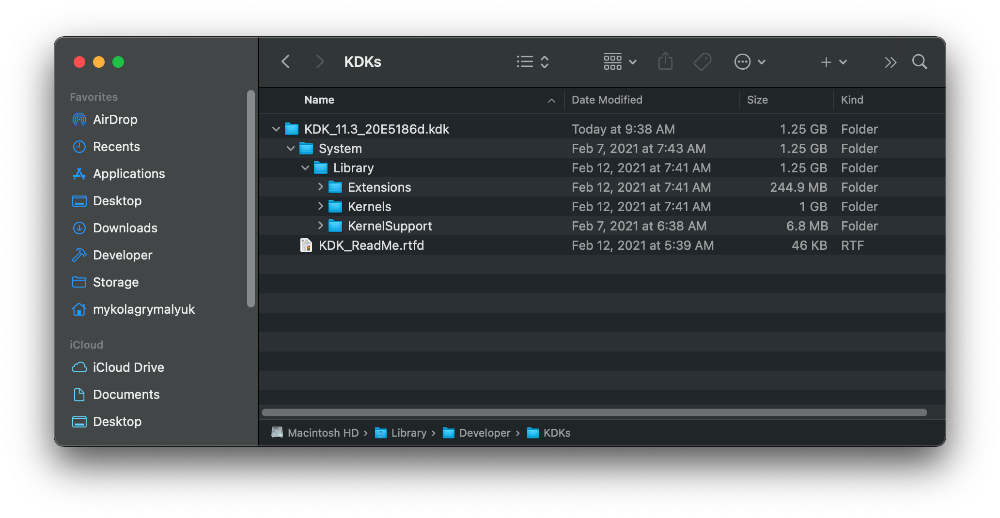

# 系统调试:深入

本节将更深入地讨论故障排除，特别关注具有适当调试输出和可选串行设置的更低级的调试。

**注意**:99%的用户不需要这种级别的调试，这只适用于核心或极端情况。

[[toc]]

## EFI 设置

在大多数情况下，只需要相当小的更改。我们主要推荐的是DEBUG版本的**OpenCore**和所有的**kext**。这可以帮助您获得所有必要的数据，有关OpenCore调试的更多详细信息，请参阅这里: [OpenCore调试](./debug.md)

除了使用OpenCore和kexts的DEBUG版本，这些工具也可以提供很大的帮助:

* [DebugEnhancer.kext](https://github.com/acidanthera/DebugEnhancer/releases)
  * 极大地帮助内核调试，同时还修补了 [kern.msgbuf to 10485760](https://github.com/acidanthera/DebugEnhancer/blob/4495911971011a1a7a0ffe8605d6ca4b341f67d9/DebugEnhancer/kern_dbgenhancer.cpp#L131) ，并允许更大的内核日志。
  * 注意这个kext不能与内核初始化一起启动，所以早期的日志不会被修补，直到kext在PCI配置阶段之前加载
  
* [SSDT-DBG](https://gist.github.com/al3xtjames/39ebea4d615c8aed829109a9ea2cd0b5)
  * 启用ACPI表中的调试语句，帮助操作系统中的ACPI事件调试
  * 注意你需要[编译SSDT](https://sumingyd.github.io/Getting-Started-With-ACPI/Manual/compile.html)
  
## Config.plist 设置

对于串行设置，OpenCore实际上是非常直接的。

### Misc

#### Serial

* **Init**: YES
  * 从 OpenCore 初始化串口
  * 需要将OpenCore日志发送到串口

#### Debug

* **Target**: `67`
  * 启用OpenCore调试输出
  * `Target` = `75`添加额外的串行输出标志(`0x08`)，如果你[计划使用串行](#serial-setup-optional)
  * 你可以在这里计算你自己的值:[OpenCore调试](./debug.md)
  
### NVRAM

#### boot-args

在这里，我们要设置一些变量来帮助我们调试输出，对于我们来说，我们将使用以下的boot-args:

```
-v keepsyms=1 debug=0x12a msgbuf=1048576
```

现在让我们来看看每个arg的作用:

* **-v**
  * 启用详细输出
* **keepsyms=1**
  * 确保在内核发生严重故障时保留符号，这对故障排除非常有帮助
* **debug=0x12a**
  * Combination of `DB_PRT` (0x2), `DB_KPRT` (0x8), `DB_SLOG` (0x20), and `DB_LOG_PI_SCRN` (0x100)
  * 最新版本XNU的完整列表可以在这里找到: [debug.h](https://github.com/apple-oss-distributions/xnu/blob/master/osfmk/kern/debug.h)
* **msgbuf=1048576**
  * 设置内核的消息缓冲区大小，这有助于在启动期间获得正确的日志
  * 1048576 is 1MB(/1024^2), 如果需要可以更大
  * 注意：DebugEnhancer kext不需要，但是对于早期的内核日志，它仍然是必需的

**其他有用的boot-args**:

根据你正在调试的内容，你可能还会发现这些boot-args非常有用:

* **-liludbgall**
  * 在Lilu和任何其他插件上启用调试，但请注意，这需要调试版本的kext
* **io=0xff**
  * 启用IOKit调试，输出更大。请注意，此参数的日志量将非常大，并将降低系统的速度。尤其是在启动的时候。
* **igdebug=0xff**
  * 开启iGPU相关的调试，在使用iGPU系统时很有用
* **serial=5**
  * 将输出重定向到串行如果你[计划使用串行](#serial-setup-optional)
  * 推荐用于PCI配置之前的早期内核输出
* **acpi_layer=0x8**
  * 启用`ACPI_TABLES`调试，参见[acoutput.h](https://github.com/acpica/acpica/blob/master/source/include/acoutput.h) 了解更多信息
  * `0xFFFFFFFF` 也可以启用所有层
* **acpi_level=0x2**
  * 设置`ACPI_LV_DEBUG_OBJECT`调试，参见 [acoutput.h](https://github.com/acpica/acpica/blob/master/source/include/acoutput.h) 了解更多信息
  * `0xFFFF5F` 也可以表示 `ACPI_ALL_COMPONENTS`

## 串行设置(可选)

* [硬件设置](#hardware-setup)
* [EFI 设置](#efi-setup)
* [Config.plist 设置](#config-plist-setup)

虽然是可选的，但串行仍然对抓取所有的信息超级有帮助。这也是正确记录超早期内核崩溃的唯一方法(例如在`[EB|# log:EXITBS:START]`之后的事情)

对于这个设置，你需要一些东西:

* 测试机上的串行头/端口
* 串行到串行或串行到usb电缆
* 第二台机器接收串行日志记录(使用串行或USB)
* 软件监控串行输出
  * 在本指南中，我们将使用 [CoolTerm](https://freeware.the-meiers.org) ,因为它支持macOS, Linux, Windows甚至树莓派
  * `screen` 和其他方法也支持

### 硬件设置

对于这个例子，我们将使用华硕X299-E Strix板，它有一个串行头。要确认您的单板是否自带串口，请查看单板的所有者或服务手册，并搜索串口/COM端口:


正如你所看到的，我们在主板的底部有一个COM端口，如果你不使用9/10引脚串行头到DB9适配器，甚至为我们手动连接我们的串行引脚提供了一个图表。

或者，一些机器在后IO上带有DB9串行端口，例如这台Dell Optiplex 780 SFF(注意VGA和串行**不是**同一个连接器):


对于我的X299设置，我使用一个简单的 [串行头到DB9](https://www.amazon.ca/gp/product/B001Y1F0HW/ref=ppx_yo_dt_b_asin_title_o00_s00?ie=UTF8&psc=1), 然后一个 [DB9到USB RS 232适配器](https://www.amazon.ca/gp/product/B075YGKFC1/ref=ppx_yo_dt_b_asin_title_o00_s01?ie=UTF8&psc=1) 最后终止在我的笔记本电脑:

| Serial header to DB9 | DB9 to USB  RS 232 adapter |
| :--- | :--- |
|  |  |

OpenCore手册通常建议CP21202-based UART设备:

> 要在引导期间获得日志，可以使用串口调试。在目标中打开串口调试，例如0xB表示onscreen with Serial。OpenCore使用115200波特率，8个数据位，无奇偶校验和1个停止位。对于macOS，最好的选择是基于cp2102的UART设备。将主板TX连接到USB UART RX，主板GND连接到USB UART GND。使用屏幕工具获取输出，或者下载GUI软件，比如CoolTerm。
> 注意:在一些主板(可能是USB UART加密狗)PIN命名可能不正确。GND与RX交换是非常常见的，因此您必须将主板“TX”连接到USB UART GND，并将主板“GND”连接到USB UART RX。

**重要提醒**:不要忘记在BIOS中启用串口，大多数主板默认情况下将禁用它

### CoolTerm 设置

现在让我们启动[CoolTerm](https://freeware.the-meiers.org)并设置一些选项。当您打开CoolTerm时，您可能会看到一个简单的窗口。在这里选择选项条目:


这里给出了很多选项，但我们主要关心的是:

* Port: 确保与您的串行控制器匹配。
* Baudrate = 115200
* Data Bits = 8
* Parity = 无
* Stop Bit = 1

接下来，保存这些设置，并选择Connect条目。这将为你提供一个来自serial的实时日志:


要记录，只需前往 `Connections -> Capture to Text/Binary File -> Start...(Cmd+R)`:


## 内核调试工具包(可选)

* [KDK on an Installed OS](#kdk-on-an-installed-os)
* [Uninstalling the KDK](#uninstalling-the-kdk)

内核调试工具包(kdk)是一种从内核和核心kext获取更多日志信息的好方法，kdk具体来说是苹果自己提供的macOS核心基础的调试版本。它们包括更多的日志记录和断言，允许您更直接地查看设置中的问题。但是请注意，我们不会讨论桥接调试或 `lldb` 的用法。

<span style="color:red"> 警告: </span> 在工作机器上安装kdk可能会导致操作系统更新和安装出现问题。请在专用的macOS安装上调试，以避免数据丢失

首先，我们至少需要一个来自苹果的[免费开发者帐户](https://developer.apple.com/support/compare-memberships/) 一旦您注册了最低限度的免费层，您现在可以从[更多下载页面](https://developer.apple.com/download/more/):

* 注:免费等级将仅限于发布kdk，只有测试版kdk提供给[付费开发者帐户](https://developer.apple.com/support/compare-memberships/)
* 注2:苹果早在OS X 10.5和Leopard时就有kdk了，所以不用担心你的操作系统不受支持


要确定你需要哪个KDK版本的测试版，在终端中运行以下命令:

```sh
sw_vers | grep BuildVersion
```

为此，我将下载内核调试套件11.3 build 20E5186d。下载完成后，挂载磁盘镜像，就可以找到KDK安装程序了。默认情况下，KDK只会为了“执行双机调试”而安装自己，并且默认情况下不会为主机内核调试提供任何额外的好处。

### KDK在已安装的操作系统上

要在主机上启用调试，您需要执行以下操作:

1. 运行 KDK 安装 pkg
2. 关闭SIP协议(OS X 10.11+)
3. 以可写方式挂载根分区(macOS 10.15+)
4. 安装调试内核和kext
5. 更新boot-args
6. 重新启动并检查您的工作

#### 1. 运行 KDK 安装 pkg

正常运行pkg即可:


安装完成后，你可以在`/Library/Developer/KDKs`目录下找到KDK组件，例如调试内核:



#### 2. 禁用SIP

* 适用于OS X 10.11, El Capitan和更新版本

禁用SIP，用户有两种选择:

* 通过恢复禁用

* [通过config.plist禁用](./extended/post-issues.md#disabling-sip)

一般情况下，我们强烈建议恢复，以便通过NVRAM复位轻松恢复，但是一些用户可能需要通过NVRAM擦除禁用SIP。

对于前者，只需重新启动到macOS恢复，打开终端并运行以下命令:

```sh
csrutil disable
csrutil authenticated-root disable # Big Sur+
```

重新启动，SIP将进行相应的调整。你可以在终端中运行`csrutil status`来验证它是否工作。

* <span style="color:red"> 注意: </span> 对于依赖[OpenCore的ApECID功能](https://sumingyd.github.io/OpenCore-Post-Install/universal/security/applesecureboot.html#apecid)的用户，请注意此 **必须** 被禁用才能使用KDK。

#### 3. 以可写方式挂载根分区

* 适用于macOS 10.15，卡特琳娜及更新版本

将根卷挂载为可写卷很容易，但是这个过程有点长:

```bash
# Big Sur+
# 首先，为您的驱动器创建一个挂载点
mkdir ~/livemount

# 接下来，找到您的系统卷
diskutil list

# 从下面的列表中，我们可以看到我们的系统卷是disk5s5
/dev/disk5 (synthesized):
   #:                       TYPE NAME                    SIZE       IDENTIFIER
   0:      APFS Container Scheme -                      +255.7 GB   disk5
                                 Physical Store disk4s2
   1:                APFS Volume ⁨Big Sur HD - Data⁩       122.5 GB   disk5s1
   2:                APFS Volume ⁨Preboot⁩                 309.4 MB   disk5s2
   3:                APFS Volume ⁨Recovery⁩                887.8 MB   disk5s3
   4:                APFS Volume ⁨VM⁩                      1.1 MB     disk5s4
   5:                APFS Volume ⁨Big Sur HD⁩              16.2 GB    disk5s5
   6:              APFS Snapshot ⁨com.apple.os.update-...⁩ 16.2 GB    disk5s5s

# 安装驱动(即。disk5s5)
sudo mount -o nobrowse -t apfs  /dev/disk5s5 ~/livemount

# 现在您可以自由地对系统卷进行任何编辑
```

```bash
# 仅限 Catalina
sudo mount -uw /
```

#### 4. 安装调试内核和kext

现在我们将KDK安装到系统中:

```bash
# 将KDK安装到系统卷
# 确保替换<KDK版本>
# 对于10.15及以上版本，用/Volumes/<Target Volume>交换live挂载
sudo ditto /Library/Developer/KDKs/<KDK Version>/System ~/livemount/System

# 重建真实的内核缓存(大苏尔及更新版本)
sudo kmutil install --volume-root ~/livemount --update-all

# 重建内核缓存(卡特琳娜和更老的版本)
sudo kextcache -invalidate /Volumes/<Target Volume>

# 最后，一旦完成系统卷的编辑
# 我们要创建一个新的快照(大苏尔和更新的)
sudo bless --folder ~/livemount/System/Library/CoreServices --bootefi --create-snapshot
```

#### 5. 更新boot-args

现在您已经完成了KDK的设置和安装，现在我们需要告诉boot.Efi使用哪个内核。你有两个选择:

* `kcsuffix=debug` (由Big Sur移除)
* `kcsuffix=development`
* `kcsuffix=kasan`

`development`参数将在Big Sur中设置新的默认调试内核，而`kasan`是一个更注重日志记录的内核，包含[AddressSanitizer](https://github.com/google/sanitizers/wiki/AddressSanitizer).

一旦你决定了哪个内核最适合你，在config.plist中将kc后缀arg添加到boot-args中

#### 6. 重新启动并检查您的工作

假设一切都正确地完成了，现在要重新启动，检查是否引导了正确的内核:

```sh
sysctl kern.osbuildconfig
 kern.osbuildconfig: kasan
```

正如我们所看到的，我们成功地启动了KASAN内核。

### 卸载KDK

卸载KDK相当简单，但是如果不小心，可能会有一点破坏性。

1. 将根分区挂载为可写(macOS 10.15+)
2. 删除调试内核和kext
3. 重新启用SIP
4. 清除引导参数
5. 重新启动并检查您的工作

步骤:

#### 1. 将根分区挂载为可写(macOS 10.15+)

```bash
# Big Sur+
# 首先，为您的驱动器创建一个挂载点
# 上次挂载卷时仍然存在的跳过
mkdir ~/livemount

# 接下来，找到您的系统卷
diskutil list

# 从下面的列表中，我们可以看到我们的系统卷是disk5s5
/dev/disk5 (synthesized):
   #:                       TYPE NAME                    SIZE       IDENTIFIER
   0:      APFS Container Scheme -                      +255.7 GB   disk5
                                 Physical Store disk4s2
   1:                APFS Volume ⁨Big Sur HD - Data⁩       122.5 GB   disk5s1
   2:                APFS Volume ⁨Preboot⁩                 309.4 MB   disk5s2
   3:                APFS Volume ⁨Recovery⁩                887.8 MB   disk5s3
   4:                APFS Volume ⁨VM⁩                      1.1 MB     disk5s4
   5:                APFS Volume ⁨Big Sur HD⁩              16.2 GB    disk5s5
   6:              APFS Snapshot ⁨com.apple.os.update-...⁩ 16.2 GB    disk5s5s

# 挂载驱动(即.disk5s5)
sudo mount -o nobrowse -t apfs  /dev/disk5s5 ~/livemount
```

```bash
# 仅限卡特琳娜
sudo mount -uw /
```

#### 2. 删除调试内核和kext

```bash
# 恢复旧快照(Big Sur+)
sudo bless --mount ~/livemount --bootefi --last-sealed-snapshot
```

```bash
# 重置内核缓存(Catalina及更老版本)
sudo rm /System/Library/Caches/com.apple.kext.caches/Startup/kernelcache.de*
sudo rm /System/Library/PrelinkedKernels/prelinkedkernel.de*
sudo kextcache -invalidate /
```

#### 3. 重新启用SIP

* 恢复命令(如果之前通过恢复更改):

```sh
csrutil enable
csrutil authenticated-root enable # Big Sur+
```

* config.plist更改(如果之前通过config.plist更改):
  * [通过config.plist启用](./extended/post-issues.md#disabling-sip)
  
#### 4. 清除引导参数

不要忘记在你的引导参数中删除`kcsuffix=`

#### 5. 重新启动并检查您的工作

假设一切都正确地完成了，现在要重新启动，检查是否引导了正确的内核:

```sh
sysctl kern.osbuildconfig
 kern.osbuildconfig: release
```

正如我们所看到的，我们成功地引导了一个KASAN内核。
