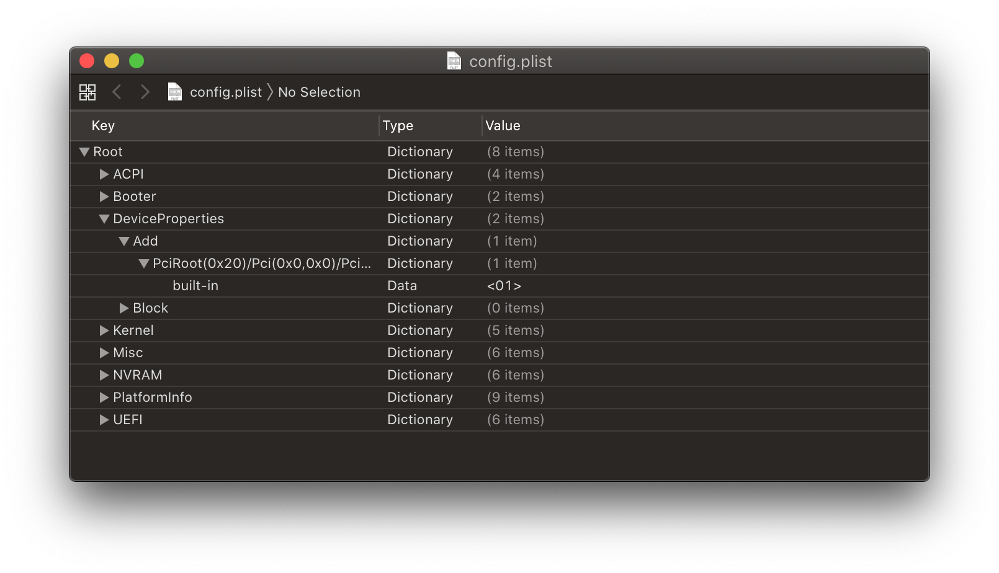

# General Troubleshooting

* Supported version: 0.6.1

This section is for those having issues booting either OpenCore, macOS or having issues inside macOS. If you're confused as to where exactly in the macOS boot process you're stuck, reading the [macOS Boot Process](../troubleshooting/boot.md) page can help clarify things.

While still a work in progress, laptop users wanting to convert an existing Clover install can see the  [Clover to OpenCore conversion](https://github.com/dortania/OpenCore-Install-Guide/blob/master/clover-conversion) for more info

**And if your issue is not covered, please read the official OpenCore documentation: [Configuration.pdf](https://github.com/acidanthera/OpenCorePkg/blob/master/Docs/Configuration.pdf)**

# OpenCore booting

* [Stuck on `no vault provided!`](#stuck-on-no-vault-provided)
* [Stuck on `OC: Invalid Vault mode`](#stuck-on-oc-invalid-vault-mode)
* [Stuck on EndRandomSeed](#stuck-on-endrandomseed)
* [Stuck on `[EB|#LOG:EXITBS:START]`](#stuck-on-eb-log-exitbs-start)
* [Stuck on [EB|LD:OFS] Err(0xE) when booting preboot volume](#stuck-on-eb-ld-ofs-err-0xe-when-booting-preboot-volume)
* [Can't see macOS partitions](#can-t-see-macos-partitions)
* [Black screen after picker](#black-screen-after-picker)
* [Stuck on `OC: OcAppleGenericInput... - Success`](#stuck-on-oc-ocapplegenericinput-success)
* [Stuck on `OCB: OcScanForBootEntries failure - Not Found`](#stuck-on-ocb-ocscanforbootentries-failure-not-found)
* [Stuck on `OCB: failed to match a default boot option`](#stuck-on-ocb-failed-to-match-a-default-boot-option)
* [Stuck on `OCABC: Memory pool allocation failure - Not Found`](#stuck-on-ocabc-memory-pool-allocation-failure-not-found)
* [Stuck on `OCS: No schema for DSDT, KernelAndKextPatch, RtVariable, SMBIOS, SystemParameters...`](#stuck-on-ocs-no-schema-for-dsdt-kernelandkextpatch-rtvariable-smbios-systemparameters)
* [Stuck on `OC: Driver XXX.efi at 0 cannot be found`](#stuck-on-oc-driver-xxx-efi-at-0-cannot-be-found)
* [Stuck on `Buffer Too Small`](#stuck-on-buffer-too-small)
* [Stuck on `Plist only kext has CFBundleExecutable key`](#stuck-on-plist-only-kext-has-cfbundleexecutable-key)
* [Receiving `Failed to parse real field of type 1`](#receiving-failed-to-parse-real-field-of-type-1)
* [Stuck after selection macOS partition on OpenCore](#stuck-after-selection-macos-partition-on-opencore)
* [Can't select anything in the picker](#can-t-select-anything-in-the-picker)
* [Stuck on `This version of Mac OS X is not supported: Reason Mac...`](#stuck-on-this-version-of-mac-os-x-is-not-supported-reason-mac)
* [`Couldn't allocate runtime area` errors?](#couldn-t-allocate-runtime-area-errors)
* [SSDTs not being added](#ssdts-not-being-added)
* [Booting OpenCore reboots to BIOS](#booting-opencore-reboots-to-bios)
* [OCABC: Incompatible OpenRuntime r4, require r10](#ocabc-incompatible-openruntime-r4-require-r10)

## Stuck on `no vault provided!`

Turn off Vaulting in your config.plist under `Misc -> Security -> Vault` by setting it to:

* `Optional`

If you have already executed the `sign.command` you will need to restore the OpenCore.efi file as the 256 byte RSA-2048 signature has been shoved in. Can grab a new copy of OpenCore.efi here: [OpenCorePkg](https://github.com/acidanthera/OpenCorePkg/releases)

**Note**: Vault and FileVault are 2 separate things, see [Security and FileVault](https://dortania.github.io/OpenCore-Post-Install/universal/security.html) for more details

## Stuck on `OC: Invalid Vault mode`

This is likely a spelling mistake, options in OpenCore are case-sensitive so make sure you check closely, **O**ptional is the correct way to enter it under `Misc -> Security -> Vault`

## Stuck on EndRandomSeed

Couple problems:

**Booter Issues:**

* `DevirtualiseMmio` may be taking precious areas in memory that are needed for other uses, you may need to disable this quirk or whitelist the bad regions: [Using DevirtualiseMmio](../extras/kaslr-fix.md#using-devirtualisemmio)
* `SetupVirtualMap` may be needed depending on the firmware, generally this quirk should be avoided but most Gigabyte users and older hardware(Broadwell and older) will need this quirk to boot.
  * Z490 boards are known to fail with `SetupVirtualMap` enabled, especially on Asus and AsRock boards.
* `RebuildAppleMemoryMap` may not be a fan of your firmware, use of this quirk is dependent on having `EnableWriteUnprotector` disabled and `SyncRuntimePermissions` enabled with the addition of having a `Memory Attribute Table` in your firmware. If your firmware doesn't have MATs, disable both `RebuildAppleMemoryMap` and `SyncRuntimePermissions` then enable `EnableWriteUnprotector`.

To verify whether your board has MATs, check the logs for something like this:

```
OCABC: MAT support is 1
```

**Kernel Issues:**

* **AMD:** Missing [kernel patches](https://github.com/AMD-OSX/AMD_Vanilla/tree/opencore)(only applies for AMD CPUs, make sure they're OpenCore patches and not Clover. Clover uses `MatchOS` while OpenCore has `MinKernel` and `Maxkernel`)
* **Intel:** Missing CFG or XCPM patches
  * Enable `AppleXcpmCfgLock` and `AppleCpuPmCfgLock`, this disables `PKG_CST_CNFIG_CONTROL` within the XNU and AppleIntelCPUPowerManagement respectively. Not recommended long term solution as this can cause instability.
  * Alternatively you can properly disable CFG-Lock: [Fixing CFG Lock](https://dortania.github.io/OpenCore-Post-Install/misc/msr-lock.html)
* **Intel:** `AppleXcpmExtraMsrs` may be required, this is generally meant for Pentiums, HEDT and other odd systems not natively supported in macOS. **Do not use on AMD**
  
**UEFI Issues:**

* `ProvideConsoleGop` is likely missing as this is needed for transitioning to the next screen, this was originally part of AptioMemoryFix but is now within OpenCore as this quirk. Can be found under UEFI -> Output
* `IgnoreInvalidFlexRatio` missing, this is needed for Broadwell and older. **Not for AMD and Skylake or newer**

## Stuck on `[EB|#LOG:EXITBS:START]`

This is actually the exact same error as `EndRandomSeed` so all the same fixes apply(10.15.4 and newer changed the debug protocol for those curious):

**Booter Issues:**

* `RebuildAppleMemoryMap` may not be a fan of your firmware, use of this quirk is dependent on having `EnableWriteUnprotector` disabled and `SyncRuntimePermissions` enabled with the addition of having a `Memory Attribute Table` in your firmware.
  * If your firmware doesn't have MATs:
    * Disable both `RebuildAppleMemoryMap` and `SyncRuntimePermissions` then enable `EnableWriteUnprotector`.
  * If your firmware supports MATs:
    * Enable both `RebuildAppleMemoryMap` and `SyncRuntimePermissions` then disable `EnableWriteUnprotector`.

To verify whether your board has MATs, check the logs for something like this:

```
OCABC: MAT support is 1
```

* `DevirtualiseMmio`
  * Certain MMIO spaces are still required to function correctly, so you'll need to either exclude these regions in Booter -> MmioWhitelist or disable this quirk outright.
  * More info here: [Using DevirtualiseMmio](../extras/kaslr-fix.md#using-devirtualisemmio)

* `SetupVirtualMap`
  * This quirk is required for the majority of firmwares and without it it's very common to kernel panic here, so enable it if not already
    * However, certain firmwares do not work with this quirk and so may actually cause this kernel panic:
      * Intel's Ice Lake series
      * Intel's Comet Lake series
      * AMD's B550 and A520(Latest BIOS on X570 are also included now)
      * AMD's TRx40
      * VMs like QEMU
      * Asus's X299 v3006+ BIOS updates(This also applies to other X299 boards on the latest BIOS)

* `EnableWriteUnprotector`

  * Another issue may be that macOS is conflicting with the write protection from CR0 register, to resolve this we have 2 options:
    * If your firmware supports MATs(2018+ firmwares):
      * EnableWriteUnprotector -> False
      * RebuildAppleMemoryMap -> True
      * SyncRuntimePermissions -> True
    * For older firmwares:
      * EnableWriteUnprotector -> True
      * RebuildAppleMemoryMap -> False
      * SyncRuntimePermissions -> False

Regarding MATs support, firmwares built against EDK 2018 will support this and many OEMs have even added support all the way back to Skylake laptops. Issue is it's not always obvious if an OEM has updated the firmware, you can check the OpenCore logs whether yours supports it:

```
OCABC: MAT support is 1
```

Note: `1` means it supports MATs, while `0` means it does not.

**Kernel Issues:**

* **AMD:** Missing [kernel patches](https://github.com/AMD-OSX/AMD_Vanilla/tree/opencore)(only applies for AMD CPUs, make sure they're OpenCore patches and not Clover. Clover uses `MatchOS` while OpenCore has `MinKernel` and `Maxkernel`)
* **Intel:** Missing CFG or XCPM patches
  * Enable `AppleXcpmCfgLock` and `AppleCpuPmCfgLock`, this disables `PKG_CST_CNFIG_CONTROL` within the XNU and AppleIntelCPUPowerManagement respectively. Not recommended long term solution as this can cause instability.
  * Alternatively you can properly disable CFG-Lock: [Fixing CFG Lock](https://dortania.github.io/OpenCore-Post-Install/misc/msr-lock.html)
* **Intel:** `AppleXcpmExtraMsrs` may be required, this is generally meant for Pentiums, HEDT and other odd systems not natively supported in macOS. **Do not use on AMD**
  
**UEFI Issues:**

* `ProvideConsoleGop` is likely missing as this is needed for transitioning to the next screen, this was originally part of AptioMemoryFix but is now within OpenCore as this quirk. Can be found under UEFI -> Output
* `IgnoreInvalidFlexRatio` missing, this is needed for Broadwell and older. **Not for AMD and Skylake or newer**

## Stuck on `[EB|LD:OFS] Err(0xE)` when booting preboot volume

Full error:

```
[EB|`LD:OFS] Err(0xE) @ OPEN (System\\Library\\PrelinkedKernels\\prelinkedkernel)
```

This can happen when the preboot volume isn't properly updated, to fix this you'll need to boot into recovery and repair it:

1. Enable JumpstartHotplug under UEFI -> APFS(Recovery may not boot on macOS Big Sur without this option)
2. Boot into recovery
3. Open the terminal, and run the following:

```bash
# First, find your preboot volume
diskutil list

# from the below list, we can see our preboot volume is disk5s2
/dev/disk5 (synthesized):
   #:                       TYPE NAME                    SIZE       IDENTIFIER
   0:      APFS Container Scheme -                      +255.7 GB   disk5
                                 Physical Store disk4s2
   1:                APFS Volume ⁨Big Sur HD - Data⁩       122.5 GB   disk5s1
   2:                APFS Volume ⁨Preboot⁩                 309.4 MB   disk5s2
   3:                APFS Volume ⁨Recovery⁩                887.8 MB   disk5s3
   4:                APFS Volume ⁨VM⁩                      1.1 MB     disk5s4
   5:                APFS Volume ⁨Big Sur HD⁩              16.2 GB    disk5s5
   6:              APFS Snapshot ⁨com.apple.os.update-...⁩ 16.2 GB    disk5s5s

# now mount the preboot volume
diskutil mount disk5s2

# Next run updatePreboot on the Preboot volume
diskutil apfs updatePreboot /volume/disk5s2
```

Then finally reboot, note you may need to disable JumpstartHotplug to boot normally again.

## Stuck on `OCB: LoadImage failed - Security Violation`

```
OCSB: No suitable signature - Security Violation
OCB: Apple Secure Boot prohibits this boot entry, enforcing!
OCB: LoadImage failed - Security Violation
```

This is due to missing outdated Apple Secure Boot manifests present on your preboot volume resulting is a failure to load if you have SecureBootModel set, reason for these files being missing is actually a bug in macOS.

To resolve this you can do one of the following:

* Disable SecureBootModel(ie. set `Misc -> Secuirty -> SecureBootModel -> Disabled`)
* Reinstall macOS with the latest version
* Or copy over the Secure Boot manifests from `/usr/standalone/i386` to `/Volumes/Preboot/<UUID>/System/Library/CoreServices`

## Can't see macOS partitions

Main things to check:

* ScanPolicy set to `0` to show all drives
* Have the proper firmware drivers such as HfsPlus(Note ApfsDriverLoader shouldn't be used in 0.5.8)
* Set UnblockFsConnect to True in config.plist -> UEFI -> Quirks. Needed for some HP systems
* Set **SATA Mode**: `AHCI` in BIOS
* Set `UEFI -> APFS` to see APFS based drives:
  * **EnableJumpstart**: YES
  * **HideVerbose**: YES
  * **MinDate**: `-1`
  * **MinVersion**: `-1`

## Black screen after picker

This is due to missing ConsoleGOP, enable it under your config:

* `UEFI -> Output -> ProvideConsoleGop`

Another possibility is that the problem occurs due to `RebuildAppleMemoryMap` being enabled, disable it under your config:

* `Booter -> Quirks -> RebuildAppleMemoryMap`

If this doesn't help, grab the [debug versions](https://github.com/acidanthera/OpenCorePkg/releases) of `OpenCore.efi` and `BOOTx64.efi` and replace them in your EFI. This will show much more info on where your hack is actually getting stuck.

## Stuck on `OC: OcAppleGenericInput... - Success`

So this isn't actually an error, instead OpenCore isn't showing you all the debug info. This is right before/while the kernel is being loaded so things we need to check for:

* Intel:
  * CFG-Lock disabled in the BIOS **or** `AppleCpuPmCfgLock` and `AppleCpuPmCfgLock` enabled under Kernel -> Quirks
* AMD:
  * Verify you have added the correct kernel patches to your config(remember, OpenCore patches use `MinKernel` and `MaxKernel` while Clover has `MatchOS`)
    * [Ryzen/Threadripper(17h)](https://github.com/AMD-OSX/AMD_Vanilla/tree/opencore/17h)
    * [Bulldozer/Jaguar(15h/16h)](https://github.com/AMD-OSX/AMD_Vanilla/tree/opencore/15h_16h)

If this doesn't help, grab the [debug versions](https://github.com/acidanthera/OpenCorePkg/releases) of `OpenCore.efi` and `BOOTx64.efi` and replace them in your EFI. This will show much more info on where your hack is actually getting stuck.

## Stuck on `OCB: OcScanForBootEntries failure - Not Found`

This is due to OpenCore being unable to find any drives with the current ScanPolicy, setting to `0` will allow all boot options to be shown

* `Misc -> Security -> ScanPolicy -> 0`

## Stuck on `OCB: failed to match a default boot option`

Same fix as `OCB: OcScanForBootEntries failure - Not Found`, OpenCore is unable to find any drives with the current ScanPolicy, setting to `0` will allow all boot options to be shown

* `Misc -> Security -> ScanPolicy -> 0`

## Stuck on `OCABC: Memory pool allocation failure - Not Found`

This is due to either incorrect BIOS settings and/or incorrect Booter values. Make sure config.plist -> Booter -> Quirks is correct and verify your BIOS settings:

* Above4GDecoding is Enabled
* CSM is Disabled(Enabling Windows8.1/10 WHQL Mode can do the same on some boards)
* BIOS is up-to-date(Z390 and HEDT are known for having poorly written firmwares)

## Stuck on `OCS: No schema for DSDT, KernelAndKextPatch, RtVariable, SMBIOS, SystemParameters...`

This is due to either using a Clover config with OpenCore or using a configurator such as Mackie's Clover and OpenCore configurator. You'll need to start over and make a new config or figure out all the garbage you need to remove from your config. **This is why we don't support configurators, they are known for these issues**

## Stuck on `OC: Driver XXX.efi at 0 cannot be found`

Verify that your EFI/OC/Drivers matches up with your config.plist -> UEFI -> Drivers

Note that the entries are case-sensitive.

## Stuck on `Buffer Too Small`

* Enable Above4GDecoding in the BIOS

## Stuck on `Plist only kext has CFBundleExecutable key`

Missing or incorrect `Executable path`

## Receiving "Failed to parse real field of type 1"

* A value is set as `real` when it's not supposed to be, generally being that Xcode converted `HaltLevel` by accident:

  ```
  <key>HaltLevel</key>
  ```

  ```
  <real>2147483648</real>
  ```

  To fix, swap `real` for `integer`:

  ```
  <key>HaltLevel</key>
  ```

  ```
  <integer>2147483648</integer>
  ```
  
## Stuck after selection macOS partition on OpenCore

* CFG-Lock not off(Intel Users only), couple solutions:
  * [Patch your MSR E2](https://dortania.github.io/OpenCore-Post-Install/misc/msr-lock.html)(Recommended solution)
  * Enable `AppleXcpmCfgLock` and `AppleCpuPmCfgLock`, this disables `PKG_CST_CNFIG_CONTROL` within the XNU and AppleIntelCPUPowerManagement respectively. Not recommended long term solution as this can cause instability.
* AMD kernel patches aren't working(AMD Users only):
  * Either outdated or missing kernel patches
* Incompatible keyboard driver:
  * Disable `PollAppleHotKeys` and enable `KeySupport`, then remove [OpenUsbKbDxe](https://github.com/acidanthera/OpenCorePkg/releases) from your config.plist -> UEFI -> Drivers
  * If the above doesn't work, reverse: disable `KeySupport`, then add [OpenUsbKbDxe](https://github.com/acidanthera/OpenCorePkg/releases) to your config.plist -> UEFI -> Drivers

## Can't select anything in the picker

* Incompatible keyboard driver:
  * Disable `PollAppleHotKeys` and enable `KeySupport`, then remove [OpenUsbKbDxe](https://github.com/acidanthera/OpenCorePkg/releases) from your config.plist -> UEFI -> Drivers
  * If the above doesn't work, reverse: disable `KeySupport`, then add [OpenUsbKbDxe](https://github.com/acidanthera/OpenCorePkg/releases) to your config.plist -> UEFI -> Drivers

## Stuck on `This version of Mac OS X is not supported: Reason Mac...`

This error happens when SMBIOS is one no longer supported by that version of macOS, make sure values are set in `PlatformInfo->Generic` with `Automatic` enabled. Reminder of supported SMBIOS in macOS 10.15 Catalina:

* iMac13,x+
* iMacPro1,1
* MacPro6,1+
* MacBook8,1+
* MacBookAir5,x+
* MacBookPro9,x+

And reminder, the following SMBIOS require newer versions of macOS:

| SMBIOS | Initial Support | Kernel support |
| :--- | :--- | :--- |
| iMac19,x       | 10.14.4  | 18E226 |
| iMac20,x       | 10.15.6  | 19G2005 |
| MacPro7,1      | 10.15.0  | 19A583 |
| MacBookAir9,1  | 10.15.4  | 19E287 |
| MacBookPro16,1 | 10.15.1  | 19B2093 |
| MacBookPro16,2 | 10.15.4  | 19E2269 |
| MacBookPro16,3 | 10.15.4  | 19E2269 |

## `Couldn't allocate runtime area` errors

See [Fixing KASLR slide values](../extras/kaslr-fix.md)

## SSDTs not being added

So with OpenCore, there's some extra security checks added around ACPI files, specifically that table length header must equal to the file size. This is actually the fault of iASL when you compiled the file. Example of how to find it:

```
* Original Table Header:
*     Signature        "SSDT"
*     Length           0x0000015D (349)
*     Revision         0x02
*     Checksum         0xCF
*     OEM ID           "ACDT"
*     OEM Table ID     "SsdtEC"
*     OEM Revision     0x00001000 (4096)
*     Compiler ID      "INTL"
*     Compiler Version 0x20190509 (538510601)
```

The `Length` and `checksum` value is what we care about, so if our SSDT is actually 347 bytes then we want to change `Length` to `0x0000015B (347)`(the `015B` is in HEX)

Best way to actually fix this is to grab a newer copy of iASL or Acidanthera's copy of [MaciASL](https://github.com/acidanthera/MaciASL/releases) and remaking the SSDT

## Booting OpenCore reboots to BIOS

* Incorrect EFI folder structure, make sure all of your OC files are within an EFI folder located on your ESP(EFI system partition)


## OCABC: Incompatible OpenRuntime r4, require r10

Outdated OpenRuntime.efi, make sure BOOTx64.efi, OpenCore.efi and OpenRuntime are **all from the same exact build**. Anything mismatched will break booting

* **Note**: FwRuntimeServices has been renamed to OpenRuntime with 0.5.7 and newer

# macOS booting

* [Stuck on `RTC...`, `PCI ConfigurationBegins`, `Previous Shutdown...`, `HPET`, `HID: Legacy...`](#stuck-on-rtc-pci-configuration-begins-previous-shutdown-hpet-hid-legacy)
* [Stuck at ACPI Table loading on B550](#stuck-at-acpi-table-loading-on-b550)
* ["Waiting for Root Device" or Prohibited Sign error](#waiting-for-root-device-or-prohibited-sign-error)
* [macOS installer in Russian](#macos-installer-in-russian)
* [macOS Installer being damaged](#macos-installer-being-damaged)
* [Stuck on or near `IOConsoleUsers: gIOScreenLock...`](#stuck-on-or-near-ioconsoleusers-gioscreenlock-giolockstate-3)
* [Scrambled Screen on laptops](#scrambled-screen-on-laptops)
* [Black screen after `IOConsoleUsers: gIOScreenLock...` on Navi](#black-screen-after-ioconsoleusers-gioscreenlock-on-navi)
* [300 series Intel stalling on `apfs_module_start...`](#_300-series-intel-stalling-on-apfs-module-start)
* [Kernel Panic `Cannot perform kext summary`](#kernel-panic-cannot-perform-kext-summary)
* [Kernel Panic `AppleIntelMCEReporter`](#kernel-panic-appleintelmcereporter)
* [Kernel Panic `AppleIntelCPUPowerManagement`](#kernel-panic-appleintelcpupowermanagement)
* [Frozen in the macOS installer after 30 seconds](#frozen-in-the-macos-installer-after-30-seconds)
* [15h/16h CPU reboot after Data & Privacy screen](#_15h-16h-cpu-reboot-after-data-privacy-screen)
* [Keyboard works but trackpad does not](#keyboard-works-but-trackpad-does-not)
* [Sleep crashing on AMD](#sleep-crashing-on-amd)
* [Kernel Panic on `Invalid frame pointer`](#kernel-panic-on-invalid-frame-pointer)
* [`kextd stall[0]: AppleACPICPU`](#kextd-stall-0-appleacpicpu)
* [MediaKit reports not enough space](#mediakit-reports-not-enough-space)
* [DiskUtility failing to erase](#diskutility-failing-to-erase)
* [Kernel Panic on AppleIntelI210Ethernet](#kernel-panic-on-appleinteli210ethernet)
* [SATA Drives Not Shown in Disk Utility](#sata-drives-not-shown-in-diskutility)
* [Stuck at 2 minutes remaining](#stuck-at-2-minutes-remaining)
* [Kernel panic on "Wrong CD Clock Frequency" with Icelake laptop](#kernel-panic-on-wrong-cd-clock-frequency-with-icelake)

## Stuck on `RTC...`, `PCI Configuration Begins`, `Previous Shutdown...`, `HPET`, `HID: Legacy...`

Well this general area is where a lot of PCI devices are first setup and configured, and is where most booting issues will happen. Other names include:

* `apfs_module_start...`,
* `Waiting for Root device`,
* `Waiting on...IOResources...`,
* `previous shutdown cause...`

The main places to check:

* **Missing EC patch**:
  * For desktops, make sure you have your EC SSDT both in EFI/OC/ACPI and ACPI -> Add, **double check it's enabled.**
  * If you don't have one, grab it here: [Getting started with ACPI](https://dortania.github.io/Getting-Started-With-ACPI/)
* **IRQ conflict**:
  * Most common on older laptops and pre-builts, run SSDTTime's FixHPET option and add the resulting SSDT-HPET.aml and ACPI patches to your config( the SSDT will not work without the ACPI patches)
* **PCI allocation issue**:
  * **UPDATE YOUR BIOS**, make sure it's on the latest. Most OEMs have very broken PCI allocation on older firmwares, especially AMD
  * Make sure either Above4G is enabled in the BIOS, if no option available then add `npci=0x2000` to boot args.
    * Some Gigabyte X299 boards(ie. GA-X299-UD4) may require both npci and Above4G
    * AMD CPU Note: **Do not have both the Above4G setting enabled and npci in boot args, they will conflict**. This rule does not apply to X99
  * Other BIOS settings that are important: CSM disabled, Windows 8.1/10 UEFI Mode enabled
* **NVMe or SATA issue**:
  * Sometimes if either a bad SATA controller or an unsupported NVMe drive are used, you can commonly get stuck here. Things you can check:
    * Not using either a Samsung PM981 or Micron 2200S NVMe SSD
    * Samsung 970EvoPlus running the latest firmware(older firmwares were known for instability and stalls, [see here for more info](https://www.samsung.com/semiconductor/minisite/ssd/download/tools/))
    * SATA Hot-Plug is disabled in the BIOS(more commonly to cause issues on AMD CPU based systems)
    * Ensure NVMe drives are set as NVMe mode in BIOS(some BIOS have a bug where you can set NVMe drives as SATA)
* **NVRAM Failing**:
  * Common issue HEDT and 300 series motherboards, you have a couple paths to go down:
    * 300 Series Consumer Intel: See [Getting started with ACPI](https://dortania.github.io/Getting-Started-With-ACPI/) on making SSDT-PMC.aml
    * HEDT: See [Emulating NVRAM](https://dortania.github.io/OpenCore-Post-Install/misc/nvram.html) on how to stop NVRAM write, note that for install you do not need to run the script. Just setup the config.plist

* **RTC Missing**:
  * Commonly found on 300 series and X299/Cascade Lake-X refresh motherboards, caused by the RTC clock being disabled by default. See [Getting started with ACPI](https://dortania.github.io/Getting-Started-With-ACPI/) on creating an SSDT-AWAC.aml
  * Some drunk firmware writer at HP also disabled the RTC on the HP 250 G6 with no way to actually re-enable it, for users cursed with such hardware you'll need to create a fake RTC clock for macOS to play with:

Example of what a disabled RTC with no way to enable looks like(note that there is no value to re-enable it like `STAS`):


## Stuck at ACPI table loading on B550


If you're getting stuck at or near ACPI table loading with an AMD B550 or A520 motherboard, add the following SSDT:

* [SSDT-CPUR.aml](https://github.com/dortania/Getting-Started-With-ACPI/blob/master/extra-files/compiled/SSDT-CPUR.aml)

And please remember to add this SSDT to both EFI/OC/ACPI **and** your config.plist under ACPI -> Add(ProperTree's snapshot function can do this for you)

## "Waiting for Root Device" or Prohibited Sign error

Generally seen as a USB error, couple ways to fix:

* If you're hitting the 15 port limit, you can temporarily get around this with `XhciPortLimit` but for long term use, we recommend making a [USBmap](https://github.com/corpnewt/USBMap). CorpNewt also has a guide for this: [USBmap Guide](https://dortania.github.io/OpenCore-Post-Install/usb/)
* Another issue can be that certain firmware won't pass USB ownership to macOS, to fix this we can enable `UEFI -> Quirks -> ReleaseUsbOwnership` in your config.plist
  * Enabling XHCI Handoff in the BIOS can fix this as well

* For 15h and 16h AMD CPUs, you may need to add the following:
  * [XLNCUSBFix.kext](https://cdn.discordapp.com/attachments/566705665616117760/566728101292408877/XLNCUSBFix.kext.zip)

* If XLNCUSBFix still doesn't work, then try the following:
  * [AMD StopSign-fixv5](https://cdn.discordapp.com/attachments/249992304503291905/355235241645965312/StopSign-fixv5.zip)
  
Another possible issue is missing USB ports in your DSDT, macOS isn't great at finding hardware and needs things explicitly defined to it for many things. This means if a USB port is not defined, macOS won't be able to find it. To fix this we use [USBInjectAll](https://github.com/Sniki/OS-X-USB-Inject-All/releases) to fix booting, note that this **only works on Intel USB Chipsets** and should only be required on Broadwell and older systems(with some newer AsRock boards also needing it)

For AMD users with missing ports in DSDT, you're gonna have to try all the ports in your system and pray, generally 3.1 AsMedia ports work without issue.

On rare occasions(mainly laptops), the SATA controller isn't officially supported by macOS. To resolve this, we'll want to do a few things:

* Set SATA to AHCI mode in the BIOS
  * macOS doesn't support hardware RAID or IDE mode properly.
  * Note drives already using Intel Rapid Storage Technology(RST, soft RAID for Windows and Linux) will not be accessible in macOS.
* [SATA-unsupported.kext](https://github.com/RehabMan/hack-tools/tree/master/kexts/SATA-unsupported.kext)
  * Adds support to obscure SATA controllers, commonly being laptops.
  * For very legacy SATA controllers, [AHCIPortInjector.kext](https://www.insanelymac.com/forum/files/file/436-ahciportinjectorkext/) may be more suitable.

Note that you will only experience this issue after installing macOS onto the drive, booting the macOS installer will not error out due to SATA issues.

## macOS installer in Russian

Default sample config is in Russian because slavs rule the Hackintosh world, check your `prev-lang:kbd` value under `NVRAM -> Add -> 7C436110-AB2A-4BBB-A880-FE41995C9F82`. Set to `656e2d55533a30` for American: en-US:0 and a full list can be found in [AppleKeyboardLayouts.txt](https://github.com/acidanthera/OpenCorePkg/blob/master/Utilities/AppleKeyboardLayouts/AppleKeyboardLayouts.txt). For those using with a simple text editor(ie. UEFI Shell, Notepad++, etc), `656e2d55533a30` will become `ZW4tVVM6MA==`

You may also need to reset NVRAM in the boot picker as well

Still didn't work? Well time for the big guns. We'll force remove that exact property and let OpenCore rebuild it:

`NVRAM -> Block -> 7C436110-AB2A-4BBB-A880-FE41995C9F82 -> Item 0` then set it Type `String` and Value `prev-lang:kbd`


## macOS Installer being damaged

If you've download macOS before October 2019, you likely have an expired macOS Installer certificate, there's 2 ways to fix this:

* Download newest copy of macOS
* Change date in terminal to when the certificate was valid

For the latter:

* Disconnect all networking devices(Ethernet, disable Wifi)
* In the recovery terminal set to September 1st, 2019:

```
date 0901000019
```

## Stuck on or near `IOConsoleUsers: gIOScreenLock...`/`gIOLockState (3...`

This is right before the GPU is properly initialized, verify the following:

* GPU is UEFI capable(GTX 7XX/2013+)
* CSM is off in the BIOS
* Forcing PCIe 3.0 link speed
* Double check that ig-platform-id and device-id are valid if running an iGPU.
  * Desktop UHD 630's may need to use `00009B3E` instead
* Trying various [WhateverGreen Fixes](https://github.com/acidanthera/WhateverGreen/blob/master/Manual/FAQ.IntelHD.en.md)
  * `-igfxmlr` boot argument. This can also manifest as a "Divide by Zero" error.
* Coffee Lake iGPU users may also need `igfxonln=1` in 10.15.4 and newer

## Scrambled Screen on laptops

Enable CSM in your UEFI settings. This may appear as "Boot legacy ROMs" or other legacy setting.

## Black screen after `IOConsoleUsers: gIOScreenLock...` on Navi

* Add `agdpmod=pikera` to boot args
* Switch between different display outputs
* Try running MacPro7,1 SMBIOS with the boot-arg `agdpmod=ignore`

For MSI Navi users, you'll need to apply the patch mentioned here: [Installer not working with 5700XT #901](https://github.com/acidanthera/bugtracker/issues/901)

Specifically, add the following entry under `Kernel -> Patch`:

```
Base:
Comment: Navi VBIOS Bug Patch
Count: 1
Enabled: YES
Find: 4154592C526F6D2300
Identifier: com.apple.kext.AMDRadeonX6000Framebuffer
Limit: 0
Mask:
MinKernel:
MaxKernel:
Replace: 414D442C526F6D2300
ReplaceMask:
Skip: 0
```

## 300 series Intel stalling on `apfs_module_start...`

Commonly due to systems running AWAC clocks, please see the [Getting started with ACPI](https://dortania.github.io/Getting-Started-With-ACPI/) section

## Kernel Panic `Cannot perform kext summary`

Generally seen as an issue surrounding the prelinked kernel, specifically that macOS is having a hard time interpreting the ones we injected. Verify that:

* Your kexts are in the correct order(master then plugins, Lilu always before the plugins)
* Kexts with executables have them and plist only kexts don't(ie. USBmap.kext, XHCI-unspported.kext, etc does not contain an executable)
* Don't include multiple of the same kexts in your config.plist(ie. including multiple copies of VoodooInput from multiple kexts, we recommend choosing the first kext in your config's array and disable the rest)

## Kernel Panic `AppleIntelMCEReporter`

With macOS Catalina, dual socket support is broken, and a fun fact about AMD firmware is that some boards will actually report multiple socketed CPUs. To fix this, add [AppleMCEReporterDisabler](https://github.com/acidanthera/bugtracker/files/3703498/AppleMCEReporterDisabler.kext.zip) to both EFI/OC/Kexts and config.plist -> Kernel -> Add

## Kernel Panic `AppleIntelCPUPowerManagement`

This is likely due to faulty or outright missing NullCPUPowerManagement, the one hosted on AMD OSX's Vanilla Guide is corrupted. Go yell at Shannee to fix it. To fix the issue, remove NullCPUPowerManagement from `Kernel -> Add` and `EFI/OC/Kexts` then enable `DummyPowerManagement` under `Kernel -> Quirks`

## Frozen in the macOS installer after 30 seconds

This is likely due to faulty or outright missing NullCPUPowerManagement, the one hosted on AMD OSX's Vanilla Guide is corrupted. Go yell at Shannee to fix it. To fix the issue, remove NullCPUPowerManagement from `Kernel -> Add` and `EFI/OC/Kexts` then enable `DummyPowerManagement` under `Kernel -> Quirks`

## 15h/16h CPU reboot after Data & Privacy screen

Follow directions here after UPDATE 2: [Fix Data and Privacy reboot](https://www.insanelymac.com/forum/topic/335877-amd-mojave-kernel-development-and-testing/?do=findComment&comment=2658085)

## macOS frozen right before login

This is a common example of screwed up TSC, for most system add [CpuTscSync](https://github.com/lvs1974/CpuTscSync)

For Skylake-X, many firmwares including Asus and EVGA won't write to all cores. So we'll need to reset the TSC on cold boot and wake with [TSCAdjustReset](https://github.com/interferenc/TSCAdjustReset). Compiled version can be found here: [TSCAdjustReset.kext](https://github.com/dortania/OpenCore-Install-Guide/blob/master/extra-files/TSCAdjustReset.kext.zip). Note that you **must** open up the kext(ShowPackageContents in finder, `Contents -> Info.plist`) and change the Info.plist -> `IOKitPersonalities -> IOPropertyMatch -> IOCPUNumber` to the number of CPU threads you have starting from `0`(i9 7980xe 18 core would be `35` as it has 36 threads total)

The most common way to see the TSC issue:

Case 1    |  Case 2
:-------------------------:|:-------------------------:
  |  

## Keyboard works but trackpad does not

Make sure that VoodooInput is listed *before* VoodooPS2 and VoodooI2C kexts in your config.plist.

### VoodooI2C Troubleshooting

Check the order that your kexts load - make they match what is shown under [Gathering Files](../ktext.md):

1. VoodooGPIO, VoodooInput, and VoodooI2CServices in any order (Found under VoodooI2C.kext/Contents/PlugIns)
2. VoodooI2C
3. Satellite/Plugin Kext

Make sure you have SSDT-GPIO in EFI/OC/ACPI and in your config.plist under ACPI -> Add in your config.plist. If you are still having issues, reference the [Getting Started With ACPI GPIO page](https://dortania.github.io/Getting-Started-With-ACPI/Laptops/trackpad.html).

## Kernel Panic on `Invalid frame pointer`

So this is due to some issue around the `Booter -> Quirks` you set, main things to check for:

* `DevirtualiseMmio`
  * Certain MMIO spaces are still required to function correctly, so you'll need to either exclude these regions in Booter -> MmioWhitelist or disable this quirk outright
  * More info here: [Using DevirtualiseMmio](../extras/kaslr-fix.md#using-devirtualisemmio)

* `SetupVirtualMap`
  * This quirk is required for the majority of firmwares and without it it's very common to kernel panic here, so enable it if not already
    * However, certain firmwares do not work with this quirk and so may actually cause this kernel panic:
      * Intel's Ice Lake series
      * Intel's Comet Lake series
      * AMD's B550
      * AMD's A520
      * AMD's TRx40
      * VMs like QEMU
  
Another issue may be that macOS is conflicting with the write protection from CR0 register, to resolve this we have 2 options:

* If your firmware supports MATs(2018+ firmwares):
  * EnableWriteUnprotector -> False
  * RebuildAppleMemoryMap -> True
  * SyncRuntimePermissions -> True
* For older firmwares:
  * EnableWriteUnprotector -> True
  * RebuildAppleMemoryMap -> False
  * SyncRuntimePermissions -> False

Regarding MATs support, firmwares built against EDK 2018 will support this and many OEMs have even added support all the way back to Skylake laptops. Issue is it's not always obvious if an OEM has updated the firmware, you can check the OpenCore logs whether yours supports it:

```
OCABC: MAT support is 1
```

Note: `1` means it supports MATs, while `0` means it does not.

## `kextd stall[0]: AppleACPICPU`

This is due to either a missing SMC emulator or broken one, make sure of the following:

* Lilu and VirtualSMC are both in EFI/OC/kexts and in your config.plist
* Lilu is before VirtualSMC in the kext list
* Last resort is to try FakeSMC instead, **do not have both VirtualSMC and FakeSMC enabled**

## MediaKit reports not enough space

This error is due to a small EFI, by default Windows will create a 100MB EFI whereas macOS will expect 200MB. To get around this you have 2 way to go:

* Expand the EFI of the drive to 200MB(See Google on how)
* Format the entire drive instead of just the partition
  * Note by default Disk Utility only shows partitions, press Cmd/Win+2 to show all devices(Alternatively you can press the view button)

Default           |  Show All Devices(Cmd+2)
:-------------------------:|:-------------------------:
  |  

## DiskUtility failing to erase

This is either 1(or more) of 5 issues:

* Formatting partition and not the drive, see [MediaKit reports not enough space](#mediakit-reports-not-enough-space)
* DiskUtility has an odd bug where it will fail on first erase, try erasing again
* SATA Hot-plug support in the BIOS is causing issues(try disabling this option)
* Old firmware, make sure the drive is on the latest firmware
* And finally, you may just have a bad drive

## Kernel Panic on AppleIntelI210Ethernet

For those running Comet lake motherboards with the i225-V NIC, you may experience a kernel panic on boot due to the i210 kext. To resolve this, make sure you have the correct PciRoot for your Ethernet. This commonly being either:

* PciRoot(0x0)/Pci(0x1C,0x1)/Pci(0x0, 0x0)
  * By default, this is what Asus and Gigabyte motherboards use
* PciRoot(0x0)/Pci(0x1C,0x4)/Pci(0x0,0x0)
  * Some OEMs may use this instead

## SATA Drives Not Shown in DiskUtility

* Make sure SATA Mode is AHCI in bios
* Certain SATA controllers may not be officially supported by macOS, for these cases you'll want to grab [CtlnaAHCIPort.kext](https://github.com/dortania/OpenCore-Install-Guide/blob/master/extra-files/CtlnaAHCIPort.kext.zip)
  * For very legacy SATA controllers, [AHCIPortInjector.kext](https://www.insanelymac.com/forum/files/file/436-ahciportinjectorkext/) may be more suitable.

## Stuck at 2 minutes remaining


This error is directly related to the stage at which macOS will write certain NVRAM variables for your system to boot next, and so when there's issues revolving around NVRAM it'll stall here.

To resolve, we have a few options:

* 300 series Intel Fix(ie. Z390):
  * [SSDT-PMC](https://dortania.github.io/Getting-Started-With-ACPI/)
* Others can set the following in their config.plist:
  * LegacyEnable -> YES
  * LegacyOverwrite -> YES
  * WriteFlash -> YES

## Kernel panic on "Wrong CD Clock Frequency" with Icelake laptop


To resolve this kernel panic, ensure you have -igfxcdc in your boot-args.

# macOS post-install

* [Broken iMessage and Siri](#broken-imessage-and-siri)
* [No on-board audio](#no-on-board-audio)
* [BIOS reset or sent into Safemode after reboot/shutdown?](#bios-reset-or-sent-into-safemode-after-reboot-shutdown)
* [Synaptics PS2 based trackpad doesn't work](#synaptics-ps2-based-trackpad-doesn-t-work)
* [Fix for Dell breakless PS2 keyboard keys](#fix-for-dell-breakless-ps2-keyboard-keys)
* [macOS GPU acceleration missing on AMD X570](#macos-gpu-acceleration-missing-on-amd-x570)
* [DRM Broken](#drm-broken)
* ["Memory Modules Misconfigured" on MacPro7,1](#memory-modules-misconfigured-on-macpro7-1)
* [Apps crashing on AMD](#apps-crashing-on-amd)
* [AssetCache Content Caching unavailable in virtual machine](#assetcache-content-caching-unavailable-in-virtual-machine)
* [Coffee Lake systems failing to wake](#coffee-lake-systems-failing-to-wake)

## Broken iMessage and Siri

* En0 device not setup as `Built-in`, couple ways to fix:
  * Find PCI path for your NIC with [gfxutil](https://github.com/acidanthera/gfxutil/releases)(ie: `ethernet`, GBE1, ). Then via DeviceProperties in your config.plist, apply the property of `built-in` with the value of `01` and type `Data`. Hackintool can also grab the PciRoot path if you're having issues with gfxutil. **Recommended method**
  * [NullEthernet.kext](https://bitbucket.org/RehabMan/os-x-null-ethernet/downloads/) + [SSDT-RMNE](https://github.com/RehabMan/OS-X-Null-Ethernet/blob/master/ssdt-rmne.aml). **Only recommended when first solution doesn't work**



If these fixes do not work, see the [Fixing iServices page](https://dortania.github.io/OpenCore-Post-Install/universal/iservices.html) for more in-depth guide.

## No on-board audio

Refer to [Fixing Audio with AppleALC](https://dortania.github.io/OpenCore-Post-Install/) section

## BIOS reset or sent into Safemode after reboot/shutdown

Issue with AppleRTC, quite a simple fix:

* config.plist -> Kernel -> Quirks -> DisableRtcChecksum -> true

**Note**: If you still have issues, you'll need to use [RTCMemoryFixup](https://github.com/acidanthera/RTCMemoryFixup/releases) and exclude ranges.

For a more in-depth guide, see here:

* [Fixing RTC/CMOS Resets](https://dortania.github.io/OpenCore-Post-Install/misc/rtc.html)

## Synaptics PS2 based trackpad doesn't work

You can try to use [SSDT-Enable_DynamicEWMode.dsl](https://github.com/acidanthera/VoodooPS2/blob/master/Docs/ACPI/SSDT-Enable_DynamicEWMode.dsl).
First, you have to open Device Manager, and head to the following:

```
Device Manager -> Mice and other pointing devices -> Double click on your trackpad -> Properties -> Details > BIOS device name
```

Then grab [SSDT-Enable_DynamicEWMode.dsl](https://github.com/acidanthera/VoodooPS2/blob/master/Docs/ACPI/SSDT-Enable_DynamicEWMode.dsl)
By default, this uses PCI0.LPCB.PS2K for the pathing. you'll want to rename accordingly.

```
External (_SB_.PCI0.LPCB.PS2K, DeviceObj) <- Rename this

    Name(_SB.PCI0.LPCB.PS2K.RMCF, Package()  <- Rename this

```

Then compile with MaciASL, copy to your OC/ACPI folder, and add it to your config, and you should be good to go.

* Note: Although this will work for most cases, the trackpad may be laggy and you may not be able to use the physical buttons ([more details](https://github.com/acidanthera/bugtracker/issues/890)). If you can live without the trackpad, this may be better:

Find the ACPI path of your mouse (see above), then grab [SSDT-DisableTrackpadProbe.dsl](https://github.com/acidanthera/VoodooPS2/blob/master/Docs/ACPI/SSDT-DisableTrackpadProbe.dsl). By default, this uses PCI0.LPCB.PS2K so you have to change that to your ACPI path if necessary:

```
External (_SB_.PCI0.LPCB.PS2K, DeviceObj) <- Rename this

    Name(_SB.PCI0.LPCB.PS2K.RMCF, Package() <- Rename this
```

## Fix for Dell breakless PS2 keyboard keys

For those with issues surrounding key presses not releasing(ie. pressing infinitely), you'll want to enable VoodooPS2's Dell profile.

First of all, you need to find the path to your ACPI keyboard object in the Device Manager:

```
Device Manager -> Keyboards -> Double click on your keyboard -> Properties -> Details > BIOS device name
```

After this, grab [SSDT-KEY-DELL-WN09.dsl](https://github.com/acidanthera/VoodooPS2/blob/master/Docs/ACPI/SSDT-KEY-DELL-WN09.dsl) and change the ACPI path to the one found above as needed:

```
External (_SB_.PCI0.LPCB.PS2K, DeviceObj) <- Rename this

    Method(_SB.PCI0.LPCB.PS2K._DSM, 4) <- Rename this
```

## macOS GPU acceleration missing on AMD X570

Verify the following:

* GPU is UEFI capable(GTX 7XX/2013+)
* CSM is off in the BIOS
* Forcing PCIe 3.0 link speed

## DRM Broken

See [Fixing DRM](https://dortania.github.io/OpenCore-Post-Install/universal/drm.html) page

## "Memory Modules Misconfigured" on MacPro7,1

Add [MacProMemoryNotificationDisabler kext](https://github.com/IOIIIO/MacProMemoryNotificationDisabler/releases/) to EFI/OC/Kexts and `Kernel -> Add`. Note that this kext has an odd quirk here it requires WhateverGreen to function correctly.

## Apps crashing on AMD

~~Easy fix, buy Intel~~

So with AMD, whenever Apple calls CPU specific functions the app will either not work or outright crash. Here are some apps and their "fixes":

* Adobe Products don't always work
  * Some fixes can be found here: [Adobe Fixes](https://adobe.amd-osx.com/)
  * Do note these fixes just disables functionality, they're not really fixes
* Virtual Machine running off of AppleHV's framework will not work(ie: Parallels 15, VMware)
  * VirtualBox works fine as it doesn't use AppleHV
  * VMware 10 and older can work as well
  * Parallels 13.1.0 and older are known to work as well
* Docker broken
  * Docker toolbox is the only solution as it's based off of VirtualBox, many features are unavailable with this version
* Xcode Apple Watch simulator is broken in Catalina
  * Mojave works fine
* IDA Pro won't install
  * There's an Intel specific check in the installer, app itself is likely fine
* 15/16h CPU web pages crashing
  * Follow directions here after UPDATE 5: [Fix web pages](https://www.insanelymac.com/forum/topic/335877-amd-mojave-kernel-development-and-testing/?do=findComment&comment=2661857)

## Sleep crashing on AMD

This is generally seen on AMD who use the chipset's USB controller, specifically for the Ryzen series and newer. The main way to tell if you're having issues with this is checking logs after either sleeping or waking:

* In terminal:
  * `log show --last 1d | grep "Wake reason"` verify it

Should result in something like this:

```
Sleep transition timed out after 180 seconds while calling power state change callbacks. Suspected bundle: com.apple.iokit.IOUSBHostFamily.
```

You can double check which controller is XHC0 via IOReg and checking the Vendor ID(1022 for AMD chipset). The fix for this sleep issue is either:

* Avoid the chipset USB all together(ideally set `_STA = 0x0` to disable the controller outright with an SSDT)
* Correct the USBX power properties to what the controller expects

## AssetCache Content Caching unavailable in virtual machine

Errors such as:

```bash
$ sudo AssetCacheManagerUtil activate
AssetCacheManagerUtil[] Failed to activate content caching: Error Domain=ACSMErrorDomain Code=5 "virtual machine"...
```

arise due to `VMM` flag being exposed by sysctl.

Apply [VmAssetCacheEnable](https://github.com/ofawx/VmAssetCacheEnable) kernel patch to disguise the flag and allow normal operation.

## Coffee Lake systems failing to wake

In macOS 10.15.4, there were some changes made to AGPM that can cause wake issues on Coffee Lake systems. Specifically displays hooked up to the iGPU would fail to wake. To resolve this:

* Add `igfxonln=1` to boot-args
* Make sure you're using [WhateverGreen v1.3.8](https://github.com/acidanthera/WhateverGreen/releases) or newer

# Other issues

* [Can't run `acpidump.efi`](#can-t-run-acpidump-efi)
* [Fixing SSDTTime: `Could not locate or download iasl!`](#fixing-ssdttime-could-not-locate-or-download-iasl)
* [Fix Python: `Python is not installed or not found on PATH`](#fix-python-python-is-not-installed-or-not-found-on-path)
* [Windows Startup Disk can't see APFS drives](#windows-startup-disk-can-t-see-apfs-drives)
* [Incorrect resolution with OpenCore](#incorrect-resolution-with-opencore)
* [No temperature/fan sensor output](#no-temperature-fan-sensor-output)
* [Can't find Windows/BootCamp drive in picker](#can-t-find-windows-bootcamp-drive-in-picker)
* ["You can't change the startup disk to the selected disk" error](#you-can-t-change-the-startup-disk-to-the-selected-disk-error)
* [Selecting Startup Disk doesn't apply correctly](#selecting-startup-disk-doesn-t-apply-correctly)
* [Booting Windows results in BlueScreen or Linux crashes](#booting-windows-results-in-bluescreen-or-linux-crashes)
* [Booting Windows error: `OCB: StartImage failed - Already started`](#booting-windows-error-ocb-startimage-failed-already-started)
* [macOS waking up with the wrong time](#macos-waking-up-with-the-wrong-time)
* [iASL warning, # unresolved](#iasl-warning-unresolved)
* [No Volume/Brightness control on external monitors](#no-volume-brightness-control-on-external-monitors)
* [Disabling SIP](#disabling-sip)

## Can't run `acpidump.efi`

Call upon OpenCore shell:

```
shell> fs0: //replace with proper drive

fs0:\> dir //to verify this is the right directory

  Directory of fs0:\

   01/01/01 3:30p  EFI

fs0:\> cd EFI\OC\Tools //note that its with forward slashes

fs0:\EFI\OC\Tools> acpidump.efi -b -n DSDT -z
```

## Fixing SSDTTime: `Could not locate or download iasl!`

This is usually due to an outdated version of Python, try either updating Python or add iasl to the scripts folder for SSDTTime:

* [iasl macOS version](https://bitbucket.org/RehabMan/acpica/downloads/iasl.zip)
* [iasl Windows version](https://acpica.org/downloads/binary-tools)
* [iasl Linux version](http://amdosx.kellynet.nl/iasl.zip)

## Fix Python: `Python is not installed or not found on PATH`

Easy fix, download and install the latest python:

* [macOS link](https://www.python.org/downloads/macos)
* [Windows link](https://www.python.org/downloads/windows/)
* [Linux link](https://www.python.org/downloads/source/)

Make sure `Add Python to PATH`


## Windows Startup Disk can't see APFS drives

* Outdated BootCamp drivers(generally ver 6.0 will come with brigadier, BootCamp Utility in macOS provides newer version like ver 6.1). CorpNewt has also forked brigadier fixing these issues as well: [CorpNewt's brigadier](https://github.com/corpnewt/brigadier)

## Incorrect resolution with OpenCore

* Follow [Fixing Resolution and Verbose](https://dortania.github.io/OpenCore-Post-Install/cosmetic/verbose.html) for correct setup, set `UIScale` to `02` for HiDPI
* Users also have noticed that setting `ConsoleMode` to Max will sometimes fail, leaving it empty can help

## No temperature/fan sensor output

So couple things:

* iStat Menus doesn't yet support MacPro7,1 readouts
* VirtualSMC's bundled sensors do not support AMD

For iStat, you'll have to wait for an update. For AMD users, you can use either:

* [SMCAMDProcessor](https://github.com/trulyspinach/SMCAMDProcessor/releases)
  * Still in early beta but great work has been done, note it's been mainly tested on Ryzen
* [FakeSMC3_with_plugins](https://github.com/CloverHackyColor/FakeSMC3_with_plugins/releases)

**Note for AMD with FakeSMC**:

* FileVault support requires more work with FakeSMC
* Make sure no other SMC kexts are present, specifically those from [VirtualSMC](https://github.com/acidanthera/VirtualSMC/releases)

## Can't find Windows/BootCamp drive in picker

So with OpenCore, we have to note that legacy Windows installs are not supported, only UEFI. Most installs now are UEFI based but those made by BootCamp Assistant are legacy based, so you'll have to find other means to make an installer(Google's your friend). This also means MasterBootRecord/Hybrid partitions are also broken so you'll need to format the drive you want to install onto with DiskUtility. See the [Multiboot Guide](https://hackintosh-multiboot.gitbook.io/hackintosh-multiboot/) on best practices

Now to get onto troubleshooting:

* Make sure `Misc -> Security -> ScanPolicy` is set to `0` to show all drives
* Enable `Misc -> Boot -> Hideself` is enabled when Windows bootloader is located on the same drive

## "You can't change the startup disk to the selected disk" error

This is commonly caused by irregular partition setup of the Windows drive, specifically that the EFI is not the first partition. To fix this, we need to enable this quirk:

* `PlatformInfo -> Generic -> AdviseWindows -> True`


## Selecting Startup Disk doesn't apply correctly

If you're having issues with Startup Disk correctly applying your new boot entry, this is most likely caused by a missing `DevicePathsSupported` in your I/O Registry. To resolve this, ensure you are using `PlatformInfo -> Automatic -> True`

Example of missing `DevicePathsSupported`:

* [Default DevicePath match failure due to different PciRoot #664](https://github.com/acidanthera/bugtracker/issues/664#issuecomment-663873846)

## Booting Windows results in BlueScreen or Linux crashes

This is due to alignment issues, make sure `SyncRuntimePermissions` is enabled on firmwares supporting MATs. Check your logs whether your firmware supports Memory Attribute Tables(generally seen on 2018 firmwares and newer)

Common Windows error code:

* `0xc000000d`

## Booting Windows error: `OCB: StartImage failed - Already started`

This is due to OpenCore getting confused when trying to boot Windows and accidentally thinking it's booting OpenCore. This can be avoided by either move Windows to it's own drive *or* adding a custom drive path under BlessOverride. See [Configuration.pdf](https://github.com/acidanthera/OpenCorePkg/blob/master/Docs/Configuration.pdf) for more details.

## macOS waking up with the wrong time

An odd quirk some people may notice is that from wake, macOS will have the incorrect time for a bit before self-correcting with network time check. The root cause of this issue is most likely due to your RTC not ticking, and can be resolved with a new CMOS battery(note that Z270 and newer are quite picky with voltage so choose carefully).

To verify whether your RTC is working correctly:

* Download [VirtualSMC v1.1.5+](https://github.com/acidanthera/virtualsmc/releases) and run the smcread tool:

```bash
/path/to/smcread -s | grep CLKT
```


This should provide you with a hexadecimal value, and once converted it should equal time elapsed from Midnight relative to Cupertino.

So for this example, we'll grab our value(`00010D13`) then convert it to decimal and finally divide it by 3600. This should result in the approximate time elapsed(in seconds) since midnight relative to Cupertino

* 00010D13 (Convert to HEX)-> 68883 (Divided by 3600 so we get hours)-> 19.13h(so 19:07:48)

Next you'll want to put your hack to sleep for a bit and wake it, then check the CLKT value once more to see whether it deviated more or if it has a set difference. If you find it didn't actually tick much of at all from the elapsed time, you'll need to look into buying a new battery(with proper voltage)

## iASL warning, # unresolved

If you try to decompile your DSDT and get an error similar to this:

```
iASL Warning: There were 19 external control methods found during disassembly, but only 0 were resolved (19 unresolved)
```

This happens when one ACPI table requires the rest for proper referencing, it does not accept the creation of DSDTs as we're only using it for creating a select few SSDTs. For those who are worried, you can run the following:

```
iasl * [insert all ACPI files here]
```

## No Volume/Brightness control on external monitors

Oddly enough, macOS has locked down digital audio from having control. To bring back some functionality, the app [MonitorControl](https://github.com/the0neyouseek/MonitorControl/releases) has done great work on improving support in macOS

## Disabling SIP

SIP or more properly known as System Integrity Protection, is a security technology that attempts to prevent any malicious software and the end user from damaging the OS. First introduced with OS X El Capitan, SIP has grown over time to control more and more things in macOS, including limiting edits to restricted file locations and 3rd party kext loading with `kextload`(OpenCore is unaffected as kexts are injected at boot). To resolve this, Apple has provided numerous configuration options in the NVRAM variable `csr-active-config` which can either be set in the macOS recovery environment or with OpenCore's NVRAM section(The latter will be discussed below).

You can choose different values to enable or disable certain flags of SIP. Some useful tools to help you with these are [CsrDecode](https://github.com/corpnewt/CsrDecode) and [csrstat](https://github.com/JayBrown/csrstat-NG). Common values are as follows (bytes are pre-hex swapped for you, and note that they go under NVRAM -> Add -> 7C436110-AB2A-4BBB-A880-FE41995C9F82 -> csr-active-config):

* `00000000` - SIP completely enabled (0x0).
* `03000000` - Disable kext signing (0x1) and filesystem protections (0x2).
* `FF030000` - Disable all [flags in macOS High Sierra](https://opensource.apple.com/source/xnu/xnu-4570.71.2/bsd/sys/csr.h.auto.html) (0x3ff).
* `FF070000` - Disable all [flags in macOS Mojave](https://opensource.apple.com/source/xnu/xnu-4903.270.47/bsd/sys/csr.h.auto.html) and in [macOS Catalina](https://opensource.apple.com/source/xnu/xnu-6153.81.5/bsd/sys/csr.h.auto.html) (0x7ff) as Apple introduced a value for executable policy.
* `FF0F0000` - Disable all flags in macOS Big Sur (0xfff) which has another new [flag for authenticated root](https://eclecticlight.co/2020/06/25/big-surs-signed-system-volume-added-security-protection/).

**Note**: Disabling SIP with OpenCore is quite a bit different compared to Clover, specifically that NVRAM variables will not be overwritten unless explicitly told so under the `Delete` section. So if you've already set SIP once either via OpenCore or in macOS, you must override the variable:

* `NVRAM -> Block -> 7C436110-AB2A-4BBB-A880-FE41995C9F82 -> csr-active-config`
  


## Writing to the macOS system partition

With macOS Catalina and newer, Apple split the OS and user data into 2 volumes where the system volume is read-only by default. To make these drives writable we'll need to do a few things:

**macOS Catalina**

1. [Disable SIP](#disabling-sip)
2. Mount drive as writable (Run `sudo mount -uw /` in terminal)

**macOS Big Sur**

1. [Disable SIP](#disabling-sip)
2. Mount drive as writable (See below link for command)
3. Create a new snapshot after the changes (See below link for command)
4. Tag this snapshot for next boot (See below link for command)

Full credit and command links provided by [ASentientBot](https://forums.macrumors.com/threads/macos-11-big-sur-on-unsupported-macs-thread.2242172/post-28603788) and [@mac_editor](https://egpu.io/forums/profile/mac_editor/):

* [MacRumors Thread](https://forums.macrumors.com/threads/macos-11-big-sur-on-unsupported-macs-thread.2242172/post-28603788)
* [eGPU.io thread](https://egpu.io/forums/postid/82119/)
