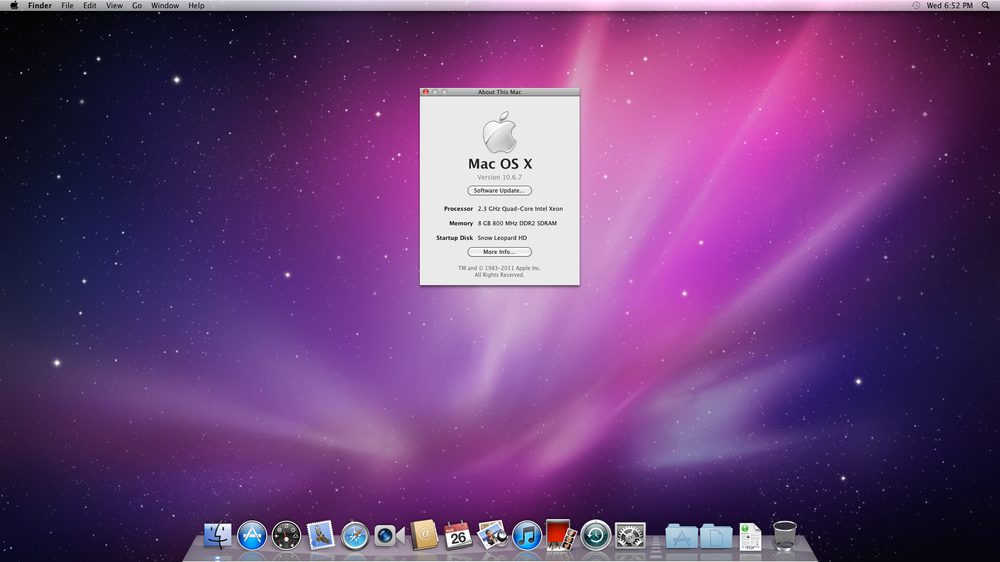
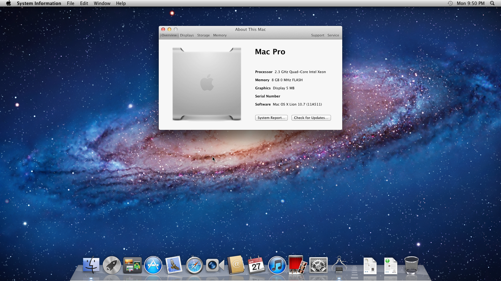
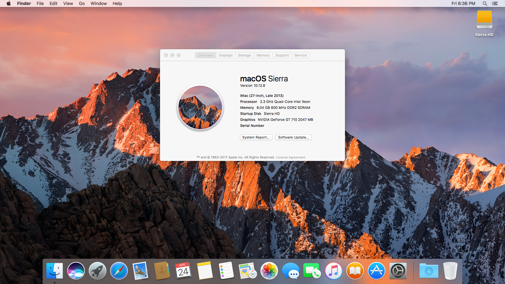
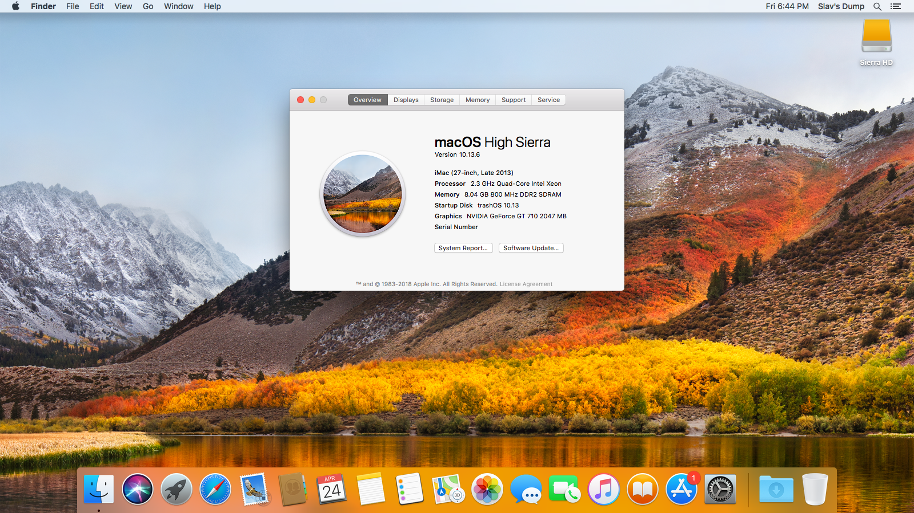
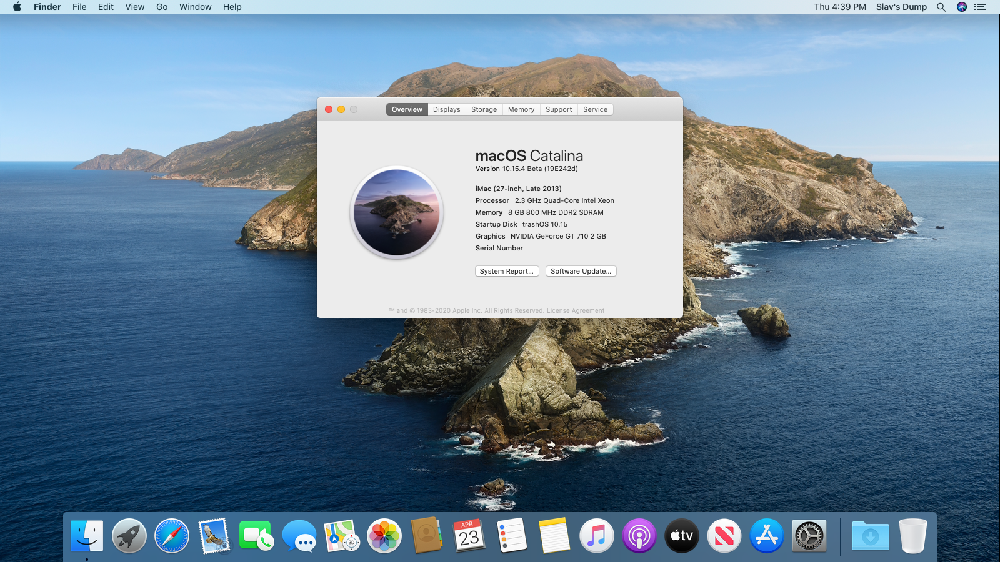

# Why OpenCore over Clover and others

* Supported version: 0.6.5

This section contains a brief rundown as to why the community has been transitioning over to OpenCore, and aims to dispel a few common myths in the community. Those who just want a macOS machine can skip this page.

* [Why OpenCore over Clover and others](#why-opencore-over-clover-and-others)
  * OpenCore features
  * Software support
  * Kext injection
* [OpenCore's shortcomings](#opencores-shortcomings)
* [Common Myths](#common-myths)
  * Is OpenCore unstable as it's a beta?
  * Does OpenCore always inject SMBIOS and ACPI data into other OSes?
  * Does OpenCore require a fresh install?
  * Does OpenCore only support limited versions of macOS?

## OpenCore features

* More OS Support!
  * OpenCore now supports more versions of OS X and macOS natively without painful hacks Clover and Chameleon had to implement
  * This includes OSes as far back as 10.4, Tiger, and even the latest builds of 11, Big Sur!
* On average, OpenCore systems boot faster than those using Clover as less unnecessary patching is done
* Better overall stability as patches can be much more precise:
  * [macOS 10.15.4 update](https://www.reddit.com/r/hackintosh/comments/fo9bfv/macos_10154_update/)
  * AMD OSX patches not needing to update with every minor security update
* Better overall security in many forms:
  * No need to disable System Integrity Protection (SIP)
  * Built-in FileVault 2 support
  * [Vaulting](https://dortania.github.io/OpenCore-Post-Install/universal/security.html#Vault) allowing to create EFI snapshots preventing unwanted modifications
  * True secure-boot support
    * Both UEFI and Apple's variant
* BootCamp switching and boot device selection are supported by reading NVRAM variables set by Startup Disk, just like a real Mac.
* Supports boot hotkey via `boot.efi` - hold `Option` or `ESC` at startup to choose a boot device, `Cmd+R` to enter Recovery or `Cmd+Opt+P+R` to reset NVRAM.

## Software Support

The biggest reason someone may want to switch from other boot loaders is actually software support:

* Kexts no longer testing for Clover:
  * Got a bug with a kext? Many developers including the organization [Acidanthera](https://github.com/acidanthera) (maker of most of your favorite kexts) won't provide support unless on OpenCore
* Many firmware drivers being merged into OpenCore:
  * [APFS Support](https://github.com/acidanthera/AppleSupportPkg)
  * [FileVault support](https://github.com/acidanthera/AppleSupportPkg)
  * [Firmware patches](https://github.com/acidanthera/AptioFixPkg)
* [AMD OSX patches](https://github.com/AMD-OSX/AMD_Vanilla/tree/opencore):
  * Have AMD-based hardware? The kernel patches required to boot macOS no longer support Clover – they now only support OpenCore.

## Kext Injection

To better understand OpenCore's kext injection system, we should first look at how Clover works:

1. Patches SIP open
2. Patches to enable XNU's zombie code for kext injection
3. Patches race condition with kext injection
4. Injects kexts
5. Patches SIP back in

Things to note with Clover's method:

* Calling XNU's zombie code that hasn't been used since 10.7, it's seriously impressive Apple hasn't removed this code yet
  * OS updates commonly break this patch, like recently with 10.14.4 and 10.15
* Disables SIP and attempts to re-enable it, don't think much needs to be said
* Likely to break with macOS 11.0 (Big Sur)
* Supports OS X all the way back to 10.5

Now let's take a look at OpenCore's method:

1. Takes existing prelinked kernel and kexts ready to inject
2. Rebuilds the cache in the EFI environment with the new kexts
3. Adds this new cache in

Things to note with OpenCore's method:

* OS agnostic as the prelinked kernel format has stayed the same since 10.6 (v2), far harder to break support.
  * OpenCore also supports prelinked kernel (v1, found in 10.4 and 10.5), cacheless, Mkext and KernelCollections, meaning it also has proper support for all Intel versions of OS X/macOS
* Far better stability as there is far less patching involved

# OpenCore's shortcomings

The majority of Clover's functionality is actually supported in OpenCore in the form of some quirk, however when transitioning you should pay close attention to OpenCore's missing features as this may or may not affect yourself:

* Does not support booting MBR-based operating systems
  * Work around is to chain-load rEFInd once in OpenCore
* Does not support UEFI-based VBIOS patching
  * This can be done in macOS however
* Does not support automatic DeviceProperty injection for legacy GPUs
  * ie. InjectIntel, InjectNvidia and InjectAti
  * This can be done manually however: [GPU patching](https://dortania.github.io/OpenCore-Post-Install/gpu-patching/)
* Does not support IRQ conflict patching
  * Can be resolved with [SSDTTime](https://github.com/corpnewt/SSDTTime)
* Does not support P and C state generation for older CPUs
* Does not support Target Bridge ACPI patching
* Does not support Hardware UUID Injection
* Does not support auto-detection for many Linux bootloader
  * Can be resolved by adding an entry in `BlessOverride`
* Does not support many of Clover's XCPM patches
  * ie. Ivy Bridge XCPM patches
* Does not support hiding specific drives
* Does not support changing settings within OpenCore's menu
* Does not patch PCIRoot UID value
* Does not support macOS-only ACPI injection and patching

# Common Myths

## Is OpenCore unstable as it's a beta

Short Answer: No

Long Answer: No

OpenCore's version number does not represent the quality of the project. Instead, it's more of a way to see the stepping stones of the project. Acidanthera still has much they'd like to do with the project including overall refinement and more feature support.

For example, OpenCore goes through proper security audits to ensure it complies with UEFI Secure Boot, and is the only Hackintosh bootloader to undergo these rigorous reviews and have such support.

Version 0.6.1 was originally designed to be the official release of OpenCore as it would have proper UEFI/Apple Secure Boot, and would be the 1 year anniversary of OpenCore's release as a public tool. However, due to circumstances around macOS Big Sur and the rewriting of OpenCore's prelinker to support it, it was decided to push off 1.0.0 for another year.

Current road map:

* 2019: Year of Beta
* 2020: Year of Secure Boot
* 2021: Year of Refinement

So please do not see the version number as a hindrance, instead as something to look forward to.

## Does OpenCore always inject SMBIOS and ACPI data into other OSes

By default, OpenCore will assume that all OSes should be treated equally in regards to ACPI and SMBIOS information. The reason for this thinking consists of three parts:

* This allows for proper multiboot support, like with [BootCamp](https://dortania.github.io/OpenCore-Post-Install/multiboot/bootcamp.html)
* Avoids poorly made DSDTs and encourages proper ACPI practices
* Avoids edge cases where info is injected several times, commonly seen with Clover
  * i.e. How would you handle SMBIOS and ACPI data injection once you booted boot.efi, but then get kicked out? The changes are already in memory and so trying to undo them can be quite dangerous. This is why Clover's method is frowned upon.

However, there are quirks in OpenCore that allow for SMBIOS injection to be macOS-limited by patching where macOS reads SMBIOS info from. The `CustomSMIOSGuid` quirk with `CustomSMBIOSMode` set to `Custom` can break in the future and so we only recommend this option in the event of certain software breaking in other OSes. For best stability, please disable these quirks.

## Does OpenCore require a fresh install

Not at all in the event you have a "Vanilla" installation – what this refers to is whether the OS has tampered in any way, such as installing 3rd party kexts into the system volume or other unsupported modifications by Apple. When your system has been heavily tampered with, either by you or 3rd party utilities like Hackintool, we recommend a fresh install to avoid any potential issues.

Special note for Clover users: please reset your NVRAM when installing with OpenCore. Many of Clover variables can conflict with OpenCore and macOS.

* Note: Thinkpad laptops are known to be semi-bricked after an NVRAM reset in OpenCore, we recommend resetting NVRAM by updating the BIOS on these machines.

## Does OpenCore only support limited versions of macOS

As of OpenCore 0.6.2, you can now boot every Intel version of macOS going all the way back to OS X 10.4! Proper support however will depend on your hardware, so please verify yourself: [Hardware Limitations](macos-limits.md)

::: details macOS Install Gallery

Acidanthera has tested many versions, and I myself have run many versions of OS X on my old HP DC 7900 (Core2 Quad Q8300). Here's just a small gallery of what I've tested:

:::

## Does OpenCore support older hardware

As of right now, the majority of Intel hardware is supported so long as the OS itself does! However please refer to the [Hardware Limitations page](macos-limits.md) for more info on what hardware is supported in what versions of OS X/macOS.

Currently, Intel's Yonah and newer series CPUs have been tested properly with OpenCore.

## Does OpenCore support Windows/Linux booting

OpenCore works in the same fashion as any other boot loader, so it respects other OSes the same way. For any OSes where their bootloader has an irregular path or name, you can simply add it to the BlessOverride section.

## Legality of Hackintoshing

Where hackintoshing sits is in a legal grey area, mainly that while this is not illegal we are in fact breaking the EULA. The reason this is not illegal:

* We are downloading macOS from [Apple's servers directly](https://github.com/corpnewt/gibMacOS/blob/master/gibMacOS.command#L84)
* We are doing this as a non-profit origination for teaching and personal use
  * People who plan to use their Hackintosh for work or want to resell them should refer to the [Psystar case](https://en.wikipedia.org/wiki/Psystar_Corporation) and their regional laws

While the EULA states that macOS should only be installed on real Macs([section 2B-i](https://www.apple.com/legal/sla/docs/macOSCatalina.pdf)) or virtual machines running on genuine Macs([section 2B-iii](https://www.apple.com/legal/sla/docs/macOSCatalina.pdf)), there is no enforceable law that outright bans this. However, sites that repackage and modify macOS installers do potentially risk the issue of [DMCA takedowns](https://en.wikipedia.org/wiki/Digital_Millennium_Copyright_Act) and such.

* **Note**: We are not official legal advisors, so please make the proper assessments yourself and discuss with your lawyers if you have any concerns.

## Does macOS support Nvidia GPUs

Due to issues revolving around Nvidia support in newer versions of macOS, many users have somehow come to the conclusion that macOS never supported Nvidia GPUs and don't at this point. However, Apple actually still maintains and supports Macs with Nvidia GPUs in their latest OS, like the 2013 MacBook Pro models with Kepler GPUs.

The main issue has to do with any newer Nvidia GPUs, as Apple stopped shipping machines with them and thus they never had official OS support from Apple. Instead, users had to rely on Nvidia for 3rd party drivers. Due to issues with Apple's newly introduced Secure Boot, they could no longer support the Web Drivers and thus Nvidia couldn't publish them for newer platforms limiting them to mac OS 10.13, High Sierra.

For more info on OS support, see here: [GPU Buyers Guide](https://dortania.github.io/GPU-Buyers-Guide/)
