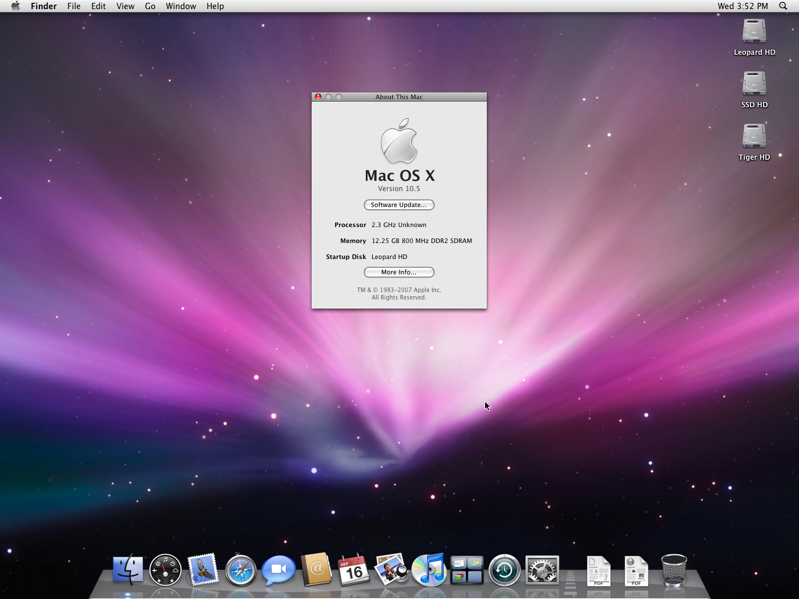
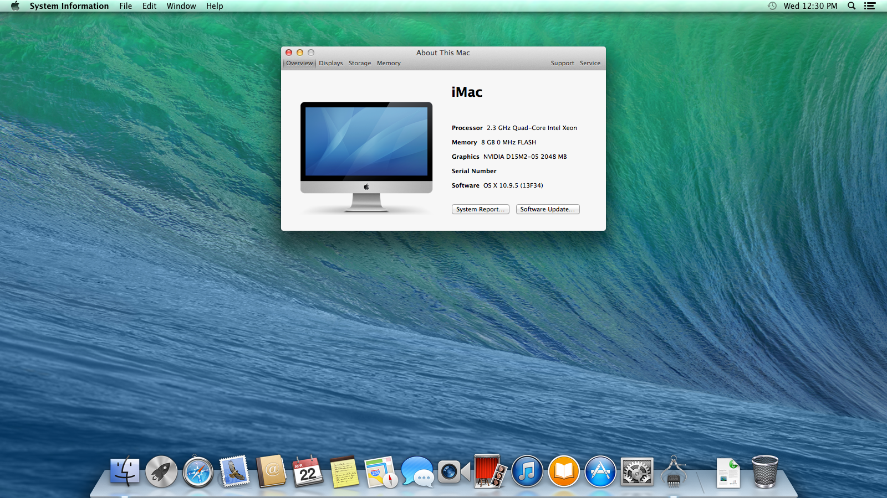

# 为什么OpenCore超过Clover和其他公司

本节简要介绍了为什么社区已经过渡到OpenCore，并旨在消除社区中常见的一些误解。那些只是想要一台macOS机器的人可以跳过这一页。

[[toc]]

## OpenCore特性

* 更多的操作系统支持!
  * OpenCore现在支持更多版本的OS X和macOS，而无需Clover和Chameleon必须实现的痛苦hack
  * 这包括早在10.4、Tiger的操作系统，甚至是13的最新版本Ventura!
* 平均而言，OpenCore系统的启动速度比使用Clover的系统要快，因为不必要的补丁要少
* 更好的整体稳定性，补丁可以更精确:
  * [macOS 10.15.4 更新](https://www.reddit.com/r/hackintosh/comments/fo9bfv/macos_10154_update/)
  * AMD OSX补丁不需要在每个小的安全更新中更新
* 以多种形式提高整体安全性:
  * 不需要禁用系统完整性保护(SIP)
  * 内置FileVault 2支持
  * [Vaulting](https://dortania.github.io/OpenCore-Post-Install/universal/security.html#Vault) 允许创建EFI快照防止不必要的修改
  * 真正的安全引导支持
    * 包括UEFI和苹果的变种
* BootCamp切换和启动设备选择通过读取启动盘设置的NVRAM变量来支持，就像真正的Mac一样。
* 通过引导支持引导热键。efi - hold启动时选择启动设备的选项或ESC, Cmd+R进入恢复或Cmd+Opt+P+R复位NVRAM。

### 软件支持

一些人想要从其他引导加载程序转换的最大原因实际上是软件支持:

* Kexts不再测试Clover:
  * kext出问题了? 许多开发人员，包括 [Acidanthera](https://github.com/acidanthera) (您最喜欢的大多数kext的制造商) 除非在OpenCore上，否则不会提供支持
* 许多固件驱动程序被合并到OpenCore:
  * [APFS 支持](https://github.com/acidanthera/AppleSupportPkg)
  * [FileVault 支持](https://github.com/acidanthera/AppleSupportPkg)
  * [Firmware 补丁](https://github.com/acidanthera/AptioFixPkg)

## OpenCore的缺点

Clover的大部分功能实际上在OpenCore中以一些奇怪的形式得到了支持，但是在过渡时，你应该密切关注OpenCore缺失的功能，因为这可能会影响到你自己:

* 不支持引导基于mbr的操作系统
  * 解决方法是在OpenCore中链式加载rEFInd一次
* 不支持基于uefi的VBIOS补丁
  * 但是在macOS中可以这样做
* 不支持传统gpu的自动设备属性注入
  * 例如:InjectIntel, InjectNVIDIA InjectAti
  * 然而,可以手动: [GPU patching](https://dortania.github.io/OpenCore-Post-Install/gpu-patching/)
* 不支持IRQ冲突补丁
  * 可以使用 [SSDTTime](https://github.com/corpnewt/SSDTTime)
* 不支持旧的cpu生成P和C状态
* 不支持硬件UUID注入
* 不支持Clover的许多XCPM补丁
  * 例如：Ivy Bridge XCPM补丁
* 不支持隐藏特定的驱动器
* 不支持在OpenCore的菜单内改变设置
* 不修补PCIRoot UID值
* 不支持macos特有的ACPI补丁

## 常见的误区

### OpenCore还是测试版，所以不稳定吗?

简短的回答:不

长答案:不是

OpenCore的版本号并不代表项目的质量。相反，它更多的是一种看到项目的垫脚石的方式。Acidanthera仍然有很多他们想要做的项目，包括全面的改进和更多的功能支持。

例如，OpenCore通过适当的安全审计以确保符合UEFI Secure Boot，并且是唯一经过这些严格审查并具有此类支持的Hackintosh引导加载程序。

版本0.6.1最初被设计为OpenCore的官方发布版本，因为它将拥有适当的UEFI/Apple Secure Boot，并将是OpenCore作为公共工具发布的一周年。然而，由于macOS Big Sur周围的情况以及OpenCore的预链接器的重写以支持它，它决定将1.0.0推迟一年。

目前的路线图：

* 2019年:测试年
* 2020年:安全启动之年
* 2021年:改进之年

所以请不要把版本号看作是一个障碍，而应该看作是值得期待的东西。

### OpenCore是否总是在其他操作系统中注入SMBIOS和ACPI数据?

默认情况下，OpenCore将假设所有操作系统都应该平等对待ACPI和SMBIOS信息。这种想法的原因包括三个部分:

* 这允许正确的多引导支持，如 [BootCamp](https://dortania.github.io/OpenCore-Post-Install/multiboot/bootcamp.html)
* 避免制作不良的dsdt，并鼓励适当的ACPI实践
* 避免信息被多次注入的边缘情况，通常在Clover中看到
  * 例如：一旦启动boot.efi，你将如何处理SMBIOS和ACPI数据注入， 但后来被赶出去吗? 因此试图撤消它们可能相当危险。这就是为什么Clover的方法是不被允许的。

然而，在OpenCore中有一些奇怪的地方允许SMBIOS注入受到macOS的限制，这是通过为macOS读取SMBIOS信息的地方打补丁实现的。 将 `CustomSMBIOSMode`设置为`Custom`的`CustomSMIOSGuid`怪癖可能会在未来中断，因此我们只建议在其他操作系统中某些软件中断的情况下使用此选项。为了最好的稳定性，请禁用这些怪癖。

### OpenCore需要全新安装吗?

如果你有一个“Vanilla”安装，那就完全不需要了——这指的是操作系统是否以任何方式被篡改了，比如将第三方kext安装到系统卷或其他苹果不支持的修改。当你的系统被严重篡改，无论是你还是第三方工具，如Hackintool，我们建议重新安装，以避免任何潜在的问题。

特别提醒Clover用户:安装OpenCore时，请重置NVRAM。Clover的许多变量可能与OpenCore和macOS冲突。

* 注:众所周知，Thinkpad笔记本电脑在OpenCore中NVRAM重置后是半砖的，我们建议通过更新这些机器的BIOS来重置NVRAM。

### OpenCore只支持macOS的有限版本吗?

从OpenCore 0.6.2开始，你现在可以启动每个Intel版本的macOS，一直到OS X 10.4!正确的支持取决于您的硬件，所以请自行验证:[硬件限制](macos-limits.md)

::: macOS安装库的详细信息

Acidanthera测试了很多版本的OS X，我自己也在我的旧HP DC 7900 (Core2 Quad Q8300)上运行过很多版本的OS X。以下是我测试过的一小部分:

:::

### OpenCore支持旧的硬件吗?

到目前为止，只要操作系统本身支持，大多数英特尔硬件都是受支持的!但是，请参阅[硬件限制页面](macos-limits.md) 以了解OS X/macOS的哪些版本支持哪些硬件。

目前，英特尔的Yonah和新系列cpu已经通过OpenCore进行了适当的测试。

### OpenCore支持Windows/Linux引导吗?

OpenCore将自动检测Windows而无需任何额外配置。 在OpenCore 0.7.3中，OpenLinuxBoot作为EFI驱动程序添加到OpenCore中，它将自动检测Linux分区。这需要[ext4_x64.efi](https://github.com/acidanthera/OcBinaryData/blob/master/Drivers/ext4_x64.efi) 或 [btrfs_x64.efi](https://github.com/acidanthera/OcBinaryData/blob/master/Drivers/btrfs_x64.efi)具体取决于在发行版中使用的格式。对于引导加载程序具有不规则路径或名称的任何操作系统，您可以简单地将其添加到BlessOverride部分。

### Hackintoshing的合法性

hackintoshing位于法律的灰色地带，主要是因为虽然这并不违法，但我们实际上违反了EULA。这不是违法的原因:

* 我们从[苹果的服务器](https://github.com/acidanthera/OpenCorePkg/blob/0.6.9/Utilities/macrecovery/macrecovery.py#L125)直接下载macOS
* 我们是作为一个教学和个人使用的非营利组织来做这件事的
  * 计划将Hackintosh用于工作或想转售它们的人应该参考 [Psystar 案例](https://en.wikipedia.org/wiki/Psystar_Corporation) 和他们的地区法律

虽然EULA规定macOS只能安装在真正的mac电脑或在真正的mac电脑上运行的虚拟机上 ([第2B-i和2B-iii节](https://www.apple.com/legal/sla/docs/macOSBigSur.pdf)),但没有强制执行的法律完全禁止这一点。 然而，重新打包和修改macOS安装程序的网站确实存在 [DMCA takedowns](https://en.wikipedia.org/wiki/Digital_Millennium_Copyright_Act) 等问题的潜在风险

* **注意**: 这不是法律建议，所以请自己进行适当的评估，如果您有任何疑问，请与您的律师讨论。

### macOS支持NVIDIA gpu吗?

由于在macOS的新版本中围绕NVIDIA支持的问题，许多用户得出结论，macOS从未支持NVIDIA gpu。直到Monterey Beta 7发布之前，苹果都支持使用NVIDIA gpu的mac电脑(例如2013年使用Kepler dGPU的MacBook Pro)。虽然有社区制作的补丁可以恢复支持，但它们需要禁用SIP(系统完整性保护)，从而禁用macOS中的重要安全功能。

另一个问题与任何新的NVIDIA gpu有关，因为苹果停止了与它们一起发货的机器，因此它们从来没有得到苹果的官方操作系统支持。相反，用户不得不依赖NVIDIA的第三方驱动。由于苹果新推出的安全引导的问题，他们不能再支持网络驱动程序，因此NVIDIA不能在更新的平台上发布它们，限制它们在mac OS 10.13, High Sierra。

有关操作系统支持的更多信息，请参阅这里: [GPU买家指南](https://dortania.github.io/GPU-Buyers-Guide/)
